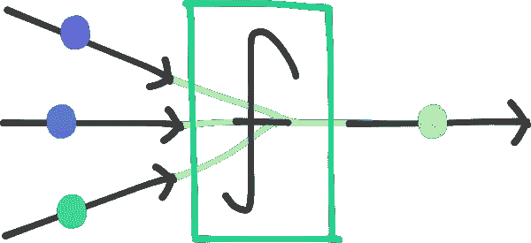
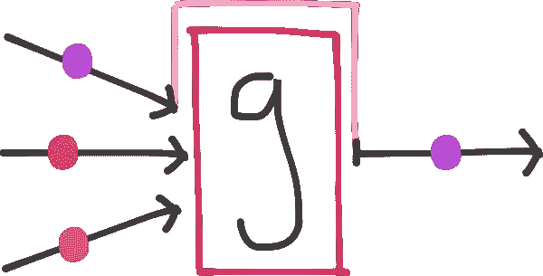
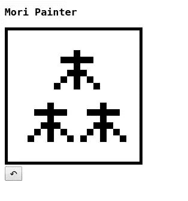

# 用 Mori 实现不可变数据和函数式 JavaScript

> 原文：<https://www.sitepoint.com/immutable-data-functional-javascript-mori/>

*这篇文章由 [Craig Bilner](https://www.sitepoint.com/author/cbilner) 和 [Adrian Sandu](https://www.sitepoint.com/author/asandu/) 进行了同行评审。感谢 SitePoint 的所有同行评审员使 SitePoint 的内容尽可能做到最好！*

函数式编程和不可变数据是许多 JavaScript 开发人员当前关注的焦点，因为他们试图找到使他们的代码更简单、更容易推理的方法。

尽管 JavaScript 一直支持一些函数式编程技术，但它们只是在最近几年才真正流行起来，而且传统上也没有对不可变数据的本地支持。JavaScript 仍在学习这两种技术，最好的想法来自已经尝试和测试过这些技术的语言。

在编程世界的另一个角落， [Clojure](https://clojure.org) 是一种函数式编程语言，致力于[真正的简单性](https://www.youtube.com/watch?v=rI8tNMsozo0)，尤其是在涉及数据结构的地方。 [Mori](http://swannodette.github.io/mori/) 是一个允许我们直接从 JavaScript 使用 [Clojure 的持久数据结构](http://clojure.org/reference/data_structures)的库。

本文将探索这些数据结构设计背后的基本原理，并研究一些使用它们来改进我们的应用程序的模式。我们也可以认为这是对使用 Clojure 或 ClojureScript 编程感兴趣的 JavaScript 开发人员的第一步。

## 什么是持久数据？

Clojure 区分了不能更改的持久值和在两次突变之间有时间生存期的短暂值。修改持久数据结构的尝试通过**返回一个应用了更改的新结构**来避免改变底层数据。

看看这种区别在理论编程语言中是什么样子可能会有所帮助。

```
// transient list
a = [1, 2, 3];
b = a.push(4);
// a = [1, 2, 3, 4]
// b = [1, 2, 3, 4]

// persistent list
c = #[1, 2, 3]
d = c.push(4);
// c = #[1, 2, 3]
// d = #[1, 2, 3, 4] 
```

我们可以看到，当我们将一个值放入临时列表时，它发生了变化。`a`和`b`都指向同一个可变值。相反，在持久化列表上调用 push 会返回一个新值，我们可以看到`c`和`d`指向不同的离散列表。

这些持久的数据结构不能被改变，这意味着一旦我们有了对一个值的引用，我们也保证它永远不会被改变。这些保证通常有助于我们编写更安全、更简单的代码。例如，一个将持久数据结构作为参数的函数不能改变它们，因此如果函数想要传达有意义的变化，它必须来自返回值。这导致编写引用透明的、[纯函数](https://www.sitepoint.com/functional-programming-pure-functions/)，更容易测试和[优化](https://www.sitepoint.com/implementing-memoization-in-javascript/)。

更简单地说，**不可变的数据迫使我们编写更多功能性的代码。**

## 更有甚者

Mori 使用 [ClojureScript 编译器](https://github.com/clojure/clojurescript)将 Clojure 标准库中数据结构的实现编译成 JavaScript。编译器发出优化的代码，这意味着如果没有额外的考虑，从 JavaScript 与编译的 Clojure 通信并不容易。森是额外考虑的一层。

就像 Clojure 一样，Mori 的函数与它们所操作的数据结构是分离的，这与 JavaScript 的面向对象倾向形成了对比。我们会发现这种差异改变了我们编写代码的方向。

```
// standard library
Array(1, 2, 3).map(x => x * 2);
// => [2, 4, 6]

// mori
map(x => x * 2, vector(1, 2, 3))
// => [2, 4, 6] 
```

Mori 还使用结构共享，通过共享尽可能多的原始结构来对数据进行有效的更改。这使得持久数据结构几乎和常规的瞬态数据结构一样有效。这些概念的实现在[视频](https://www.youtube.com/watch?v=I7IdS-PbEgI)中有更详细的介绍。

## 为什么有用？

首先，让我们想象一下，我们正试图追踪我们继承的 JavaScript 代码库中的一个错误。我们正在阅读代码，试图找出为什么我们最终得到了错误的`fellowship`值。

```
const fellowship = [
  {
    title: 'Mori',
    race: 'Hobbit'
  },
  {
    title: 'Poppin',
    race: 'Hobbit'
  }
];

deletePerson(fellowship, 1);
console.log(fellowship); 
```

`fellowship`记录到控制台时的值是多少？

如果不运行代码，或者不阅读`deletePerson()`的定义，就无从得知。它可能是一个空数组。它可能有三个新特性。我们希望它是一个去掉了第二个元素的数组，但是因为我们传入了一个可变的数据结构，所以不能保证。

更糟糕的是，该函数可能会保留一个引用，并在将来异步地改变它。从这里开始，所有对`fellowship`的引用都将使用不可预测的值。

将此与 Mori 的替代方案进行比较。

```
import { vector, hashMap } from 'mori';

const fellowship = vector(
  hashMap(
    "name", "Mori",
    "race", "Hobbit"
  ),
  hashMap(
    "name", "Poppin",
    "race", "Hobbit"
  )
)

const newFellowship = deletePerson(fellowship, 1);
console.log(fellowship); 
```

不考虑`deletePerson()`的实现，我们知道原始向量会被记录，仅仅是因为有保证它不能被变异。如果我们希望这个函数有用，那么它应该返回一个新的向量，并移除指定的项。

理解处理不可变数据的函数的流程是很容易的，因为我们知道它们唯一的作用是派生并返回一个独特的不可变值。



对可变数据进行操作的函数并不总是返回值，它们可以改变它们的输入，有时需要程序员在另一端重新获取值。



更简单地说，**不可变的数据加强了可预测性的文化**。

## 在实践中

我们将看看如何使用 Mori 来构建一个具有撤销功能的像素编辑器。以下代码作为[代码笔](http://codepen.io/SitePoint/pen/reMPPv?editors=0010)可用，你也可以在文章的[底部找到。](#demo)



*我们将假设你要么继续使用 Codepen，要么使用 Mori 和下面的 HTML 在 ES2015 环境中工作。*

```
<div>
  <h3>Mori Painter</h3>
</div>
<div id="container">
  <canvas id='canvas'></canvas>
</div>
<div>
  <button id='undo'>↶</button>
</div> 
```

### 设置和实用程序

让我们从析构 Mori 名称空间中需要的函数开始。

```
const {
  list, vector, peek, pop, conj, map, assoc, zipmap,
  range, repeat, each, count, intoArray, toJs
} = mori; 
```

这主要是一种风格偏好。您也可以直接在 Mori 对象上访问 Mori 的任何功能(如`mori.list()`)。

我们要做的第一件事是建立一个助手函数来查看我们的持久数据结构。Mori 的内部表示在控制台中没有太大意义，所以我们将使用`toJs()`函数将它们转换成可理解的格式。

```
const log = (...args) => {
  console.log(...args.map(toJs))
}; 
```

当我们需要检查 Mori 的数据结构时，我们可以使用这个函数作为`console.log()`的替代。

接下来，我们将设置一些配置值和一个实用函数。

```
// the dimensions of the canvas
const [height, width] = [20, 20];

// the size of each canvas pixel
const pixelSize = 10;

// converts an integer to a 2d coordinate vector
const to2D = (i) => vector(
  i % width,
  Math.floor(i / width)
); 
```

希望你注意到我们的`to2D()`函数返回一个[向量](http://swannodette.github.io/mori/#vector)。向量有点像 JavaScript 数组，支持高效的随机访问。

### 结构化数据

我们将使用我们的`to2D()`函数来创建一个坐标的[序列](http://swannodette.github.io/mori/#seq)，它将代表画布上的所有像素。

```
const coords = map(to2D, range(height * width)); 
```

我们使用 [range()](http://swannodette.github.io/mori/#range) 函数生成一个在`0`和`height * width`(在我们的例子中是`100`)之间的数字序列，并使用 [map()](http://swannodette.github.io/mori/#map) 和我们的`to2D()`辅助函数将其转换成 2D 坐标列表。

这可能有助于形象化`coords`的结构。

```
[
  [0, 0], [0, 1], [0, 2], [0, 3], [0, 4], [0, 5], [0, 6], [0, 7], [0, 8], [0, 9],
  [1, 0], [1, 1], [1, 2], [1, 3], [1, 4], [1, 5], [1, 6], [1, 7], [1, 8], [1, 9],
  [2, 0], [2, 1], [2, 2], [2, 3], [2, 4], [2, 5], [2, 6], [2, 7], [2, 8], [2, 9],
  ...
  [8, 0], [8, 1], [8, 2], [8, 3], [8, 4], [8, 5], [8, 6], [8, 7], [8, 8], [8, 9]
  [9, 0], [9, 1], [9, 2], [9, 3], [9, 4], [9, 5], [9, 6], [9, 7], [9, 8], [9, 9]
] 
```

这是一维坐标向量序列。

除了每个坐标，我们还想存储一个颜色值。

```
const colors = repeat('#fff'); 
```

我们使用 [repeat()](http://swannodette.github.io/mori/#repeat) 函数来创建一个无限序列的`'#fff'`字符串。我们不需要担心这样会占满内存，让浏览器崩溃，因为 Mori 序列支持*懒评*。我们只会在以后需要时计算序列中各项的值。

最后，我们想把我们的坐标和颜色以一个[散列图](http://swannodette.github.io/mori/#hashMap)的形式结合起来。

```
const pixels = zipmap(coords, colors); 
```

我们使用 [zipmap()](http://swannodette.github.io/mori/#zipmap) 函数来创建一个哈希映射，用`coords`作为键，`colors`作为值。同样，它可能有助于可视化我们的数据结构。

```
{
  [0, 0]: '#fff',
  [1, 0]: '#fff',
  [2, 0]: '#fff',
  [3, 0]: '#fff',
  [4, 0]: '#fff',
  [5, 0]: '#fff',
  ...
  [8, 9]: '#fff',
  [9, 9]: '#fff'
} 
```

与 Javascript 的对象不同，Mori 的哈希映射可以将任何类型的数据作为一个键。

### 绘制像素

要改变像素的颜色，我们需要将哈希表中的一个坐标与一个新的字符串关联起来。让我们写一个纯函数来给单个像素着色。

```
const draw = (x, y, pixels, color='#000') => {
  const coord = vector(x, y);
  return assoc(pixels, coord, color);
}; 
```

我们使用`x`和`y`坐标来创建一个坐标向量，我们可以使用它作为一个键，然后我们使用 [assoc()](http://swannodette.github.io/mori/#assoc) 将这个键与一个新的颜色关联起来。记住，因为数据结构是持久的，`assoc()`函数将返回一个*新的*散列图，而不是改变旧的散列图。

### 画画

现在我们有了在画布上绘制简单图像所需的一切。让我们创建一个函数，它采用一个坐标与像素的散列图，并将它们绘制到一个`RenderingContext2D`上。

```
const paint = (ctx, pixels) => {
  const px = pixelSize;

  each(pixels, p => {
    const [coord, color] = intoArray(p);
    const [x, y] = intoArray(coord);
    ctx.fillStyle = color;
    ctx.fillRect(x * px, y * px, px, px);
  });
}; 
```

让我们花一分钟时间来理解这里发生了什么。

我们使用 [each()](http://swannodette.github.io/mori/#each) 来迭代我们的像素散列图。它将每个键和值(一起作为一个序列)作为`p`传递给回调函数。然后我们使用 [intoArray()](http://swannodette.github.io/mori/#intoArray) 函数将它转换成可以被析构的数组，这样我们就可以挑选出我们想要的值。

```
const [coord, color] = intoArray(p);
const [x, y] = intoArray(coord); 
```

最后，我们使用 canvas 方法在上下文本身上绘制一个彩色矩形。

```
ctx.fillStyle = color;
ctx.fillRect(x * px, y * px, px, px); 
```

### 将它连接在一起

现在，我们需要做一些管道工作，以便将所有这些部件组装在一起并正常工作。

```
const canvas = document.getElementById('canvas');
const context = canvas.getContext('2d');

canvas.width = width * pixelSize;
canvas.height = height * pixelSize;

paint(context, pixels); 
```

我们将获得画布，并使用它来创建渲染图像的上下文。我们还将适当地调整它的大小，以反映我们的尺寸。

最后，我们将传递由 paint 方法绘制的像素的上下文。幸运的话，你的画布应该呈现为白色像素。不是最激动人心的发现，但我们正在接近。

### 交互性

我们希望监听点击事件，并使用它们通过前面的`draw()`函数来改变特定像素的颜色。

```
let frame = list(pixels);

canvas.addEventListener('click', e => {
  const x = Math.floor(e.layerX / pixelSize);
  const y = Math.floor(e.layerY / pixelSize);
  const pixels = draw(x, y, frame);
  paint(context, pixels);
  frame = pixels;
}); 
```

我们将一个点击监听器附加到画布上，并使用事件坐标来确定要绘制的像素。我们使用这些信息通过我们的`draw()`函数创建一个新的像素散列图。然后我们把它绘制到我们的上下文中，并覆盖我们绘制的最后一帧。

此时，我们可以在画布上绘制黑色像素，每一帧都基于前一帧，创建一个复合图像。

### 跟踪帧

要实现撤销，我们需要将每个历史修订存储到像素散列图中，以便将来可以再次检索它们。

```
let frames = list(pixels); 
```

我们使用一个[列表](http://swannodette.github.io/mori/#list)来存储我们绘制的不同“帧”。列表在头部支持高效的加法，对第一项支持 O(1)查找，这使它们非常适合表示堆栈。

我们需要修改我们的点击监听器来使用我们的框架堆栈。

```
canvas.addEventListener('click', e => {
  const x = Math.floor(e.layerX / pixelSize);
  const y = Math.floor(e.layerY / pixelSize);

  const currentFrame = peek(frames);
  const newFrame = draw(x, y, currentFrame);
  frames = conj(frames, newFrame);
  paint(context, newFrame);
}); 
```

我们使用 [peek()](http://swannodette.github.io/mori/#peek) 函数来获取堆栈顶部的帧。然后我们用它来创建一个带有`draw()`功能的新帧。最后，我们使用 [conj()](http://swannodette.github.io/mori/#conj) 来*连接*新的帧到帧堆栈的顶部。

尽管我们改变了本地状态(`frame = conj(frames, newFrame)`)，但实际上我们并没有改变任何数据。

### 撤消更改

最后，我们需要实现一个撤销按钮，从堆栈中弹出顶部的框架。

```
const undo = document.getElementById('undo');

undo.addEventListener('click', e => {
  if(count(frames) > 1) {
    frames = pop(frames);
    paint(context, peek(frames));
  }
}); 
```

当点击撤销按钮时，我们检查当前是否有任何要撤销的帧，然后使用 [pop()](http://swannodette.github.io/mori/#pop) 函数用一个不再包括顶部帧的新列表替换`frames`。

最后，我们将新堆栈的顶部框架传递给我们的`paint()`函数来反映这些变化。此时，您应该能够绘制和撤销对画布的更改。

## 演示

这是我们最终得到的结果:

通过 [CodePen](http://codepen.io) 上的 SitePoint ( [@SitePoint](http://codepen.io/SitePoint) )看笔[森像素](http://codepen.io/SitePoint/pen/reMPPv/)。