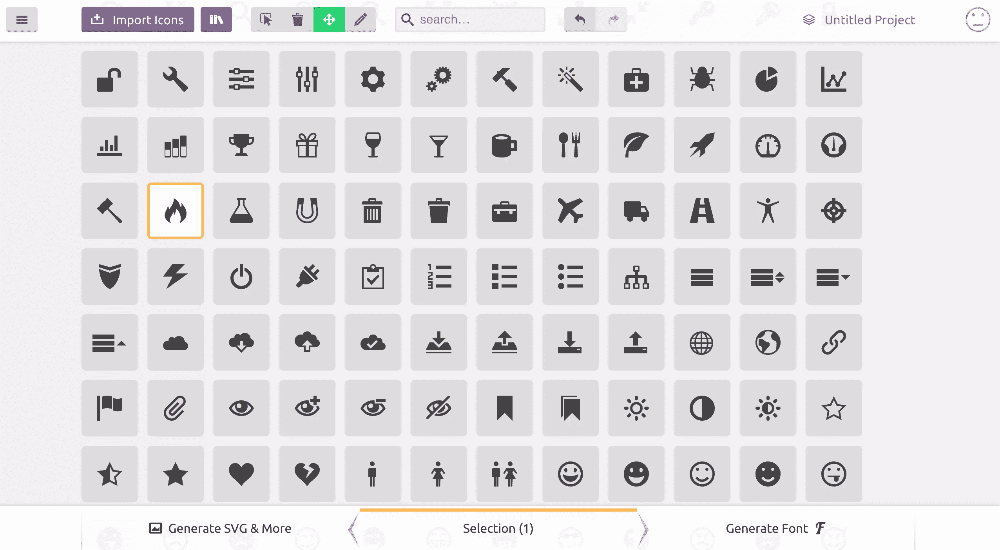

# 可访问图标的工作 SVG 工作流

> 原文：<https://www.sitepoint.com/a-working-svg-workflow-for-accessible-icons/>

众所周知，使用字体作为图标是一种不好的做法。对渲染(大小、定位等)不好。)，它有奇怪的故障(代理浏览器，CORS 等)。)，它传达了糟糕的语义，会伤害可访问性，这样的例子不胜枚举。CSS-Tricks 有一篇关于此事的深刻见解。

也就是说，我总是觉得处理 SVG 有点复杂。老实说，我不是莎拉·苏伊丹。SVG 不是我真正喜欢的东西。所有这些路径、奇怪的标签和属性。我真的不知道如何使用它们。尽管如此，我不得不。尽管如此，我还是喜欢把事情做好。

所以我想出了一个既简单又自动化的 SVG 图标工作流。希望它对你们中的一些人有用。

## 要点是什么？

CSS-Tricks 有一篇由 Chris Coyier 撰写的非常好的文章，讲述了如何用 SVG 精灵构建一个图标系统。鉴于这篇文章是 Chris 文章的直接应用，我建议你如果还没有读过的话，读一读。

下面是它的大致工作原理。

1.  源图标被收集在专用文件夹中的单个 SVG 文件中。
2.  用 [spritesh](https://github.com/edenspiekermann/sprite.sh) 生成一个 sprite。
3.  精灵包含在主布局中，以供将来参考。
4.  图标通过一个小组件显示。
5.  ？？？
6.  利润。

设置取决于你正在做的项目的类型(Jekyll，React，Rails…)，但是它的要点是一样的。在本文中，我将带您完成这些步骤，以便您今天就可以开始使用它。

## 正在收集图标文件

如果你问我，我会觉得这有点难，因为拥有正确的 SVG 文件不是一个容易的话题。根据用于导出图标的工具，标记看起来会有所不同，可能会变得臃肿，等等。不要让我开始谈论`viewBox`问题…

如果你可以避免设计自己的图标，我建议你这样做。Icomoon 有一个非常不错的可爱图标集合，可以免费使用并导出为 SVG。你不能期望更多。这就是为什么我们会在这篇文章中这样做。



首先，选择你需要的图标。完成后，点击“生成 SVG &更多”。您应该会看到列出了所有您选择的图标。现在您可以从 Icomoon 下载这个包。生成的 zip 文件包含你选择的图标所需要的一切(PNG 文件，SVG 文件，CSS，JavaScript，demo…)。我建议您复制 SVG 子文件夹(包含单个图标文件)的内容，并将其粘贴到您的图标文件夹中。

在继续之前，您必须清理一下 SVG 文件。这本身并不完全必要，但我建议您这样做，以避免 SVG sprite 因大量垃圾而膨胀。下面是 Icomoon 的 *fire* 图标下载后的样子:

```
<?xml version="1.0" encoding="utf-8"?>
<!-- Generated by IcoMoon.io -->
<!DOCTYPE svg PUBLIC "-//W3C//DTD SVG 1.1//EN" 
          "https://www.w3.org/Graphics/SVG/1.1/DTD/svg11.dtd">
<svg version="1.1" xmlns="https://www.w3.org/2000/svg" 
     xmlns:xlink="https://www.w3.org/1999/xlink" 
width="16" height="16" viewBox="0 0 16 16">
<path d="M5.016 16c-1.066-2.219-0.498-3.49 0.321-4.688 0.897-1.312 1.129-2.61 
1.129-2.61s0.706 0.917 0.423 2.352c1.246-1.387 1.482-3.598 1.293-4.445 2.817 1.969 
4.021 6.232 2.399 9.392 8.631-4.883 2.147-12.19 1.018-13.013 0.376 0.823 0.448 
2.216-0.313 2.893-1.287-4.879-4.468-5.879-4.468-5.879 0.376 2.516-1.364 5.268-3.042 
7.324-0.059-1.003-0.122-1.696-0.649-2.656-0.118 1.823-1.511 3.309-1.889 5.135-0.511 
2.473 0.383 4.284 3.777 6.197z"></path>
</svg>
```

一个`<path>`就这么多！我建议您删除 XML 定义、初始注释、doctype 和 SVG 包装器(因为我们将通过引用 sprite 来内联 SVG)，因此只保留实际绘制的内容:

```
<path d="M5.016 16c-1.066-2.219-0.498-3.49 0.321-4.688 0.897-1.312 1.129-2.61 
1.129-2.61s0.706 0.917 0.423 2.352c1.246-1.387 1.482-3.598 1.293-4.445 2.817 1.969 
4.021 6.232 2.399 9.392 8.631-4.883 2.147-12.19 1.018-13.013 0.376 0.823 0.448 
2.216-0.313 2.893-1.287-4.879-4.468-5.879-4.468-5.879 0.376 2.516-1.364 5.268-3.042 
7.324-0.059-1.003-0.122-1.696-0.649-2.656-0.118 1.823-1.511 3.309-1.889 5.135-0.511 
2.473 0.383 4.284 3.777 6.197z"></path>
```

## 生成精灵

你可能会问自己为什么我们不直接用 Icomoon 生成的 sprite(`symbol-defs.svg`)？实际上，我们可以。你会发现我们将要做的基本上是同样的事情。我不喜欢使用雪碧的原因是:

*   Icomoon 添加了一些不必要的东西(主要是属性)和不总是相关的东西(例如在文件名后填充`<title>`)。
*   我不想每次想给雪碧添加图标的时候又回到 Icomoon 下载雪碧。项目内部有一个系统是很好的。

有几种方法可以从图标文件的文件夹中生成 sprite，但大多数都依赖于某种资源管道，如 Grunt 或 Gulp。这就是我创建 [spritesh](https://github.com/edenspiekermann/sprite.sh) 的原因，这是一个 Bash 脚本。

注意:如果你有自己喜欢的精灵生成器，请务必坚持使用。spritesh 只是当你不能/不想加载 Gulp/Grunt 和所有仅仅用于捆绑图标的依赖项时的一个小帮手。

您可以通过 npm 安装 spritesh，或者将其作为一个 gem 来安装(无论如何，两者都是 Bash 脚本的瘦包装器):

```
npm install spritesh -g
```

然后，在图标文件夹上运行 spritesh。假设您将图标文件存储在`asseimg/icons`中，并希望在`_includes`文件夹中生成精灵，下面是它的样子:

```
spritesh --input asseimg/icons --output _includes/sprite.svg --viewbox "0 0 16 16" --prefix icon-
```

*注意:你可能想把这个命令放在一个 [npm 脚本](https://docs.npmjs.com/cli/run-script)中，以避免每次你想重新生成精灵时都要重新输入。*

因为我们从源文件中剥离了`<svg>`元素(及其`viewBox`属性)，所以`viewbox`参数是必要的。这里我们使用`0 0 16 16`，因为这是 Icomoon 首先使用的。

`prefix`参数也不是强制性的。它只是防止在包含 sprite 时与 DOM 中已经存在的`id`属性发生冲突。应该没有必要，但是我认为命名图标的`id`属性是一个好的做法。

注意:如果在 Windows 上工作，你将不得不在 git bash 或者 Cygwin 中运行 spritesh。

你现在应该有一个精灵看起来像这样:

```
<svg xmlns="https://www.w3.org/2000/svg" style="display:none">
<symbol id='icon-fire' viewBox='0 0 16 16'><path d="M5.016 
16c-1.066-2.219-0.498-3.49 0.321-4.688 0.897-1.312 1.129-2.61 
1.129-2.61s0.706 0.917 0.423 2.352c1.246-1.387 1.482-3.598 
1.293-4.445 2.817 1.969 4.021 6.232 2.399 9.392 8.631-4.883 
2.147-12.19 1.018-13.013 0.376 0.823 0.448 2.216-0.313 
2.893-1.287-4.879-4.468-5.879-4.468-5.879 0.376 2.516-1.364 
5.268-3.042 7.324-0.059-1.003-0.122-1.696-0.649-2.656-0.118 
1.823-1.511 3.309-1.889 5.135-0.511 2.473 0.383 
4.284 3.777 6.197z"></path></symbol>
<!-- Other <symbol>s… -->
</svg>
```

剩下唯一要做的就是在主布局中包含精灵。例如，如果在一个 Jekyll 网站上工作，可以简单到在`_includes/`文件夹中生成 sprite 并将其添加到布局文件中:

```

```

## 创建图标组件

到目前为止，我们已经收集了图标，并制作了一个精灵。这很好，但是，我们仍然需要设置一个方便的方法来使用这些精灵图标。我们将在一个`<svg>`标签中使用一个`<use>`标签来引用我们 sprite 中的相关符号(在这篇文章关于 CSS-Tricks 中有关于该技术[的更多信息)，就像这样:](https://css-tricks.com/svg-sprites-use-better-icon-fonts/)

```
<svg viewBox="0 0 16 16" class="icon icon-fire">
  <use xlink:href="#icon-fire"></use>
</svg>
```

它可以工作，但是不太友好，而且从长远来看，处理起来很烦人。同样，如果我们需要改变类，或者`viewBox`属性，我们将不得不检查这个项目中出现的所有情况。一点都不理想。

我们想要的是将这些重复的标记抽象成一个部分。在《化身博士》中，它可能是这样的:

```
<svg viewBox="0 0 16 16" class="icon icon-{{ include.icon }}">
  <use xlink:href="#icon-{{ include.icon }}"></use>
</svg>
```

要使用它，您需要包含分部并向它传递一个`icon`参数:

```

```

随意改进分部，使其接受其他参数，如额外的类。

在 React 中，它可能看起来像这样:

```
const Icon = (props) => (
  <svg viewBox='0 0 16 16' className={`icon icon-${props.icon}`}>
    <use xlinkHref={`#icon-${props.icon}`} />
  </svg>
);

export default Icon;
```

*注:`xlinkHref`仅适用于 React 0.14。在 React 0.13 中，你必须使用`dangerouslySetInnerHTML`。更多信息请见[关于堆栈溢出](http://stackoverflow.com/a/26822815)的回答。*

然后:

```
<Icon icon='fire' />
```

## 关于可达性的一句话

在莱奥妮·沃森的[这篇文章中，建议给 sprite 中的`<symbol>`定义添加一个标题和一个分别带有`<title>`和`<desc>`的描述，以提高可访问性。](https://www.paciellogroup.com/blog/2013/12/using-aria-enhance-svg-accessibility/)

我完全支持这一点，但是，我倾向于认为标题和描述严重依赖于上下文。因此，在我看来，它们最好在使用时定义(在我们的组件中)，而不是在定义时定义(在 sprite 中)。

例如，如果你在文本旁边使用一个图标，你不希望标题被大声读出，因为文本已经在那里了。另一方面，如果你使用一个图标作为按钮的唯一内容，你希望标题和描述是可读的，这样用户就知道按钮的用途。

下面是我将如何更新我们的组件，使其能够传递标题和描述，使其高度可访问。

```

<svg viewBox="0 0 16 16" role="img" class="icon icon-{{ include.icon }}" 
     aria-labelledby="title-{{ id }} desc-{{ id }}">
  
  <title id="title-{{ id }}">{{ include.title }}</title>
    
  
  <desc id="title-{{ id }}">{{ include.desc }}</desc>
  
  <use xlink:href="#icon-{{ include.icon }}"></use>
</svg>
```

``液体标签初始化一个变量，然后在每次被调用时增加一个变量。在我们的场景中，每次包含部分图标时都会调用它，所以对于每个图标。

[React 版本](https://jsfiddle.net/Lnx3kcmb/2/)的工作方式是一样的，使用 Lodash 来获得一个惟一的 id(请随意使用您选择的实现):

```
import { uniqueId } from 'lodash';

const Icon = (props) => {
  const id = uniqueId();
  return (
    <svg viewBox='0 0 16 16' role='img'
    className={`icon icon-${props.icon}`}
    aria-labelledby={
      (props.title ? `title-${id}` : '') +
      (props.desc ? ` desc-${id}` : '')
    }>
      {props.title && <title id={`title-${id}`}>{props.title}</title>}
      {props.desc && <desc id={`desc-${id}`}>{props.desc}</desc>}
      <use xlinkHref={`#icon-${props.icon}`} />
    </svg>
  );
}

export default Icon;
```

我承认它非常冗长，但考虑到以下情况，这并不是一个真正的问题:

*   组件的作用是抽象复杂性，避免重复。
*   可访问性极其重要，应该优先考虑。

## 包装东西

嘿，现在还不算太糟，是吧？如果我们总结一下，我们的系统使我们很容易:

*   使用自定义选项从命令行生成一个 sprite(这使得它很容易插入任何构建脚本中);
*   使用 sprite 并使用部分/组件自定义输出；
*   添加新图标。

如果你问我，那听起来像一个好系统！如果我们想进一步推进，我们可以使用 [SVGO](https://github.com/svg/svgo) 来优化 SVG 文件。通过 npm 安装:

```
npm install svgo spritesh --save-dev
```

然后，在您的`package.json`中充分利用 npm 脚本:

```
{
  "scripts": {
    "sprite": "spritesh --input asseimg/icons --output _includes/sprite.svg --viewbox '0 0 16 16' --prefix icon-",
    "presprite": "svgo asseimg/icons"
  },
  "devDependencies": {
    "spritesh": "^1.0.8",
    "svgo": "^0.6.1"
  }
}
```

现在，每次我们运行`sprite`任务时，npm 将首先在图标文件夹上运行`svgo`(它只有用一次，但是如果我们添加新图标的话，最好保留它)。

可能还有进一步改进的空间，所以如果你想到任何可以让这个 SVG 工作流更好的东西，请一定要分享！

*非常感谢 [Sara Soueidan](https://twitter.com/sarasoueidan) 对 SVG 的技术评论，以及 [Heydon Pickering](https://twitter.com/heydonworks) 对可访问性的深刻见解。*

## 分享这篇文章