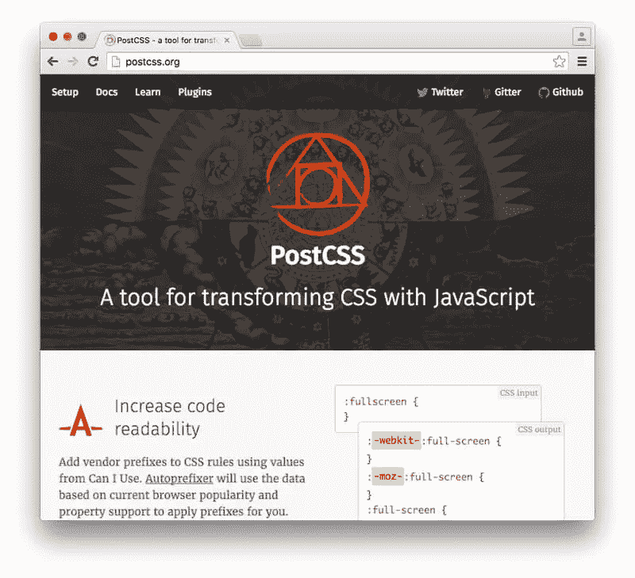

# 如何将 PostCSS 与 Gulp 一起使用

> 原文：<https://www.sitepoint.com/how-to-use-postcss-with-gulp/>

一段时间以来，PostCSS 迅速流行起来。如果你还没有使用过或者不知道什么是 PostCSS，那么我建议你看一下[这篇介绍性的 PostCSS 教程](https://www.sitepoint.com/an-introduction-to-postcss/)，它讨论了 PostCSS 的基础知识，包括如何安装和运行 PostCSS 以及一些插件的快速概述。

在本教程中，我将向你展示如何使用 PostCSS 和流行的自动化工具 [Gulp](http://gulpjs.com/) 。由于这不是一个入门教程，我不会涵盖吞咽的基础知识。但是为了快速复习，你可以看看[这篇优秀的文章](https://www.sitepoint.com/introduction-gulp-js/)。



## 设置项目

在开始本教程之前，您应该有一个将在其中工作的项目文件夹。这个文件夹应该已经安装了 Gulp，并且里面有两个文件夹，分别名为“initial”和“final”(或者您选择的其他名称)。名为“initial”的文件夹将包含您的原始和未处理的 CSS 代码。“最终”文件夹将包含已处理的文件，随时可供使用。

在继续之前，使用终端导航到您的项目文件夹，并运行以下命令:

```
npm install gulp-postcss --save-dev
```

`--save-dev`标志将您正在安装的插件作为依赖项添加到`project.json`文件中。这将有助于您在项目中与其他人合作。当其他团队成员在你的软件包上运行`npm install`命令时，所有的插件都会自动安装。

此时，您的文件夹结构应该是:

*   **initial** —包含原始 CSS 文件的文件夹。
    *   *style.css* —未处理的样式表，我们将在稍后编辑。
*   **final** —包含已处理 CSS 文件的文件夹。
*   **node_modules** —包含所有 npm 模块的文件夹。
    *   **gulp** —安装 gulp 时创建。
    *   **gulp-postcss** —运行上面的命令后创建。
*   *guplfile.js* —你的大口文件。
*   *package.json* —你的 package.json 文件。

## 安装插件

让我们安装一个基本插件来开始。我们要用的插件是[短色](https://github.com/jonathantneal/postcss-short-color)。这基本上扩展了现有的 color 属性，使用第二个值来设置背景色。运行以下命令来安装`short-color`。

```
npm install postcss-short-color --save-dev
```

您也可以使用以下命令同时安装`gulp-postcss`和`postcss-short-color`:

```
npm install gulp-postcss postcss-short-color --save-dev
```

安装完这两个插件后，您需要打开并编辑`gulpfile.js`文件，这样您就可以开始使用插件了。我们首先包括下面几行来启用这两个插件:

```
var gulp = require('gulp');
var postcss = require('gulp-postcss');
var shortColor = require('postcss-short-color');
```

现在，让我们设置一个 Gulp 任务来处理我们的原始 CSS 文件，并创建一个生产就绪的样式表。下面是执行此操作的代码:

```
gulp.task('css', function () {
  return gulp.src('initial/*.css')
  .pipe(postcss([shortColor]))
  .pipe(gulp.dest('final'));
});
```

我首先创建一个名为`css`的任务。每当您想要运行相应的功能时，都会用到这个名称。您可以在`gulp.src()`中指定想要处理的文件。使用`*.css`将处理“初始”文件夹中的所有 CSS 文件。

接下来，我们使用`pipe()`函数来调用我们所有的插件。为此，我们将所有插件作为参数传递给`postcss()`函数。在我们的基本例子中，我们实际上只需要传递一个插件。我将在下一节向您展示如何将多个插件作为参数传递。管道化插件后，`gulp.dest()`用于设置处理文件的目的地。

为了测试是否一切都设置正确，在“initial”文件夹中创建一个`style.css`文件。`style.css`将有以下 CSS:

```
section {
  color: white black;
}
```

接下来，您需要在终端中运行`gulp css`命令。此时，如果您查看“final”文件夹，您应该会看到一个包含以下 CSS 的`style.css`文件:

```
section {
  color: white;
  background-color: black;
}
```

如果样式表中的 CSS 与上面的 CSS 匹配，那么我们可以假设一切正常。

## 安装多个插件

仅仅使用一个基本插件不会对你的工作效率有太大帮助。PostCSS 有很多令人印象深刻且非常有用的插件，所以在大多数情况下你会用到不止一个。在这一节中，我将向你展示如何同时使用多个插件。

你可能会觉得有用的三个 PostCSS 插件/包是: [short](https://github.com/jonathantneal/postcss-short) 、 [cssnext](https://github.com/MoOx/postcss-cssnext) 和 [autoprefixer](https://github.com/postcss/autoprefixer) 。

将使你能够为许多属性写速记的 CSS。例如:

```
.heading {
  font-size: 1.25em 2;
}
```

会变成:

```
.heading {
  font-size: 1.25em;
  line-height: 2;
}
```

使您能够在样式表中使用最新的 CSS 语法。例如，下面的 CSS:

```
.link {
  color: color(green alpha(-10%));
}
```

被转换为:

```
.link {
  background: rgba(0, 255, 0, 0.9);
}
```

最后，`autoprefixer`会将厂商前缀添加到您的 CSS 中，并转换:

```
img {
  filter: grayscale(0.9);
}
```

收件人:

```
img {
  -webkit-filter: grayscale(0.9);
  filter: grayscale(0.9);
}
```

现在让我们看看如何安装这些插件，然后用它们来转换我们的样式表。在项目目录中运行以下命令:

```
npm install autoprefixer postcss-short postcss-cssnext --save-dev
```

我们将不得不修改我们的 Gulp 任务来包含所有这些插件。为了便于维护和简洁，我们将把这些插件存储在一个数组中，而不是一次一个地处理所有这些插件。这是我们`gulpfile.js`的代码:

```
var gulp = require('gulp');
var postcss = require('gulp-postcss');
var autoprefixer = require('autoprefixer');
var cssnext = require('postcss-cssnext');
var shortcss = require('postcss-short');

gulp.task('css', function() {
  var plugins = [
    shortcss,
    cssnext,
    autoprefixer({browsers: ['> 1%'], cascade: false})
  ];
  return gulp.src('initial/*.css')
  .pipe(postcss(plugins))
  .pipe(gulp.dest('final'));
});
```

您可能已经注意到，我已经为 Autoprefixer 插件指定了一些选项。这些选项决定了 Autoprefixer 输出的 CSS。在这种情况下，我告诉插件支持全球使用率超过 1%的所有浏览器。我还禁用了级联，以便所有带前缀和不带前缀的属性都保持对齐。大多数其他插件也有类似的选项。

要测试一切是否正常，请将以下 CSS 放入样式表中:

```
.prefix-filter {
  display: flex;
}

.cssshort-section {
  text: #333 bold justify uppercase 1.25em 1.7 .05em;
}
.cssnext-link {
  color: color(blue alpha(-10%));
}
.cssnext-link:hover {
  color: color(orange blackness(80%));
}
```

如果你现在在终端中运行`gulp css`，你应该在“final”文件夹中的 style.css 里面得到下面处理过的 CSS。

```
.prefix-filter {
  display: -webkit-box;
  display: flex;
}

.cssshort-section {
  color: #333;
  font-weight: 700;
  text-align: justify;
  text-transform: uppercase;
  font-size: 1.25em;
  line-height: 1.7;
  letter-spacing: .05em;
}

.cssnext-link {
  color: #0000ff;
  color: rgba(0, 0, 255, 0.9);
}

.cssnext-link:hover {
  color: rgb(51, 33, 0);
}
```

## 插件的执行顺序

上一节中的例子非常清楚地说明了 PostCSS 的用处。PostCSS 的全部力量在于它的插件。然而，当使用多个插件时——你最终会在复杂的项目中使用——要记住的一件事是你执行它们的顺序。

考虑两个插件 [rgba-fallback](https://github.com/postcss/postcss-color-rgba-fallback) 和 [color-function](https://github.com/postcss/postcss-color-function) 。rgba-fallback 将 rgba 颜色转换为十六进制格式，color-function 将 CSS 的`color()`函数转换为更兼容的 CSS。假设您有以下 CSS:

```
body {
  background: color(orange a(90%));
}
```

如果您要在颜色功能插件之前运行 rgba-fallback 插件，如下所示:

```
var plugins = [
  rgbafallback,
  colorfunction
];
```

您将获得以下 CSS:

```
body {
  background: rgba(255, 165, 0, 0.9);
}
```

如您所见，在已处理的 CSS 中没有 RGBA 回退。出现这种异常的原因是，当 fallback 插件运行时，它发现背景是`color(orange a(90%))`并且不知道如何处理它。稍后，颜色函数插件执行并从原始颜色函数创建 RGBA 颜色值。

如果您要颠倒插件顺序并按以下顺序运行它们:

```
var plugins = [
  colorfunction,
  rgbafallback
];
```

最终的 CSS 将是:

```
body {
  background: #ffa500;
  background: rgba(255, 165, 0, 0.9)
}
```

这一次，颜色插件首先将背景颜色转换为 RGBA 值，然后回退插件添加一个十六进制回退。

## 结论

在本教程中，我已经介绍了一起使用 Gulp 和 PostCSS 的基础知识。通过插件的正确组合和 Gulp 的高效使用，您可以节省许多开发时间，并避免不必要的麻烦。如果你对本教程中提到的技术有任何问题或建议，请在评论中告诉我！

## 分享这篇文章