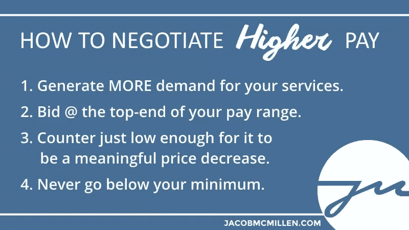

# 我希望在成为自由职业者之前就知道的 4 件事

> 原文：<https://www.sitepoint.com/4-things-i-wish-id-been-told-at-the-start-of-my-freelance-career/>

我从事自由职业已经有 5 年了…过去 3 年是全职的。我享受自由，享受我所能获得的高薪，也许最重要的是，享受活动的多样性。

当然，你不可能花 5 年时间做一件事而不学到一些东西，所以今天我想花点时间来分享一些我希望一开始就知道的事情。我还会提到一些我设法避免的事情，这些事情似乎是许多自由职业者的常见失误点。

我希望这对你来说已经足够了，因为我们马上就要开始了。

## 1.定价与服务质量无关

许多人倾向于认为价格与质量直接相关。当然，你知道有些例外，但是平均来说，人们倾向于挣他们应得的，对吗？

不。不是自由职业者。事实上，如果你想成为一名自由职业者，你需要完全摆脱这种心态。

资本主义的现实是，定价与质量无关。定价 100%由人们愿意支付的价格决定。作为一名自由职业者，我的服务成本完全取决于我能从客户那里谈判到什么，而不是我工作的实际价值。

作为自由职业者，如果你想赚更多的钱，你不需要更好的服务，你需要[更好的谈判技巧](http://jacobmcmillen.com/how-to-negotiate-freelance-payment/)。以下是实现这一目标的注意事项:

当然，质量很重要，我们接下来会谈到这一点，但它实际上与你的定价无关。基本上相同的文章我赚了 12 美元和 800 美元。如果你能改变你的心态，明白价格是你的客户愿意付多少钱的问题，你就可以立即开始做同样多的工作，赚更多的钱。

## 2.你的长期成功将完全取决于质量

虽然你的工作质量不会决定你在任何给定项目上的收入，但它将决定你从回头客和推荐客户那里获得多少项目，而回头客和推荐客户往往会构成一个成功的自由职业者的大部分收入。

不要让这有损于我先前的观点。如果你没有抓住第一点，你可以做 800 美元的高质量工作，并在你的余生中得到 12 美元的报酬。

然而，如果你成功地为 12 美元的高质量工作收取 800 美元，你会发现自己无法吸引到更多的业务。当然，总会有例外，如果你所在的市场中，客户对所提供的服务往往了解有限，那么你就有可能逃脱诈骗。但老实说，如果你的目标只是抢劫，成为一名自由服务提供商是一种非常低效的方式。

长期成功的最佳方式是为你的同事提供一致的价值。当一个客户对你的工作感到兴奋时，有一个很好的机会会变成额外的工作和一两个推荐。当你的每个客户都遇到这种情况时，你实际上是在建立一个被动的潜在客户网络。

专注于做高质量的工作，并随着职业发展不断提高。这是作为自由职业者获得长期成功的最佳途径。

## 3.一次性的免费工作是打开大门最简单的方法

我在新的和有经验的自由职业者中看到了两种相反但同样不正常的趋势。

一方面，有很多没有安全感的自由职业者会做大量免费或低薪的工作，希望在未来获得新的工作或更高的报酬。另一方面，有些自由职业者对免费做某事的想法嗤之以鼻，结果他们错过了很多演出。

免费工作可能是打开大门的最好(最终也是最便宜)的工具之一，但是你必须正确地利用它。我的意思是。

当有人在评估是否要雇用你时，他们实际上是在试图对你是否能提供他们需要的东西做出有根据的猜测。他们试图猜测雇佣你是否会带来积极的投资回报。如果你能为他们回答这个问题，你可以把他们加入你的付费客户名单。

这就是一次性免费服务派上用场的地方。你可以通过提前交付一些证明你价值的东西来消除这个问题。如果你做的是高质量的工作，这是获得经常性业务的好方法。

例如:

*   作家可以写一篇免费的文章，推销一个循环演出
*   开发者可以建立一个免费的登陆页面，推销一个完整的网站
*   设计师可以创建一个标志，并推出一个完整的设计包

你可能已经注意到，免费工作之后是一些额外服务的推销。这真的很重要。

不要随便给谁做免费的工作。只有和那些很有可能给你更多工作的人一起尝试。

永远不要为同一个人做两次免费的工作。

如果你为某人创造了正的投资回报，而他们的回应是要求更多的免费工作，他们就没有兴趣雇佣你做有偿工作。你总能找到愿意占你便宜的人。

## 4.某处有一种组合会给你激情和利润

有一种神话说，你应该追求你的激情，金钱会随之而来。这根本不是真的。

当我第一次开始专业写作时，我真的对写体育很感兴趣。但是你猜怎么着？其他所有幻想自己是作家的 20 多岁的人也是如此。由于驱动价格的供求关系，这意味着如果你作为一名自由体育作家，每篇文章赚 15 美元，你实际上做得相当不错。

因此，我不再以每篇 15 美元的价格写体育，而是以每篇 600 美元的价格写营销。我很享受。

这不是我最喜欢写的东西，也不是我能写的最赚钱的话题。然而，这个话题给我自己带来了激情和收益的完美结合。两种光谱对我来说都足够了。

这真的是经营你自己的自由职业生意的关键——找到完美的组合，让你保持兴趣，同时产生你想要的收入。

很多人会花很多时间试图在一个赚钱很少的领域“成功”——在这个领域，过上体面生活的人是万里挑一的。我想如果这是你最大的梦想，而钱不是你的选择，那就去实现它吧。

但现实是，可能有一种组合会给你带来职业生涯所需的满足感和职业生涯之外生活所需的收入。为什么不从一开始就尝试这种混合呢？

## 结论

这是我希望在自由职业生涯开始时就有的一些建议。

*   如果你没有谈判技巧，你会损失很多钱。
*   如果质量不好，你会失去很多客户。
*   做没有回报的免费工作会让你损失很多时间。
*   如果你没有找到合适的工作组合，你可能会失去你想要的工作/生活平衡。

如果你是一名自由职业者，我向你致敬，并祝你一切顺利。如果你能避开陷阱，继续努力，这将是一份伟大的职业。

## 分享这篇文章