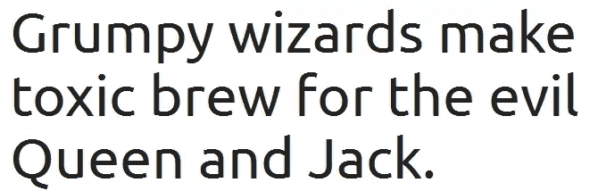
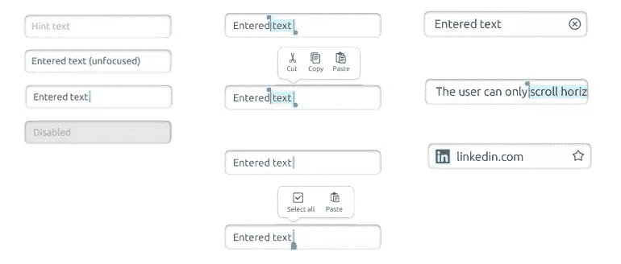
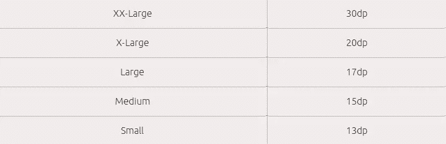
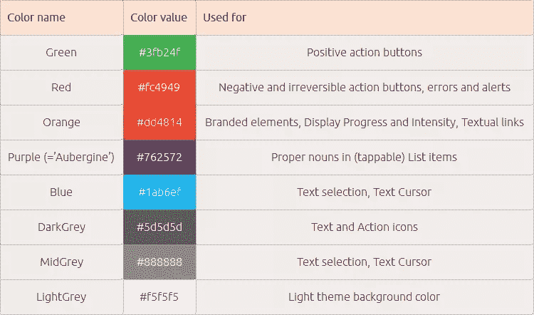
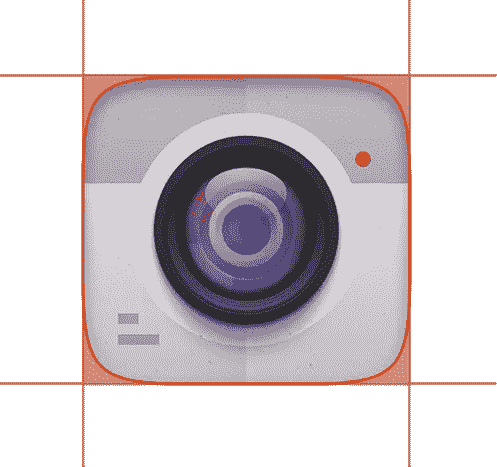
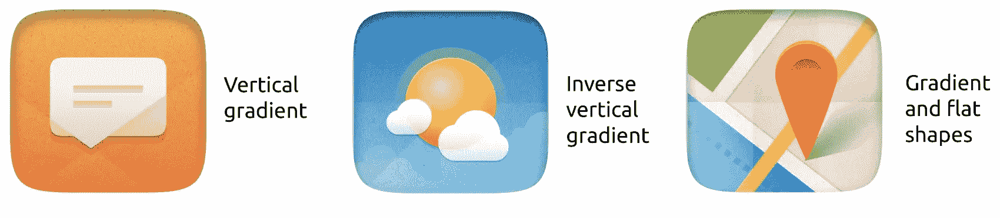
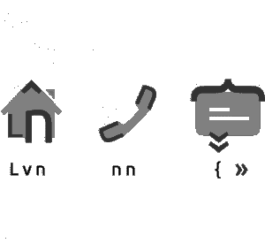

# 探索 Ubuntu 手机用户界面元素

> 原文：<https://www.sitepoint.com/ubuntu-phone-ui-elements/>

去年 11 月，我写了一篇简短的文章，介绍了手机 Ubuntu 操作系统的 UX 原则。在这篇文章中，我将基于 Canonical 提供的官方[风格指南](https://design.ubuntu.com/apps/building-blocks/)，关注特定的 UI 元素。该开始了！

## 排版和文本

Ubuntu 手机用的是自己的字体，不出所料叫做‘Ubuntu’。这是最受欢迎的开放字体之一，你可能会偶然发现一个新项目或初创公司不时使用这种字体。[你可以在这里下载字体](http://font.ubuntu.com/)。

为了在使用 Ubuntu 字体时符合样式指南，您需要遵循以下规则:

*   “轻磅”是页眉和正文的主要重量。
*   使用“中”来强调一个或两个单词，或者突出显示一个动作，例如警告框中的警告。
*   建议不要在 UI 中使用斜体，因为根据 Canonical 的说法，它看起来很“虚弱”，并且影响可读性。
*   我们鼓励您使用“中等”重量，而不是“粗”重量。

有一个关于文本输入的规范，你可以在 [Ubuntu 风格指南](https://design.ubuntu.com/apps/building-blocks/text-input)中详细阅读，但是我将总结主要的元素。

*   有几个文本输入状态，这是一个常见的 UX 原则，几乎与 Android 相同。
*   文本字段允许用户输入单行文本，无论是否经过数据验证。它们可以是特定于密码或数值的，或者是不可编辑的，带有禁用的文本区域。阅读文本字段的 [API 文档了解更多细节。](http://developer.ubuntu.com/api/qml/sdk-14.10/Ubuntu.Components.TextField/)
*   文本区域(多行)会自动换行以容纳溢出的文本，从而为用户创造更多的书写空间。在它的 [API 文档](https://developer.ubuntu.com/api/apps/qml/sdk-15.04/Ubuntu.Components.TextArea/)中阅读更多信息。

这里有一个整洁的参考不同的大小用于文本大小，默认是'中等'。

这就是排版，你会毫无问题地习惯 Ubuntu 的指导方针，因为 UX 不会重新发明轮子。

## 颜色；色彩；色调

Ubuntu 的核心功能使用了特定的颜色，你可以从这个表中找到它们。

你会在风格指南中偶然发现“紫红色”。它用于突出名词，如一个地方或联系人姓名。这使得文本从浅灰色背景中突出出来。

使用浅色和中性色作为背景是很重要的，这样内容本身就能吸引所有的注意力，而不是背景。

阅读 [color aletta 指南](https://design.ubuntu.com/apps/style/color-palette)了解更多详情。

## 肖像学

Ubuntu 对图标有独特的处理方式，这对于那些不喜欢过去几年流行的扁平化设计哲学的人来说尤其有趣。

这里的关键元素是 Ubuntu 形状，它是一个带圆角的正方形，图标会根据它自动裁剪。裁剪后，应用内部阴影以使图标在 UI 中凹陷显示。有用的矩形区域必须是不透明的，但是画布顶部和底部的两个 16 像素高的条带可以是透明的。

Ubuntu 中的图标也由一个“纸纹理”(位图属于一个称为“纹理”的特定层)和一个垂直背景渐变(相同色调的两种颜色)组成。两者中较亮的是顶部边缘，上面覆盖了一层微妙的纸纹理。

“折叠”是苏茹图标主题的定义特征。应用程序在背景上有三个可见的折叠之一。标准折叠是垂直的、水平的或 45 度的，穿过图标的中心。它们的位置和方向可以改变，以跟随和突出象形图或扁平形状中的线条。它们也可以作为故事的一部分。

Ubuntu 图标的另一个显著特点是图标和字体基于相同的模式。字体是 Ubuntu 视觉标识的核心，它的图案可以应用于符号来定义它们的轮廓。

关于图标还有其他小而重要的细节，所以如果你想更深入地了解，请再次阅读[风格指南](https://design.ubuntu.com/apps/style/iconography)。

## 响应性

Ubuntu 采用了一个独特的框架，用网格定义的度量单位来保持统一的体验。网格单位定义了 Ubuntu 中的视觉节奏，应该用于所有的度量，包括元素的大小、间距和边距等。所有的测量都要用 **1 GU** 的倍数(格单位)，对于大多数笔记本电脑就是 **8px** ，retina 笔记本电脑 **16px** ，对于大多数手机和平板电脑就是 **18px** 。网格布局通过将屏幕空间划分为网格单元来工作。

**注**:如果您需要比 GU 更小的单位，Dp(密度独立像素)也是可用的。在大多数器件上，1dp 通常相当于 1 个像素。

一旦你理解了如何使用网格单元，你就可以让自己熟悉关于响应的设计哲学，在[风格指南](https://design.ubuntu.com/apps/patterns/responsive-design)中有详细说明。

## Ubuntufied？

随着手机版火狐操作系统被 Mozilla 抛弃，人们对 Canonical 的计划热情和信心都不高。但对我来说，被谷歌和苹果垄断的想法很可怕，所以看到有勇气尝试新事物的新竞争者总是令人耳目一新。

你认为 Ubuntu 的设计规格如何？

## 分享这篇文章