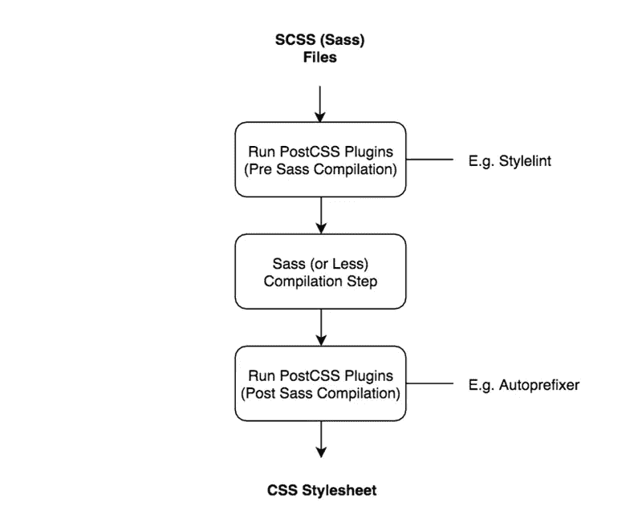

# 后 CSS 流言终结:四个后 CSS 流言终结

> 原文：<https://www.sitepoint.com/postcss-mythbusting/>

随着任何新的前端工具的引入，关于它在已经拥挤的市场中的潜在价值的重要问题也随之而来。它给开发者提供了新的东西吗？投入时间和精力去学习和实现它值得吗？

从一开始， [PostCSS](http://postcss.org/) 就面临着一个有趣的问题。随着它在一个相当成熟的领域与诸如 Sass 和 Less 等成熟的 CSS 工具争夺关注，出现了许多关于它的分类和使用的误解。

因此，让我们解决一些关于 PostCSS 的最常见的误区，并通过这样做来展示它是如何增强您的工作流程并改进您使用 CSS 的方式的。

*注意:如果你想了解更多关于 postscs 到底是什么以及如何设置它的信息，请查看这篇[关于 postscs 的介绍](https://www.sitepoint.com/an-introduction-to-postcss/)，然后再回到这里进行一些流言蜚语！*

## 误解 1——PostCSS 是前置或后置处理器

让我们从与 PostCSS 相关的最大的困惑点开始。

当 PostCSS 首次发布时，它被提升并归类为“后处理器”。许多第一批 PostCSS 插件采用了有效的 CSS 并以某种方式对其进行了扩展，而不是以前预处理程序所熟悉的采用自定义语法并将其编译成有效 CSS 的方法。

将 PostCSS 称为后处理器有些误导，实际上贬低了它的功能。我更愿意把它简单地称为 CSS 处理器，因为它可以在你的 CSS 创作过程中的几个点上，使用 PostCSS 插件执行许多不同的任务。

许多 PostCSS 插件采用自定义语法并将其转换为有效的 CSS，就像您会联想到传统的预处理程序(如 Sass)一样。一个这样的例子是 [PostCSS Nested](https://github.com/postcss/postcss-nested) 插件，它允许你嵌套选择器——与 Sass 和 Less 实现选择器嵌套的方式相同。其他 PostCSS 插件接受有效的 CSS 并对其进行扩展，比如 PostCSS 最知名的插件 [Autoprefixer](https://github.com/postcss/autoprefixer) ，它会自动将供应商前缀添加到样式表中。

一些 PostCSS 插件实际上根本没有改变你的 CSS，而是提供了对你的风格有用的见解。Stylelint 可以用来对你的 CSS 进行 lint 处理，而像 [Colorguard](https://github.com/SlexAxton/css-colorguard) 这样的插件可以帮助你在整个项目中保持一致的调色板。

除此之外，PostCSS 可以像解析标准 CSS 一样解析 SCSS 语法。这意味着你可以用 PostCSS 插件来扩展你的 Sass `.scss`文件——这一点我们将在神话 2 中详细讨论。

为了打破我们的第一个神话——PostCSS 既不是前处理器也不是后处理器。它是一个 CSS 处理器，可以在工作流程中的不同点扩展或报告您的样式。

## 误解 2——post CSS 是 Sass 和 Less 等预处理程序的替代品

开发人员中一个常见的误解是将 PostCSS 作为现有预处理工具(如 Sass 和 Less)的替代工具。

我相信这是由于第一批 PostCSS 插件集中于模拟前置处理器中常见的特性，如变量、条件、循环和混合。随着 PostCSS 社区的发展，出现了更加多样化的插件，提供了许多区别于传统预处理程序的特性。

因此，尽管您可以使用 PostCSS 作为使用 Sass 或更少的预处理器的替代方案，您也可以通过扩展您最喜欢的预处理器的特性来增强您现有的工具集。

PostCSS 能够解析 CSS 和 [SCSS 语法](https://github.com/postcss/postcss-scss)，这意味着您可以在 Sass 编译步骤之前和之后使用 PostCSS 插件来转换您的样式。例如，在当前的一个项目中，我使用 PostCSS 在我的 Sass 文件被编译成 CSS 之前使用 Stylelint 对其进行 lint。生成的 CSS 然后用插件扩展，如 Autoprefixer 和 [postcss-assets](https://github.com/assetsjs/postcss-assets) ，以添加供应商前缀和内嵌图像资产作为数据 URIs。因此，您的工作流可能看起来像这样:



最终，如何选择使用 PostCSS 取决于您自己。如果你想把它作为你唯一的 CSS 处理工具，你当然可以这么做。但是，如果您非常喜欢使用 Sass 或更少的 Sass，那么可以考虑 PostCSS 同样能够与这些工具一起工作，提供您的预处理器所不能提供的附加功能。

## 误解 3——post CSS 只会让我的工具更加复杂

我知道你在想什么。前端工具领域已经有了太多的选择——为什么还要添加另一个工具，并可能使您的构建过程变得更加复杂呢？这是一个合理的担忧，但是你需要在你工作的项目中对自己进行评估。

你可能已经在使用 PostCSS 而没有意识到。如果您使用 Autoprefixer 向 CSS 添加供应商前缀，那么您已经在使用 PostCSS 了。Autoprefixer 是一个 PostCSS 插件，可以通过 [grunt-postcss](https://github.com/postcss/autoprefixer#grunt) 或 [gulp-postcss](https://github.com/postcss/autoprefixer#gulp) 插件实现到常见的任务运行程序中，如 Grunt 和 Gulp。如果您使用不同的工作流工具，如 Webpack，也有可用的解决方案——查看 [PostCSS 文档，了解关于此](https://github.com/postcss/postcss#usage)的更多信息。

如果您在项目中使用 Autoprefixer 时没有使用这些插件，我建议您更新您的项目来这样做。以这种方式包含它的好处是允许您非常容易地包含其他 PostCSS 插件。例如，如果我使用 Autoprefixer 和 Gulp，我的代码将如下所示:

```
return gulp.src( ['/**/*.css'] )
  // PostCSS tasks to be run on our CSS files
  .pipe( postcss([
    autoprefixer({
      browsers: [
        '> 5%',
        'last 2 versions',
        'ie > 7'
      ] 
    }) // Autoprefixes CSS properties for various browsers
    … // any other PostCSS plugins to be run can be added in here
]) )
.pipe( gulp.dest( CSS_DEST_PATH ) );
```

正如你所看到的，当你想在你的过程中包含额外的插件时，可以在你的 Autoprefixer 引用旁边添加额外的插件。

如果你出于某种原因不使用 Autoprefixer，那么我建议你看看其他可用的 PostCSS 插件。每个项目和开发团队都是不同的，只有通过浏览可用的插件，你才能判断是否有什么可以帮助你和你的团队创作 CSS。

将 PostCSS 作为过程的一部分并不比添加任何其他 Grunt 或 Gulp 插件更复杂。不要因为它是另一个构建步骤而忽略它；如果这一步有助于你改进你的 CSS 工作方式，这是值得考虑的一步。

## 误解 4——PostCSS 不能提供我当前的预处理器不能提供的任何东西

这个神话来源于 PostCSS 被直接比作预处理器，比如 Sass 和 Less——特别是模拟 Sass 功能的 PostCSS 插件。

在过去的 12 个月里，PostCSS 作为一种工具已经发展了很多。虽然这些插件仍然可用，但有更丰富的插件选择，这些插件提供了它们所能做的大量变化。

如果您对使用当前的预处理器非常满意，并且以前认为 PostCSS 只是提供了相同的特性，那么我建议您再看一看。诸如 [Stylelint](http://stylelint.io/) 、[postscs Stats](https://github.com/cssstats/postcss-cssstats)和 [doiuse](https://github.com/anandthakker/doiuse) 等插件可以提供 CSS 的自动报告——这是传统的预处理器无法做到的。

它还可以提供自动化的优化，比如针对 [SVG](https://github.com/ben-eb/postcss-svgo) 或 [CSS 缩小](https://github.com/ben-eb/cssnano)，并且提供了一个比使用 mixins 更优雅的解决方案来为你的样式添加后备。

如果你想尝试用 [CSS 模块](https://www.sitepoint.com/understanding-css-modules-methodology/)，PostCSS 也[提供插件，可以帮助你完成那个](https://github.com/postcss/postcss#solve-global-css-problem)。

关于 PostCSS 要记住的关键是，它仍然是一个相对较新的工具。随着社区的不断发展，越来越多的插件被创建出来，解决各种有趣的 CSS 开发问题。查看当前在 [postcss.parts 站点](http://postcss.parts/)上可用的插件目录，看看当前有什么可用的。

简而言之，PostCSS 提供了各种各样的独特特性，这些特性是使用其他预处理程序无法实现的。花点时间看看有什么可用的，因为您可能会发现您可以轻松地扩展您当前的预处理器的特性集。

## 概括起来

PostCSS 是一个强大的 CSS 处理工具，可以增强任何前端开发人员的工作流程。作为一种工具，它正迅速变得越来越成熟，并为常见的 CSS 和预处理器创作问题提供了一些非常优雅的解决方案。

如果你以前看过 PostCSS，并且因为某种原因而放弃了它，我建议你再看一看；它是一个可以增强任何前端开发工作流的工具。

## 分享这篇文章