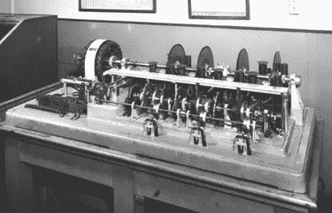
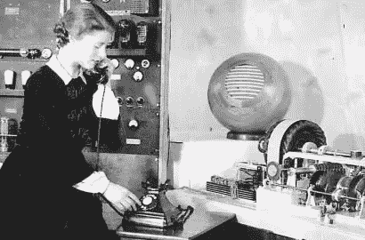
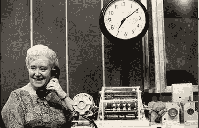

# 会说话的时钟:基于语音的用户界面的诞生

> 原文：<https://www.sitepoint.com/talking-clock-birth-voice-based-ui/>

如今，语音驱动的 UI 系统无处不在。

*   电梯宣布楼层
*   汽车唠叨着要我们系好安全带
*   火车站背诵时刻表信息
*   亚马逊回声阅读美国食谱
*   Siri 为误解了我们的问题而道歉

事实上，说话系统如此普遍，以至于我们几乎没有注意到它们的存在。但并不总是这样。

## 在 Siri 之前有“TIM”

不，这不是老式熟食店切肉机或旧台锯。

认识一下蒂姆:Siri 有个爷爷。

这是蒂姆，世界上第一个会说话的时钟系统之一，于 1936 年在伦敦发布。任何有电话的人都可以拨打“会说话的时钟”号码，听到准确的 GMT 时间，精确到秒。

> 第三声钟响时，将是 10 点 25 分 30 秒整…嘀…嘀…嘀… 。

在运营的第一年，1300 万用户拨打了会说话的时钟。从站长到公共汽车司机到面包师，再到村里的时钟计时员，每个人都通过会说话的时钟来设定时间。

可以说，这使得“TIM”成为世界上第一个面向大众市场的电子数据服务。几十年前，互联网甚至是一个想法，*成千上万的人每天都在连接到一个全自动、网络化的信息服务。*

 *这是你祖父母的互联网！

<small>埃塞尔·简·凯恩——伦敦会说话的钟的第一个声音</small>

当然，这是在晶体管和硅出现之前很久的事了，所以 TIM 是由一个由马达、转子、圆盘和表盘组成的精密发条装置组成的。你在书脊上看到的玻璃盘包含了 79 个独特的时间名称——*过去五年…* ，*过去六年…* ，*过去七年…* 等等。

本质上，TIM 是一个复杂的大型电唱机和布谷鸟钟的混合体——但它可以在一分钟内与数百名用户通话。

在邮局的 15，000 名接线员中举行了声音测试，以选出时钟的“声音”。从 1936 年到 1963 年，埃塞尔·简·凯恩(上图)成为英国《时代》杂志的代言人。

<small>帕特·西蒙斯与马克三</small>

1963 年，英国邮政推出了新一代会说话的时钟，名为“马克三号”，由帕特·西蒙斯(上图)优雅的声音配音。直到 1985 年 4 月，布赖恩·考比取代了帕特的位置，每年有多达 4 亿人听到她的声音。

虽然 Mark III 已经正式退役，但它在 1985 年被转移到了英国钟表学院博物馆，在那里它继续完美地为游客服务了 20 年。

据博物馆馆长艾伦·米德勒顿(Alan Midleton)说，2005 年的一天，马克三型的发动机发出令人不安的呼呼声，最后嘎然而止。英国钟表研究所的技术人员花了几个月的时间来重建和恢复它的工作状态。

直到后来，他们才发现 85 岁的帕特·西蒙斯在时钟停止的同一时间离开了人世。

诡异吧。

*原载于 [SitePoint 设计简讯](https://www.sitepoint.com/newsletter/)* 。* 

## *分享这篇文章*