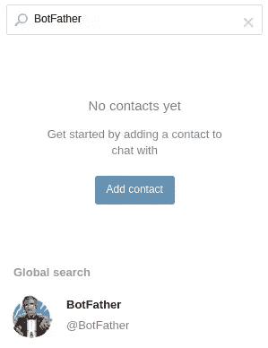
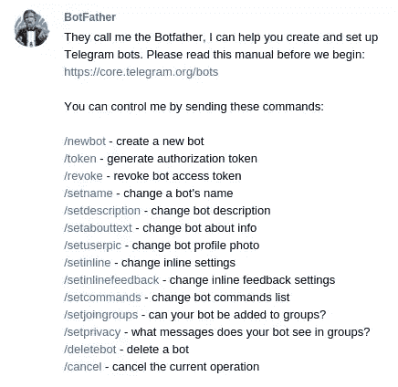
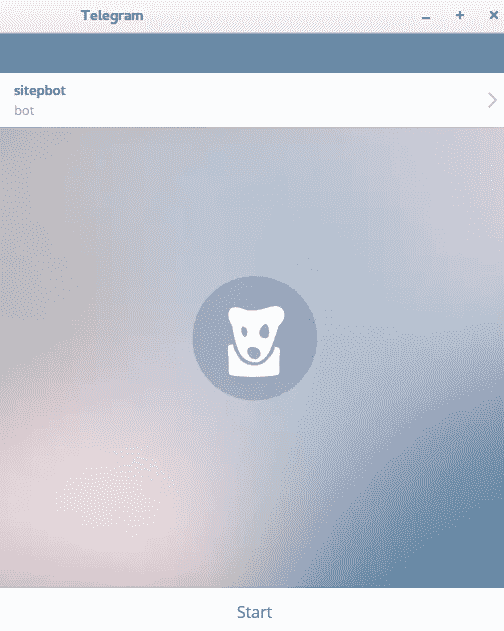
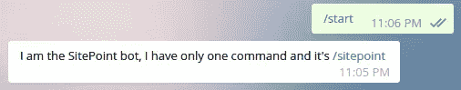
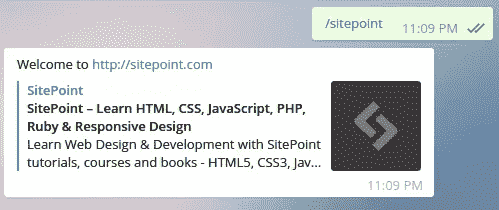

# 用 Ruby 快速创建一个电报机器人

> 原文：<https://www.sitepoint.com/quickly-create-a-telegram-bot-in-ruby/>


Telegram 对你来说可能是一个新名字，但它在过去几年里越来越受欢迎，最近的新闻报道称 Telegram 每月有 1 亿活跃用户。那么这到底是怎么回事呢？

Telegram 是一个基于云的消息应用程序，以各种功能而闻名，其安全消息是关键功能之一。它支持多种平台，如 Windows、OSX、GNU/Linux、Android、iOS 和 Windows Phone。值得一提的是，Telegram 的客户端是开源的，所以我们可以使用任何其他消息应用程序，如 Pidgin 来连接 Telegram。

电报的一些特点:

*   加密
*   超级团体(1000 名成员或更多)
*   文件/照片传输
*   开源客户端
*   通过您的所有设备同步您的消息
*   文件大小共享限制 1.5 GB
*   蝇蛆病

我们将特别讨论最后一个问题。Telegram 提供了两个 API:开发者的 API 和 T2 的 API

首先，我们需要注册一个账户。要么下载其中一个客户端，要么直接去 [web](http://web.telegram.org) 版 Telegram。从那里，你会被要求给一个电话号码，电报将发送一个确认短信。

## 遇见父亲


机器人是一种特殊的电报账户，用于自动处理信息。用户可以通过在私人或群聊中向机器人发送命令来与它们互动。我们使用对机器人 API 的 HTTPS 请求来控制我们的机器人。

我们可以用机器人做什么？

*   在电报组中做笔记
*   获取天气更新
*   玩游戏
*   与社交网络、IRC 等其他服务互动。

我们可以用机器人做很多事情。创建机器人的第一步是与机器人父亲对话。

在搜索表单**中输入父**。



点击机器人父亲，一个聊天容器就会打开，这样我们就可以和他聊天了。点击**开始**按钮，这将显示一个命令列表，我们可以用它来与机器人父亲交互。



让我们使用命令`/newbot`创建我们的机器人。它将要求为我们的机器人命名，所以我们将把我们的机器人命名为**site bot**。

现在我们必须注册一个用户名，**注意:**它必须以 **bot** 结尾，如果我们的 bot 被命名为 TetrisBot，用户名必须是 **tetris *bot*** 。顺其自然 **sitepointbot** 。

爸爸会祝贺我们，并给我们的机器人 telegram.me/sitepoint_bot 一个链接。

我们可以添加一个描述，也可以添加一个简介图片到我们的机器人。`/help`命令会给我们一个命令列表，我们可以与机器人父亲进行交互。

```
/newbot - create a new bot
/token - generate authorization token
/revoke - revoke bot access token
/setname - change a bot's name
/setdescription - change bot description
/setabouttext - change bot about info
/setuserpic - change bot profile photo
/setinline - change inline settings
/setinlinefeedback - change inline feedback settings
/setcommands - change bot commands list
/setjoingroups - can your bot be added to groups?
/setprivacy - what messages does your bot see in groups?
/deletebot - delete a bot
/cancel - cancel the current operation 
```

使用上面的一个命令，我们可以对我们的机器人进行各种修改。但是，现在最重要的命令是`/token`，因为它会给我们一个 API 令牌来通过 HTTPS 访问我们的机器人。继续，现在输入:

```
/token 
```

返回值看起来会像这样:`197372558:AAEtvechentOstoPmVyb1_aF2Dbe7k`

在创建了我们的机器人并让它听我们说话之后，是时候使用一些 Ruby 的能力了。有几个 gem 可以与 bot API 交互。我们将使用 **telegram-bot-ruby** 。

## 装置

我们可以从您的终端直接安装:

```
gem install telegram-bot-ruby 
```

或者将其添加到我们的 **Gemfile** :

```
gem 'telegram-bot-ruby' 
```

如果我们将它与 **Gemfile** 一起使用，我们需要在我们的项目目录中输入`bundle install`。这将安装 gem 及其所需的依赖项。

### Hello SitePoint 示例

创建一个名为 **sitepointbot.rb** 的文件，我们将在这里构建这个文件的内容。

首先，我们需要进口我们的宝石:

```
require 'telegram/bot' 
```

接下来，我们需要添加我们之前生成的令牌:

```
token = 'YOUR API TOKEN' 
```

使用`bot.api`对象，我们可以使用 Bot API 中的所有方法:

```
Telegram::Bot::Client.run(token) do |bot|
  bot.listen do |message|
    case message.text
    when '/sitepoint'
      bot.api.send_message(chat_id: message.chat.id, text: "Welcome to https://www.sitepoint.com")
    end
  end
end 
```

`send_message`是 Bot API 的方法之一，它向当前的`chat_id`发送消息。`chat_id`是目标聊天的唯一标识符，或者目标频道的用户名。当然，`text`是要发送到聊天室的消息。每当机器人在我们的聊天消息中看到`/sitepoint`时，它都会回复“欢迎来到 https://www.sitepoint.com！”

注意:强烈建议我们在命令前使用斜线(/)，我们不想让我们的机器人干扰我们的对话。

### 完全码

```
require 'telegram/bot'

token = 'YOUR API TOKEN'
Telegram::Bot::Client.run(token) do |bot|
  bot.listen do |message|
    case message.text
    when '/sitepoint'
      bot.api.send_message(chat_id: message.chat.id, text: "Welcome to https://www.sitepoint.com")
    end
  end
end 
```

现在是时候运行我们的机器人了:

```
ruby sitepointbot.rb 
```

我们必须寻找机器人。它将出现在搜索结果区域。



你可以看到，有一个“开始”按钮。如果我们点击按钮，将会执行一个`/start`命令。这应该总是包含来自我们的机器人的欢迎消息，这是添加关于机器人的一般信息的最佳位置，如它做什么和它理解什么命令。



这是开始按钮或`/start`命令的效果。如果你想在聊天中启动机器人，你也可以输入

```
start@SitepBot 
```

这是必要的，如果你有一个以上的聊天机器人。

现在我们来试试`/sitepoint`。



结果是一条欢迎消息，其中包含指向 SitePoint 网站的链接。

### 再举一个例子

让我们使用`sendLocation`方法。这个方法将在地图上创建一个点。我们将使用同一个对象`bot.api`，但是这次我们想要使用`send_location`方法:

```
bot.api.send_location(chat_id: message.chat.id, latitude: -37.807416, longitude: 144.985339) 
```

### 完全码

```
require 'telegram/bot'

token = 'YOUR API KEY'
Telegram::Bot::Client.run(token) do |bot|
  bot.listen do |message|
    case message.text
    when '/start'
      bot.api.send_message(chat_id: message.chat.id, text: "I am the SitePoint bot, My commands are /sitepoint /map")
    when '/sitepoint'
      bot.api.send_message(chat_id: message.chat.id, text: "Welcome to https://www.sitepoint.com")
    when '/map'
      bot.api.send_location(chat_id: message.chat.id, latitude: -37.807416, longitude: 144.985339)
   end
  end
end 
```

**注意**:我们需要退出 bot 并重新开始，才能看到变化。


### 结论

Telegram 提供可靠、安全的信息服务。像 Slack 一样，Telegram 提供了创建可以与用户互动的机器人的能力。我们已经看到了机器人可以做的一些基本功能，但我们可以让它们更智能，功能更强大，看看 Telegram 的 API，发挥创意。如果你做了很棒的东西，请与我们分享。

## 分享这篇文章