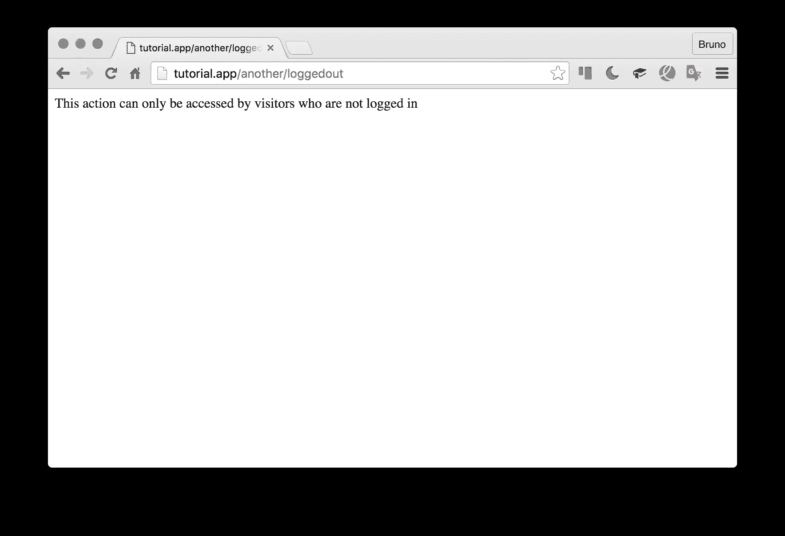
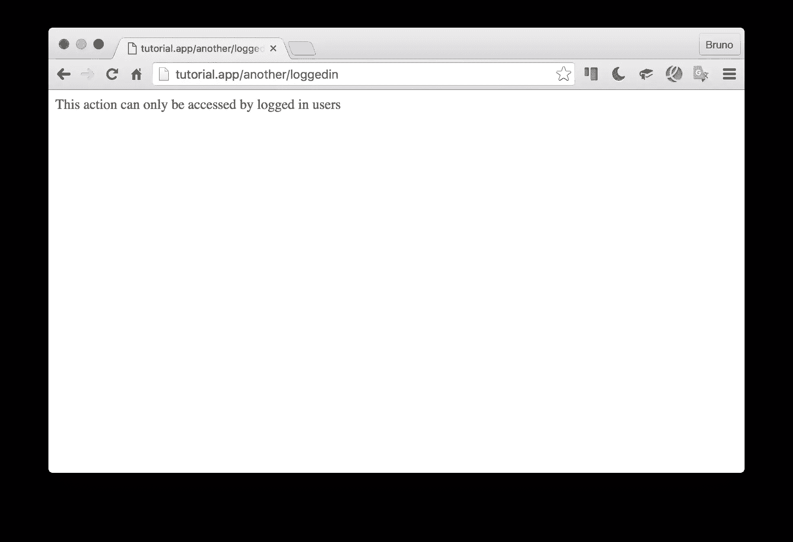
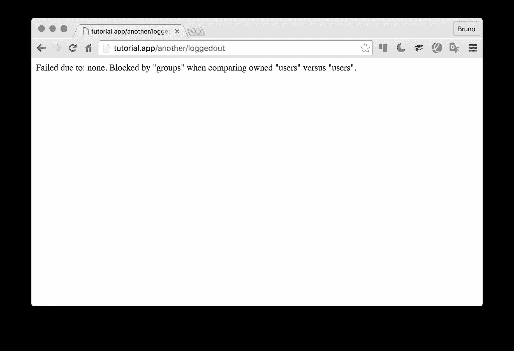
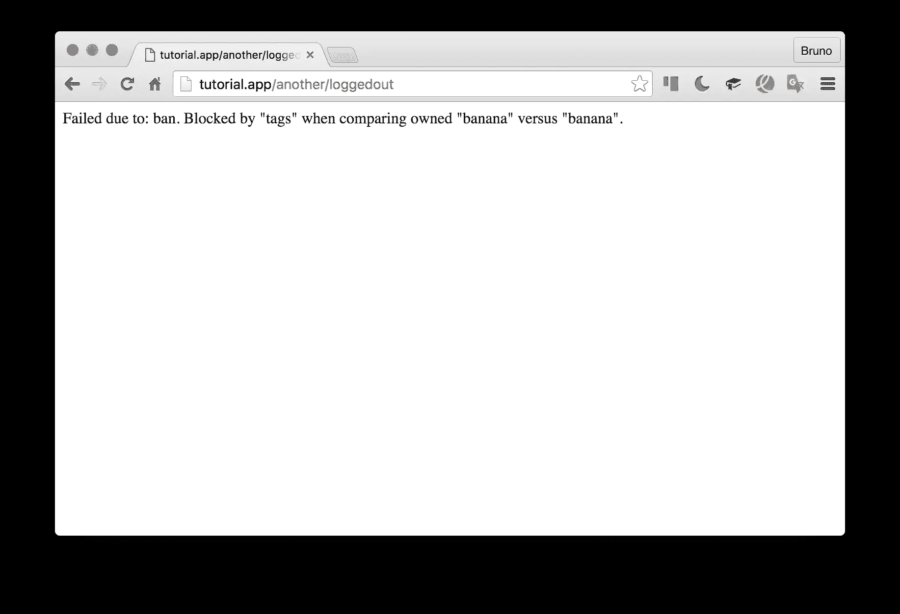

# 用 Rauth 控制用户对类和方法的访问

> 原文：<https://www.sitepoint.com/control-user-access-to-classes-and-methods-with-rauth/>

Rauth 是 SitePoint 的访问控制包，主要通过注释来授权或限制对某些类或方法的访问。


在本教程中，我们将学习如何使用它。

## 为什么是劳思

传统的访问控制层(ACL)只控制路由——您将任何以`/admin`开头的内容都设置为只有管理员才能访问，等等。这在大多数情况下是可以的，但在以下情况下就不行了:

*   您希望在命令行上控制访问(那里没有路由)
*   即使更改了路由，您也希望接入层保持不变

Rauth 就是为了满足这一需求而开发的。当然，如果它的功能不够完善，它也可以和其他类型的 ACL 一起很好地工作。

## 注释是坏的

有些“争议”，Rauth 默认使用注释来控制访问。不管你对 PHP 中的注释持哪种观点，这就是为什么在 Rauth 的例子中使用注释并不像某些人所说的那样错误:

*   由于在典型的 MVC 应用程序中，您通常会控制对控制器和动作的访问，像这样将它们硬耦合到 Rauth 不仅无害(如果您正在大规模地更改框架或应用程序的结构，控制器几乎总是需要被完全丢弃和重写,)

*   如果您不喜欢注释，可以给 Rauth 一个预先缓存或预先解析的权限和它们所应用的类的列表，这样就可以完全避免整个注释问题

*   再也不用担心注释会减慢速度，因为 PHP 每次都需要反映到相关的类中并提取它们。在 OpCache 一直打开的情况下，这种情况只会发生一次，在 Rauth 自己的缓存支持下，这种情况甚至可以保存在其他地方，并且可以完全避免注释读取过程。

## 简单的例子

举个简单的例子，让我们创建两个类，一个`index.php`文件，并安装 Rauth:

```
composer require sitepoint/rauth 
```

```
<?php

// index.php

use SitePoint\Rauth;

require_once 'vendor/autoload.php';

$r = new Rauth();

$user = [
    'groups' => 'admin',
];

$fakeRoutes = [
    'admin' => ['One', 'adminOnly'],
    'users' => ['One', 'users'],
    'banned' => ['One', 'banned'],
    'everyone' => ['Two', 'everyone'],
];

foreach ($fakeRoutes as $route) {

    require_once $route[0] . '.php';

    $class = $route[0];
    $method = $route[1];

    try {
        $r->authorize($class, $route[1], $user);
        echo "Success: ";
        $class = new $class();
        $class->$method();
    } catch (Rauth\Exception\AuthException $e) {
        echo "Authorizing {$class}::{$route[1]} failed!\n";
        echo $e->getMessage() . "\n";
    }
} 
```

```
<?php

// One.php

/**
 * Class One
 * @auth-groups users
 */
class One
{
    /**
     * @auth-groups admin
     */
    public function adminOnly()
    {
        echo 'Because the "admin" group is detected, the One::adminOnly method is executed.';
        echo "\n";
    }

    public function users()
    {
        echo '"Users" can use One::users - it inherited from the class @auth declaration';
        echo "\n";
    }

    /**
     * @auth-groups banned
     * @auth-mode none
     */
    public function banned()
    {
        echo 'No user with the group "banned" can access One::banned.';
        echo "\n";
    }
} 
```

```
<?php

// Two.php

class Two
{
    public function everyone()
    {
        echo "Everyone can access Two::everyone!\n";
    }
} 
```

如果我们现在在控制台中使用以下命令运行它:

```
php index.php 
```

我们会得到:

```
vagrant@homestead:~/Code/rauthtest$ php index.php
Success: Because the "admin" group is detected, the One::adminOnly method is executed.
Authorizing One::users failed!

Success: No user with the group "banned" can access One::banned.
Success: Everyone can access Two::everyone! 
```

如果我们将`$user`数组的组改为`banned`，看看会发生什么:

```
vagrant@homestead:~/Code/rauthtest$ php index.php
Authorizing One::adminOnly failed!

Authorizing One::users failed!

Authorizing One::banned failed!

Success: Everyone can access Two::everyone! 
```

简而言之，Rauth 使用*需求*(文档块中以`@auth-`开头的所有内容)，并将它们与*属性*(我们在`$user`变量中定义的所有内容)进行比较。如何获得这些属性取决于您，也许您会使用某种预制的包，如 Gatekeeper，或者您会推出自己的身份认证系统，这都无关紧要。重要的是，Rauth 以一种与类/方法上的*需求*相当的格式获得属性。

*关于模式的说明:如果用户的组属性是“admin ”,他们可以使用`@auth-groups admin`访问所有方法。如果`mode`被设置为`@auth-mode OR`(这是默认设置，可以省略)，那么用户将能够使用`@auth-groups admin, users, banana`访问方法，因为他们只需要定义**组中的一个**。当模式为 AND ( `@auth-mode AND`)时，他们需要拥有所有的组。如果在`banned()`方法中模式是`NONE`，那么用户不能有任何组。*

记住，`auth-`可以是任何东西，不一定是`groups`。您可以使用像`@auth-banana ripe`这样完全任意的值，然后属性中带有`'banana' => 'ripe'`的用户将能够访问该类/方法。

## 依赖注入示例

上面的例子是授权流程的基本演示。现在让我们设置一个场景，其中一个路由被解析，一个控制器被依赖注入容器自动调用，一个授权检查被自动进行。换句话说，启动一个新应用程序的最佳实践方法——one[nofw](https://github.com/Swader/nofw)——无框架框架——是基于。

```
composer require sitepoint/rauth php-di/php-di nikic/fast-route 
```

让我们也做一个`Controllers`文件夹，放两个控制器在里面:

```
<?php
// Controllers/OneController.php

namespace MyApp;

class OneController
{
    public function homeAction()
    {
        echo "This is the home screen!";
    }
} 
```

```
<?php

namespace MyApp;

/**
 * Class AnotherController
 * @package MyApp
 */
class AnotherController
{
    public function indexAction()
    {
        echo "This is the second controller, index action, accessible to all";
    }

    /**
     * @auth-groups users
     */
    public function onlyLoggedInAction()
    {
        echo "This action can only be accessed by logged in users";
    }

    /**
     * @auth-groups users
     * @auth-mode NONE
     */
    public function onlyLoggedOutAction()
    {
        echo "This action can only be accessed by visitors who are not logged in";
    }
} 
```

我们还需要配置自动加载器来加载这些控制器:

```
 "autoload": {
        "psr-4": {
            "MyApp\\": "Controllers"
        }
    } 
```

并使用以下内容重新生成自动加载文件:

```
composer du 
```

下一步是按照 PHP-DI 文档配置路由和依赖注入容器。我们的`index.php`文件应该修改成这样:

```
<?php

// index.php

require_once 'vendor/autoload.php';

use SitePoint\Rauth;
use FastRoute\RouteCollector;
use FastRoute\Dispatcher;
use DI\ContainerBuilder;

$containerBuilder = new ContainerBuilder;
$containerBuilder->addDefinitions([

]);
$container = $containerBuilder->build();

$routeList = [
    ['GET', '/one-home', ['MyApp\OneController', 'homeAction']],
    ['GET', '/another-index', ['MyApp\AnotherController', 'indexAction']],
    ['GET', '/another/loggedin', ['MyApp\AnotherController', 'onlyLoggedInAction']],
    ['GET', '/another/loggedout', ['MyApp\AnotherController', 'onlyLoggedOutAction']],
];

/** @var Dispatcher $dispatcher */
$dispatcher = FastRoute\simpleDispatcher(
    function (RouteCollector $r) use ($routeList) {
        foreach ($routeList as $routeDef) {
            $r->addRoute($routeDef[0], $routeDef[1], $routeDef[2]);
        }
    }
);
$route = $dispatcher->dispatch(
    $_SERVER['REQUEST_METHOD'],
    $_SERVER['REQUEST_URI']
);
switch ($route[0]) {
    case FastRoute\Dispatcher::NOT_FOUND:
        die('404 not found!');
    case FastRoute\Dispatcher::METHOD_NOT_ALLOWED:
        die('405 method not allowed');
    case FastRoute\Dispatcher::FOUND:

        $controller = $route[1];
        $parameters = $route[2];

        $container->call($controller, $parameters);
        break;
} 
```

首先，我们制作一个新的空容器。然后，我们定义一些路线(这通常会放入一个类似于`routes.php`的外部文件)。我们将这些路由添加到 dispatcher，因此它知道如何处理它们，最后我们提取触发路由的元素并触发适当的控制器。很简单，对吧？

现在，这些路线应该是可行的:



是时候添加 Rauth 层来实际限制对其中一些路线的访问了。

首先，我们将向容器添加一个`User`定义:

```
$containerBuilder->addDefinitions(
    [
        'User' => function () {
            return [
                'groups' => 'users',
            ];
        },
    ]
); 
```

通常这有某种逻辑，比如检查数据库中的用户组。出于本教程的目的，硬编码就足够了，因为实际的用户管理超出了本文的范围。

然后，在下面的`FOUND`案例中，我们将实例化 Rauth 类，并构建一个属性数组，以便在进行`authorize`检查时为其提供信息。注意，如果用户没有被定义(例如，他们被注销)，我们默认为一个空的`groups`数组。

```
// [...]

case FastRoute\Dispatcher::FOUND:

$controller = $route[1];
$parameters = $route[2];

$rauth = new Rauth();
$attributes = $container->get('User') ?: ['groups' => []]; 
```

既然 Rauth 在`authorize`调用失败时抛出了一个`AuthException`，那么让我们也将整个事情包装到一个`try/catch`块中。

```
try {
    $rauth->authorize($controller[0], $controller[1], $attributes);
} catch (Rauth\Exception\AuthException $e) {
    die("Authorization failed");
} 
```

如果我们现在使用之前的默认硬编码用户访问`another/loggedout`路由，应该会失败，因为我们在该用户上有`users`组:


而`another/loggedin`组将会成功:



当然，在开发过程中，您可能想要一些更详细的错误消息。为此，每个`AuthException`都有一个`type`并包含一些`Reason`对象。如果模式设置为“无”,则类型类似于“无”;如果故障是由于禁止而发生的，则类型类似于“禁止”(有所不同——见下一节),等等。每个原因都有自己的失败组(不要与任意命名的“组”属性混淆)，以及该组中所有实体的列表。也许这可以通过一个例子得到最好的解释。我们可以将上面的`die()`调用替换为:

```
echo 'Failed due to: ' . $e->getType(). '. ';
/** @var Rauth\Exception\Reason $reason */
foreach ($e->getReasons() as $reason) {
    echo 'Blocked by "' . $reason->group . '" when comparing owned "' . implode(
            ", ", $reason->has
        ) . '" versus "' . implode(", ", $reason->needs) . '".';
}
die(); 
```

你可能希望在一个 flash 消息中或者在一个普通的应用程序中的一个漂亮的错误视图中，但是在本教程中像这样重复出来是没问题的。如果我们再次尝试`loggedout`路径，这个块会产生如下输出:



换句话说，它说:“我不希望‘组’中有以下任何一项:‘用户’，但我得到了‘用户’”。

随意更改用户数组上的一些硬编码组，并修改类上的注释以进一步测试一些路由。也检查一下`AND`对`OR`模式。

### 结婚预告

到目前为止，我们没有提到的最后一件事是:禁令。Rauth 有一个额外的预先检查，称为被禁实体，这是所有其他人之前。如果满足了一个禁令，那么授权就失败了，不管有多少其他东西匹配。例如:

```
@auth-groups users, admin
@auth-ban-groups banned 
```

如果用户拥有`banned`组，无论他们是否也拥有`users`或`admin`，上面都将阻止对类或方法的访问。像其他属性一样，ban 集合可以是任意:

```
@auth-groups users, admin
@auth-ban-tags banana 
```

用`banana`标记一个用户，他们就不能进入，不管他们的其他属性如何。

Ban 检查发生在任何其他检查之前，所以如果您只需要基于某些属性阻止对某些类或方法的访问，ban 将是最有效的方法。禁令有自己的例外类型:



## 结论

我们看了一下 [Rauth](https://github.com/sitepoint/Rauth) ，SitePoint 用于控制对类和方法的访问的包。我们在两个简单的演示中实现了它，并展示了它的易用性。

由于 Rauth 是一个 [SitePoint 开源项目](https://www.sitepoint.com/fast-multi-language-docs-with-sitepoints-rtdsphinx-php/)，我们正在积极寻找贡献者或只是对一些开放问题的反馈——我们决心使我们的包值得生产使用，我们需要你的帮助。

你给劳思打针了吗？你会吗？请在评论中告诉我们！

## 分享这篇文章