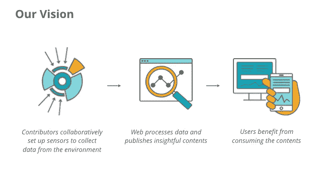

# 火狐操作系统转向互联设备

> 原文：<https://www.sitepoint.com/the-firefox-os-pivot-into-connected-devices/>

你可能已经听说了 Mozilla 公司取消了智能手机的 Firefox 操作系统。经过三年多与苹果-谷歌移动巨头的持续游击战，Mozilla 正试图选择新的战斗，它希望能赢。尤其是——广阔而模糊的物联网(IoT)世界。火狐操作系统现在将转向互联设备，其技术将用于物联网创新流程。Mozilla 预测，物联网热潮将比十年前的智能手机热潮更大。与 Firefox OS 不同，没有必要弥合与竞争对手之间的巨大差距——物联网仍然是一个足够新的概念，新玩家能够塑造它的愿景。

与此同时，火狐操作系统正在过渡到一个社区维护的项目。这意味着 2016 年后，Mozilla 将不再为其配备员工。此外，该项目将被重新命名为**引导到壁虎(B2G)** 。这已经在 [Mozilla 社区论坛上公布了。](https://discourse.mozilla-community.org/t/update-on-b2g-os-for-smartphones-transition/7364)
通过联网设备战略，Mozilla 也打算在物联网领域保留一席之地。

在下面的文章中，我们将提前了解 Mozilla 的相关物联网项目，这些项目将为 Mozilla 在物联网领域的角色奠定基础。

***注:**所有项目都处于非常早期的阶段，因此在整个 2016 年，你会注意到许多项目的合并、拆分和变更。*

## FlyWeb

FlyWeb 是 Mozilla 的一个更具体的项目，Firefox 的创造者希望通过它开辟新的领域。它是一个项目的内部代号，将 web 应用程序架构引入到本地交互中。

FlyWeb 设计提出使用局域发现机制来使两个计算端点(其中一个端点通常是由用户控制的智能手机)能够使用局域传输协议建立 Web 应用会话。

在所有这些交互中，一个端点扮演 web 服务器的角色，另一个端点扮演 web 客户端的角色。智能手机可以扮演局域网客户端的角色，使用其周围端点公开的服务。此外，智能手机应用程序可以充当局域网服务器，向周围的其他智能手机公开服务。或者，使用 web 应用程序架构将计算“推”到它周围的端点。

> FlyWeb 的核心是一个非常简单的想法。手机不再只与云交互，它们可以发现周围运行空网络客户端的电子设备并与之交互，如电视、投影仪、游戏控制台等。当连接到电话上时，电子设备就变得活跃起来。这里的关键是，要么手机为这些电子设备提供网络应用，要么电子设备为手机提供网络应用。

Mozilla 似乎正在将其大量精力和资源重新分配到联网设备/物联网领域，并认为后者可能是比智能手机革命更大的革命的一部分。

FlyWeb 的一个非常早期的演示已经在 2015 年伦敦 Mozilla Festival 上展示过，展示了它的潜在用途:

[https://www.youtube.com/embed/0Sy1EmIUu8w](https://www.youtube.com/embed/0Sy1EmIUu8w)

FlyWeb 项目似乎是新的互联设备战略的重要组成部分。要了解更多(除了耐心之外)，你可以去 Mozilla Wiki 。

## CHIRIMEN

CHIRIMEN 是一个开发环境，在这里你可以通过网络技术控制物理事物/设备，如传感器和执行器。此外，它允许你同时控制电脑屏幕上的虚拟事物(内容)和物理事物(设备)。该项目包括板计算机及其软件。具体来说:

*   板载计算机硬件
*   Gecko 操作系统的引导(无品牌的 Firefox 操作系统)
*   低级 API(WebGPIO、WebI2C)

CHIRIMEN 计划很快开放硬件和软件代码，因此所有开发人员都可以从中受益，并通过网络进一步体验互联设备空间。这背后的推理完全是合法的。Mozilla 日本正在通过版权和许可权审批，以确保之后一切顺利。

CHIRIMEN 的伟大之处在于，web 开发人员不需要调整他们的工作流程来适应新的框架和流程，而是可以在他们通常的环境中继续工作。

目前你能做的不多，但这是一个值得关注的令人兴奋的项目。查看 CHIRIMEN 网站或 [Mozilla 开发者网络](https://developer.mozilla.org/en-US/docs/Mozilla/Firefox_OS/Board_guide/CHIRIMEN)了解更多详情。

## 树莓 Pi 上的火狐操作系统

在过去的几年里，Mozillians 一直在不懈地努力将 Firefox OS 移植到 Raspberry Pi 上，并取得了有趣的结果。让我们来看看 Foxberry Pi，一个运行在 [Raspbian](https://www.raspbian.org/) 内部的 Firefox OS 实例，不涉及它的安装。

***注:** Foxberry Pi 只是一个演示版，极不稳定。小心行事。*

> Raspbian 是一个基于 Debian 的免费操作系统，针对 Raspberry Pi 硬件进行了优化。操作系统是一组让你的 Raspberry Pi 运行的基本程序和实用工具。然而，Raspbian 提供的不仅仅是一个纯粹的操作系统:它附带了超过 35，000 个软件包，这些预编译的软件以一种良好的格式捆绑在一起，便于安装在您的 Raspberry Pi 上。

为了不在这里赘述不必要的细节，你可以前往 Mozilla Wiki 按照一步一步的指导或者查看这里的教程:

[https://www.youtube.com/embed/U467HSjuFOs](https://www.youtube.com/embed/U467HSjuFOs)

关于在树莓派上使用 Firefox 操作系统的更多可能性，请查看[黑客 B2G Mozilla Wiki 页面](https://wiki.mozilla.org/Hacking_b2g_on_Raspberry_Pi)

***注:** B2G 又名 Boot to Gecko 是无品牌的 Firefox OS 项目的名称。因此，每当火狐操作系统技术在 Mozilla 之外使用时，它就被称为 B2G。此外，Firefox OS 正在移植到 Raspberry Pi 2，未来几个月将会有更多的消息。*

## 环

虽然与塞尔达专营权无关，但 Project Link 的目标是智能家居的个人用户代理，创建一个由用户独自拥有的东西的网络。Link agent 不会将个人数据委托给第三方，而是了解用户希望如何与家中的设备世界进行交互的偏好，甚至可以为他们实现互联世界的自动化。所有这些仍然可以方便安全地完成，但完全在用户的控制之下。

该项目仍处于非常早期的阶段，但你可以查看它的 [GitHub repo](https://github.com/fxbox/) 并在项目链接的 [Mozilla Wiki 页面上找到更多关于它的信息。](https://wiki.mozilla.org/Project_Link)

## 传感器网络

同样，SensorWeb 还处于非常非常早期的规划阶段。SensorWeb 旨在找到从传感器到开放数据的最简单路径，以便贡献者可以协作使用传感器来获得关于他们生活环境的详细信息。SensorWeb 正在启动一个试点项目，为空气污染建立一个众包 pm2.5 传感器网络。前往 SensorWeb 的 Mozilla Wiki 页面了解更多细节*(还没有，但它将在未来几个月内更新更多细节)*。

来源:Mozilla

## 智能家居

智能家居在早期也是一个概念性的项目。顾名思义，智能家居项目希望在苹果 Homekit 这样的“盒子”解决方案和 Raspberry Pi 这样的 DIY 解决方案之间提供一个中间地带。它旨在将模块化、价格合理的硬件与易于使用的规则相结合。查看智能家居上的 Mozilla Wiki 页面获取更新。

## 我的钓竿

与之前的项目不同，Vaani 是在 2015 年夏天开始的([我们去年在 SitePoint 这里写过](https://www.sitepoint.com/whats-new-developers-firefox-os-2-5/))。Vaani 的目标是使用开放的、Mozilla 支持的技术为物联网(IoT)带来声音:

> 我们认为语音界面是与互联设备交互的最自然的方式，但目前还没有大规模的开放解决方案。通过 Vaani，我们计划为希望以灵活和可定制的方式为其设备添加语音界面的开发人员、设备制造商和最终用户提供“物联网支持包”，同时避免“锁定”主要商业参与者之一。

最初，Vaani 将瞄准智能家居，但最终将扩展到物联网中更广泛的语音应用。同样，请留意 Vaani 的 Mozilla Wiki 页面上的新闻。

## 许多东西的互联网

尽管在其早期阶段，Mozilla 似乎正在认真应对物联网领域的挑战。虽然很明显缺乏一些方向，但考虑到我们在这里谈论的是物联网，这并不奇怪。

作为一个开源项目，你可以通过参与 Mozilla 的[互联设备参与来参与到上述项目的开发和总体路线图中。让我们知道进展如何！](https://wiki.mozilla.org/Connected_Devices/Participation)

## 分享这篇文章