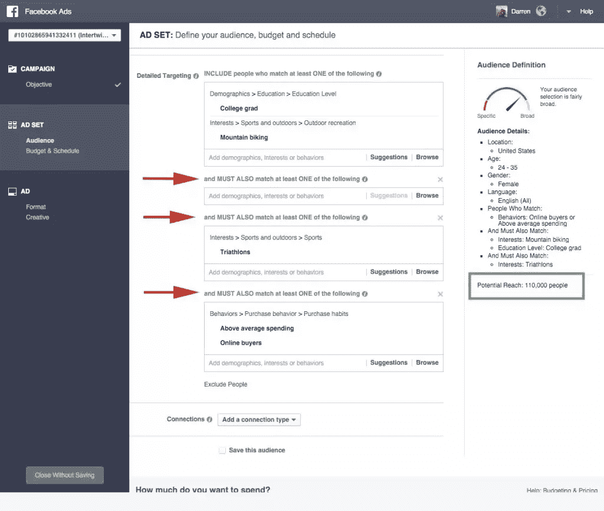
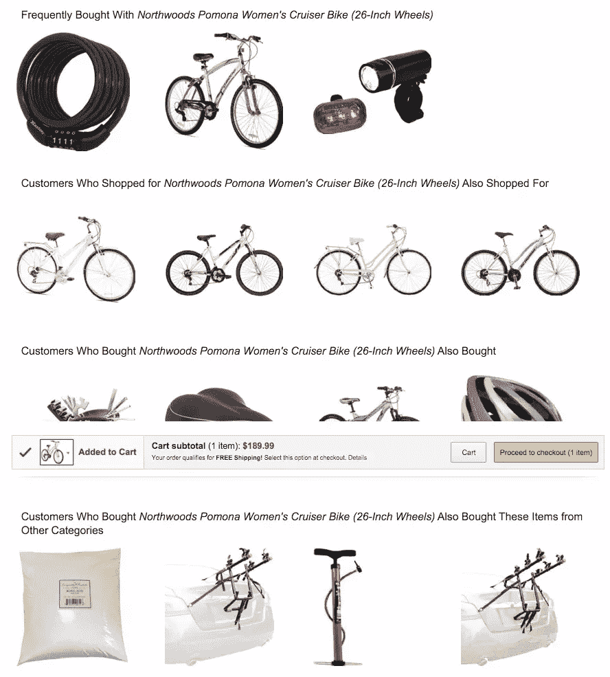
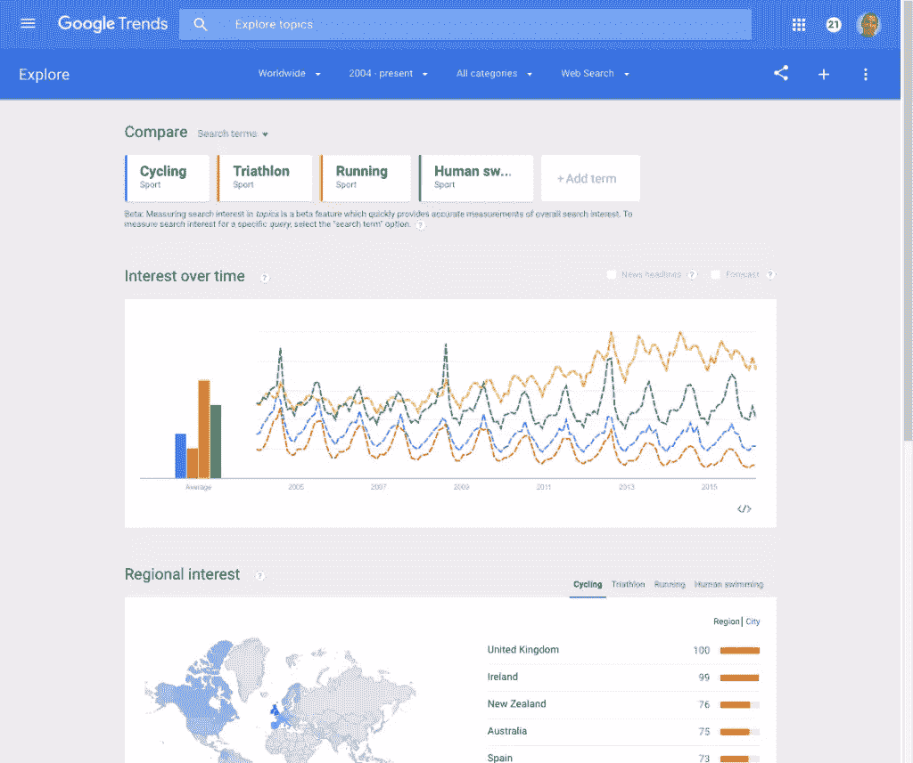
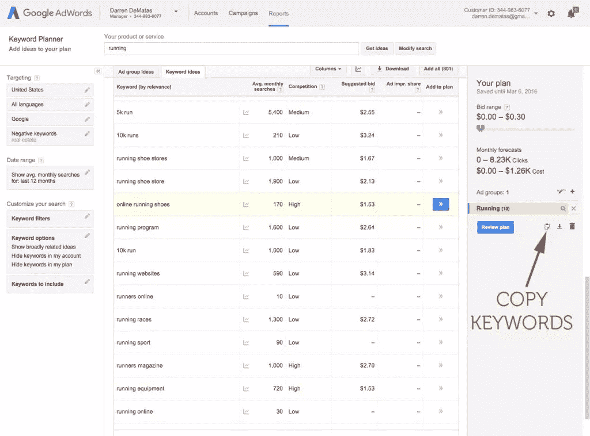
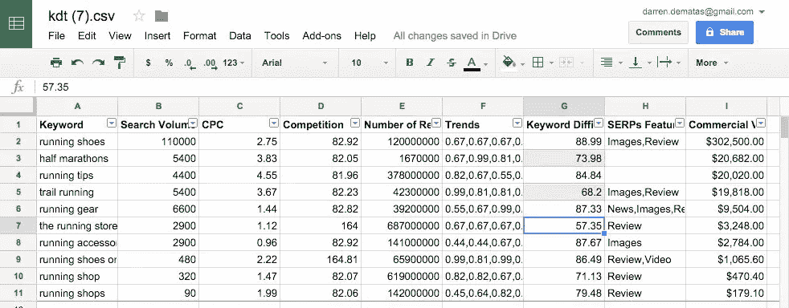
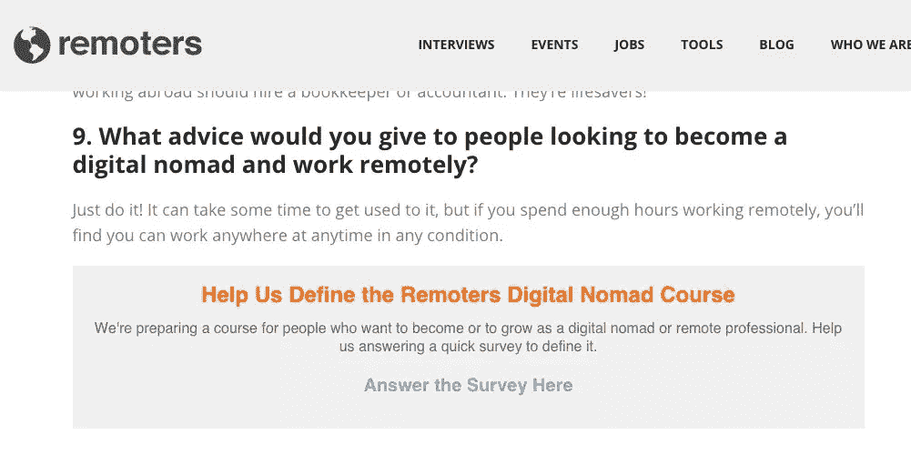

# 如何开始内容第一的电子商务业务

> 原文：<https://www.sitepoint.com/content-first-ecommerce-business/>

如果你一直在考虑开展电子商务业务，那么[现在是理想的时机](http://www.entrepreneur.com/article/251386)。自 2010 年以来，美国电子商务(B2C)销售额几乎翻了一番，预计 2015 年将达到 3470 亿美元。全球电子商务销售额[预计将翻一番](https://www.internetretailer.com/2015/07/29/global-e-commerce-set-grow-25-2015)，从 2015 年的 1.672 万亿美元增至 2019 年的 3.5 万亿美元。

尽管技术的进步使得创办电子商务企业变得很容易，但 90%的新企业在创办后不久就失败了。事实证明，电子商务不仅仅是将产品加载到您选择的电子商务平台上。

除非你有很高的利润和雄厚的广告资金，否则你需要围绕人而不是产品来开展业务。否则，你会在 90%的统计中结束。我们不想那样，对吗？**以下是你应该首先从人(而不是产品)入手的原因:**

*   选择错误的产品，你会浪费时间和金钱
*   确定你的角色，你就可以在更长的时间内销售多种产品
*   如果你在推送内容(而不是产品)，那么建立流量和吸引力会更容易
*   如果趋势改变，你可以更快地调整
*   给自己多一点时间来找出合适的产品

如果你真的有一个独特的产品创意，而且 Kickstarter 有钱让它运转起来，那就想尽一切办法推出它吧！但是如果你不确定卖什么，内容第一的方法是在快速增长的市场中成功的不二法门。

这是你开展内容第一的电子商务业务的六步行动计划。

## 行动 1:挖掘人物角色的力量

如果不提及人物角色，我们就无法进行关于内容营销的明智对话。一旦你[发展了你的角色](http://blog.hubspot.com/ecommerce/ecommerce-buyer-persona-questions-to-ask)，制定追加销售和交叉销售策略。你想在采购产品甚至写第一篇文章之前就这么做。你的目标应该是向同一个人销售多种产品。作为一个昙花一现的奇迹，你活不了多久。**这里有一个验证你的角色和寻找潜在产品的快速流程:**

### 1.在[脸书广告管理器](https://www.facebook.com/business/help/200000840044554)中创建一个模拟广告

加载广告定位功能后，输入您的人物角色的人口统计数据和兴趣。在每个兴趣或行为之后，点击“缩小范围”，并将附加标准设置为“必须匹配”现在不要担心地点，我们只想确保至少有 100，000 人符合你的理想角色/市场。在上面的例子中，有 110，000 名受过大学教育的女性喜欢山地自行车和铁人三项，并且在线消费高于平均水平。

### 2.去亚马逊寻找潜在的交叉销售和追加销售产品

在这一步，你所要做的就是为你的角色输入一个产品创意。一旦你把它添加到你的购物车，亚马逊将显示你可能交叉销售和追加销售的产品。

在上面的例子中，最初添加的产品是一辆女式山地车。

### 3.问问你自己这些产品是否符合你的个性

记下您感兴趣的产品，重复第 2 步，列出可能的产品。

## 行动 2:勾画出你的商业模式

你的角色应该告诉你，你是要卖给消费者还是企业。但是你也必须考虑你的定位。你是要做个人品牌(比如时装设计师)还是做企业？ [B2B 电子商务市场的规模几乎是 B2C](http://www.forbes.com/sites/sarwantsingh/2014/11/06/b2b-ecommerce-market-worth-6-7-trillion-by-2020/#18d70cc22e7c) 的两倍，但有更多的挑战需要担心，如税收、法规和物流。你还需要考虑你想要销售的产品类型(数字的、实体的、服务的)以及你将如何获得它们。您可以:

*   **在家制作**您的产品
*   让工厂生产你的产品
*   从制造商处批发购买并转售
*   **dropship** 你从未接触过的产品

如果你正在寻找一个高利润的企业，你最好的选择是制造自己的品牌。但是，通过批发和直运，您可以更快地启动和扩大规模。

## 行动 3:评估产品的市场适合度

现在你心中已经有了一打左右的产品类别，是时候审视一下商业价值和竞争了。[产品市场契合度](http://web.stanford.edu/class/ee204/ProductMarketFit.html)只是一个花哨的术语，用来判断你想卖的产品是否有一个你可以参与竞争的市场。解决这个问题最实用的方法是关键词研究。**你可以从一个简单的过程开始:**

### 1.在谷歌趋势中输入你广泛的市场术语

你也可以输入产品，但是产品的受欢迎程度会改变，所以最好使用市场定义关键字。考虑删除有下降趋势的术语。

看完这些趋势后，我想我会把重点放在我的铁人三项女性角色的跑步方面。

### 2.将你的市场关键词输入谷歌关键词规划器

将你感兴趣的关键词添加到计划中。寻找所有类型的关键词:产品、操作方法和技巧。不用担心过滤掉。我们还在集思广益阶段。拍摄 50-100 个左右的关键词。完成后，复制你的关键词。

### 3.检查关键字难度

这是很多人跳过的一步。不要。将你的关键词粘贴到类似 [SEMRush](https://www.semrush.com) 的关键词研究难度工具中。这将会让你知道对关键词进行有机排名有多难。有其他工具有免费计划([关键词查找器](https://kwfinder.com/analyzer/)或术语浏览器)，但我个人使用 SEMRush 的付费计划。

如果没有付费计划，每天只能查看 10 个关键词。

任何高于 75 的在我看来都很难。

专业提示:不要只考虑产品和类别页面。一些关键词可以成为优秀的博客文章、指南和可链接资产。我很想创造“美国最美丽城市的 50 场必跑半程马拉松”

### 4.检查商业价值

最后一步是检查商业价值。最快的方法是从 SEMRush 导出关键字列表。那会有你的 SEO 难度，量和 CPC。

将每次点击费用和交易量相乘，你就可以估算出商业价值。按商业量从高到低排序，寻找搜索引擎优化难度较低的关键词。

看着这些数据，我也会优先考虑越野跑。

### 5.冲洗并重复

对你所有的市场和产品都要经历这个过程。优先考虑那些商业价值高，难度低的。关键词研究的目的是帮助引导你进入一个市场，在这个市场中，你可以通过内容和有机 SEO 取胜。进入一个没有商业价值的市场是毫无意义的。内容营销是一个长期的游戏。

## 行动 4:在至少两种媒体上制作内容

如今，仅仅一个博客是不够的。要真正抓住你的观众的心，你需要通过一种替代的媒介来吸引他们。在你的营销组合中加入音频或视频是联系你的观众的一种强有力的方式。但是这确实需要更多的工作和一致的出版时间表。

这就是自举的意义所在，对吗？你卷起袖子投入时间，而不是金钱。开始和推广一个播客相对便宜，但是 T2 的视频内容营销似乎对电子商务更有效。**这里有三个成功的电子商务内容营销的例子:**

1.Slikhaarshop 是一家护发产品批发/直运公司，在 Instagram 上拥有超过 35 万名粉丝，在 YouTube 上拥有 100 万名订户。他们每周制作一集新节目。他们有一个*非常*具体的角色。

2.Think Geek 在 YouTube 上有 17.6 万名用户，他们的产品经常被分享 1 万多次。这个[产品](http://www.thinkgeek.com/product/ee3c/)有超过 10 万股！

3.REI 有一个我见过的最好的电子商务博客。他们用杀手级的生活方式指南碾压 SEO，比如这个[离网背包一号](http://blog.rei.com/hike/an-introduction-to-off-the-grid-backpacking/)。

你的内容营销的要点是服务你的受众，并产生流量和反向链接。如果你做不到这一点，你可以忘记其他的。查看我在 Lemonstand 上的文章，获得一些使用内容生成链接的技巧。

## 行动 5:测试产品创意

你能做的最简单的事情就是让你的访问者帮助你定义和创造一个产品。这尤其适用于像电子课程这样的数字产品。

[Remoters.net](http://remoters.net/interview-brian-dean/)直接要求游客帮助他们创造产品。如果你专注于流量，不想投入任何资源来创造产品，你可以使用联盟营销来测试你的观众是否会花钱购买一个潜在的产品。

如果你觉得你对什么样的物理产品会起作用有很好的感觉，你可以尝试直运。只需准备好处理与供应商和客户沟通订单所涉及的所有人工工作。如果你觉得你有一个非常好的产品创意，你可以推出你的商店，并向产品页面发送付费流量。

不过，你可以很快烧完美钞。购买前需要 4.5 次品牌互动。这就是通过内容营销打造品牌如此重要的原因。

## 行动 6:启动商店

在早期阶段，你不希望“购买”按钮无处不在。一个商业化的网站很难向有影响力的人和博主推广你的网站，也很难获得反向链接。我喜欢偷偷接近我的竞争对手！

像 Shopify 或 BigCommerce 这样的 SaaS 平台(价格从每月 29 美元起)已经内置了主机。但是如果你想在你的主域名上开始使用 WordPress，当你准备出售的时候，你可以在一个子文件夹中安装一个免费的平台，比如 WooCommerce 或者 Prestashop。

虽然 WordPress 电子商务平台是免费的，但虚拟主机不是。这个 [WordPress 主机定价指南](http://makeawebsitehub.com/best-wordpress-hosting/)把所有东西都很好地放在了一个地方。有了内容，你可以将你的人物角色定位在销售漏斗的顶端(在他们进入购买模式之前)，并引导他们完成购买。

比在销售漏斗底部购买流量，在价格上与亚马逊竞争要好得多。做成功的 10%！

## 分享这篇文章