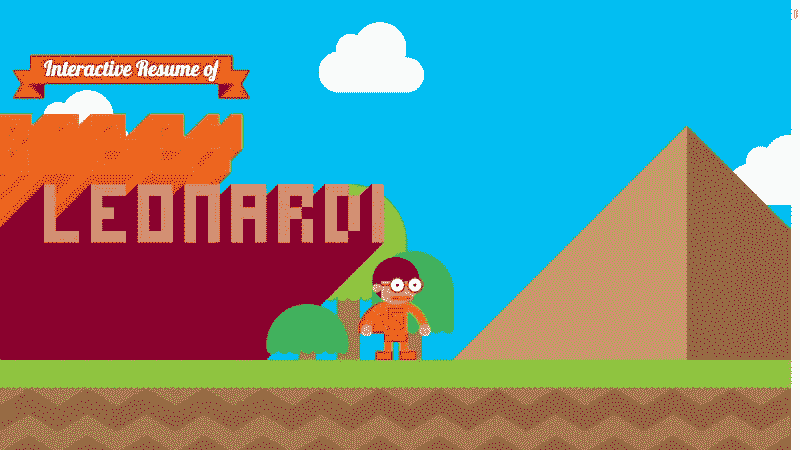
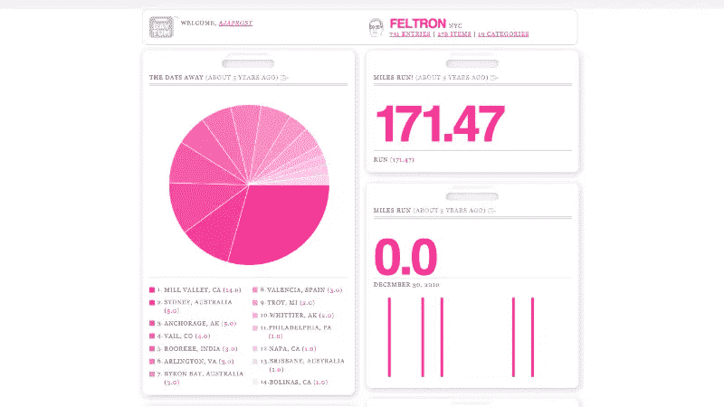
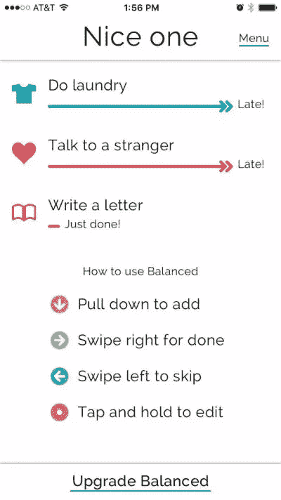
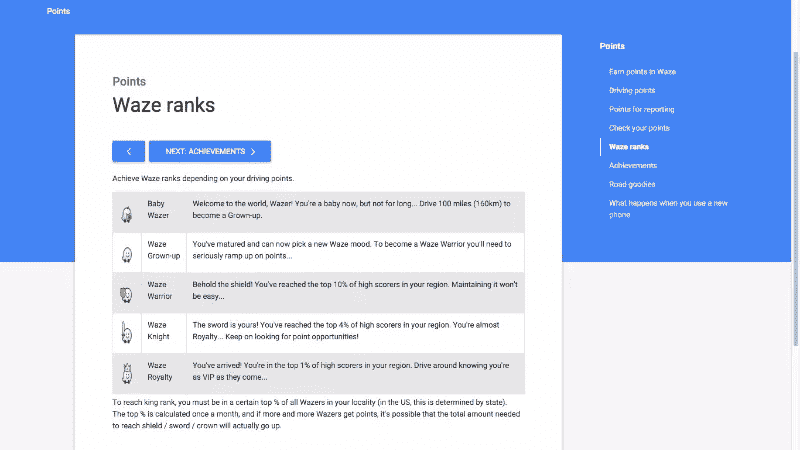
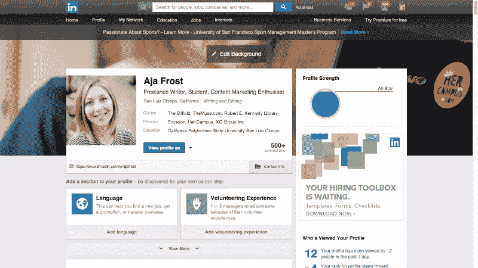
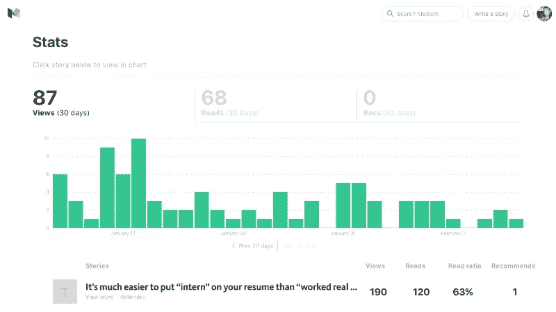

# 设计中游戏化的 6 个鼓舞人心的例子

> 原文：<https://www.sitepoint.com/6-inspiring-examples-of-gamification-in-design/>

从强力球到糖果粉碎到 Farmville，游戏已经渗透到我们的生活中。理由很充分:它们有趣、令人兴奋、有回报。此外，升级或赢得一场比赛会给我们带来即时的满足感和自豪感。

所以，为了让你的 UX 更吸引人——甚至让人上瘾——试着融入游戏化元素。

为了激励你(并证明游戏化可以融入任何类型的网站或应用程序)，我找到了六个游戏化用户体验的绝佳例子。

## 1.视频游戏组合

设计师罗比·莱昂纳迪采取了一种非常实际的方法来使他的个人网站界面游戏化:他把它变成了一个视频游戏。

进入网站后，你会看到一个欢迎横幅。一个电子游戏角色(很明显代表莱昂纳迪)正站在下面，只需轻点几下鼠标，你就会发现你正在为他制作动画。

当你通过视频游戏的关卡时——一路上跳跃、飞行和跳进热气球——你会看到描述莱昂纳迪令人印象深刻的职业历史的卡通元素。

“旅程”以电子邮件形式结束。到了这一步，你已经被深深打动，非常高兴，很难*不*雇用他。

尽管莱昂纳迪的作品如此精彩，部分原因是因为它独一无二，但你仍然可以从中获得灵感。考虑在你的 UI 中加入视觉游戏元素，让它更新颖，唤醒你用户内心的孩子。

## 2.数据可视化仪表板

Daytum 是一个优雅的网站，可以让你将个人数据转化为图表、图形和记录。

例如，一个用户创建了一个饼状图，显示他重播了最频繁的[首歌曲。另一个是记录](http://daytum.com/ArrEye)[每年工作多少天](http://daytum.com/sgtgary)(他的记录可以追溯到 2012 年)。

游戏化的元素是微妙的，但是累积分数和跟踪进度的概念绝对是游戏化的。

这是一个很好的例子，说明如何使用游戏化而不强迫你的用户去竞争。由于没有模板或限制规则，Daytum 上的每个人都创建了自己的仪表板和主题，因此，你不能将你的结果或更新与其他人进行比较。

## 3.激励应用

许多旨在帮助你过上更好生活的应用融入了游戏化元素，但 [Balanced](http://balancedapp.com/) 是一个特别好的例子。

每次你完成一个任务，你向右滑动来标记它为“完成”一个“刚刚完成”的标签会出现在任务的下方，而“干得好”会闪现在你的屏幕上。单独来看，这些反应可能并不令人印象深刻，但合在一起，它们是正面反馈的 1-2-3 次点击。此外，“完成”栏是绿色的，这很重要，因为[绿色与](https://www.sitepoint.com/using-color-psychology-create-effective-price-table/)平衡、精力和健康的感觉联系在一起。

任务管理 app[Todoist](https://todoist.com)也很好地利用了游戏化原则。

它使用一个基于分数的系统来鼓励你更有效率。当你划掉待办事项清单上的项目，使用 Todoist 的高级功能，并达到自我分配的生产力目标时，你将获得因果报应积分。当你让任务逾期超过两天，你就失去了因果报应。

你可能会想，“你能用你的因果报应买到什么？”天才就是:*一无所有*。Todoist 的创造者明白，积累积分本身就是有回报的。没有必要提供更高的奖励。

我还想指出，获得积分依赖于更频繁地使用该应用程序并探索其功能。最好的游戏化元素会潜移默化地提升你的用户的忠诚度和依赖度。

## 4.导航工具

2013 年，谷歌[为](http://www.usatoday.com/story/tech/personal/2015/10/25/waze-remains-top-navigation-app-big-update/74340960/) [Waze](http://www.waze.com) 支付了超过 10 亿美元——投资得到了回报，因为三年后，它已经拥有了[5000 万活跃用户](http://techcrunch.com/2015/10/19/navigation-app-waze-gets-a-huge-redesign-now-less-cluttered-but-still-needs-improvement/#.shppeoy:9ktp)。

游戏化是 Waze 成功的重要组成部分。

如果你从未使用过它，Waze 既提供传统方向，也提供来自其他司机的道路“提示”。例如，如果你在高速公路上开车时打开了 Waze，它可能会通知你“1 英里内有警察”或“3 英里内有事故”

Waze 鼓励用户使用它的应用程序，并通过复杂的积分、排名和徽章系统提供信息。

每次你报告路况或油价，你会得到 6 到 8 分。这是真正的天才——Waze 会在你运行应用程序的情况下，每行驶一英里给你积分，激励人们使用它，即使他们已经知道他们要去哪里。

你甚至可以得到视频游戏式的“道路糖果”，或随机放置的价值不同点数的战利品。

排名是由你与你所在地区的人相比的分数决定的。

除了成为“瓦兹战士”或“瓦兹骑士”的满足感之外，这些积分没有任何用途。事实上，Todoist 和 Waze 都使用一个最终任意的分数系统，这表明你可以在你的产品中加入分数和等级，而不需要现实世界的奖励。

## 5.一个职业网络平台

不管你怎么说 LinkedIn 的笨拙的 UX，但是游戏化元素的整合做得很好。该网站鼓励你通过量化你的个人资料优势来尽可能多地填写你的个人资料。

实际上，达到“100%”是不可能的，这是一个让用户无休止地修改个人资料的非常聪明的方法。

LinkedIn 还向你展示了你在过去 90 天里获得了多少页面浏览量，与你的历史浏览量相比如何，你采取了多少“行动”，以及与你的公司、你的人际网络和你所在领域的其他人相比，你的排名如何。

通过向你展示这些指标，LinkedIn 让你与两个实体竞争:你的职业“竞争对手”和你自己。

你不仅想比你的同龄人排名更高，而且你还想击败你以前的数字。网站的这一方面可以让 LinkedIn 像脸书或 Instagram 一样让人上瘾。

即使在你的产品中加入用户竞争是没有意义的，你几乎总能找到一种方法来加入自我竞争。

## 6.博客社区

有大量的博客网站；Medium 总是以其干净、单色的美感脱颖而出。

然而，仔细观察，你会发现 Medium 在将游戏化原则融入其结构的方式上也是独一无二的。

现在有一个传统的关注者与你所关注的人的比例，这是互联网的身份通用语。此外，每个用户都会收到对其帖子的详细分析。你不仅可以看到上个月你的总浏览量、阅读量和“推荐量”,还可以看到单个故事的浏览量、阅读量和推荐量。

Medium 甚至帮你分解了百分比:点击故事的人中有 X %一直在滚动。

这些指标是激起人们对内容制作热情的有效方法，但网站的创建者也找到了一种将内容消化游戏化的方法。

对一个故事的每一个评论都能得到“心灵”的赞同；如果你的评论得到最多的关注，它会首先显示。因为只显示有限数量的评论，所以很明显会留下最受欢迎的注释。回应回应也可以*心有灵犀*。此外，读者可以公开突出他们真正喜欢的故事片段。如果同一个片段被多次突出显示，它会变成一种特殊的颜色和“顶部突出显示”的荣誉

如果你有兴趣阅读更多关于游戏化的内容，我推荐以下文章:

*   [通过奖励和游戏化增加参与度](https://www.sitepoint.com/increase-engagement-with-merit-and-gamification/)
*   [利用游戏机制构建引人入胜的网络应用](https://www.sitepoint.com/building-engaging-web-apps-game-mechanics/)
*   [游戏化为什么被打破(以及如何修复)](http://thenextweb.com/dd/2015/10/16/why-gamification-is-broken-and-how-to-fix-it/#gref)

## 分享这篇文章