# Simbla:网站建设者的另一种方法

> 原文：<https://www.sitepoint.com/simbla-a-different-approach-to-a-website-builder/>

*本文由[辛布拉](http://www.simbla.com/?campaign=sitepoint)赞助。感谢您对使 SitePoint 成为可能的赞助商的支持。*

在过去的几年里，我尝试和使用了许多不同类型的网站建设者。我也和一些尝试过不同网站构建工具的企业主谈过，也和他们一起工作过。

大多数网站建设者都有一个事实，那就是他们只能带你走这么远。他们似乎都在某些方面有所欠缺。它们可能很容易用来构建华丽的网站，但对于 SEO 来说却很糟糕。它们可以让你建立漂亮的网站，但是很难使用。

Simbla ，一个较新的网站建设者，旨在通过一个包罗万象的包来解决所有这些问题。

## Simbla 是什么？

Simbla 是一个网站构建器，它使用 Bootstrap 3 来创建 HTML5 网站，这些网站看起来很棒，很容易创建，对 SEO(搜索引擎优化)来说也很棒。这是竞争对手的不足之处。许多网站建设者不产生符合 web 标准的输出，这使得搜索引擎很难索引或理解他们网站上显示的内容。

Simbla 有一个站点地图生成器，可以创建 XML 格式的站点地图。您将在网站管理员工具中使用它来让 Google 抓取您的站点。Simbla 还使用合法网站的标准 HTML 元数据，包括标题和关键字。它也为你的页面生成搜索引擎友好的 URL。你的网站不会有任何奇怪的扩展名或页码。你也可以包括谷歌分析跟踪，就像你可以在任何其他标准网站。

## 模式

Simbla 有两种不同的使用模式。你可以选择简易模式和专业模式。如果您没有太多的网站建设经验，这将使您很容易开始，但随着您 web 开发技能的提高，这也为您提供了使用全部功能的独特机会。

## 简易模式

简单模式听起来就是这样。您可以使用拖放页面生成器将结构元素拖到页面上。令人惊讶的是，与吹嘘这种技术的大多数其他构建者不同，有大量灵活、有用的模块可以用来构建任何类型的站点。有各种各样的预构建部分可供选择。每个预览都预先填充了虚拟内容，因此您可以看到它应该是什么样子。然后，您只需点击模块的每个部分来替换图像和文本。我真的从没见过这么容易、顺利、快速地完成这项工作。你可能认为在浏览器中运行会有很多加载和延迟时间。事实并非如此。Simbla 运行起来像轻量级桌面应用一样流畅。

## 专业模式

专业模式适用于当你已经逛了一圈，并且想要完全控制你的站点的每一个小细节的时候。您可以通过单击屏幕顶部靠近中心的 Pro 按钮来启用它。您将收到一个警告，提示您正在进入专业模式，然后在确认后，您的画布区域会发生一些变化。这些模块被更加简化和细化为框架元素。

Pro 模式更高级，需要了解网站结构，包括标题、动态内容和容器。了解 Bootstrap 中的结构是如何工作的，对于使用 Simbla 的 Pro 模式构建一个站点是至关重要的。

这些元素仍然是通过拖放功能设置的，但是您可以访问需要一些经验的功能。您可以建立自己的网格，使您能够控制站点的结构，但是您也能够访问和控制您期望的元素，例如文本、传送带、视频、菜单、表单等等。你从一张空白的画布开始，把你的愿景变成现实。这与简单模式不同，在简单模式中，您将预先构建的元素拖到画布上，然后交换内容。

专业模式允许你插入你自己的 HTML，你可以创建你自己的自定义菜单。

专业模式有点难以想象，但你可以随时点击预览按钮来查看你的工作和目前为止的效果。

## 突出的特点

### 灵活性

我喜欢辛布拉没有把你逼入绝境。当使用 Simbla 时，即使在 Pro 模式下，我也预料到当你拖出结构元素时，你将无法重新定位它们。这真是大错特错。我插入了一个标题和一个表单，然后我意识到拥有一个容器可能是个好主意。我可以轻松地将容器拖到画布上，然后在画布中重新定位和拖动元素。我可以很容易地将任何东西嵌套在一个容器中，并且可以拖放任何我想要的元素。

### 主题制作人

想象一下，只需一次点击就能编辑你的网站的外观。本质上，这就是你可以用 Simbla 的主题生成器做的事情。

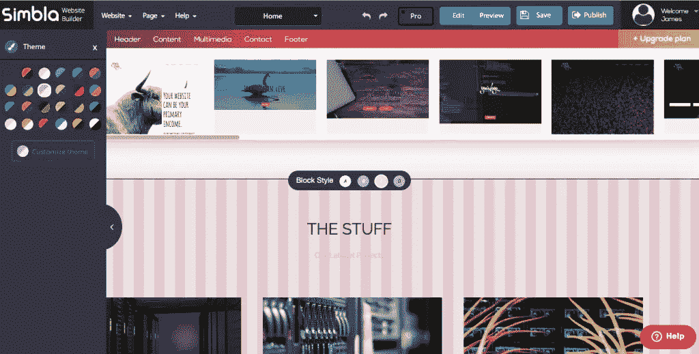

你会发现左边有一个看起来像圆形调色板的东西。当你点击它时，一个完整的面板会出现一个已经制作好的主题列表。这些主题包含字体、颜色、背景等等。

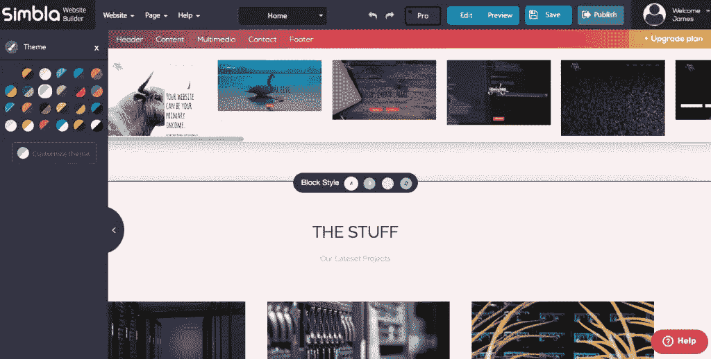

对于每个主题选择，您会发现 A、B、C 和 d 的变化。这些是该主题的变化，细分为每个单独的内容部分。这很棒，因为你可以通过简单的点击来改变它。您甚至可以编辑现有的主题，根据自己的喜好进行调整。

您也可以创建自己的主题。您可以控制标题、字体、链接颜色、图标颜色、按钮和背景。这使您无需代码就能定制站点的整体外观。您可以将背景设置为纯色，也可以用图案填充。您可以通过选择字体粗细、样式、颜色、大小和行距来优化文本等元素。这提供了灵活性和控制方面的终极体验。

### 表单生成器

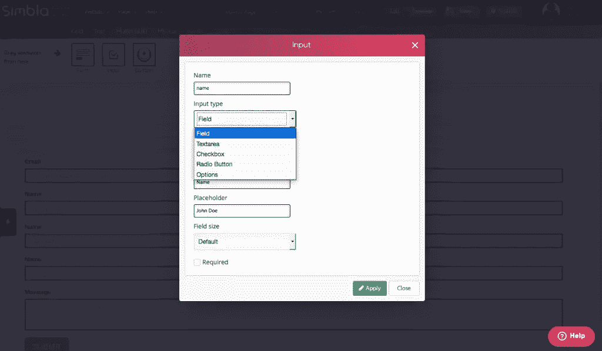

我不得不承认我讨厌表格。对我来说，设计表单是一件痛苦的事情，因为所有的标签和字段都是用来构建表单的。Simbla 使表单变得简单，能够添加您想要的任何输入类型，包括文本框、文本区域、单选按钮、复选框和下拉菜单。您可以随时拖动和重新定位任何字段。您还可以控制收集什么类型的数据，并且可以以任何可以想象的方式设计表单的样式。你可以在几个方面使用它。在一个页面上，您可以为新客户准备一份调查问卷，而在另一个页面上，您可以准备一份功能齐全的联系表格。

### 快速重新设计

厌倦了你的旧设计？轻松编辑任何页面并将新布局拖到页面上。重组内容，点击发布，你已经在几分钟内重新设计了任何网页！

### 真正的拖放

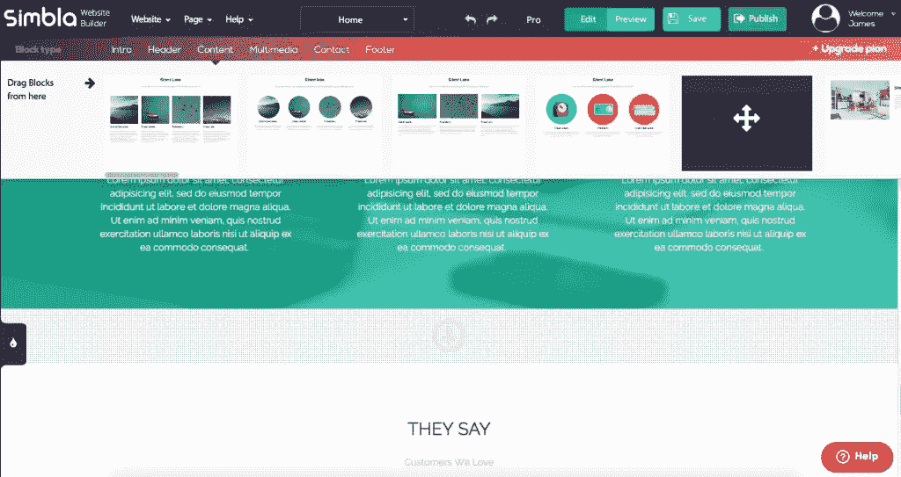

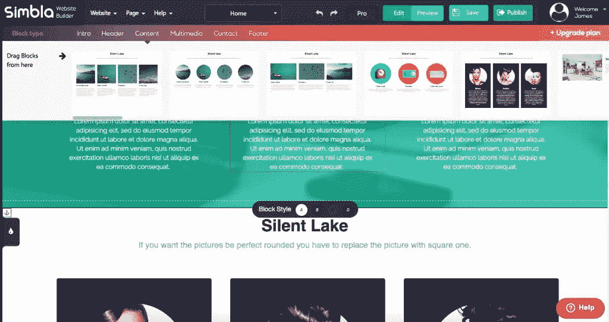

我以前试过拖放网站建设者。通常，它们的工作效果有限。您可以拖动模块，但是您会被模块中的内容或它的布局所困扰。你通常也受限于可用布局的数量和多样性。Simbla 允许您拥有真正的拖放体验，使您能够拖动元素来重新定位它们。我前面提到过表单，您可以添加字段、拖动和重新定位它们的顺序，以及定制几乎任何东西。此外，正如您在上面的图像中看到的，Simbla 的一些内容模块有 A、B、C 和 D 选项，这些选项实际上是不同的颜色变化。

### 难以置信的实惠

对于这样的东西，你可能希望每月支付 100 美元或更多，特别是你所得到的东西的易用性和功能性，但 Simbla 的定价模式使任何企业主或个人都可以负担得起，在不打破银行的情况下建立和托管自己的网站。信不信由你，Simbla 有一个免费的启动选项，但如果你想要自己的域名，并担心资源，你可以开始托管自己的品牌网站，每月只需 6 美元。大多数可靠的虚拟主机公司收费比这高。

## 入门指南

当你建立网站时，你有两种选择。可以从模板开始，也可以使用 Simbla 的向导。这两种方法都非常简单，只需要几分钟就可以设置好。让我们来看看每种方法。

### 使用现成的模板

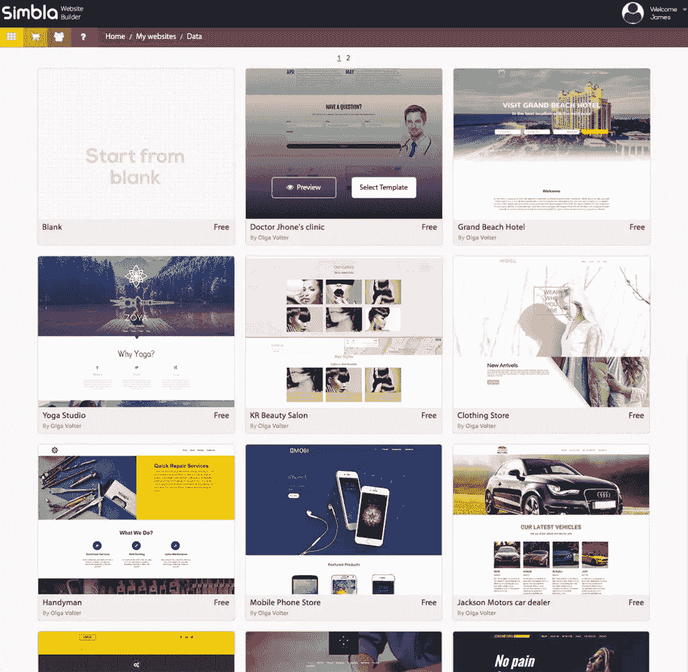

当您选择此选项时，您可以为不同风格的网站选择几十种不同的预制模板。选择一个符合您的愿景的模板，并输入您的站点名称，这将把您选择的模板带入构建器部分。

### 使用向导

该向导是设置网站的简单方法。它会问你一系列的问题，比如“你的网站叫什么名字？”它会问你在你的网站上需要哪些页面。你也可以从一个简单的单页网站或多页网站中选择更多的内容。您可以轻松地点击和选择不同的页面，建立主菜单和您的菜单项的顺序。

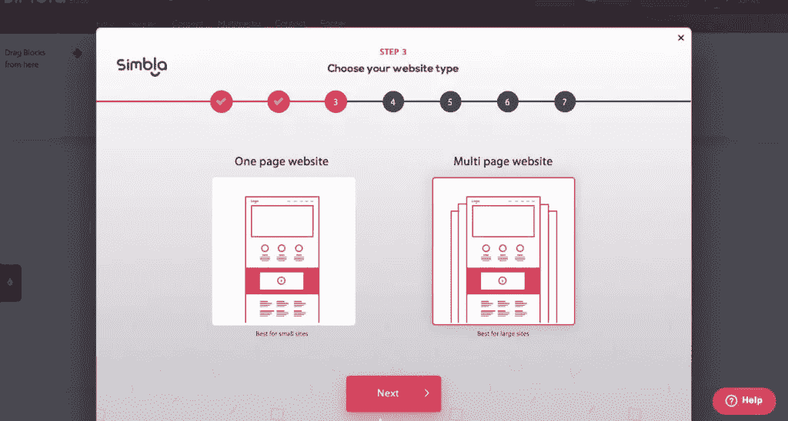

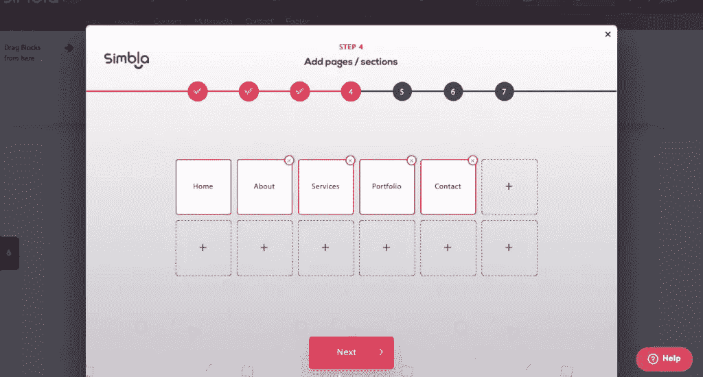

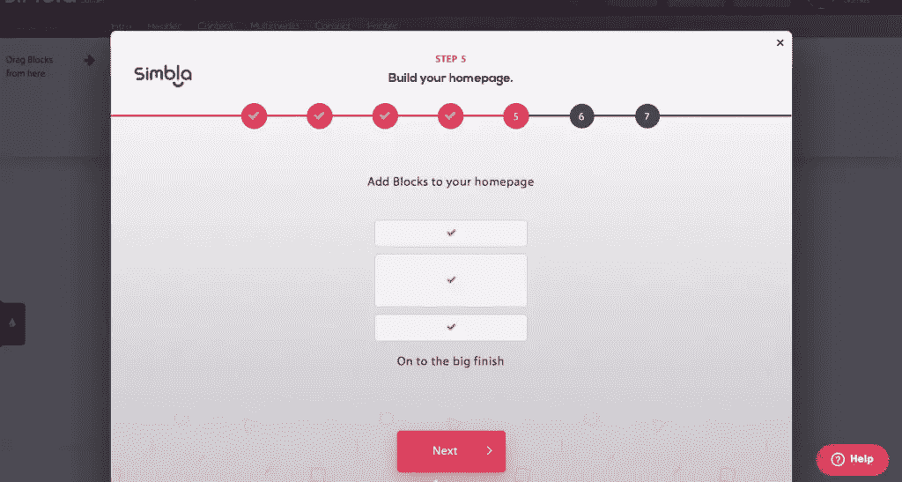

一旦做出这些决定，Simbla 将要求您选择三个主要页面组件:页眉、内容区域和页脚。您可以为每一个部分选择不同的布局类型，预览包含虚拟图像和文本。这让你在做出选择之前对每个部分有一个大概的了解。

### 界面

当你做好准备后，上面提到的两种方法都会让你进入页面生成器部分。在这里，您可以控制站点上的所有元素。在我的例子中，我想改变标志。我收到一个警告，说我正在编辑母版页部分，我放在这里的任何内容都将显示在所有页面上。这很好，因为我希望我的标志显示在所有网页上。

我可以单击任何元素，这将显示每个元素的选项。选项图标非常简单明了。您可以编辑图像、文本、颜色和任何可能适用的专业设置。

## 自定义您的网站

Simbla 让编辑你的网站变得如此简单和直观。要更改页面，靠近浏览区域顶部中央有一个下拉菜单。点击此处显示所有可用页面，点击不同的页面进行更改。在这里，您还可以添加页面，或编辑母版页。

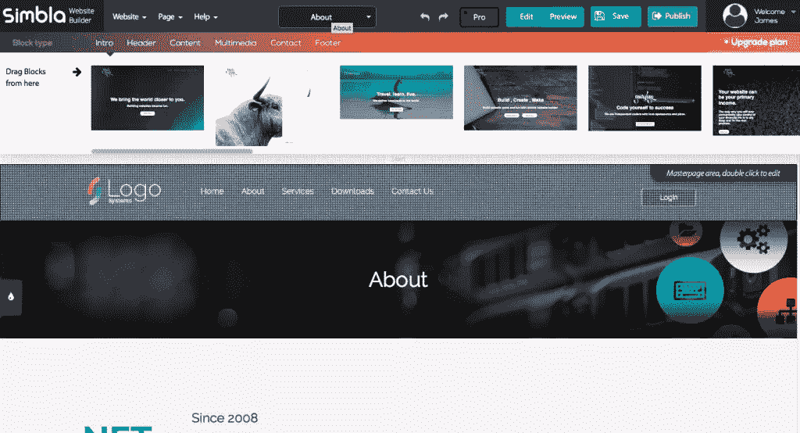

### 菜单

在从紫色到橙色的渐变栏中，您会发现不同内容块的细分。在这里，您可以为页面选择不同的简介、页眉、内容区域、联系人部分和页脚布局。你的菜单通常可以在标题部分找到。

### 颜色；色彩；色调

除了照片，你几乎可以给任何元素上色。如果它可以用 CSS 样式化，你可以在 Simbla 中改变它的颜色。例如，要改变一个部分的背景颜色，点击它，点击改变背景，你可以使用图像或颜色来改变它。您也可以通过单击文本元素，选择编辑或单击画笔图标，然后选择颜色来更改任何文本元素的颜色。

### 页面元素

Simbla 提供了种类繁多的页面元素，您可以构建任何类型的网站。您可以根据需要将任意多的内容部分拖到页面上，并且可以自定义每个内容部分的图像和文本。您可以堆叠、拖动和重新排序它们，从而轻松地为站点构建您想要的布局。

### 风雅

对于那些喜欢微调网站和手工制作网站各个方面的人来说，你可以调整文本的行高、图像的宽度和高度，还可以在选项部分旋转它们。您可以:

*   缩进文本。
*   在文本部分添加链接。
*   向图像添加链接。
*   添加图像描述。
*   为网站全局启用配色方案。
*   添加背景图案。
*   裁剪图像或全尺寸使用它们。
*   生成网站地图。
*   使用网站管理员工具。
*   做一个 301 重定向。
*   添加一个网站图标。
*   管理和添加文件下载。
*   为快速导航添加锚点。
*   再补充这么多！

## 用 Simbla 构建的四大网站

现在您已经对 Simbla 的功能有了很好的了解，请查看这些由 Simbla 客户创建的网站。

### Mybusiness CRM

[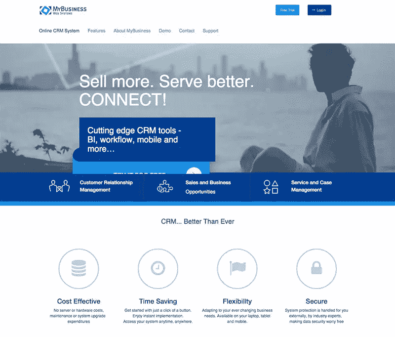](https://www.mybusiness-crm.com/)

### 设计展台创意

[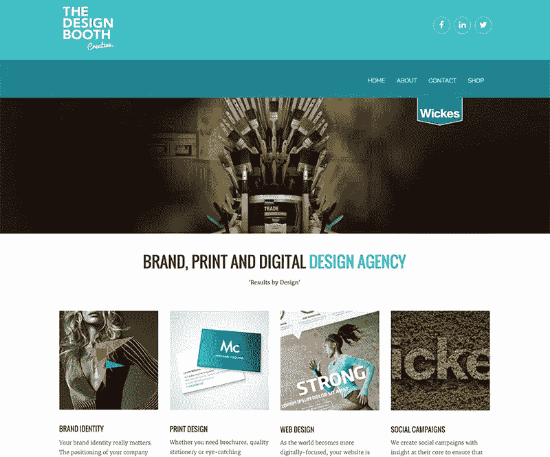](http://www.thedesignboothcreative.com/)

### 街猫

[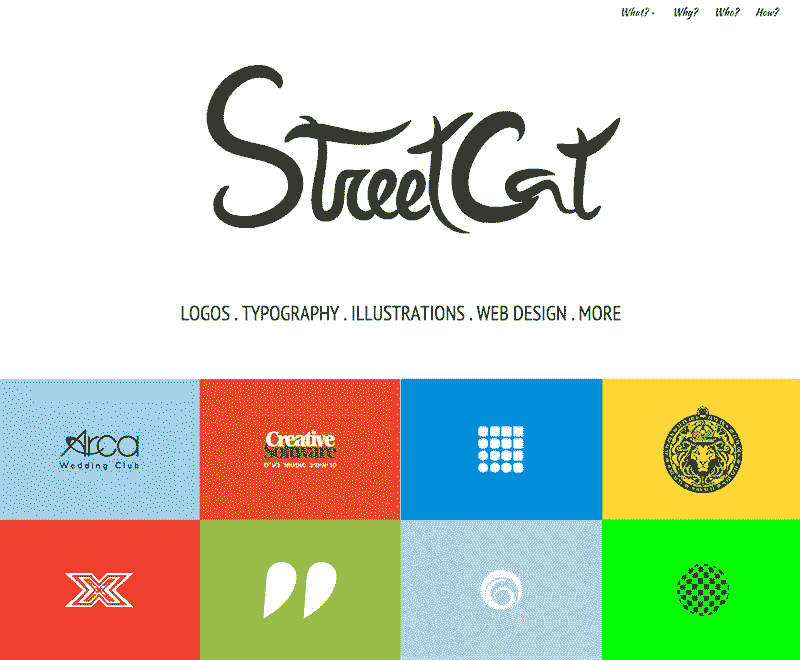](http://www.street-cat.co.il/)

### 哈马拉特里纺织品公司

## 结论

Simbla 在创建一个易于使用、直观的网站构建器方面做得非常好，它适用于新手和有经验的用户。通过免费和超级实惠的计划，他们提供了一个高质量的产品，其中包含每个人都需要的功能。你可以定制和优化你的网站，不像其他我见过的拖放网站建设者。Simbla 站点不仅是 SEO 友好的，它们也是用户友好的，易于使用和构建。如果你想要一个简单的方法来建立一个优雅的网站， [Simbla 网站生成器](http://www.simbla.com/?campaign=sitepoint)绝对是一个不错的选择。

## 分享这篇文章