# 如何导出和提交您的元应用程序

> 原文：<https://www.sitepoint.com/how-to-export-and-submit-your-meta-app/>

几周前，我们研究了[增强现实入门和 Meta](https://www.sitepoint.com/getting-started-with-augmented-reality-and-meta/) ，并制作了一只漂亮的增强现实蝴蝶。Meta 2 随后发布供预购，我们探索了[Meta 2 对增强现实开发者的意义](https://www.sitepoint.com/what-the-meta-2-means-for-augmented-reality-developers)。围绕元开发还有很多内容没有真正涉及，所以让我们来探索这个过程中相当重要的一部分——导出您的应用程序！

我最近完成了我自己的 Meta 1 应用程序，并认为它将有助于涵盖该过程中所涉及的内容，以及我在此过程中没有涵盖的技巧。我们将看看你的初始应用程序开发后的各个阶段——如何将你的应用程序变成最终的可执行文件，你可以将它交给其他 Meta 先锋朋友，以及如何将它提交给 Meta 的开发中心，让更多的先锋看到。

## 在 Unity 中导出你的应用

那些以前在 Unity 中导出过应用程序的人会发现这个过程非常简单。需要记住的是，与典型的 Unity 项目导出不同的是，只有一些小问题。对于那些完全不熟悉 Unity 的人，我们将详细介绍这个过程，所以你应该能够跟上。

首先，在 Unity 编辑器中打开你的场景。如果你跟随蝴蝶教程，这个场景是在*场景>蝴蝶场景*中。确保它完全准备好被导出，并且您已经在场景中获得了您希望包含在最终产品中的所有可见内容。我发现在导出场景之前，总是在 Unity 中最后一次播放场景是一个好习惯。

一旦我们非常乐意导出我们的 AR 应用程序，我们就去*文件>构建设置…* :

我在这里要强调的第一件事是检查“构建场景”下面列出的场景。确保你当前的场景在那里。如果列表中没有场景，点击*“添加开放场景”*将场景添加到列表中:

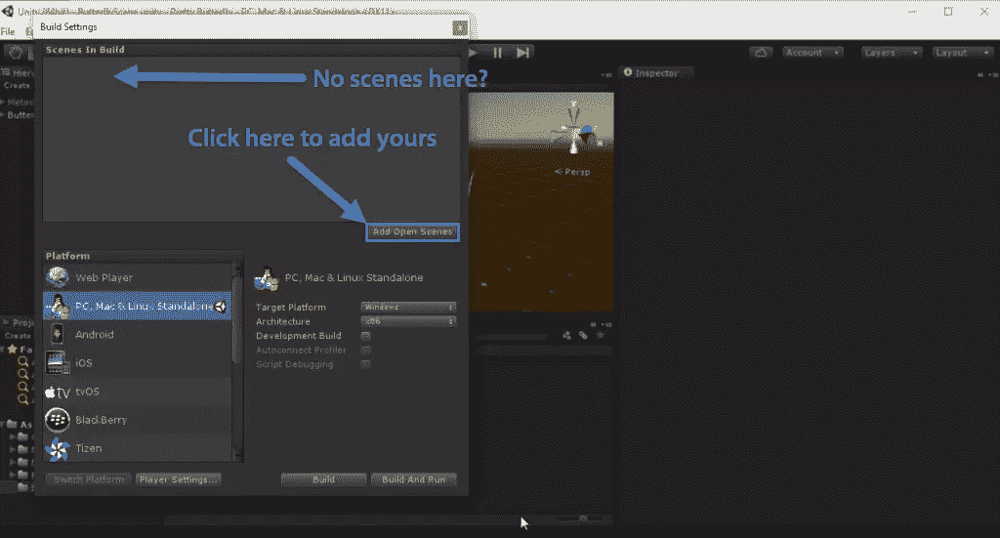

如果你有多个场景——确保那里的场景是你期望的场景。这听起来很明显，但当我构建自己的 AR 应用 MetaKitty 时，我发现了这一点，并且在我的项目中有两个版本的场景。当我对场景的任何更改都无法导出时，我困惑了好一阵子。不要犯我的愚蠢错误！

同样在“构建设置”窗口中:

*   选择*“PC、Mac & Linux 单机版”*。
*   确保目标平台设置为*“Windows”*。
*   设置架构为*“x86”*。

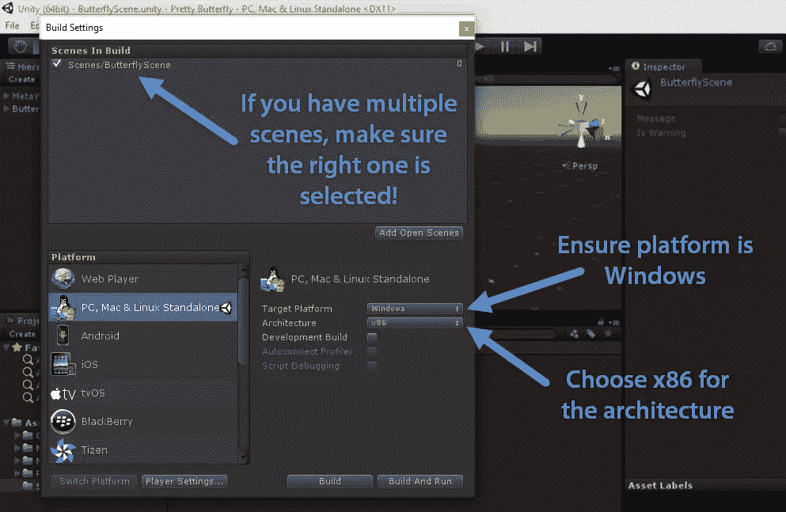

现在，我们需要为我们的应用程序设置一些特定的设置。首先，我们点击“平台”选项下的*“播放器设置…”*。在屏幕右侧的“检查器”面板中，我们会看到导出的应用程序的一系列设置。我们从添加我们自己的公司名称和产品名称开始。我从上一篇文章中为这个应用程序准备了*【站点点】*和*【漂亮的蝴蝶】*。

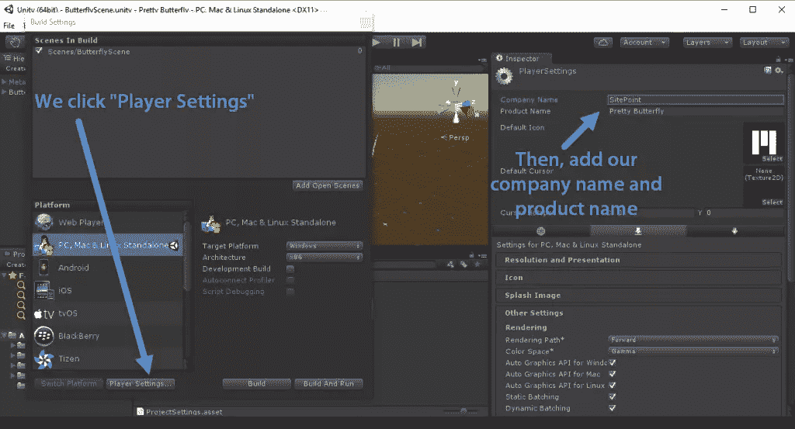

*如果你的应用程序有自己的图标，你也可以点击“产品名称”下方的“默认图标”来更新它。否则，默认情况下它会有 Meta 徽标。*

在第一部分下面，有几个可扩展的设置部分。我们可以点击“Splash Image”来调整应用程序首次加载时的外观。您可以将配置对话框横幅更改为您自己的图像。这是出现在初始窗口中的横幅，为用户提供屏幕分辨率、图形质量和显示器的选项。如果你想定制它，它的大小应该是 432 x 163 像素。Unity 不会放大图像来适应，它只会在需要时居中和裁剪图像。

如果您有 Unity Pro，您还可以关闭“显示 Unity 闪屏”选项，去掉总是出现在开头的 Unity 徽标位:

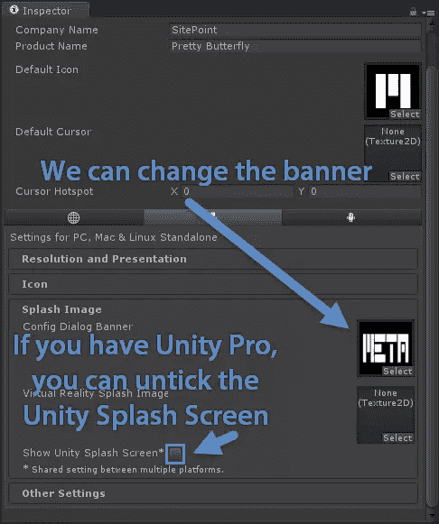

最后，展开“其他设置”部分，确保在“优化”下，“Api 兼容级别”设置为*。NET 2.0"* 。对我来说，还没有哪一次不是这样，但这是值得一试的！

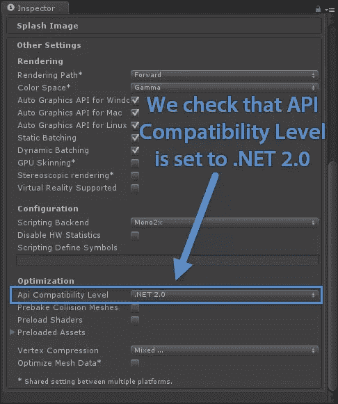

然后，如果我们回到“构建设置”窗口，我们可以选择*“构建”*或*“构建设置”*来构建我们的应用程序。如果你想让它一建成就直接运行，选择*“建立并运行”*。我通常选择这个选项:

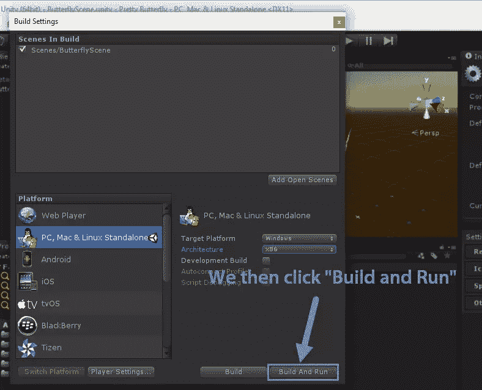

我个人目前的偏好是将我的构建添加到项目中他们自己的*“Builds”*文件夹中:

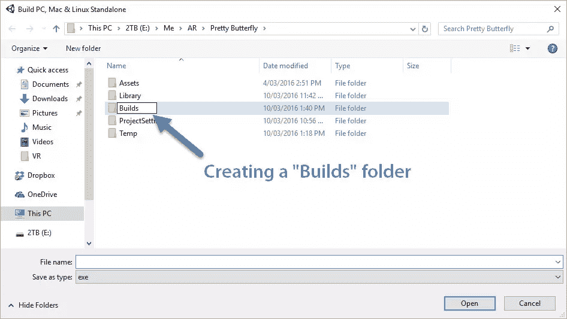

然后，我们输入 AR 应用程序的文件名，并单击*“保存”*:

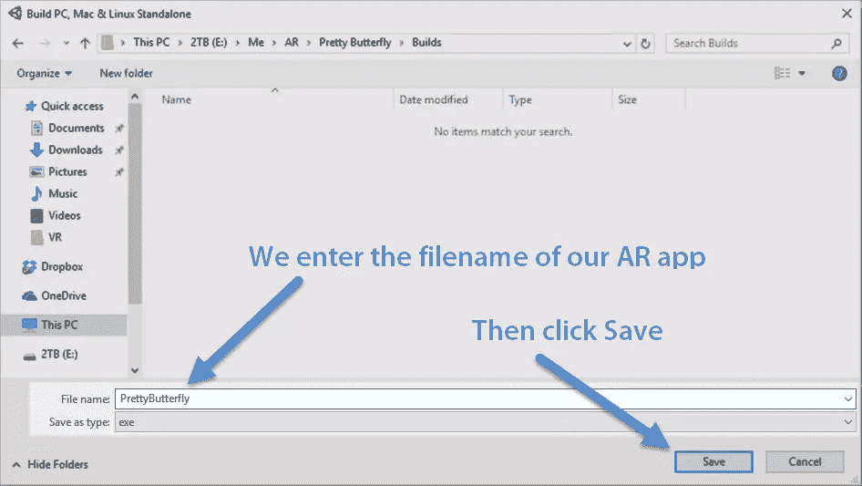

我们的应用程序现在应该完成构建过程并运行。如果成功完成，我们应该会看到如下所示的配置屏幕:

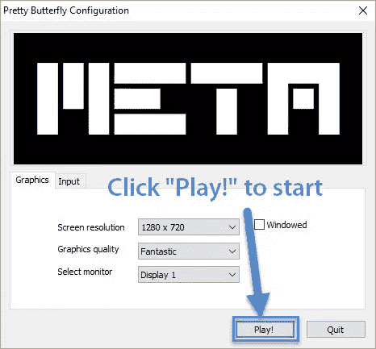

当我们点击*“播放！”*，确保“窗口”没有被勾选，应用程序现在应该全屏运行，应该出现在你的 Meta 耳机中，而不是尴尬的 Unity 窗口！

## 在我们的构建中查看日志

如果您在运行您构建的应用程序时发现问题，并希望使用`Debug.Log()`语句调试它们，您可以勾选“构建设置”屏幕上的*“开发构建”*复选框。这将运行应用程序，在右下角显示“开发构建”文本，在左下角显示日志:

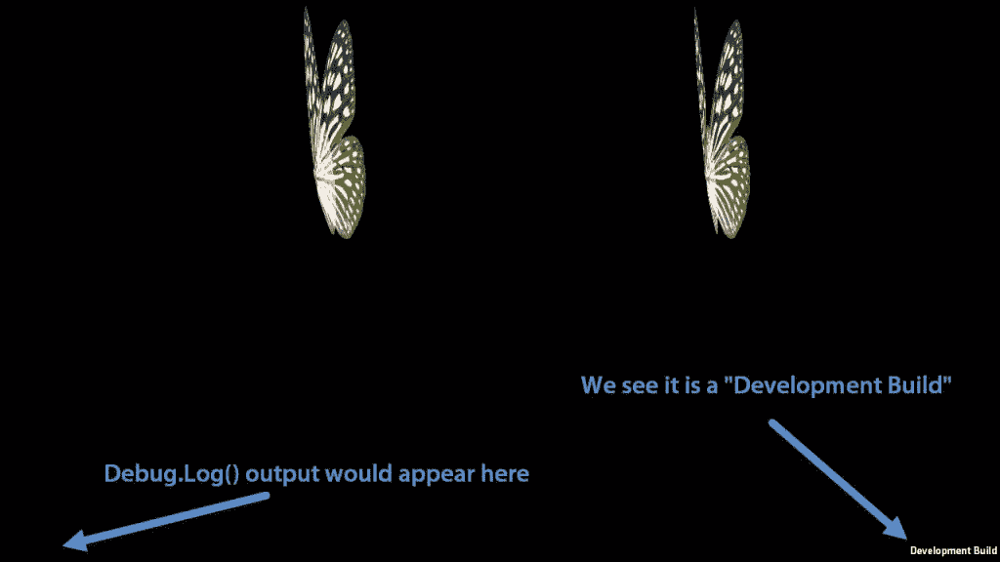

## 将您的应用提交到 Meta

一旦你有了一个你认为值得更多人使用的功能齐全的应用，你可以把它提交给 Meta，让它出现在他们的开发中心。一旦提交，它看起来就像这样:

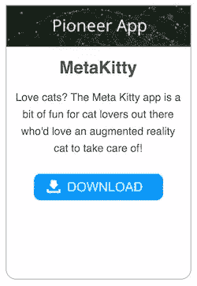

上面的应用程序是我最近提交给开发中心的一个应用程序，它是一个可爱的猫的原型应用程序，你可以喂养它，四处走动，并把它放在床上睡觉。如果你是元先锋，看看吧！

*在深入了解该过程之前，请确保您的应用程序是使用最新的 Meta SDK 构建的——如果您构建该应用程序已经有一段时间了，请检查自那以后是否有更新，并在提交之前更新您的应用程序！*

要提交你自己的应用，你需要填写 Meta 的[应用提交表](http://go.metavision.com/app-submission)。我强烈建议用文本编辑器，Evernote，Google Keep…等写下你的答案，然后复制粘贴。当你需要重新提交该应用程序的未来版本时，这可以节省你的时间，如果你在其他地方进一步推广该应用程序，这些答案往往会派上用场。

对于应用程序提交，您需要准备好以下详细信息:

*   您的最终应用名称。
*   你的应用程序的当前版本号。
*   您的开发人员/公司/团队名称。
*   联系人的电子邮件地址。
*   了解您的应用程序在*(可通过 F3 访问的“广角”模式)*下的相机模式。
*   zip 文件中应用程序的链接。把它上传到可以公开访问的地方，比如 Dropbox、Google Drive 或者你自己的公共网络服务器。在这个 zip 文件中，您需要:
    *   App.exe
    *   Your AppName_Data folder
*   如果你有一个应用程序运行的视频，准备好一个链接。
*   如果你有一个应用代码的代码回购，并希望分享它——也做好准备。
*   以下详细信息将用于创建一个 readme.txt 文件供您下载，因此也请准备好:
    *   该应用程序的用途-谁将使用该应用程序，他们将用于什么目的？
    *   一个 20 字的应用程序描述——这是一个出现在开发中心，像我的 MetaKitty 应用程序。
    *   使用说明—他们需要知道什么？指出触发功能的任何特定按键。
    *   应用程序的功能——列出你的应用程序可以实现的各种功能！
    *   故障排除信息—是否存在一个您经常需要做某些事情来修复的常见错误？比如出问题时按一个键来重新定位元素？
    *   发行说明-如果您以前提交过此应用程序，那么更新了什么？这很可能是你的第一个应用，如果是这样的话你可以跳过这个！

一旦你提交了应用程序，你应该会收到 Meta 团队的消息，他们会对你的应用程序进行质量保证检查，并在发布前提出任何修复或改进方法。他们提供了一些真正有价值的反馈——只要确保你提交时有时间来调整你错过的 Meta QA 团队发现的任何东西。

## 结论

如果您遵循了所有这些步骤，拥有了一个高质量的 AR 应用程序，并对其进行了调整以满足 Meta 团队的任何 QA 请求，您应该会发现您的应用程序自豪地坐在 Meta Dev Center 中，供其他 Meta 先锋试用！

你向元开发中心提交应用了吗？请在下面的评论中告诉我，或者在 Twitter 上通过 [@thatpatrickguy](https://www.twitter.com/thatpatrickguy) 联系我，我很乐意去看看！

## 分享这篇文章