# 14 个 jQuery 模态对话框

> 原文：<https://www.sitepoint.com/14-jquery-modal-dialog-boxes/>

向用户展示快速信息的一个好方法是使用 jQuery 模态对话框或窗口。对话框也可以用来提醒他们注意警告、错误等等。如果做得正确，好看的对话框是一种简单的方法，可以让你的网站感觉更现代，而不需要做很多额外的工作。

许多框架，比如 Twitter Bootstrap 或 T2 Zurb 基金会，都将包含模态和对话。然而，如果你想要的是一个好看的，易于使用的模态窗口，而不是从头开始滚动你自己的窗口，有很多库可以帮助你。

这里有一些模态对话框给你，享受！

2013 年 12 月 12 日更新:更新了本帖中的所有插件，并添加了新的演示图片。删除了缺失的插件并添加了新的插件。现在有 18 个像样的。

【2016 年 3 月 10 日更新:插件列表已经完全更新刷新。如果您还没有使用 jQuery，请跳到不需要它的 JavaScript 库的附加部分！

## 1.使困惑

vex 风格简单，可配置性高，可移动，使用起来很愉快。开始在你的项目中使用 vex，作为一个简单的替代，不与你已经安装的其他库或插件冲突。让你的网站看起来更现代。

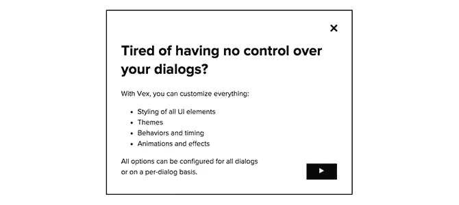

[主页/演示](http://github.hubspot.com/vex/docs/welcome/) | [GitHub](https://github.com/hubspot/vex)

## 2.animatedModal.js

js 是一个 jQuery 插件，用于创建带有 CSS3 过渡的全屏模式。您可以使用来自 [animate.css](http://daneden.github.io/animate.css/) 的过渡，或者创建自己的过渡。

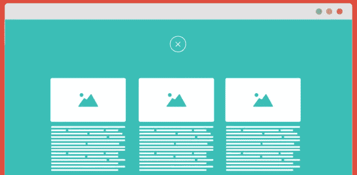

[主页/演示](http://joaopereirawd.github.io/animatedModal.js/) | [GitHub](https://github.com/joaopereirawd/animatedModal.js)

## 3.远程的

Remodal 是一个响应式、轻量级和完全可定制的模式窗口插件，具有声明式配置和哈希跟踪功能。您还可以为模态定义一个背景容器(以便创建模糊等效果)。它还支持 IE8。

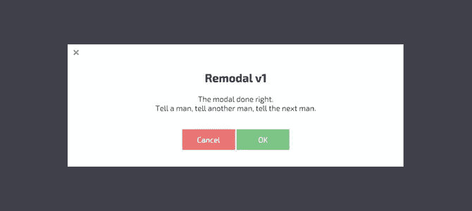

[主页/演示](http://vodkabears.github.io/remodal/) | [GitHub](https://github.com/VodkaBears/Remodal)

## 4.深渊模式

想找点不一样的吗？阿夫格伦可能会掩护你。默认设置创建了一个独特的效果，不仅将动画添加到模式中，还将动画添加到页面本身，优雅地创建了一个深度错觉。最好的方法是亲自查看下面链接中的演示。

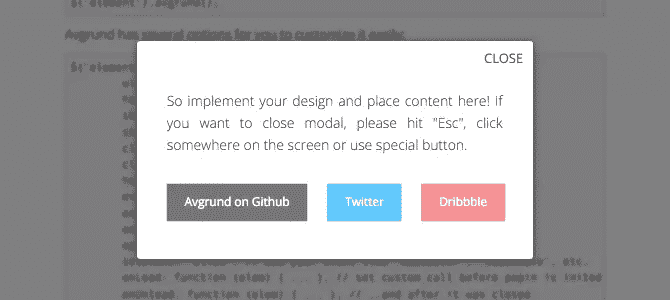

[主页/演示](http://labs.voronianski.com/jquery.avgrund.js) | [GitHub](https://github.com/hakimel/Avgrund)

## 五号音符

谁说情态动词需要居中？noty 的默认设置是与屏幕顶部齐平(能够轻松设置各种位置)。其他模态对话框也可以达到这种效果，所以这不一定是独有的，但 noty 使它非常容易配置。

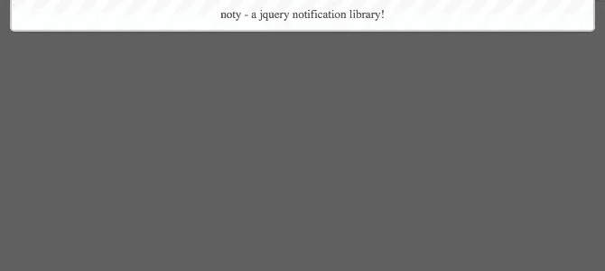

[主页/演示](http://ned.im/noty) | [GitHub](https://github.com/needim/noty/)

## 6.精益模式

如果你正在使用 jQuery，但是仍然想要轻量级的，那么 Lean Modal 是精简的。只有 1kb，没有额外的 CSS，你几乎不会注意到精益模式的存在。

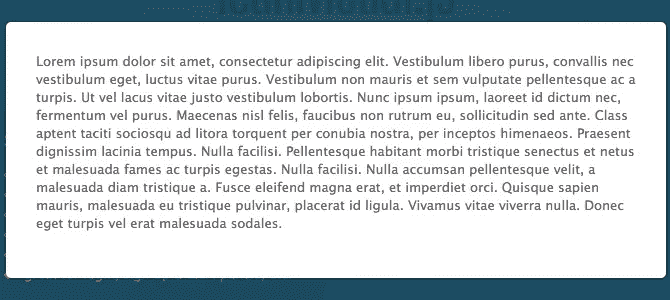

[主页/演示](http://leanmodal.finelysliced.com.au/) | [GitHub](https://github.com/FinelySliced/leanModal.js)

## 7.jQuery 弹出菜单

厌倦了突然出现？试着下来改变一下。jQuery Popdown 默认的，也是唯一的，动画从顶部进入我们的列表。它在文档和可定制性方面的不足，在简单性方面得到了弥补。

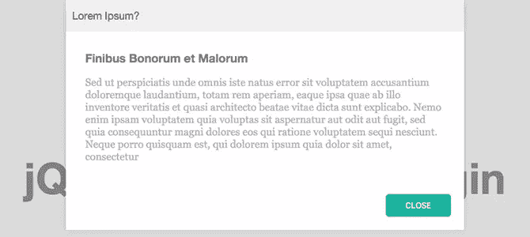

[主页/演示](http://wixel.github.io/jquery-popdown/) | [GitHub](https://github.com/Wixel/jquery-popdown)

## 8.jQuery 用户界面对话框

jQuery UI 是一个支持良好、使用广泛、易于定制、基于 jQuery 的轻量级前端框架。整个框架不仅仅包括模态，但是如果你寻找的只是对话框，那么框架的每个模块都可以很容易地从[下载页面](http://jqueryui.com/download/)单独使用。

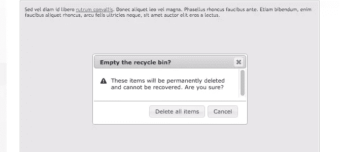

[主页/演示](https://jqueryui.com/dialog/) | [GitHub](https://github.com/jquery/jquery-ui)

## 9.color box-颜色方块

作为一个显示图像的 lightbox 插件，Colorbox 可以优雅地满足 lightbox 和模态对话框系统的需求。

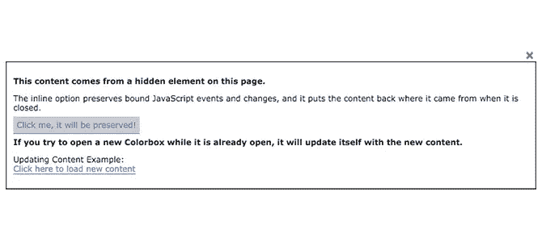

[主页/演示](http://www.jacklmoore.com/colorbox/) | [GitHub](https://github.com/jackmoore/colorbox)

## 10.布洛克伊

虽然这个列表中的每个插件都支持 Ajax，但 BlockUI 是为它而构建的。它允许开发人员使用 Ajax 模拟同步行为，而无需锁定浏览器。BlockUI 向 DOM 添加元素，使其具有阻止用户交互的外观和行为。

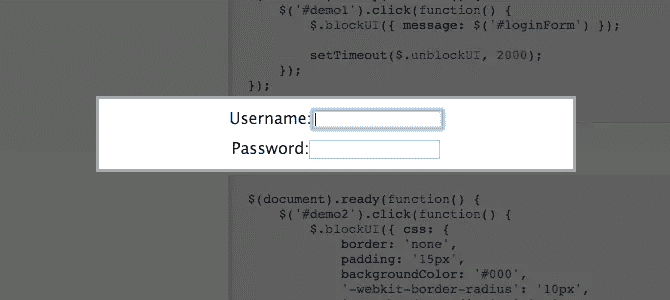

[主页/演示](http://jquery.malsup.com/block/) | [GitHub](https://github.com/malsup/blockui)

## 11.jQuery 模型

它在创造性命名方面的不足，在浏览器支持方面得到了弥补。文档声称甚至支持基于文本的浏览器。但是，不要混淆，jQuery Modal 不是 jQuery 项目的一部分。

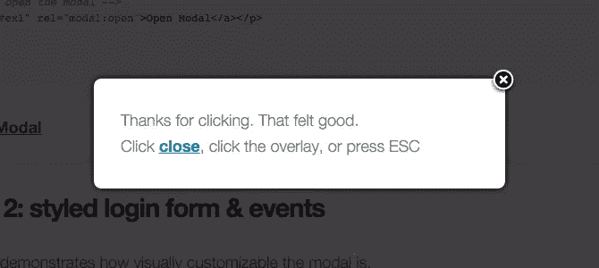

[主页/演示](http://jquerymodal.com/) | [GitHub](https://github.com/kylefox/jquery-modal)

## 12.尼罗莫达尔

你喜欢定制吗？好吧，让我来介绍一下尼罗莫达尔。这个列表中的许多其他插件允许大量的定制，但 nyroModal 的设计允许开发者有很大的自由，甚至到动画。

[主页/演示](http://nyromodal.nyrodev.com/) | [GitHub](https://github.com/nyroDev/nyroModal/)

## 13.jqModal

只有大约 375 行代码，包括注释，源代码 jqModal 非常简单明了。如果您想自己钻研源代码，这是一个很好的选择。

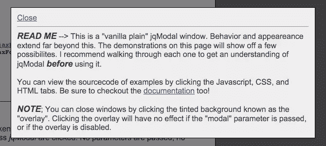

[主页/演示](http://jquery.iceburg.net/jqModal/) | [GitHub](https://github.com/briceburg/jqModal/)

## 14.斑马对话框

Zebra 默认的平面主题看起来很棒，但是你可以随意定制你自己的！

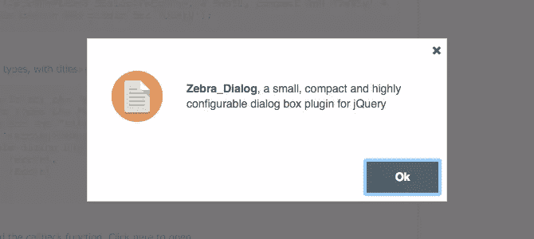

[主页/演示](http://stefangabos.ro/jquery/zebra-dialog/) | [GitHub](https://github.com/stefangabos/Zebra_Dialog)

## 奖励:rmodal

想要一个不使用 jQuery，但是依然很轻很好看的东西？你可能已经找到了你要找的人。rmodal 大小为 3kb，不依赖 jQuery，是我们列表中最轻量级的选项。

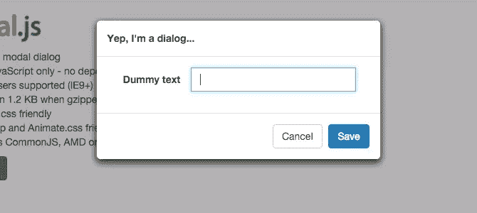

[主页/演示](http://zewish.github.io/rmodal.js/) | [GitHub](https://github.com/zewish/rmodal.js)

## 奖励:SweetAlert

SweetAlert 可能不是我们列表中最轻量级的 17kb 模式，但它是最受欢迎的。但是，它不需要 jQuery。如果您的站点很小，并且您考虑 jQuery 的唯一原因是添加一个对话框，那么 17kb 比整个 jQuery 库(可能有数百千字节)要小得多。甜蜜警报看起来也很棒。

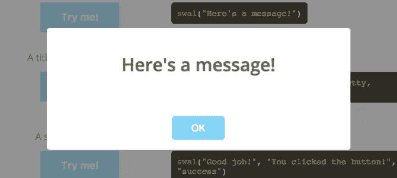

[主页/演示](http://t4t5.github.io/sweetalert/) | [GitHub](https://github.com/t4t5/sweetalert)

## 分享这篇文章