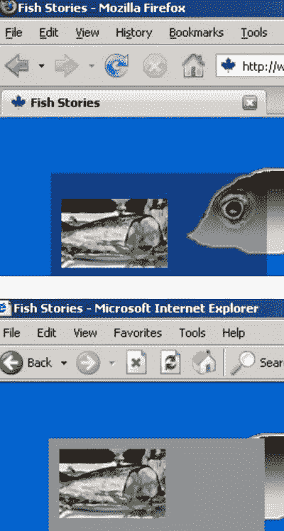
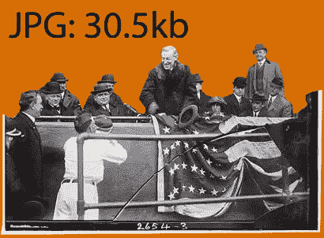
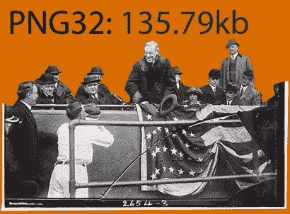
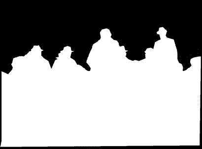
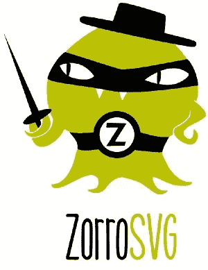
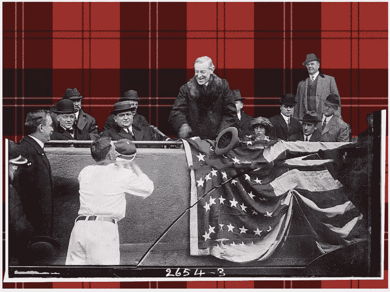

# SVG 能把你从你的胖 PNG-32s 中拯救出来吗？

> 原文：<https://www.sitepoint.com/can-svg-save-fat-png-32s/>

如果你已经存在了足够长的时间(即 2000 年初)，你会记得我们所渴望的是体面的 PNG-32 支持。

虽然 PNG-32 比普通的 GIF 具有更好的透明支持，但 Internet Explorer 将透明部分渲染为脏水灰色。由于 IE6 统治了 90%的浏览器市场，这令人心碎。

可以理解的是，人们咬牙切齿，花了一晚上的时间，用 JavaScript 和模糊的微软过滤器设计可笑的 IE 黑客。

是的，我的朋友们，在那些日子里，我们有更好的事情可以抱怨！

因此，当我们终于可以依赖 PNG-32 支持的时候，我们都非常高兴，从那以后我们几乎没有仔细研究过 PNG。

## 巴布亚新几内亚——糟糕的一点…

尽管 PNG-32 透明性很好，但总是要付出代价的。大 png 是大的文件，通常是 JPEG 的 4 到 5 倍。

*这个 JPEG 文件的重量刚刚超过 30kb*

*与 PNG 相同的图像滴答超过 135kb*

但是，如果我们需要高质量的阿尔法透明度，我们必须吸取它，对不对？

PNG-32 也没有灵活性。JPEG 让你选择最有效的压缩方式，而 PNG 则采取“要么喜欢，要么忍受”的方式。

## SVG 在其中发挥了什么作用？

SVG 有两种能力可以帮助我们。

1.  因为 SVG 是一种文档格式(像 HTML)，所以我们可以在我们的 SVG 里面 嵌入其他文件格式(比如 JPEG)***。这是[在这里解释的](http://tutorials.jenkov.com/svg/image-element.html)如果你感兴趣，但是你不*需要*来理解这个。***
2.  SVG 还支持允许您[创建 alpha 通道(透明蒙版)](http://tutorials.jenkov.com/svg/filters.html)的滤镜——与 Photoshop 中的滤镜没有什么不同。对于上面的图像，我们需要一个像这样的面具。

阿尔法通道

因此，如果我们将这两种 SVG“超级能力”结合起来，理论上我们可以创建一种新的超高效的图像文件格式，具有迷人的 32 位透明度。

但这值得努力吗？

## 迎接狐狸 VG

幸运的是，Mario Klingemann([@卡西蒙多](https://twitter.com/quasimondo))创建了 ZorroSVG 来为我们解决大部分困难。

只需将您的大块透明 PNG32s 直接拖到 ZorroSVG 中，选择 JPEG 质量/压缩设置，您将收到一个闪亮的新透明 SVG，它应该可以在几乎任何现代浏览器中工作。

这太简单了。

作为一次试驾，我拿了上面的原始 878kb PNG-24 图像，并把它扔在 ZorroSVG 上，质量设置为 80%。

新的 SVG 重 183 kb——是原来的 21%。

这里有一个代码笔显示了 SVG 的作用。

这是一个很酷的概念，它可能会为其他一些想法提供一个很好的起点。下周会有更多。

## 分享这篇文章