# 在带有 Objective-C++的 iOS 应用程序中使用 C 和 C++

> 原文：<https://www.sitepoint.com/using-c-and-c-in-an-ios-app-with-objective-c/>

在我的[之前的教程](https://www.sitepoint.com/using-c-and-c-code-in-an-android-app-with-the-ndk/)中，我讨论了如何使用原生开发工具包用 C 或 C++开发 Android 应用。在本教程中，我将介绍如何在 iOS 中使用 C 或 C++以及 Objective-C。与需要特殊 API(NDK)来支持原生开发的 Android 不同，iOS 默认支持它。iOS 的 C 或 C++开发更加简单，因为它有一个名为“Objective-C++”的特性。我将讨论 Objective-C++是什么，它的局限性，以及如何用它来构建 iOS 应用程序。

## 什么是 Objective-C++？

目标-C++可能听起来像一种新的编程语言，但它不是。它是两种语言的结合，Objective-C 和 C++。Apple 提供了 Objective-C++作为混合 Objective-C 代码和 C++代码的便利机制。

Objective-C 接近于 C，但面向对象的特性是作为 C 之上的一个薄层实现的。它是 C 的严格超集，这使得任何 C 代码都是有效的 Objective-C 程序。

尽管 Swift 现在是开发 iOS 应用程序的推荐语言，但仍然有很好的理由使用 C、C++和 Objective-C 等旧语言。尽管 Swift 迅速崛起，Objective-C 仍然是 iOS 上的主导语言，因为已经有大量的现有应用程序和库用它创建。

使用 Objective-C 的一个原因是将为另一个平台编写的现有 C/C++程序移植到 iOS。通过仔细规划，使用 C 或 C++开发跨平台应用程序是可能的。尽管 Swift 是开源的，但它尚未完全支持其他平台。另一个用例是利用已经可用的现有本机代码库的能力。这是 iOS 应用程序仍然使用 C/C++/Objective-C 的最重要原因之一。

## 使用 Objective-C++

本教程的最终项目可以在 GitHub 上找到。

### 创建项目

打开 Xcode 并选择*新建一个 Xcode 项目*。

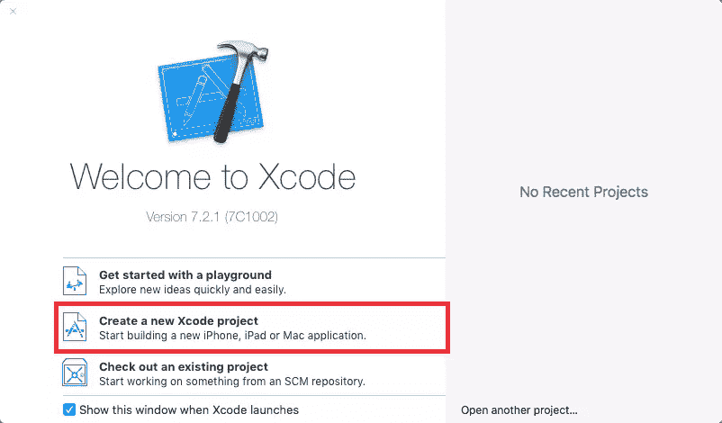

在模板选择界面，从 iOS 应用选项卡中选择*单视图应用*，点击*下一步*。

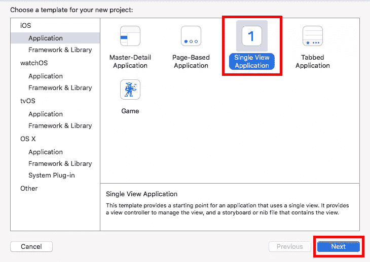

在项目选项屏幕中，将产品命名为 *HelloCpp* 。以反向域名格式输入您的组织和组织标识符。

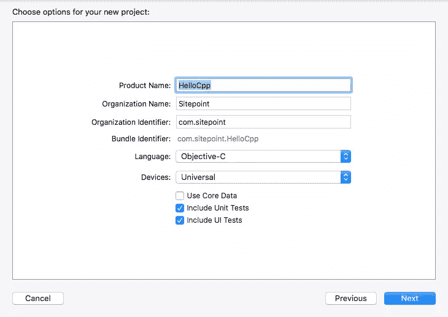

因为它不是真正的语言，所以没有创建 Objective-C++项目的选项。可用的不是 Objective-C 就是 Swift。对于这个项目，选择 Objective-C。保留其他选项，然后单击下一个的*并选择一个文件夹来保存项目。*

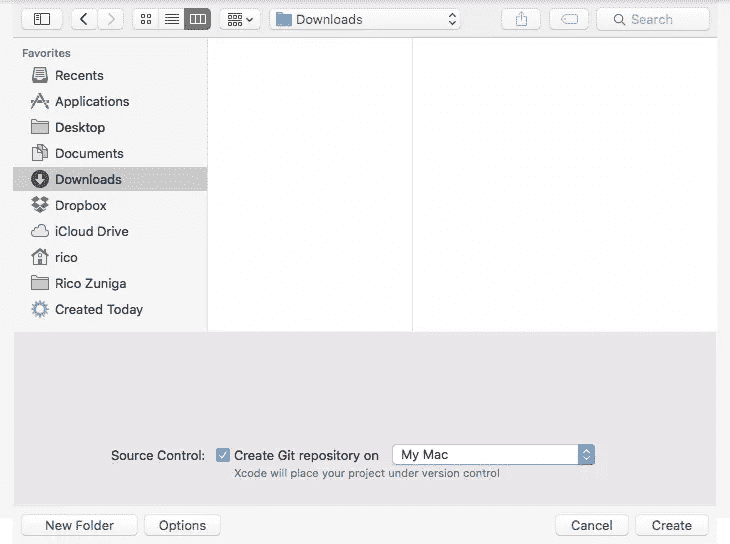

### C++

是时候添加一些 C++代码了。如果这是你第一次使用 C++，看看这个关于语言的教程。查看左边的*项目导航器*窗格。大多数文件都以*结尾。h* 或*。m* 。那些以*结尾的。h* 是头文件，而带*的是头文件。m* 是 Objective-C 源文件。

创建一个从 Objective-C 文件中调用的 C++类。使用*文件- >新建- >文件…* 菜单项或按 *⌘ + N* 创建一个新文件。在出现的文件模板窗口中，选择 *iOS - > Source - > C++文件*，点击 *Next* 。

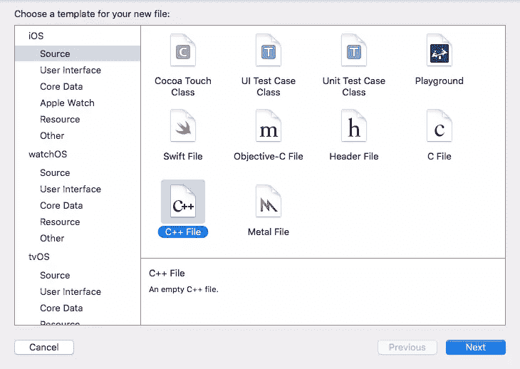

将文件命名为*问候语*，保持【T2 也创建一个头文件复选框处于选中状态，点击*下一步*。将文件保存在 *HelloCpp* 文件夹中。

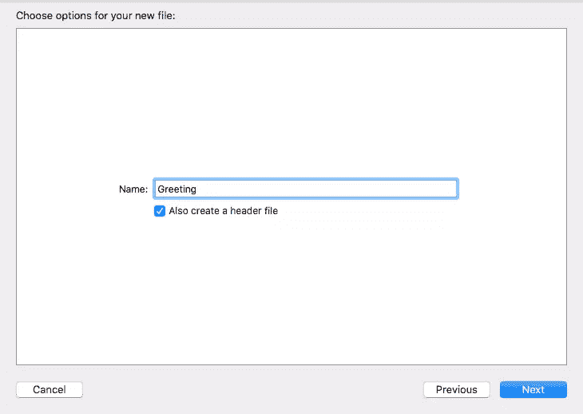

项目的结构现在应该如下所示。随意拖动文件来改进*项目导航器*中的排列。

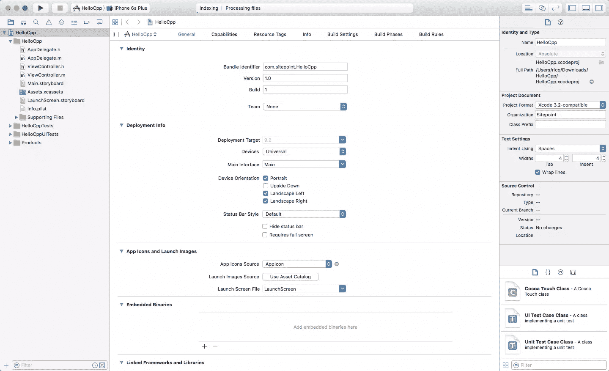

打开 *Greeting.hpp* ，在`include <stdio.h>`和`#endif /* Greeting_hpp */`行之间添加以下代码:

```
#include <string>

class Greeting {
    std::string greeting;
public:
    Greeting();
    std::string greet();
};
```

在 *Greeting.cpp* 中定义这些方法，在`include "Greeting.hpp"`行后添加以下代码:

```
Greeting::Greeting() {
    greeting = "Hello C++!";
}

std::string Greeting::greet() {
    return greeting;
}
```

这是一段简单的代码，它创建了一个名为`Greeting`的类，并使用一个名为`greet()`的方法返回一个字符串值。

### Objective-C 与 C++

既然您已经添加了简单的 C++ Greeting 类，请尝试从 Objective-C 调用它。打开 *ViewController.m* 并导入 *Greeting.hpp* 头文件:

```
#import "ViewController.h"
#import "Greeting.hpp"
...
```

在 ViewController 的`@interface`块中声明一个类型为`Greeting`的变量。

```
@interface ViewController ()
{
    Greeting greeting;
}
@end
```

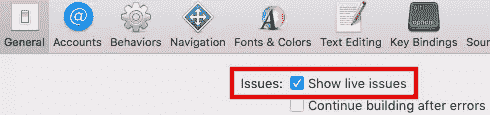

如果*显示实时问题*选项被启用，在添加前一行代码后，会立即出现一条错误消息，称<q>未知类型名称‘问候’</q>。要解决此问题，请将 *ViewController.m* 重命名为 *ViewController.mm* 。这个简单的命名约定告诉 Xcode】想要混合 Objective-C 和 C++。重命名文件后，错误应该会消失。

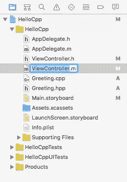

让我们通过添加一个按钮来增加应用程序的交互性。从*项目导航器*中选择 *Main.storyboard* 显示视图控制器场景。如下所示，将一个按钮从对象库拖到视图的中心。把文字改成*轻点我！*。

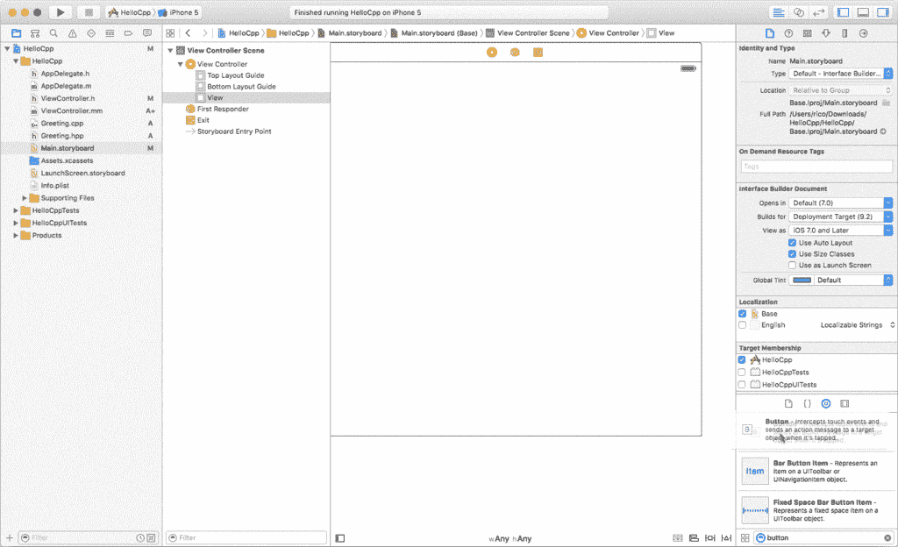

创建一个指向最近创建的按钮的`UIButton`出口。当仍然在 *Main.storyboard* 屏幕中时，通过从工具栏切换打开助理编辑器。按下键盘上的*控制键*并将一个连接器从按钮拖到`greeting`变量下的一行。将这个插座命名为 *helloButton* 。

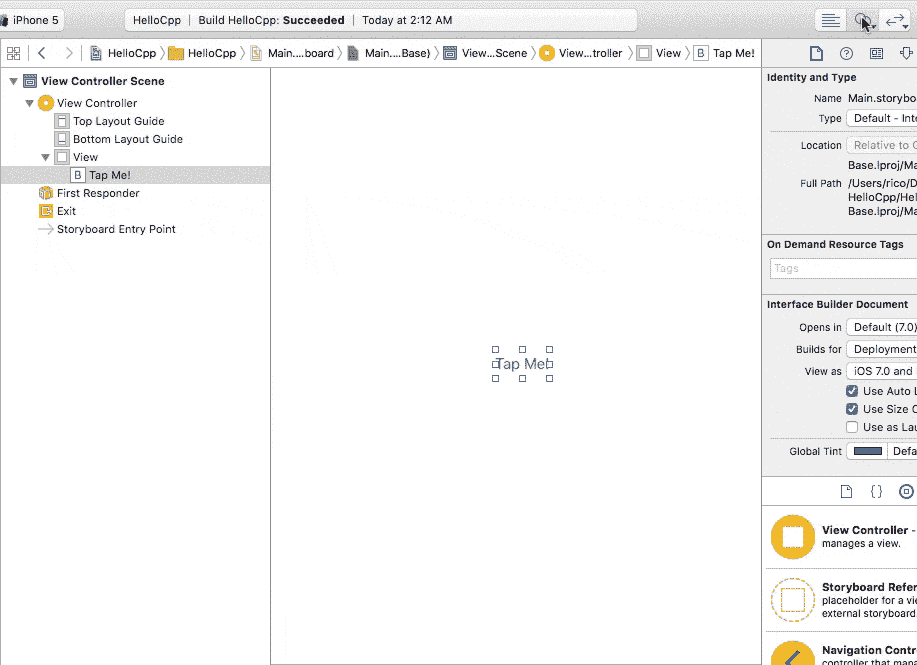

打开 *ViewController.h* ，在`@interface`和`@end`之间增加如下`IBAction`方法:

```
- (IBAction)showGreeting;
```

在 *ViewController.mm* 中定义该方法，在`- (void)didReceiveMemoryWarning`函数之后`@end`之前插入以下代码:

```
- (IBAction)showGreeting {

    NSString* newTitle = [NSString stringWithCString:greeting.greet().c_str() encoding:[NSString defaultCStringEncoding]];

    [helloButton setTitle:newTitle forState:UIControlStateNormal];
}
```

这个方法调用 C++类`Greeting`中定义的`greet()`方法，并使用它返回的字符串值替换 *Tap Me！*按钮的标题。使用相同的*控制+拖动*技术将按钮连接到该动作。回到 *Main.storyboard* 屏幕，通过工具栏打开助理编辑器，然后 *control +拖拽*一个连接器从按钮到`- (IBAction)showGreeting`方法的主体。`- (IBAction)showGreeting`方法左侧的小空心圆应被激活/填充，表示*点击我！*按钮现在连接到该动作。

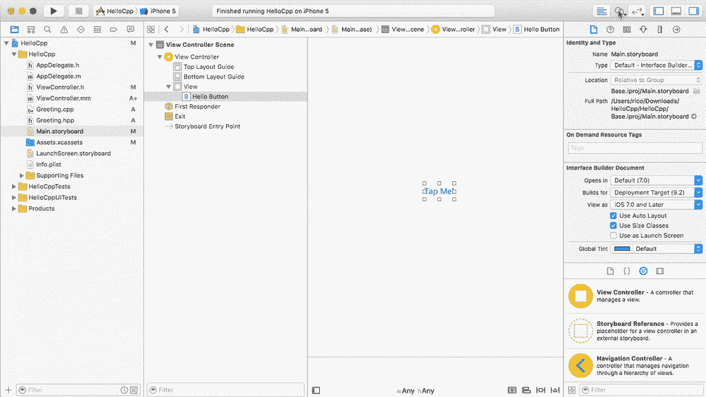

构建并运行应用程序。请注意，该按钮在模拟器上偏离了中心。通过使用*控制+拖动*技术启用自动布局约束来解决这个问题。将按钮连接到其容器，并启用垂直和水平居中。再次运行应用程序以查看改进。

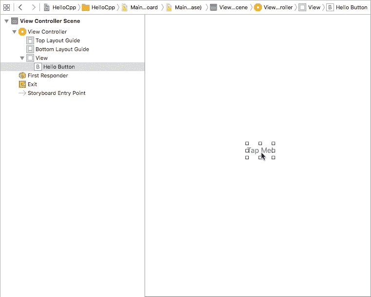

## 限制

Objective-C++实际上并没有合并 Objective-C 和 C++的特性。也就是说，Objective-C 类不具备 C++所具备的特性，反之亦然。下面的代码示例阐释了这些限制:

### 使用 Objective-C 语法调用 C++对象将不起作用

```
std::string greet = [greeting greet]; // error
```

### 不能将构造函数或析构函数添加到 Objective-C 对象中

```
@interface ViewController ()
{
    Greeting greeting;
    IBOutlet UIButton *helloButton;
    ViewController(); // error
    ~ViewController(); // error
}
@end
```

### 关键字`this`和`self`不能互换使用

```
std::string greet = self->greeting.greet(); // works
std::string greet2 = this->greeting.greet(); // error
```

### C++类不能从 Objective-C 类继承

```
#include <stdio.h>
#include <string>
#include "ViewController.h"

class Greeting: public ViewController { // error
    std::string greeting;
public:
    Greeting();
    std::string greet();
};
```

### Objective-C 类不能从 C++类继承

```
#import "Greeting.hpp"

@interface Goodbye : Greeting // error

@end
```

### 当混合 Objective-C 和 C++时，也不完全支持异常处理

在 C++代码中无法捕获在 Objective-C 代码中引发的异常，而在 C++代码中引发的异常在 Objective-C 代码中无法捕获。

```
double divide(int dividend, int divisor) {
    if ( divisor == 0 ) {
        throw "Cannot divide by zero!"; // will not be caught in Objective-C
    }

    return (dividend/divisor);
}
```

## 重用库

重用现有 C/C++库的能力是考虑本地语言时最重要的用例之一，这在 iOS 中是一个简单的过程。虽然 Android 仍然需要一个单独的 NDK，但 iOS 已经支持 C 和 C++。

### SDL

如同安卓 NDK 教程一样，我们将在这个例子中使用 SDL。[简单 DirectMedia 层](https://www.libsdl.org/)是一个开源硬件抽象库，主要用于游戏或任何涉及高性能图形的东西。它是用 C 编写的，所以可以很容易地包含在 Objective-C 代码中。

### 项目设置

首先从[下载页面](https://www.libsdl.org/download-2.0.php#source)下载 SDL 源代码，或者克隆 Mercurial repo:

`hg clone http://hg.libsdl.org/SDL`

下载或克隆完成后，在 Xcode 中创建一个新的*单视图应用程序*项目。将它命名为 *HelloSDL* ，语言设置为 Objective-C

您将从零开始，因此在*项目导航器*中，选择以下突出显示的文件，并将它们移动到回收站:

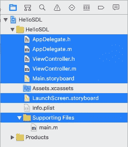

从 *Info.plist* 文件中删除以下键。

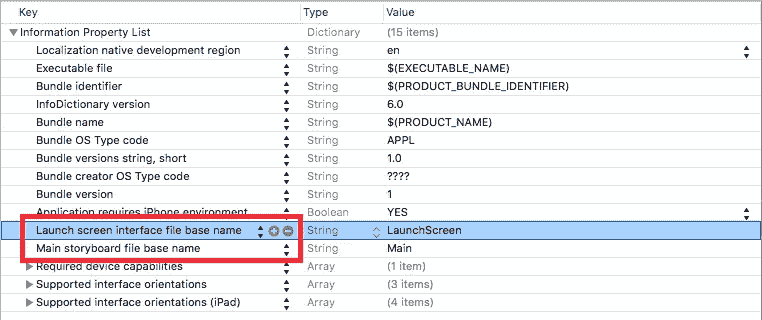

使用*文件- >将文件添加到<q>你好 SDL</q>……*菜单项，将 SDL 图书馆项目添加到 *HelloSDL* 。导航到下载或克隆的 SDL 文件夹，进入 *Xcode-iOS/SDL/* 然后选择 *SDL.xcodeproj* 。

在*项目导航器*中选择主 *HelloSDL* 项目，在目标下选择 *HelloSDL* 。向下滚动到*链接的框架和库*部分。

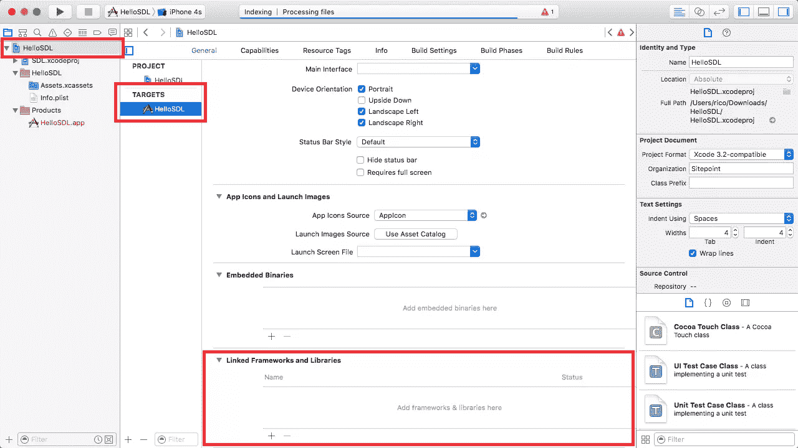

点击 *+* 按钮，手动添加 *libSDL2.a* 及以下框架:

*   音频工具箱.框架
*   CoreAudio.framework
*   CoreGraphics.framework
*   CoreMotion.framework
*   基础.框架
*   游戏控制器.框架
*   OpenGLES.framework
*   QuartzCore.framework
*   UIKit.framework


使用*命令并点击*来多选框架。整理*项目导航器*，选择新添加的框架，并使用*选择*上下文菜单中的【新分组】对它们进行分组。

向项目添加一个 *main.c* 文件。不需要为此创建一个头文件，所以取消勾选*也创建一个头文件*框。

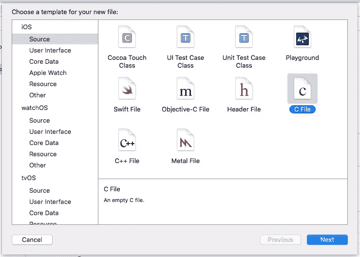

我们将重用福尔摩斯·福特勒从*SDL/Xcode-iOS/Template/SDL iOS Application/main . c*文件中获得的示例代码:

```
/*
 *  rectangles.c
 *  written by Holmes Futrell
 *  use however you want
 */

#include "SDL.h"
#include <time.h>

#define SCREEN_WIDTH 320
#define SCREEN_HEIGHT 480

int
randomInt(int min, int max)
{
    return min + rand() % (max - min + 1);
}

void
render(SDL_Renderer *renderer)
{

    Uint8 r, g, b;

    /* Clear the screen */
    SDL_SetRenderDrawColor(renderer, 0, 0, 0, 255);
    SDL_RenderClear(renderer);

    /*  Come up with a random rectangle */
    SDL_Rect rect;
    rect.w = randomInt(64, 128);
    rect.h = randomInt(64, 128);
    rect.x = randomInt(0, SCREEN_WIDTH);
    rect.y = randomInt(0, SCREEN_HEIGHT);

    /* Come up with a random color */
    r = randomInt(50, 255);
    g = randomInt(50, 255);
    b = randomInt(50, 255);
    SDL_SetRenderDrawColor(renderer, r, g, b, 255);

    /*  Fill the rectangle in the color */
    SDL_RenderFillRect(renderer, &rect);

    /* update screen */
    SDL_RenderPresent(renderer);
}

int
main(int argc, char *argv[])
{

    SDL_Window *window;
    SDL_Renderer *renderer;
    int done;
    SDL_Event event;

    /* initialize SDL */
    if (SDL_Init(SDL_INIT_VIDEO) < 0) {
        printf("Could not initialize SDL\n");
        return 1;
    }

    /* seed random number generator */
    srand(time(NULL));

    /* create window and renderer */
    window =
        SDL_CreateWindow(NULL, 0, 0, SCREEN_WIDTH, SCREEN_HEIGHT,
                         SDL_WINDOW_OPENGL);
    if (!window) {
        printf("Could not initialize Window\n");
        return 1;
    }

    renderer = SDL_CreateRenderer(window, -1, 0);
    if (!renderer) {
        printf("Could not create renderer\n");
        return 1;
    }

    /* Enter render loop, waiting for user to quit */
    done = 0;
    while (!done) {
        while (SDL_PollEvent(&event)) {
            if (event.type == SDL_QUIT) {
                done = 1;
            }
        }
        render(renderer);
        SDL_Delay(1);
    }

    /* shutdown SDL */
    SDL_Quit();

    return 0;
}
```

这段代码在屏幕的随机区域显示随机颜色的矩形。将这段代码复制到 *main.c* 文件中。

最后，将*用户头文件搜索路径*属性设置为 SDL 头文件所在的文件夹。最简单的方法是在 HelloSDL 项目中创建一个指向 SDL 文件夹的符号链接，并将*用户标题搜索路径*属性设置为 *SDL/include/* 。

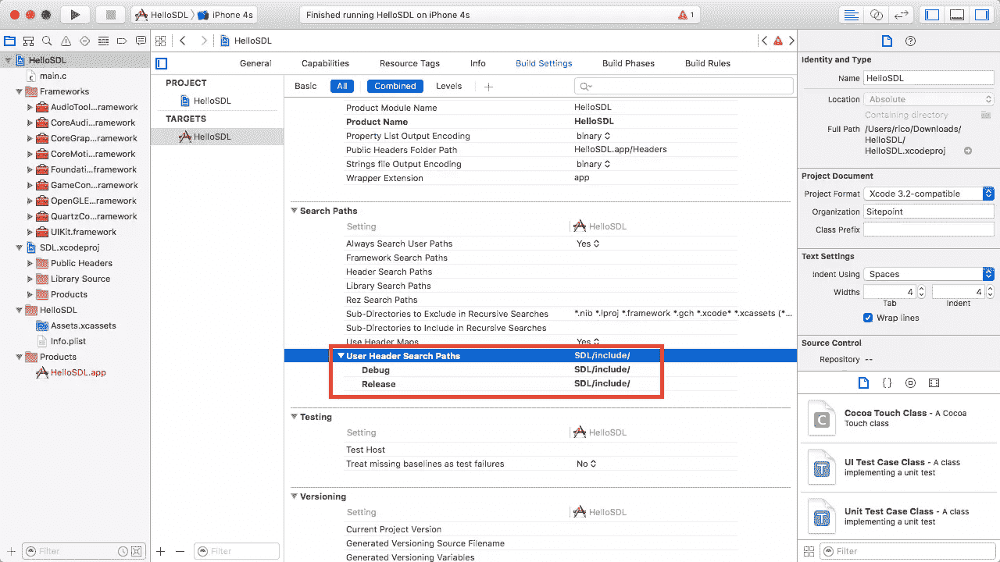

确保 *HelloSDL* 是工具栏中的活动方案，然后构建并运行项目以查看舞动的矩形。

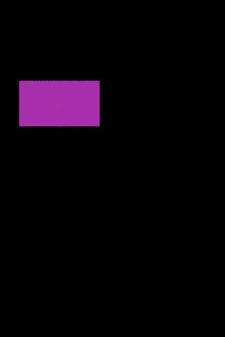

## 结论

如您所见，通过使用 Objective-C++，iOS 中的 C 和 C++开发非常简单。如果你以前一直用 C 或 C++编程，那么现在更容易过渡到 iOS 开发并利用你现有的技能。最重要的是，您可以利用现有的 C/C++库，如功能强大的 SDL，只需很少的配置。

我很想在下面的评论中听到你使用 Objective-C++的经验和意见。

## 分享这篇文章