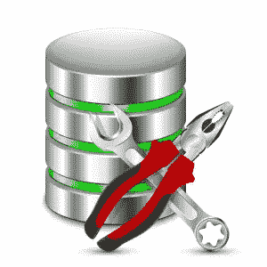

# 将手指放在带 HairTrigger 的导轨触发器上

> 原文：<https://www.sitepoint.com/put-your-finger-on-triggers-in-rails-with-hairtrigger/>



[HairTrigger](https://github.com/jenseng/hair_trigger) 使 [Ruby on Rails](https://github.com/rails/rails) 应用程序能够以一种简洁且与数据库无关的方式创建和管理数据库触发器。如果没有它，在 Rails 应用程序中实现数据库触发器将需要特定于数据库的知识，即创建带有所需 SQL 语句的存储过程来执行数据库操作。

在本文中，将向您简要介绍数据库触发器，以及使用活动记录回调和数据库触发器之间的比较。本文还将解释使用 HairTrigger 实现数据库触发器的要点。有关触发 API 的完整信息，请参考官方[文档](https://github.com/jenseng/hair_trigger/blob/master/README.md)。

为了有一个好的起点，将为您提供一个使用 HairTrigger 实现数据库触发器的用例。这个用例演示了一个反规范化策略，它需要实现数据库触发器来聚合和同步表之间的数据。实现的完整源代码可以在 [Github](https://github.com/hendrauzia/sitepoint-hair-trigger) 上找到作为参考。

## 数据库触发器一览

数据库触发器是存储过程中的一组 SQL 语句，当数据库中的给定表或视图发生特定事件时，将自动执行这些语句。本节将不讨论数据库触发器的实现细节，而是提供我们将尝试实现什么以及何时不使用数据库触发器的高级概述。

### 使用数据库触发器进行反规范化

我们将使用反规范化策略来演示数据库触发器的实现。涉及 2 个表:`clips`和`videos`。一个视频可以有多个剪辑，一个剪辑只能属于一个视频。反规范化包括将表`clips`的列`duration`汇总到表`videos`的匹配列`duration`中。

为了避免每次都计算总的视频剪辑持续时间，最好取消剪辑持续时间的规格化。剪辑持续时间的值也很少改变，这使它成为使用数据库触发器进行反规格化的良好候选。

数据库触发器将用于在每次剪辑持续时间更新时计算视频剪辑持续时间的总和，并将其存储在视频持续时间内。需要更新视频持续时间的其他时间包括创建和删除剪辑。

以下是为`clips`表创建数据库触发器时需要考虑的事件:

*   创建剪辑后，更新视频持续时间。
*   更新剪辑持续时间后，更新视频持续时间。
*   删除剪辑后，更新视频持续时间。

### 数据库触发器的陷阱

作为旁注，请小心不要引入循环更新。也就是说，避免创建更新一列的触发器，该触发器还会触发前一列的更新。

另一种应该避免使用数据库触发器的情况是，当受影响的行频繁更改时，这可能会导致“数据更新风暴”。如果需要，您应该向触发器添加一个前提条件，以确保触发器仅在特定列更新时触发。

## 数据库触发器与活动记录回调

数据库触发器是表或视图生命周期的挂钩，而[活动记录回调](http://api.rubyonrails.org/classes/ActiveRecord/Callbacks.html)是活动记录对象生命周期的挂钩。数据库触发器不应被视为活动记录回调的完全替代。相反，触发器应该被视为活动记录回调的补充。

### 何时使用数据库触发器

触发器应该在您需要活动记录回调中不可用的特定数据库功能的情况下使用。只要不引入循环更新或数据更新风暴，如前一节所述，使用数据库触发器是可以的。当您决定在 Rails 应用程序中实现数据库触发器时，可以参考以下要点:

*   需要原子 SQL 操作。
*   克服竞争条件，例如聚合数据。
*   跨数据库实施参照完整性。
*   记录或审核数据库记录。

### 何时使用活动记录回调

另一方面，活动记录回调应该在不需要特定的数据库特性并且可以从活动记录中获得的情况下使用。还应该注意的是，您必须非常小心不要引入循环回调，就像使用触发器时的循环更新问题一样。以下是一些使用活动记录回调比触发器更好的情况:

*   需要调试，反正就是普通的 Ruby。
*   挂钩到特定于活动记录的回调，例如在验证之前。
*   不引入竞争条件的 SQL 操作。
*   需要特定 Ruby/Rails 特性的 SQL 操作。

也就是说，这可能不是两者之间的完整比较，但它应该在您开始实施它之前，为您选择正确的技术提供一个良好的开端。

## 数据库触发器使用 HairTrigger

让我们看看如何使用 HairTrigger gem 管理触发器，特别是反规范化和数据聚合的用例。该演示向用户展示了以下技术:

*   Ruby 2.3.0
*   4.2.5.1 铁路公司
*   PostgreSQL 9.5.0

下一节中的任何实现都没有在其他环境中测试过。如果您有不同的设置，请在进入下一部分之前查阅 HairTrigger [兼容性](https://github.com/jenseng/hair_trigger#compatibility)列表。

### 装置

将宝石放入您的宝石档案:

```
gem "hairtrigger" 
```

并从应用程序根路径运行以下命令:

```
bundle install 
```

就这样，你可以走了。

### 履行

为了实现我们的用例，我们假设演示所需的所有字段都已经就绪。下一步是添加触发器，让我们回顾一下数据库触发器的计划:

*   创建剪辑后，更新视频持续时间。
*   更新剪辑持续时间后，更新视频持续时间。
*   删除剪辑后，更新视频持续时间。

可以看到所有事件后面的语句都是完全一样的，就是更新视频时长。因此，我们可以创建一个方法，返回在所有事件中使用的 SQL 语句:

```
# app/models/clip.rb
def self.update_video_duration_sql
  <<-SQL
    UPDATE videos SET duration = (
      SELECT sum(clips.duration)
      FROM clips
      WHERE clips.video_id = videos.id
    )
  SQL
end 
```

更新条件可以通过使用特殊变量来完成，这些变量是`NEW`和`OLD`。因为有些事件包含不同的变量，所以应该将更新条件放在每个触发器中。有关特殊变量的用法，请参考您的数据库文档。

创建剪辑后，更新视频持续时间:

```
# app/models/clip.rb
trigger.after(:create) do
  <<-SQL
    #{ self.update_video_duration_sql }
    WHERE videos.id = NEW.video_id
  SQL
end 
```

更新剪辑持续时间后，更新视频持续时间:

```
# app/models/clip.rb
trigger.after(:update).of(:duration) do
  <<-SQL
    #{ self.update_video_duration_sql }
    WHERE videos.id = NEW.video_id
  SQL
end 
```

删除剪辑后，更新视频持续时间:

```
# app/models/clip.rb
trigger.after(:delete) do
  <<-SQL
    #{ self.update_video_duration_sql }
    WHERE videos.id = OLD.video_id
  SQL
end 
```

### 数据库迁移

要创建数据库迁移，请运行以下命令:

```
bundle exec rake db:generate_trigger_migration 
```

上述由 HairTrigger gem 提供的 Rake 任务将为您的数据库触发器创建必要的迁移。之后，通过运行以下命令来应用数据库迁移。

```
bundle exec rake db:migrate 
```

每当您更改触发器块中的内容时，您都应该运行触发器迁移生成 Rake 任务，否则，将不会创建任何迁移。其工作原理是，在代码更新前后，触发器块中的 SQL 语句会有所不同，因此它可以确定是否应该创建新的迁移。

## 结论

使用 HairTrigger 实现数据库触发器到此结束。HairTrigger 提供了其他方法，允许轻松集成和管理触发器，请访问官方[文档](https://github.com/jenseng/hair_trigger/blob/master/README.md)获取完整参考。阅读完本文后，我希望您能更好地理解使用触发器的好处，避免实现陷阱，并能够使用 HairTrigger 在您的 Rails 应用程序中正确地应用它。

## 分享这篇文章