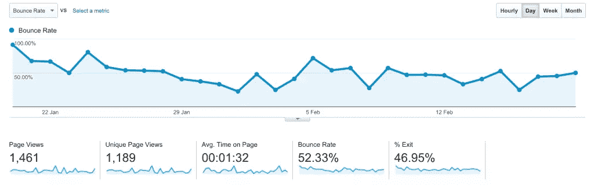

# 降低你的 WordPress 网站跳出率的 10 个技巧

> 原文：<https://www.sitepoint.com/10-tips-for-reducing-the-bounce-rate-on-your-wordpress-site/>

跳出率简单来说就是访问你的网站的用户在浏览一个页面后就离开的比例。

你可以利用 [Google Analytics](https://www.google.com/analytics/web/) 来确定你的网站的跳出率，从而确定只浏览一页后实际点击离开你的网站的用户的百分比。

跳出率是一个重要的考虑因素，不仅在用户参与度和体验方面，在 SEO 方面也是如此。如果你从 SEO 的角度对跳出率感兴趣，那么也值得读一读[评论的顶级 WordPress SEO 插件](https://www.sitepoint.com/top-wordpress-seo-plugins-reviewed/)。

跳出率对许多网站来说是一个严重的问题，但是有一些有效的方法可以用来降低跳出率。下面，我将向你展示如何用真正有效的方法来降低你的 WordPress 网站的跳出率。

## 降低跳出率

### 1.提高网站速度

互联网用户变得越来越不能容忍缓慢加载的网站。Sean Work 的一份报告显示，47%的消费者希望网页在 2 秒或更短的时间内加载，40%的人放弃了一个加载时间超过 3 秒的网站，页面响应延迟一秒会导致转化率下降 7%，如果一个电子商务网站每天赚100，000 美元，一秒的页面延迟可能会导致每年 250 万美元的销售损失。

如果你是特定服务或内容类型的唯一提供者，并且你并不特别关心你所提供的用户体验，那么你可能会考虑忽略你的站点加载速度。否则，尽你所能加速你的网站，不要指望用户坐在那里等待你的网站完成加载(他们实际上不会),如果缓慢。

更多信息请看我的文章 [12 种加速你的 WordPress 网站的方法](https://www.sitepoint.com/12-ways-to-speed-up-your-wordpress-website/)。

### 2.提供优质内容

提供高质量的内容无疑是网站成功的最关键因素。提供糟糕的内容不仅会增加网站的跳出率，还会让你失去用户的信任和信心。

当用户访问一个网站而无法获得他们想要的东西时，他们会离开并搜索其他地方来获得它，他们往往不会回来。

### 3.长文章应该分成几部分

人们往往缺乏时间，希望文章简洁、信息丰富，没有不必要的填充和不相关的信息。给他们想要的东西，以一种快速和容易理解的形式，他们会留下来，对你的内容更感兴趣。

### 4.你不必使用弹出窗口

弹出窗口可能会提高订阅率和转化率，但它们也有很高的风险让人讨厌。如果我遇到一个网站，我会立即关闭一个弹出窗口并离开它。

呈现行动号召有很多替代方式，可能是一个简短的公告或订阅小部件。你也可以进行 A/B 分割测试，看看什么最适合你的网站。

### 5.提高网站的移动响应能力

随着越来越多的访问者通过智能手机和平板电脑访问网络，你真的应该让你的 WordPress 网站在小屏幕上完美运行。

这不应该是一个问题，因为你可以通过选择有响应性的主题来轻松处理这个问题。如果你买不起付费的响应主题，相信我，你会找到数百个免费的响应主题。看看 Tahir Taous 最近的这篇文章，它涵盖了 10 个最受欢迎的免费 WordPress 主题。

### 6.外部链接应该在一个新的标签中打开

你不会真的想用你自己的链接把访问者赶走吧？因此，当引用你网站之外的资源时，你应该确保他们真的看到了你网站之外的资源。

一种常用的方法是将链接中的`target`属性设置为`_blank`，这将确保用户在点击链接时被重定向到一个新的选项卡，而不是在与你的站点相同的页面中打开链接。这种方法经常是激烈辩论的主题，但它是很多人做的事情。

`<a href="https://link_here" target="_blank"> Some text here </a>`

### 7.网站设计和用户体验

假设我们打开一个网站，目标是阅读帖子或查看他们的服务，当我们登陆网站时，欢迎我们的是完全黄色的背景，红色的文本，以及足够高的标题来放置你的相册。

如果你像我一样，那么在离开这个网站之前，你不会犹豫。

网站设计是一个非常重要的元素，应该好好把握。即使你的内容并不完美，相信我，如果你的网站是干净和令人愉悦的，你可能会鼓励用户留下来看看你网站上的其他页面。

### 8.链接到内部内容并显示相关帖子

这无疑是让用户留在你网站上的好方法。与其总是链接到外部资源，不如参考你网站上的资源。

当用户读完你网站上的帖子后，他们下一步会做什么？留下来还是回到他们来的地方？即使伟大的内容鼓励用户阅读更多，你也必须让它尽可能简单，尤其是当他们有兴趣留下来的时候。

像 [YARRP](https://wordpress.org/plugins/yet-another-related-posts-plugin/) 这样的插件将毫无压力地帮助实现这个目标。

### 9.明智地处理广告

我知道你必须从你的网站上获得一些收入，但是如果你不明智地这样做，你可能会在两方面有所损失:收入的减少和用户数量及其在网站上的时间的减少。

你不会真的想让访问者怀疑什么是广告，什么是真正的内容。在你的主页上只保留很少的广告，如果可能的话，最好不要有广告。在你的帖子页上，尽你所能安排好广告，文字广告会更好。

### 10.提供清晰的导航

假设你使用 WordPress 建立你的商业网站，在标题区域创建清晰易懂的导航是理想的。如果你不能为用户提供一条清晰的路径，他们会离开并去别的地方。

例如，当用户只对查看你的作品集感兴趣来决定你是否适合合作时，实现一个糟糕的导航系统会让他们立刻寻找其他的替代品。

确保你的导航清晰、易于访问、易于理解且不混乱。

### 结论

记住这一点，跳出率的降低不会在一夜之间发生。这是一个持续的渐进过程，有效地应用上面解释的策略可以有效地减少你的站点上的风险。

也许你有额外的技巧来降低跳出率？请在下面的评论区分享。

## 分享这篇文章