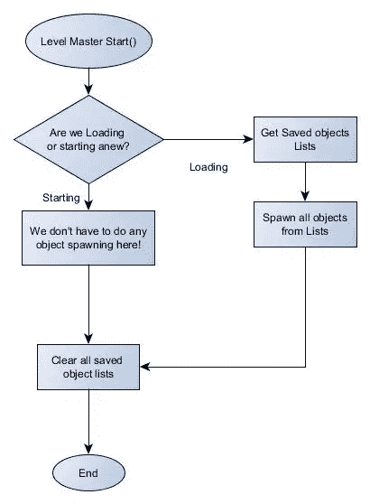
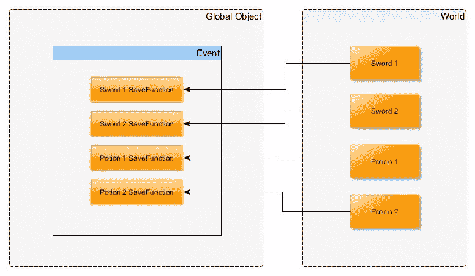
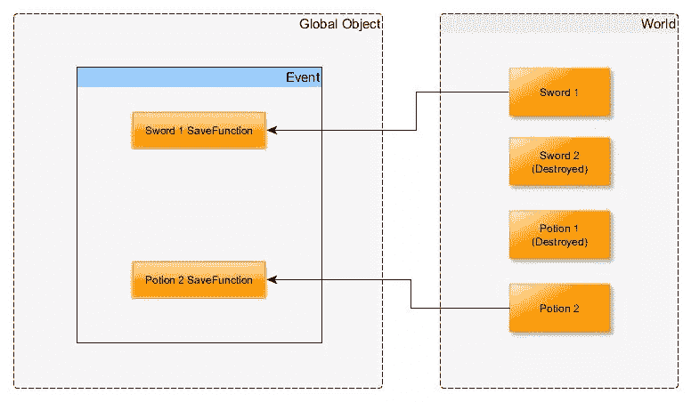
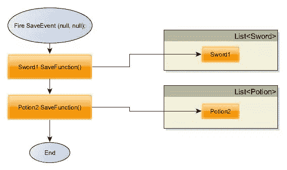
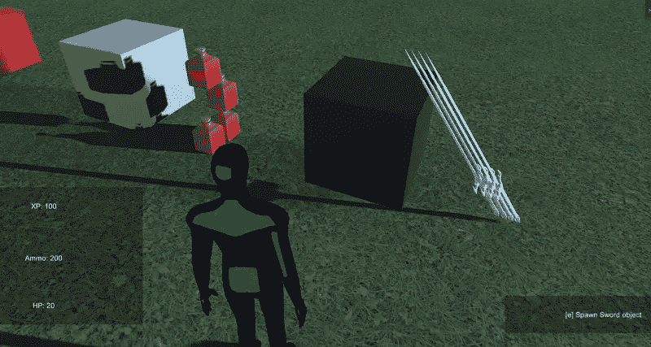
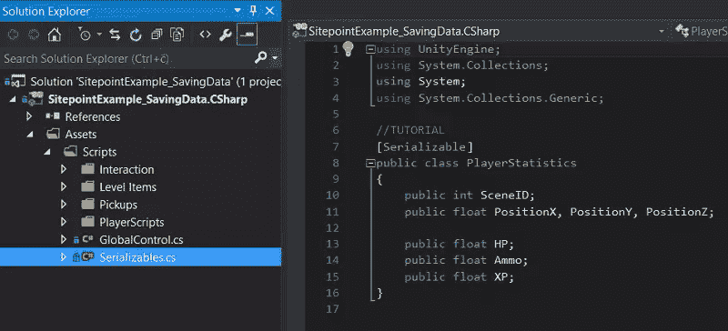
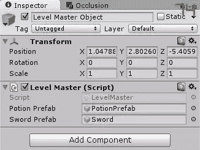
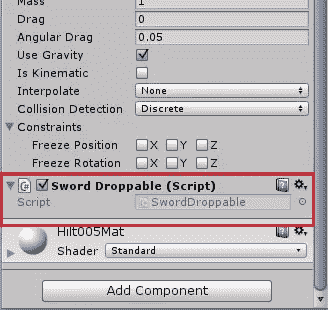

# 掌握 Unity 5 中的保存和加载功能

> 原文：<https://www.sitepoint.com/mastering-save-and-load-functionality-in-unity-5/>

*感谢[文森特·夸尔斯](https://www.sitepoint.com/author/vquarles/)好心帮助[同行评审](https://www.sitepoint.com/introduction-to-sitepoints-peer-review/)这篇文章。*

在本教程中，我们将完成游戏中保存和加载功能的实现。在之前关于在 Unity 中保存和加载玩家游戏数据的教程中，我们成功地保存和加载了玩家相关的数据，如统计数据和库存，但现在我们将解决最困难的部分——世界对象。最终的系统应该让人想起[上古卷轴游戏](https://en.wikipedia.org/wiki/The_Elder_Scrolls_V:_Skyrim)——每一个物体都精确地保存在原来的位置，保存时间不定。

* * *

如果你需要一个项目来练习，这里有一个我们在上一个教程中完成的项目版本。它已经升级了一对游戏中可以产生物品的互动物品——一瓶药水和一把剑。它们可以被衍生和<q>拾取</q> ( *被衍生*)，我们需要正确地保存和加载它们的状态。项目的完成版本(完全实现了保存系统)可以在本文的底部找到。

### 下载项目启动文件

[项目 GitHub 页面](https://github.com/sitepoint-editors/SitepointExample_SavingData/tree/Mastering_Start)
[项目 ZIP 下载](https://github.com/sitepoint-editors/SitepointExample_SavingData/archive/Mastering_Start.zip)

* * *

## 实现理论

在实现之前，我们需要分解保存和加载对象的系统。首先也是最重要的，我们需要某种<q>级别的主</q>对象，它将生成和取消对象。它需要在关卡中生成已保存的对象(如果我们正在加载关卡，而不是重新开始)，取消选中的对象，通知对象他们需要保存自己，并管理对象列表。听起来很多，所以让我们把它放进流程图:



基本上，整个逻辑是将一个对象列表保存到一个硬盘上——在下一次加载关卡时，它将被遍历，当我们开始游戏时，所有来自它的对象都将生成。听起来很容易，但是困难在于细节:我们如何知道要保存哪些对象，以及如何将它们重新生成？

## 代表和事件

在上一篇文章中，我提到我们将使用委托事件系统来通知对象他们需要自救。先解释一下什么是**代表**和**事件**。

您可以阅读[官方代表文件](https://msdn.microsoft.com/en-us/library/ms173171.aspx)和[官方活动文件](https://msdn.microsoft.com/en-us/library/awbftdfh.aspx)。但是不要担心:即使是我也不理解官方文档中的许多技术术语，所以我将用简单的英语来表达:

### 代表

你可以把委托想象成一个**功能蓝图**。它描述了一个函数应该是什么样子:它的返回类型是什么，它接受什么参数。例如:

```
public delegate void SaveDelegate(object sender, EventArgs args);
```

此委托描述了一个不返回任何内容(void)的函数，并接受. NET/Mono framework 的两个标准参数:一个表示事件发送方的通用对象，以及可用于传递各种数据的最终参数。你真的不用担心这个，我们可以把(null，null)作为参数传递，但是它们必须在那里。

那么这与**事件**有什么联系呢？

### 事件

你可以把一个**事件**想象成一个功能的<q>盒子。它只接受与**委托**(一个蓝图)相匹配的函数，并且你可以在运行时随意添加或删除函数。</q>

然后，在任何时候，你都可以**触发**一个事件，这意味着同时运行当前盒子中的所有功能。考虑以下事件声明:

```
public event SaveDelegate SaveEvent;
```

这个语法是这样的:声明一个公共事件(任何人都可以**订阅**,我们稍后会谈到它)，它接受由 **SaveDelegate** delegate(见上文)描述的函数，它被称为 **SaveEvent** 。

### 订阅和取消订阅

订阅一个事件基本上意味着“把一个功能放进盒子里”。语法非常简单。假设我们的事件是在我们众所周知的`GlobalObject`类中声明的，我们有一些名为<q>potiondropbable</q>的魔药对象类需要订阅一个事件:

```
//In PotionDroppable's Start or Awake function:
GlobalObject.Instance.SaveEvent += SaveFunction;

//In PotionDroppable's OnDestroy() function:
GlobalObject.Instance.SaveEvent -= SaveFunction;

//[...]
public void SaveFunction (object sender, EventArgs args)
{
 //Here is code that saves this instance of an object.
} 
```

我们来解释一下这里的语法。我们首先需要一个符合所描述的委托标准的函数。在对象的脚本中，有这样一个名为 **SaveFunction** 的函数。我们稍后会写我们自己的，但是现在让我们假设它是一个工作函数，用于将对象保存到硬盘驱动器，以便以后可以加载它。

当我们拥有它时，我们只是在脚本开始或唤醒时将该函数放入盒子中，并在它被破坏时移除它。(取消订阅非常重要:如果你试图调用一个被销毁对象的函数，你将在运行时得到空引用异常)。我们通过访问声明的事件对象，并使用加法运算符后跟函数名来实现这一点。

注意:我们没有用括号或参数调用函数；我们只是使用了函数的名字，没有别的。

所以让我们解释一下，所有这些最终在游戏的一些示例流程中做了什么。

### 逻辑流程

我们假设，通过游戏的流程，玩家的动作在世界上催生了两把剑和两种药剂(比如玩家用战利品开了一个箱子)。

这四个对象在**保存**事件中注册它们的函数:



现在让我们假设玩家从世界上拿起一把剑和一瓶药水。当物品被“捡起”时，它们有效地触发了玩家库存的变化，然后自我毁灭(我知道这有点破坏魔法):



然后，假设玩家决定保存游戏——也许他们真的需要接那个响了三次的电话(嘿，你做了一个很棒的游戏):



基本上，所发生的是盒子里的功能被一个接一个地触发，直到所有的功能都完成了，游戏才开始。每个“保存自己”的对象基本上都是在一个列表中写下自己——在下一个游戏**加载**时，将由主级对象检查，列表中的所有对象都将被实例化(衍生)。就是这样，真的:如果到目前为止您已经遵循了这篇文章，那么您基本上已经准备好立即开始实现它了。尽管如此，我们在这里还是要看一些具体的代码示例，和往常一样，如果你想看看整个项目应该是什么样子，在文章的最后会有一个完成的项目等着你。

## 密码

让我们首先检查一下现有的项目，熟悉一下里面的内容。



正如你所看到的，我们有这些设计精美的盒子，作为我们已经提到的两个物体的产卵器。两个场景都有一对。您可以立即看到问题:如果您过渡场景或使用`F5/F9`保存/加载，产生的对象将会消失。

盒子生成者和生成的对象本身使用一个简单的可交互的接口机制，该机制为我们提供了识别这些对象的光线投射、在屏幕上写文本以及使用[E]键与它们交互的能力。

没有更多的存在。我们在这里的任务是:

*   列一张药剂物品的清单
*   列一个剑的物品清单
*   实现全局保存事件
*   使用保存功能订阅事件
*   实现一个级别主对象
*   如果我们正在加载一个游戏，让一级主生成所有保存的对象。

如您所见，这并不像人们希望的那样简单。事实上，没有一个现有的游戏引擎(CryENGINE，UDK，虚幻引擎 4，其他)真的有一个简单的保存/加载功能实现。正如你所想象的，这是因为保存机制实际上是每个游戏特有的。通常需要保存的不仅仅是对象类；它是世界的状态，比如完成的/正在进行的任务，阵营友好/敌对，甚至是一些游戏中当前的天气状况。它变得相当复杂，但是有了正确的保存机制基础，简单地升级它以获得更多功能就变得容易了。

### 对象类别列表

让我们先从简单的东西开始——对象列表。我们玩家的数据通过简单的`Serializables`类中数据的**表示**来保存和加载。



同样，我们需要一些可序列化的类来表示我们的对象。为了编写它们，我们需要知道我们需要保存哪些属性——对于我们的玩家，我们有很多东西需要保存。幸运的是，对于这些物体，你很少需要比它们的世界位置更多的东西。在我们的例子中，我们只需要保存对象的位置，其他什么都不需要。

为了更好地构建我们的代码，我们将从可序列化程序末尾的简单类开始:

```
[Serializable]
public class SavedDroppablePotion
{
    public float PositionX, PositionY, PositionZ;
}

[Serializable]
public class SavedDroppableSword
{
    public float PositionX, PositionY, PositionZ;
}
```

你可能想知道为什么我们不简单地使用一个基类。答案是我们可以，但是您永远不知道何时需要添加或更改需要保存的特定项目属性。此外，这对于代码可读性来说要容易得多。

到现在为止，你可能已经注意到我经常使用术语<q>可丢弃的</q>。这是因为我们需要区分可丢弃(可生成)对象和**可放置**对象，它们遵循不同的保存和生成规则。我们稍后会谈到这一点。

现在，不像玩家的数据，我们知道在任何给定的时间只有一个玩家，我们可以有多个对象，像药水。我们需要做一个动态列表，并指明这个列表属于哪个场景:我们不能在 Level1 中产生 Level2 的对象。这很容易做到，同样是在可序列化中。把这个写在我们最后一节课的下面:

```
[Serializable]
public class SavedDroppableList
{
    public int SceneID;
    public List<SavedDroppablePotion> SavedPotions;
    public List<SavedDroppableSword> SavedSword;

    public SavedDroppableList(int newSceneID)
    {
        this.SceneID = newSceneID;
        this.SavedPotions = new List<SavedDroppablePotion>();
        this.SavedSword = new List<SavedDroppableSword>();
    }
}
```

创建这些列表的最佳位置是我们的 GlobalControl 类:

```
 public List<SavedDroppableList> SavedLists = new List<SavedDroppableList>(); 
```

我们的列表现在已经很好了:当我们需要生成项目时，我们将从 LevelMaster 对象中访问它们，并在 GlobalControl 中从硬盘中保存/加载，就像我们已经对玩家数据所做的那样。

### 代表和事件

啊，终于来了。让我们实现著名的事件。

在全局控制中:

```
 public delegate void SaveDelegate(object sender, EventArgs args);
    public static event SaveDelegate SaveEvent; 
```

如您所见，我们将事件设为静态引用，这样更符合逻辑，以后也更容易处理。

关于事件实现的最后一点:只有包含事件声明的类才能触发事件。任何人都可以通过访问`GlobalControl.SaveEvent +=...`来订阅它，但是只有 GlobalControl 类可以使用`SaveEvent(null, null);`来触发它。试图从别处使用`GlobalControl.SaveEvent(null, null);`将导致编译器错误！

事件实现到此为止！让我们订阅一些东西吧！

### 事件订阅

现在我们有了事件，我们的对象需要**订阅它**，或者，换句话说，<q>开始监听</q>一个事件，并在它触发时做出反应。

我们需要一个在事件触发时运行的函数——针对每个对象。让我们前往<q>picks</q>文件夹中的 PotionDroppable 脚本。注意:剑还没有设置它的脚本；我们马上就能成功！

在 PotionDroppable 中，添加以下内容:

```
 public void Start()
    {
        GlobalControl.SaveEvent += SaveFunction;
    }

public void OnDestroy()
{
    GlobalControl.SaveEvent -= SaveFunction;
}

public void SaveFunction(object sender, EventArgs args)
{

}
```

我们正确地完成了事件的订阅和取消订阅。现在的问题是，如何在列表中保存这个对象？

我们首先需要确保我们有一个为当前场景初始化的对象列表。

在 GlobalControl.cs 中:

```
public void InitializeSceneList()
    {
        if (SavedLists == null)
        {
            print("Saved lists was null");
            SavedLists = new List<saveddroppablelist>();
        }

        bool found = false;

        //We need to find if we already have a list of saved items for this level:
        for (int i = 0; i</saveddroppablelist> 
```

这个函数需要每一级触发一次。问题是，我们的全局控制通过水平和它的启动和唤醒功能只触发一次。我们将通过简单地从我们稍后创建的 Level Master 对象中调用这个函数来解决这个问题。

我们还需要一个小的助手函数来返回当前的活动场景列表。在 GlobalControl.cs 中:

```
public SavedDroppableList GetListForScene()
    {
        for (int i = 0; i 
```

现在我们确信我们总是有一个列表来保存我们的项目。让我们回到我们的药剂脚本:

```
public void SaveFunction(object sender, EventArgs args)
    {
        SavedDroppablePotion potion = new SavedDroppablePotion();
        potion.PositionX = transform.position.x;
        potion.PositionY = transform.position.y;
        potion.PositionZ = transform.position.z;

GlobalControl.Instance.GetListForScene().SavedPotions.Add(potion);
    } 
```

这是我们所有句法糖衣真正发光的地方。这个可读性很强，很好理解，需要的时候也很容易根据自己的需要去改变！简而言之，我们创建一个新的“药剂”表示，并将其保存在实际列表中。

### 创建级别主对象

首先，做一点小小的准备。在我们现有的项目中，我们有一个全局变量告诉我们场景是否被加载。但是我们没有这样的变量来告诉我们场景是否通过使用门被转换。我们希望当我们回到上一个房间时，所有掉落的物体都还在，即使我们没有保存/载入游戏。

要做到这一点，我们需要对全局控制做一些小改动:

```
public bool IsSceneBeingTransitioned = false;
```

在转换脚本中:

```
public void Interact()
    {
        //Assign the transition target location.
        GlobalControl.Instance.TransitionTarget.position = TargetPlayerLocation.position;

        //NEW:
        GlobalControl.Instance.IsSceneBeingTransitioned = true;
        GlobalControl.Instance.FireSaveEvent();

        Application.LoadLevel(TargetedSceneIndex);
    }
```

我们准备创建一个可以正常工作的 LevelMaster 对象。

现在我们只需要在加载游戏时读取列表并从中生成对象。这就是级别主对象要做的事情。让我们创建一个新脚本，并将其命名为 <q>LevelMaster</q> :

```
public class LevelMaster : MonoBehaviour
{

    public GameObject PotionPrefab;
    public GameObject SwordPrefab;

    void Start ()
    {
        GlobalControl.Instance.InitializeSceneList();

        if (GlobalControl.Instance.IsSceneBeingLoaded || GlobalControl.Instance.IsSceneBeingTransitioned)
        {
            SavedDroppableList localList = GlobalControl.Instance.GetListForScene();

            if (localList != null)
            {
                print("Saved potions count: " + localList.SavedPotions.Count);

                for (int i = 0; i < localList.SavedPotions.Count; i++)
                {
                    GameObject spawnedPotion = (GameObject)Instantiate(PotionPrefab);
                    spawnedPotion.transform.position = new Vector3(localList.SavedPotions[i].PositionX,
                                                                    localList.SavedPotions[i].PositionY,
                                                                    localList.SavedPotions[i].PositionZ);
                }

            }
            else
                print("Local List was null!");
        }
    }

}
```

代码太多了，我们来分解一下。

代码只在开始时运行，如果需要，我们用它来初始化 GlobalControl 中保存的列表。然后，我们询问 GlobalControl 我们是否正在加载或转换一个场景。如果我们要重新开始场景(比如新游戏之类的)，这没关系——我们不会产生任何物体。

如果我们*正在*加载一个场景，我们需要获取保存的对象列表的本地副本(只是为了在重复访问全局控制、*和*时节省一点性能，使语法更可读)。

接下来，我们简单地遍历列表，并在列表中生成所有药剂对象。生成的确切语法基本上是**实例化**方法重载之一。我们必须**将实例化方法的结果**转换成<q>游戏对象</q>(由于某种原因，默认返回类型是简单的**对象**)，这样我们就可以访问它的转换，并改变它的位置。

这是对象产生的地方:如果您需要在产生时更改任何其他值，这是完成它的地方。

我们需要在每个场景中放置我们的关卡大师，并为其分配有效的预设:



现在我们只缺少一个关键部分:我们需要实际触发事件，将列表序列化到硬盘上并从中读取。我们将在 GlobalControl 中现有的保存和加载函数中简单地做到这一点:

```
 public void FireSaveEvent()
    {
        GetListForScene().SavedPotions = new List<SavedDroppablePotion>();
        GetListForScene().SavedSword = new List<SavedDroppableSword>();
        //If we have any functions in the event:
        if (SaveEvent != null)
            SaveEvent(null, null);
    }

    public void SaveData()
    {
        if (!Directory.Exists("Saves"))
            Directory.CreateDirectory("Saves");

        FireSaveEvent();  

        BinaryFormatter formatter = new BinaryFormatter();
        FileStream saveFile = File.Create("Saves/save.binary");
        FileStream SaveObjects = File.Create("saves/saveObjects.binary");

        LocalCopyOfData = PlayerState.Instance.localPlayerData;

        formatter.Serialize(saveFile, LocalCopyOfData);
        formatter.Serialize(SaveObjects, SavedLists);

        saveFile.Close();
        SaveObjects.Close();

        print("Saved!");
    }

    public void LoadData()
    {
        BinaryFormatter formatter = new BinaryFormatter();
        FileStream saveFile = File.Open("Saves/save.binary", FileMode.Open);
        FileStream saveObjects = File.Open("Saves/saveObjects.binary", FileMode.Open);

        LocalCopyOfData = (PlayerStatistics)formatter.Deserialize(saveFile);
        SavedLists = (List<SavedDroppableList>)formatter.Deserialize(saveObjects);

        saveFile.Close();
        saveObjects.Close();

        print("Loaded");
    }
```

这看起来也有很多代码，但是大部分已经在那里了。(如果您遵循了我以前的教程，您会认识到二进制序列化命令；这里唯一的新东西是 FireSaveEvent 函数，以及一个保存列表的附加文件。就是这样！

## 初始测试

如果你现在运行这个项目，那么每次你点击`F5`和`F9`，或者走进门(以及这些的任意组合)时，药剂对象将被正确地保存和加载。

然而，还有一个问题需要解决:我们没有保存剑。

这只是为了演示一旦你已经建立了类似的基础，如何向你的项目添加新的可保存的对象。

## 扩展系统

假设你已经有了一个新的对象生成系统——就像我们已经有了剑一样。他们目前不能交互太多(除了基础物理)，所以我们需要写一个类似于药剂 1 的脚本，使我们能够‘捡起’一把剑并正确保存它。

当前正在生成的剑的预置可以在**资产>预置**文件夹中找到。

让我们成功吧。转到**资产>脚本>拾取**，在那里你会看到<q>potiondropbable</q>脚本。在它旁边，创建一个新的**剑可掉落**脚本:

```
public class SwordDroppable : MonoBehaviour, IInteractable
{
    public void Start()
    {
        GlobalControl.SaveEvent += SaveFunction;
    }

    public void OnDestroy()
    {
        GlobalControl.SaveEvent -= SaveFunction;
    }

    public void SaveFunction(object sender, EventArgs args)
    {
        SavedDroppableSword sword = new SavedDroppableSword();
        sword.PositionX = transform.position.x;
        sword.PositionY = transform.position.y;
        sword.PositionZ = transform.position.z;

GlobalControl.Instance.GetListForScene().SavedSword.Add(sword);

    }
    public void Interact()
    {
        Destroy(gameObject);
    }
    public void LookAt()
    {
        HUDScript.AimedObjectString = "Pick up: Sword";
    }
}
```

**不要**忘记“可交互的”接口实现。这很重要:没有它，你的剑将无法被相机的光线投射识别，并且无法破解。此外，仔细检查剑预置属于**项目**层。否则，光线投射将再次忽略它。现在将这个脚本添加到**剑**预设的第一个孩子(实际上有网格渲染器和其他组件):



现在，我们需要繁殖它们。在大师级游戏中，在产生药剂的`for`循环下:

```
for (int i = 0; i < localList.SavedSword.Count; i++)
                {
                    GameObject spawnedSword = (GameObject)Instantiate(SwordPrefab);
                    spawnedSword.transform.position = new Vector3(localList.SavedSword[i].PositionX,
                                                                    localList.SavedSword[i].PositionY,
                                                                    localList.SavedSword[i].PositionZ);
                }
```

…就是这样。每当您需要保存新的项目类型时:

*   在 iserializable 类中添加
*   为订阅保存事件的项目创建脚本
*   在主级别中添加实例化逻辑。

## 结论

现在，这个系统相当粗糙:硬盘上有多个保存文件，物体的旋转没有保存(剑，玩家，等等。)，并且在场景转换(但不加载)期间定位玩家的逻辑有点古怪。

一旦稳固的系统就位，这些现在都是需要解决的小问题，我邀请你试着用这个教程和完成的项目来修补一下，看看你是否能改进这个系统。

但即便如此，这已经是一个在游戏中进行保存/加载机制的相当可靠和可靠的方法了——不管它与这些<q>示例</q>项目有多少不同。

* * *

正如承诺的那样，这是完成的项目，如果你需要它作为参考，或者因为你在某个地方卡住了。保存系统是按照本教程的说明使用相同的命名方案实现的。

### 下载完成的项目:

[项目 GitHub 页面](https://github.com/sitepoint-editors/SitepointExample_SavingData/tree/Mastering_Finish)
[项目 ZIP 下载](https://github.com/sitepoint-editors/SitepointExample_SavingData/archive/Mastering_Finish.zip)

* * *

## 分享这篇文章