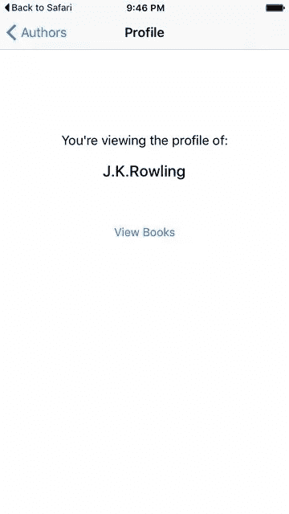
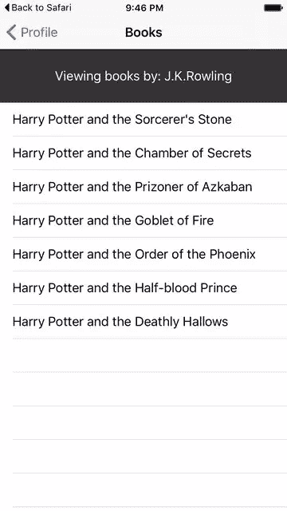
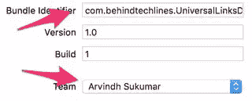
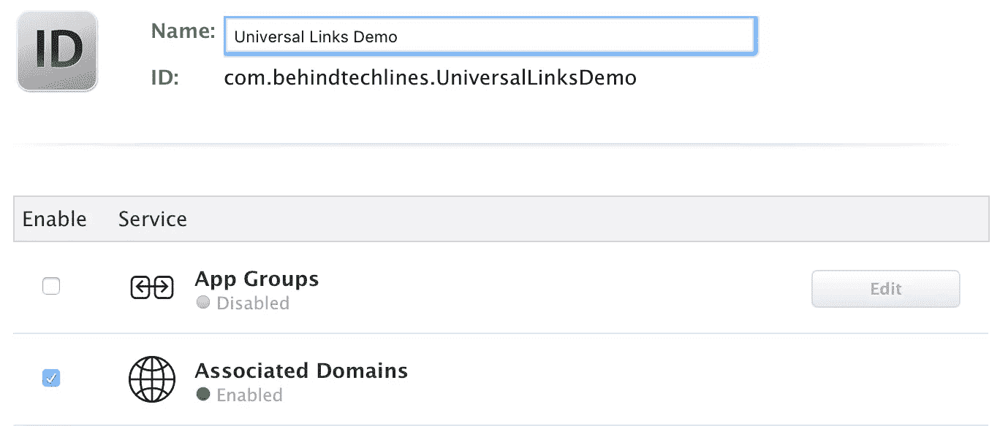
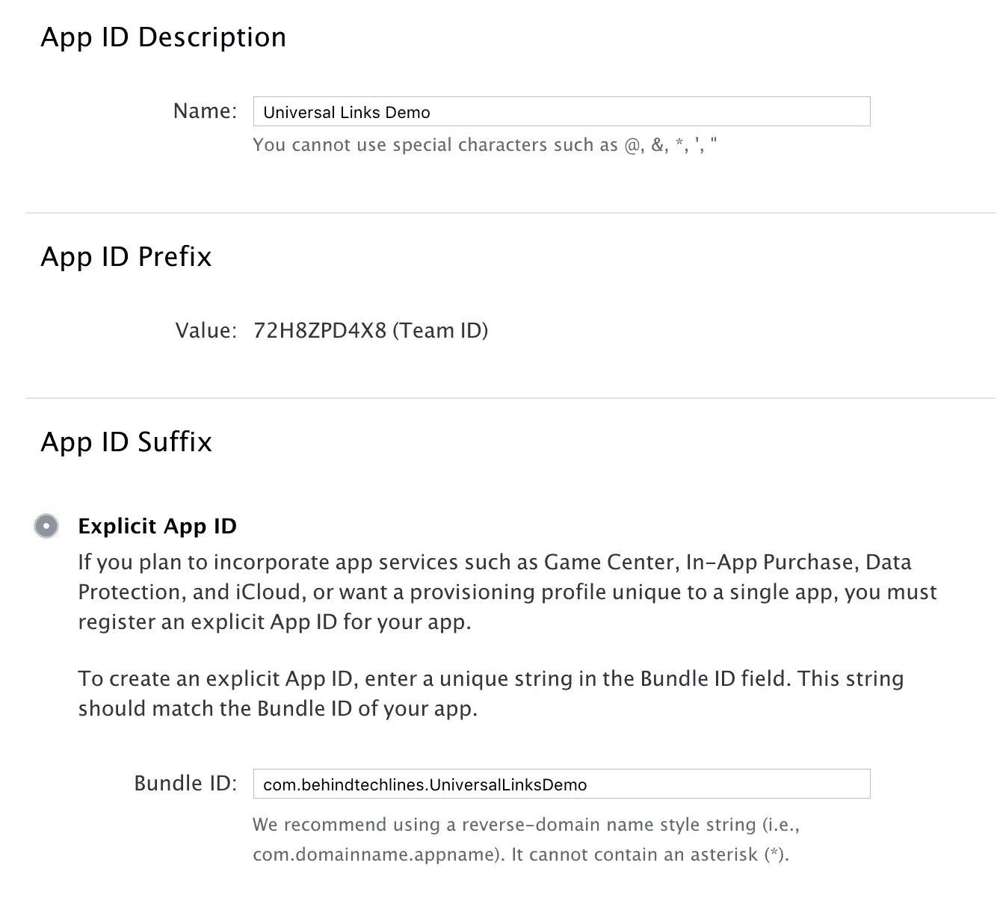
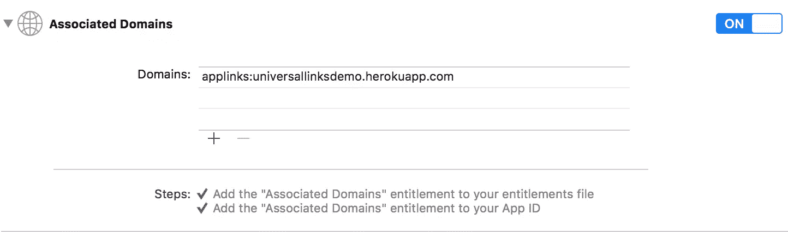
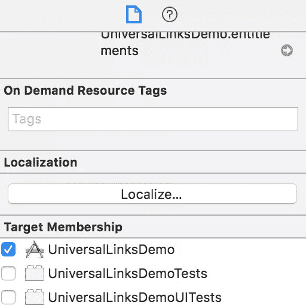

# iOS 通用链接实现无缝应用用户体验

> 原文：<https://www.sitepoint.com/ios-universal-links-for-a-seamless-app-user-experience/>

iOS 9 引入的更有趣的功能之一是[通用链接](https://developer.apple.com/library/ios/documentation/General/Conceptual/AppSearch/UniversalLinks.html)。在您的应用程序中支持此功能，可以在应用程序本身中无缝打开任何指向网络内容的链接。如果它不在设备上，系统会使用 Safari 打开链接。

这很棒，原因有很多:

*   您不必担心 URI 方案和记录支持的路线/路径。
*   这是安全的，因为苹果要求上传一个配置文件到你的服务器上(稍后会有更多)。因为你对此有控制权，所以其他应用程序将自己与你的链接联系起来的可能性很小。
*   路由到您的 web 内容的相同链接可以在您的应用程序上使用和解析。这使得共享内容更加容易。
*   回退*只是工作*，这意味着你不必担心应用程序可能无法安装的情况。

在这篇文章中，我将展示如何设置你自己的服务器，并在你的应用程序中处理相应的链接。

## 服务器设置

服务器应用程序将是一个简单的 Rails 应用程序，显示作者列表和他们的一些书籍。你最简单的入门方式就是在 Heroku 上克隆 app，点击下面的按钮就可以了。

[](https://heroku.com/deploy?template=https://github.com/sitepoint-editors/UniversalLinksDemo-Web)

如果你不想选择这个选项，你也可以通过在 [Github](https://github.com/sitepoint-editors/UniversalLinksDemo-We) 上克隆应用程序并将其推送到你选择的主机来自己部署应用程序。

你可以在这里看到正在运行的应用[。默认情况下，它显示作者列表。点击任何一个作者都会显示他们写的书的列表。](https://universallinksdemo.herokuapp.com)

### 应用程序站点关联文件

仅仅有一个在线运行的服务器是不够的。为了安全地将您的 iOS 应用程序与服务器关联，苹果要求您提供一个名为*Apple-app-site-association*的配置文件。这是一个 JSON 文件，描述了域和支持的路由。

在*https://{ domain }/apple-app-site-association*中，*apple-app-site-association*文件需要通过 HTTPS 访问，无需任何重定向。

**注意**:根据你使用的网络应用和框架，你可能需要在你的网络应用上设置路线来处理上述路径。

该文件如下所示:

```
{
   "applinks": {
       "apps": [ ],
       "details": [
           {
               "appID": "{app_prefix}.{app_identifier}",
               "paths": [ "/path/to/content", "/path/to/other/*", "NOT /path/to/exclude" ]
           }
       ]
   }
}
```

**注** : *。json* 不应该追加到文件名中。

这些键如下所示:

*   `apps`:应该有一个空数组作为它的值，并且它**必须**存在。这就是苹果想要的。
*   `details`:是一个字典数组，网站支持的每个 iOS 应用都有一个字典。每个字典都包含关于应用程序、团队和捆绑包 id 的信息。在示例应用程序中，是`72H8ZPD4X8.com.behindtechlines.UniversalLinksDemo`和应用程序支持的路径。

```
{
"applinks": {
  "apps": [],
  "details": [
    {
      "appID": "72H8ZPD4X8.com.behindtechlines.UniversalLinksDemo",
      "paths": [
        "/authors",
        "/authors/*/books",
        "/authors/*"
      ]
    }
]
}
}
```

定义路径有三种方式:

*   **Static** :整个支持的路径被硬编码以标识特定的链接，例如 */static/terms*
*   **通配符**:一个`*`可以用来匹配动态路径，比如 */authors/** 可以匹配到任何作者页面的路径。`?`内部特定路径组件，例如 *authors/1？*可用于匹配任何 ID 以 1 开头的作者。
*   **排除**:在路径前加上`NOT`会将该路径排除在匹配之外。

路径在数组中的顺序很重要。较早的索引具有较高的优先级。一旦路径匹配，评估就停止，其他路径被忽略。每个路径都区分大小写。

#### 支持多个域

应用程序支持的每个域都需要提供自己的*apple-app-site-association*文件。如果每个域提供的内容不同，那么文件的内容也将改变以支持各自的路径。否则，可以使用相同的文件，但是它需要在每个支持的域中都可以访问。

**注意**:这意味着如果你需要在你的应用程序中同时支持【example.com】的*和*的[www.example.com](http://www.example.com)的*，那么关联文件应该可以在这两个域中访问。*

#### 签署应用程序站点关联文件

如果您的应用程序面向 iOS 9，并且您的服务器使用 HTTPS 来提供内容，则您不需要对文件进行签名。如果不是(例如，当在 iOS 8 上支持[移交](https://developer.apple.com/handoff/)时)，则必须使用来自公认的认证机构的 SSL 证书对其进行签名。

**注**:这是**而不是**苹果提供的向 app Store 提交你的 App 的凭证。它应该由第三方提供，建议您使用与 HTTPS 服务器相同的证书(尽管这不是必需的)。

要签署文件，首先创建并保存一个简单的*。txt* 版的吧。接下来，在终端中运行以下命令:

```
cat <unsigned_file>.txt | openssl smime -sign -inkey example.com.key -signer example.com.pem -certfile intermediate.pem -noattr -nodetach -outform DER > apple-app-site-association
```

这将输出当前目录中的签名文件。*example.com.key*、*example.com.pem*和 *intermediate.pem* 是您的认证机构提供给您的文件。

**注意**:如果文件没有签名，那么它应该有一个`application/json`的`Content-Type`。否则，应该是`application/pkcs7-mime`。

## 应用程序设置

接下来是应用程序，它镜像服务器。它将针对 iOS 9，并将使用 Xcode 7.2 和 Swift 2.1。

该应用程序将与服务器对话，并显示以下内容:

*   **作者列表**:在服务器上调用 */authors.json* 会得到数据。
*   作者简介:点击作者时调用。这种情况下的端点是 */authors/:id.json* 。
*   **一个作者的书籍列表**:可从 */authors/:id/books.json* 获得。

app 代码可以在 [Github](https://github.com/sitepoint-editors/UniversalLinksDemo-iOS) 上找到。

这是应用程序的外观:






### 重要–需要更改

如果您打算创建自己的示例服务器实例并克隆 iOS 示例应用程序，请进行以下更改:

*   将捆绑包 ID 更改为将在会员中心的应用 ID 中使用的内容。
*   该团队应该是与您的开发人员帐户相关联的团队。
*   在 *AppDelegate.swift* 中的`kBaseURL`应该指向你的 web 服务器实例。
*   用你的 App ID 前缀和后缀更新 Rails app 上的 */public/association.json* 。



### 启用通用链接

应用程序端的设置需要两件事:

*   配置应用程序的权限，并启用通用链接。
*   处理 AppDelegate 中的传入链接。

#### 配置授权

配置应用授权的第一步是为你的应用 ID 启用授权。在[苹果开发者会员中心](https://developer.apple.com/membercenter/)做这件事。

点击*证书、标识符&配置文件*，然后点击*标识符*。选择您的应用 ID(如果需要，首先创建它)，点击*编辑*并启用*关联域名授权*。



接下来，通过点击相应的应用 ID 来获得应用 ID 前缀和后缀。



应用 ID 前缀和后缀应该与*apple-App-site-association*文件中的匹配。

接下来在 Xcode 中，选择你的应用的目标，点击*功能*，并在上将*关联域*切换到*。为您的应用程序支持的每个域添加一个条目，前缀为`applinks:`。*

**例如** : `applinks:www.example.com`和`applinks:example.com`。

示例应用程序如下所示:



**注意**:确保您选择了相同的团队，并输入了与会员中心上注册的应用 ID 相同的捆绑 ID。还要确保授权文件被 Xcode 包含，方法是选择该文件，并在*文件检查器*中，确保您的目标被选中。



#### 处理传入链接

*AppDelegate.swift* 中的`UIApplicationDelegate`方法中的`application:continueUserActivity:restorationHandler:`处理传入的链接。该方法给出了一个`NSUserActivity`对象，其`activityType`值为`NSUserActivityTypeBrowsingWeb`，属性`webpageURL`包含 URL。您解析这个 URL 以确定应用程序中的正确操作。

例如，在示例应用程序中:

```
let router = SHNUrlRouter()

func application(application: UIApplication, didFinishLaunchingWithOptions launchOptions: [NSObject: AnyObject]?) -> Bool {

      bindRoutes()

      return true
  }

  func bindRoutes(){
    // Register routes that're handled

      let storyboard = UIStoryboard(name: "Main", bundle: nil)
      let root = self.window?.rootViewController as! UINavigationController

      router.register("/authors") { (params) -> Void in

          let list: AuthorsTableViewController = storyboard.instantiateViewControllerWithIdentifier("AuthorsTableViewController") as! AuthorsTableViewController

          root.pushViewController(list, animated: true)
      }

      router.register("/authors/{id}") { (params) -> Void in

          let profileVC: AuthorProfileViewController = storyboard.instantiateViewControllerWithIdentifier("AuthorProfileViewController") as! AuthorProfileViewController
          profileVC.authorID = Int(params["id"]!)
          root.pushViewController(profileVC, animated: true)
      }

      router.register("/authors/{id}/books") { (params) -> Void in

          let list: BooksTableViewController = storyboard.instantiateViewControllerWithIdentifier("BooksTableViewController") as! BooksTableViewController
          list.authorID = Int(params["id"]!)
          root.pushViewController(list, animated: true)
      }

  }

  func application(application: UIApplication, continueUserActivity userActivity: NSUserActivity, restorationHandler: ([AnyObject]?) -> Void) -> Bool {

      if userActivity.activityType == NSUserActivityTypeBrowsingWeb {
          let url = userActivity.webpageURL!
          self.router.dispatch(url)
      }

      return true
  }
```

[SHNURLRouter](https://github.com/shnhrrsn/SHNUrlRouter) 库匹配进入的链接并采取适当的行动。

#### 测试通用链接

如果您有自己的服务器实例正在运行并与您的应用程序相关联，您现在可以测试通用链接。

一般来说，在 Safari 中或在`UIWebView` / `WKWebView`的实例中点击任何支持的链接都应该会打开应用程序。一个很好的测试源是 Github repo 的 read me。您可以派生和编辑本文中的任何示例应用程序。

如果你没有自己的服务器，或者只是想看看它的运行情况，点击这里的链接。

**注意**:对于 iOS 9.2 及更低版本，这只会在设备上起作用。iOS 9.3(撰写本文时仍处于测试阶段)也支持模拟器。

您可以将链接保存在任何支持打开它们的应用程序中，例如 Telegram，并从那里继续。

**注意** : iOS 会记住用户在打开通用链接时的选择。如果他们点击右上角的面包屑来打开 Safari 中的链接，所有进一步的点击都会将他们带到 Safari，而不是应用程序。他们可以通过选择网站上应用横幅中的*打开*切换回默认打开应用。

## 结论

仅此而已。代码不多，但配置很多。一个关键的要点是，你需要控制你自己的服务器来支持通用链接。如果你这样做了，这是把你的用户从你的网站转移到你的应用的最好方法。

任何问题或意见，请在下面告诉我。

## 分享这篇文章