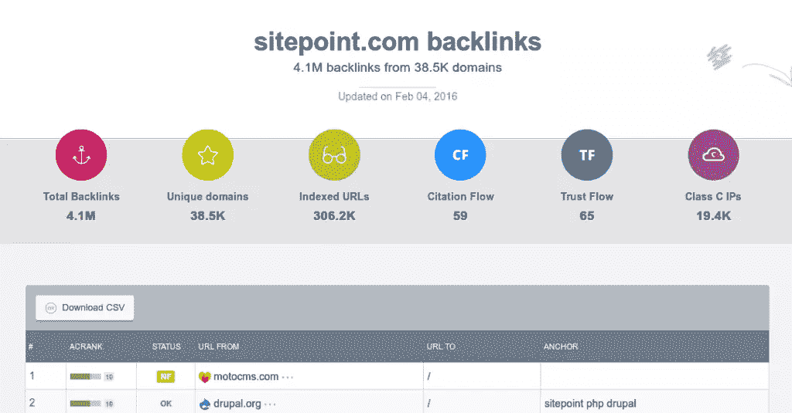

# 为什么你的链接建设结果令人沮丧的 7 个原因

> 原文：<https://www.sitepoint.com/7-reasons-why-your-link-building-results-are-frustrating/>

你在反向链接方面做得很好，但你的结果令人失望。你的策略会有什么问题？你怎么解决它？

即使是搜索引擎优化新手也知道反向链接是 SEO 成功的关键因素。我们大多数人也知道，重要的是链接质量，而不是数量。

我假设你们没有人应用批量链接建设策略，或者更糟的是，为链接付费。你确实保持你的链接建设行为干净，不做[链接方案](https://support.google.com/webmasters/answer/66356?hl=en)，但仍然发现你的排名令人失望。

## 定义‘高排名’！

排名可能在很多方面令人失望。当然，如果你不是你关键词的第一结果，很明显你总是可以做得更好，但是这是给你的排名贴上“令人失望”或“令人沮丧”标签的理由吗？

在我们继续解释为什么你的链接建设结果令人沮丧之前，我们需要澄清什么是“令人沮丧”。

第一，你如何定义‘高排名’？你能排多高？这是否总是热门关键词的首选结果？如果你(或你的客户)预料到这一点，并且不满足于任何低于这一点的东西，那么你真的有一个严重的问题——判断力。

当你成为热门关键词的首要结果时，这很好，但不幸的是，在实践中，这甚至不会发生在许多顶级网站上。简单地说，你的期望是不现实的，没有链接建设或任何其他搜索引擎优化活动可以帮助你获得如此高的排名。

当你对自己在搜索排名中能达到的目标有了现实的期望后，你需要坐下来想想你是否真的具备达到这个目标的条件。是的，你可能是竞争不那么激烈的关键词的第一名。如果你同意这个目标，这是可行的，那就去实现它吧。

如果你的目标是更多，坐下来分析你的机会。只有当你弄清楚什么是现实的期望，然后继续进行链接建设分析。想想在你目前的链接建设策略中，是什么阻碍了你达到目标。

有很多原因可以解释为什么你的反向链接很棒(至少在你看来是这样)，而你的排名是最重要的。以下是其中最常见的:

## 1.来自无关网站/页面的链接

你的成千上万的反向链接不起作用的最常见的原因是它们来自不相关的网站或页面。即使这些网站排名很高，如果它们与你的网站不相关，这些链接也没有帮助。在最好的情况下，谷歌只是忽略它们，但在最坏的情况下，这些链接被用来对付你。

很难说什么相关，什么不相关。因为我不知道任何直接来自谷歌的关于谷歌如何确定链接相关性的信息，你需要在这方面运用常识。

例如，如果你链接到一个 WordPress 模板页面，来自任何网页设计/开发博客的链接应该是相关的。当然，如果你链接的网站/页面仅仅是关于 WordPress 的，或者更好的 WordPress 模板，那是最好的。

一些搜索引擎优化专家推测，谷歌已经收紧了他们的相关性要求，一个来自一般网页设计/开发博客的链接不再相关，但因为我不知道谷歌有什么可以证实这一点，我建议我们不要相信它，干脆忽略它。

## 2.来自低质量网站的链接

你的链接可能与你的内容相关，但如果它们来自一个低质量的网站(如谷歌和常识标准所认为的)，这又会损害你的排名。任何环节都很重要的日子已经一去不复返了。现在，排名和来源的可信度非常重要。

不幸的是，低质量的网站没有统一的定义。一般来说，一个内容差、排名低的网站被 Alexa、T2、PR 和其他网站排名服务认为是低质量的。

链接农场是获得反向链接的最糟糕的地方之一。然而，即使网站不是一个链接农场，如果它有大量的出站链接，这对你来说是不好的。

低质量网站的另一种情况是当一个好网站变坏的时候。很有可能一个网站在链接到你的时候是好的，但后来这种情况发生了变化。在这种情况下，您可能需要联系该网站的网站管理员，要求删除该链接。或者，你可以在你的[谷歌网站管理员工具](https://support.google.com/webmasters/answer/2648487?hl=en)中告诉谷歌取消这个网站的链接。

## 3.低域多样性

如果你认为当你的链接只来自相关的高质量网站时，你是安全的，事实并非如此。如果你的数千个链接只来自几个领域——即使它们排名很高且相关——这也会造成伤害。

原因很简单。当你的链接只来自几个域名时，这告诉谷歌你只受这些网站的欢迎。这就是为什么最好有，比方说，5 或 10 个来自一个域的链接，但有数百个域链接到你，而不是有数千个来自几个域的链接。查看我们的[域名多样性简介](https://checker.monitorbacklinks.com/seo-tools/free-backlink-checker/sitepoint.com)了解什么是好的域名多样性:

## 4.垃圾锚文本

反向链接的锚文本与链接的来源一样重要，如果不是更重要的话。当你的锚文本有你的关键词，这对谷歌来说意义重大。

然而，由于锚文本的重要性，它很快被误用，甚至滥用。这迫使谷歌改变了它的算法，现在有一个“点击这里”，或“检查这个”，或你的网站名称作为锚文本比使用所有的反向链接关键字更安全。

如果你的反向链接中有可疑的百分比有相同/相似的锚文本，这就叫操纵，谷歌会处罚你。为了安全起见，尽可能使用多样化的锚文本。

## 5.页面上链接的位置

页面上链接的位置也很重要。当链接总是在页脚(或侧边栏)和在内容中时，会有很大的不同。

当链接位于页面内容本身内部并且自然流动时(即，它是文本逻辑结构的一部分，看起来不像是人为放置在那里的)，这个链接最有价值，因为它更独特。与域多样性类似，内容中的一个链接在页脚和侧边栏中的权重超过数百个。

## 6.技术问题

技术问题经常被低估为 SEO 问题的来源。你的网站可能存在技术问题，比如频繁的停机时间、可用性和可访问性问题、断开的链接、混乱的导航等等。防止谷歌机器人抓取你的网站，从而损害你的排名。这就是为什么必须解决你所知道的任何技术问题。

另一方面，链接站点可能存在技术问题，这会对您造成伤害。这些包括再次停机，断开链接，或只是链接蜘蛛不能/不跟随，如无跟随链接。在这种情况下，链接根本不存在搜索引擎优化的目的。

不幸的是，在这种情况下你无能为力，因为你不是其他网站的站长。唯一值得安慰的是，有了真正好的网站，技术问题会很快得到解决，所以如果你的反向链接只来自好的网站，这应该不是什么问题。

## 7.其他搜索引擎优化因素

反向链接可能是一个非常重要的排名因素，但他们肯定不是唯一的一个。一个伟大的反向链接配置文件不能弥补其他方面的不足。

例如，如果你的网站有很大的页面问题，比如低关键词密度，或者相反——关键词填充——或者如果你的网站有过多的出站链接，所有这些都不能通过顶级的反向链接来补偿。

这同样适用于由于某种原因你的域名被列入黑名单。在这种情况下，没有链接建设的努力可以帮助，直到你找出原因被列入黑名单，并处理它。

最后，我必须提到排名差的一个更明显的因素——内容差。我想我们不是在谈论糟糕的内容，因为如果你的内容是不合格的，你就不应该有任何高排名的梦想，不管你的链接建设工作有多积极。

我知道你可以找到内容差但排名高的网站的例子，但基本上这不是标准，这个公式不应该工作。

## 结论

链接可能是好的 SEO 排名的一个非常重要的因素，但是如果做得不好，链接建设不仅不会带来结果，更糟糕的是，它会损害你的排名。

链接建设可能出错的方式有很多。在这篇文章中，我提到了最常见的，但不幸的是，名单并没有到此为止。

你需要不断地观察你的链接的状态，因为即使没有算法更新，一个好的链接也很可能一夜之间变坏，这真的会影响你的排名。

如果你主要从高排名和相关网站获得链接，这些链接在文本中，你的锚文本不是垃圾邮件，链接来自不同的域，你就在正确的轨道上。仍然不能保证你会成功，但这大大增加了你成功的机会。

## 分享这篇文章