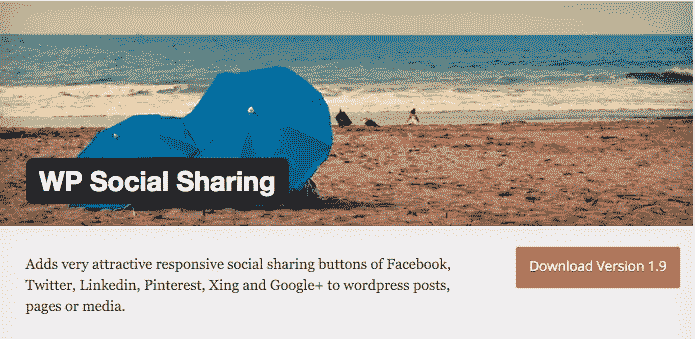
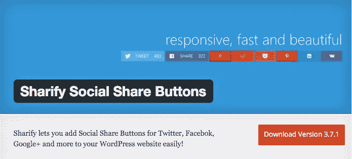
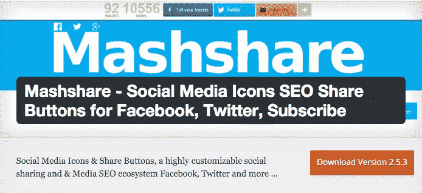
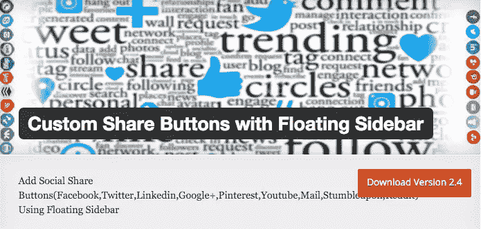
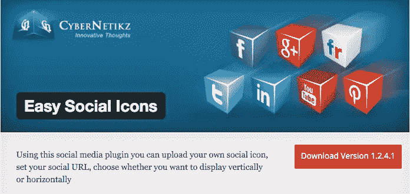

# WordPress 的 5 大响应社交分享插件

> 原文：<https://www.sitepoint.com/the-top-5-responsive-social-sharing-plugins-for-wordpress/>

越来越多的人每天通过他们的移动设备访问网络。开发响应式页面现在已经相当标准了，但是如果你想变得响应式，你必须全力以赴。

分享你的文章和页面的访问者有责任增加你网站的流量。为什么不引入响应式社交分享功能，让他们更容易地分享你的内容呢？

社交分享插件遍布于 [WordPress 插件目录](https://wordpress.org/plugins/)中，缩小几个与你的网站相匹配的插件是很困难的。在本文中，我们将深入评估 5 大响应性社交共享插件，并强调每个插件的突出特点。

## 对响应式社交共享插件的需求

WordPress 插件目录中评分最高的社交共享插件是响应式的，因为对于 web 开发者和网站管理员来说，将响应式设计元素整合到他们的网站中以增加用户体验是很重要的。

一旦从移动设备访问，没有响应的社交分享按钮(或任何没有响应的东西)最终会破坏你的网站的外观、优雅和可用性。对页面布局的干扰是你最小的问题；社交分享按钮可能会停止响应，缩小尺寸，或者降低网站速度。

根据最近的一项研究，去年超过三分之一的网页是通过移动设备访问的。用一个没有反应的社交分享插件来冒险增加你的网站流量和浏览量不是一个明智的决定。

让我们来看看 WordPress 的一些最好的、反应灵敏的社交分享插件。

## [WP 社交分享](https://wordpress.org/plugins/wp-social-sharing/)

WP 社交共享是一个免费的轻量级插件，可以让你添加自定义 CSS 和 JavaScript。这不仅是一个简单易用的插件，而且还拥有 100%响应的社交分享按钮。

**功能**
该插件使用 CSS3 来创建按钮，而不是图像。当较小尺寸(宽度小于 480 像素)的移动设备访问页面或帖子时，全尺寸按钮会自动转换为单个图像来显示图标。

用户可以集成、Google+、LinkedIn、Twitter、Xing 和 Pinterest 的社交媒体按钮。它可以让你自定义图标显示的文本，并按照你喜欢的方式重新排序。

使用这个免费插件，你不需要成为一个专业的网络开发者。WP 社会共享插件可以很容易地与任何主题集成使用方便的短代码。

**优点**

*   100%响应
*   短代码集成
*   CSS3 按钮

**缺点**

*   有限的定制选项
*   仅六个社交媒体网站的按钮

如果你正在寻找一个简单的解决方案，WP 社交分享是一个很棒的免费插件。它不会让你疯狂定制或尝试不同的颜色、尺寸和形状。如果你能在定制选项上妥协，那么这是一个值得考虑的好选择。

## [分享社交分享按钮](https://wordpress.org/plugins/sharify/)

Sharify 社交分享按钮是设计精美的社交分享按钮，免费提供高级外观。你的访客可以通过这个插件在九个不同的社交媒体平台上分享你的帖子。

这个免费插件自诩为 WordPress 最快的共享解决方案。它提供了额外的功能，如管理面板和每周更新，让网站管理员更好地控制它。

**功能**
Sharify 社交分享按钮让你为 Twitter、脸书、Google Plus、Reddit、Pocket、LinkedIn、Pinterest、Email 和 VKontake 添加按钮。如果你不想要一些，你可以把它们藏起来。Sharify 社交分享按钮还显示用户在 Twitter、脸书、Google+和 LinkedIn 上分享页面或帖子的次数。

自定义选项仅限于更改共享按钮的颜色。大多数人不会觉得这是个问题，因为默认情况下按钮是如此吸引人，以至于你不想改变它们的外观。Sharify Social Share 提供的短代码支持使得向帖子和页面添加按钮变得更加容易。

Sharify Social Share Buttons 是 WordPress 最快的共享解决方案，它归功于缓存。该插件允许您从管理面板启用共享计数缓存，并更改缓存持续时间。缓存大大降低了服务器的负载，这使得你的页面加载速度更快，给你的网站带来了它所需要的性能提升。

**优点**

*   九个社交媒体平台的按钮
*   缓存共享计数
*   SSL 支持

**缺点**

*   有限的定制选项

**底线**
Sharify Social Share Buttons 非常适合那些希望获得免费社交分享解决方案的人，这种解决方案提供了反应灵敏的按钮和优雅的设计。如果你在寻找一个更加可定制的插件或者一个可以让你添加自定义 CSS 的插件，那么你必须继续寻找。

## [Mashshare](https://wordpress.org/plugins/mashsharer/)

那些不想投资一个高级社交分享插件，但是想要所有好东西的人应该考虑安装 Mashshare。这个免费的分享解决方案可以让你为几乎所有的社交媒体网站添加社交分享按钮。

**特色**
Mashshare 附带了大量的附加组件(付费和免费)，你可以用它们来制作你想要的社交分享按钮。你可能马上就要安装的一个免费插件可以让你的按钮做出反应。

使您的共享按钮具有响应能力的附加组件背后的功能是，当检测到尺寸较小的设备时，它会自动减小按钮的宽度，从而优化按钮的尺寸。如果需要，它还允许您删除总股份计数器和文本描述。

这个插件去掉了所有附加组件，有一个计数器，显示你的帖子到目前为止的分享总数，旁边有一个社交分享按钮的水平栏。

Mashshare 的与众不同之处在于，它允许您为电子邮件列表和新闻提要添加订阅按钮。该插件对开发者友好，支持非技术型网站管理员的短代码。

**优点**

*   可通过各种附件进行扩展
*   高度可定制
*   对象和临时缓存
*   高分辨率共享按钮

**缺点**

*   显示社交媒体分享总数
*   高级附加组件

**底线**
Mashshare 将会是我个人最喜欢的免费的 WordPress 社交分享插件。从反应灵敏的高分辨率分享按钮到缓存，它几乎什么都有。

## [带有浮动侧边栏的自定义分享按钮](https://wordpress.org/plugins/custom-share-buttons-with-floating-sidebar/)

带有浮动侧边栏插件的自定义分享按钮有免费和高级两种，但我们将在本文中讨论免费的解决方案。

带有浮动侧边栏插件的自定义共享按钮与 lightbox 联系人表单和浮动侧边栏集成在一起，这两者在高级版本中都有响应。这个轻量级插件支持七个完全可定制的社交媒体平台。

**功能**
首先是带有浮动侧边栏插件的自定义分享按钮，支持脸书、Twitter、LinkedIn、Pinterest、Google+、StumbleUpon 和 Reddit 按钮。您可以通过更改每个按钮的背景颜色来自定义它们，并添加您选择的图像。

这个插件允许你篡改文本描述，设置按钮和浮动工具条的位置。有一些选项可以禁用小尺寸移动设备的侧边栏，并帮助管理插件的设计。

该插件的高级版本支持响应浮动栏和灯箱。这个插件没有任何 JavaScript 文件来减慢你的站点速度。

**优点**

*   浮动工具条
*   高度可定制
*   七个社交媒体按钮

**缺点**

*   没有股票计数器
*   高级版中的响应式浮动侧边栏和灯箱

**底线**
带有浮动侧边栏的自定义分享按钮是一个高度可定制和花哨的分享解决方案，但它没有涵盖我们大多数人在社交分享插件(如分享计数器)中渴望的一些更重要的功能。

## [简易社交图标](https://wordpress.org/plugins/easy-social-icons/)

简单的社交图标可以让你在你的网站上添加社交媒体按钮，而不用改变它们的默认外观。你们中的一些人可能不认为这是一个大问题。毕竟，默认图像更容易立即识别。

**功能**
简单的社交图标与响应迅速的网站无缝协作。该插件提供有限的定制选项，让您设置社交媒体按钮的宽度和方向。

社交媒体按钮可以水平显示在页面上，也可以垂直向下显示，这取决于页面的主题和设计。该插件还有一个小部件，可以让你将按钮添加到工具条中。

Shortcode integration 让您可以轻松地将按钮集添加到任何帖子或页面中。您还可以通过简单地将按钮拖放到正确的顺序来重新排列它们。

**优点**

*   使用方便
*   水平和垂直方向
*   小部件和短代码集成

**缺点**

*   有限的可定制性
*   没有股票计数器

**底线**
Easy Social Icons 插件是社交分享插件系列中较为简单的一个。可定制性仅限于改变按钮的方向，但是您可以使用内置的小部件将它添加到站点的侧边栏中。

## 结论

事实是，越来越多的人使用移动设备访问网络，一个完全响应的网站现在比以往任何时候都更重要。在转移到一个响应性网站的过程中，省略一些功能不再是一种选择。

正如 Drazen Prastalo 在他的文章[社交分享 WordPress 插件优化移动版](https://www.sitepoint.com/social-sharing-wordpress-plugins-optimized-for-mobile/)中所强调的，当你选择一个社交分享插件时，有几件事你必须记住——设计、功能和速度。

我们在这篇文章中讨论了 5 大免费的、响应性强的社交分享插件，重点是 Drazen 的评估标准。写这篇文章是为了帮助你通过采用响应式社交分享插件开始向响应式网站转变。

你目前在你的网站上使用哪个社交分享插件？就设计、功能和速度而言，你认为哪些是最好的？请在下面的评论区告诉我们。

## 分享这篇文章