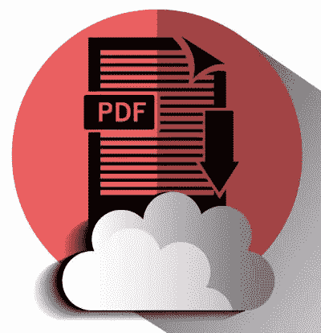
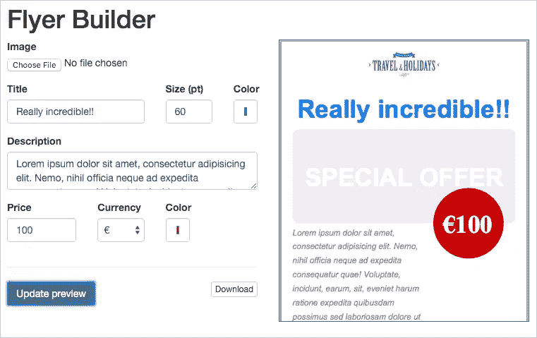

# 用 jsPDF 动态地从网页生成 PDF

> 原文：<https://www.sitepoint.com/generating-pdfs-from-web-pages-on-the-fly-with-jspdf/>



便携式文档格式已经成为桌面出版和办公自动化领域的主要创新之一。

它也广泛应用于网络出版，但不幸的是经常以错误的方式使用——比如用它来替换本应由 HTML 构建的内容。这导致了许多关于可用性、可访问性、SEO 等等的问题。

但是，在某些情况下需要 PDF 文件:当一个文档需要存档并且必须在 web 之外使用时(例如发票)，或者当您需要对打印进行深度控制时。

正是出于控制打印的需要，我开始研究一种轻松生成 PDF 的方法。

本文的目的不是简单地解释如何创建 PDF(有许多简单的方法可以做到这一点)，而是关注 PDF 文件可以解决问题的情况，以及像 jsPDF 这样的简单工具如何帮助解决这个问题。

## 处理打印

任何与 CSS 打印规则打过交道的人都知道，要实现相当好的跨浏览器兼容性有多难(例如，看看我可以使用的网站上的[分页符支持表](http://caniuse.com/#search=page-break))。所以，当我需要构建必须打印的东西时，我总是尽量避免使用 CSS，最简单的解决方案就是使用 PDF。

我这里说的不是 HTML 到 PDF 的简单转换。(我已经尝试了几个那种类型的工具，但是没有一个让我完全满意。)我的目标是完全控制元素的位置和大小、分页符等等。

过去我经常使用 FPDF，这是一个 PHP 工具，可以很容易地给你这样的控制，并且可以很容易地用许多 T2 插件进行扩展。

不幸的是，这个库似乎被放弃了(它的最后一个版本可以追溯到 2011 年)(更新:[实际上，最新的版本似乎来自 2015 年 12 月](http://www.fpdf.org/en/download.php))，但多亏了一些 JavaScript 库，我们现在能够直接在客户端构建 PDF 文件(从而使它们的生成更快)。

几个月前，当我开始我的项目时，我搜索了一个 JS 库，最终我找到了两个候选库: [jsPDF](http://mrrio.github.io/jsPDF/) 和 [pdfmake](http://pdfmake.org) 。pdfmake 似乎有很好的文档，并且非常容易使用，但是因为它是测试版，所以我决定使用 jsPDF。

## 用 jsPDF 构建 PDF

jsPDF 文档相当简单，由一个页面和一些演示组成，在源文件中(或者在它的 T2 jsDoc 页面中)有更多的信息，所以请记住，在复杂的项目中使用它在开始时会有点困难。

无论如何，jsPDF 是非常容易的基本 PDF 文件生成。看一个简单的“Hello World”示例:

```
<!DOCTYPE html>
<html lang="en">
<head>
    <meta charset="utf-8">
    <title>Hello world</title>
</head>
<body>
    <h1>Hello world</h1>
    <script type="text/javascript" src="https://cdnjs.cloudflare.com/ajax/libs/jspdf/1.0.272/jspdf.debug.js"></script>
    <script type="text/javascript">
        var pdf = new jsPDF();
        pdf.text(30, 30, 'Hello world!');
        pdf.save('hello_world.pdf');
    </script>
</body>
</html>
```

该 HTML 页面生成一个单页 PDF 文件，并将其保存在您的计算机上。首先，您必须链接到 jsPDF 库(在本例中，来自[cdnjs.com](https://cdnjs.com/libraries/jspdf))，然后创建一个 jsPDF 实例，添加一行文本，并将结果保存为`hello_world.pdf`。

请注意，我使用的是 1.0.272 版本，这不是最新的:在撰写本文时，最新的版本是 1.1.135，但是它有许多问题，所以我仍然使用以前的版本。

您可以看到构建一个基本的 PDF 文件是多么简单(您可以在 jsPDF 站点找到更多的例子)。

让我们试着建造一些更难的东西。

## 传单项目

几个月前，我被要求开发一个应用程序来创建一些简单的传单。这是一个更大的项目的一部分，该项目为旅行社处理一些服务，真正的传单部分由一些 JSON 数据填充。

该传单的主要目的是提供一种简单的方式来展示旅行社商店橱窗中的特价商品。

在本文中，我重新安排了应用程序，删除了所有服务器端功能，简化了传单设计，消除了遗留浏览器兼容性，并使用 Bootstrap 3 和 jQuery 构建了一个非常简单的 UI。

该演示与 Firefox 和 Chrome 配合良好，而 Explorer(或 Edge)不允许显示预览，只能下载生成的 PDF。

这是一个用应用程序创建的 PDF 的例子(图片来源:[Rafael Leo/Unsplash](https://images.unsplash.com/photo-1415931633537-351070d20b81?q=80&fm=jpg&s=fb26af809d5b68ba0d269eaf41f7816c)


在本文的结尾或者直接在 [CodePen](http://codepen.io/SitePoint/pen/rxPNpG) 中有一个功能演示。请注意，由于 CodePen 在 iframe 中加载结果页面，PDF 预览——也在 iframe 中加载——在 Chrome 和 Safari 中存在一些问题，导致预览无法显示。(可以的话用火狐，或者试试我个人网站上的[演示](http://primominuto.altervista.org/articoli/pdf_flyer/flyer.html)。

## 传单生成器

用户界面允许用户插入一些基本数据(标题、摘要和价格)。可选地，可以添加图像，否则显示灰色框<q>特价</q>标题。

其他数据(机构名称及其网站 URL 和徽标)嵌入在应用程序代码中。



PDF 可以在 iframe 中预览(Explorer 或 Edge 除外)或直接下载。

当点击<q>更新预览</q>或<q>下载</q>按钮时，使用 jsPDF 生成 PDF，并作为数据 URI 字符串传递给 iframe 或保存到磁盘，如上例所示。

PDF 生成首先用这些选项创建一个新的 jsPDF 对象实例:纵向(`p`)、毫米单位(`mm`)、‘A4’格式。

```
var pdf = new jsPDF('p', 'mm', 'a4');
```

使用`addImage`功能添加图像。请注意，放置在 PDF 页面中的每个对象都必须准确定位。你必须使用声明的单位来处理每个对象的坐标。

```
// pdf.addImage(base64_source, image format, X, Y, width, height)
pdf.addImage(agency_logo.src, 'PNG', logo_sizes.centered_x, _y, logo_sizes.w, logo_sizes.h);
```

图像必须是 Base64 编码的:代理徽标以这种格式嵌入脚本中，而用户加载的图像使用`$('#flyer-image').change`监听器中的`readAsDataURL`方法进行编码。

使用`textAlign`功能添加标题。注意，这个函数不是 jsPDF 核心的一部分，但是，正如作者在他的例子中所建议的，这个库可以使用它的 [API](https://mrrio.github.io/jsPDF/doc/symbols/jsPDF.html#.API) 很容易地扩展。您可以在传单生成器脚本的顶部找到`textAlign()`功能:

```
pdf.textAlign(flyer_title, {align: "center"}, 0, _y);
```

该函数计算文本字符串的 X 坐标，使其居中，然后调用本机`text()`方法:

```
pdf.text(text string, X, Y);
```

要更改文本属性，您可以使用`setFontSize()`、`setFont()`、`setTextColor()`和`setFontType()`方法。

例如，要设置 20 磅倍的红色粗体字符串，您需要键入以下内容:

```
pdf.setFontSize(20);
pdf.setFont("times");
pdf.setFontType("bold");
pdf.setTextColor(255, 0, 0);
pdf.text(10,10, 'This is a 20pt Times Bold red string');
```

<q>特价</q>灰箱和价格圈使用两种类似的方法:`roundedRect()`和`circle()`。它们都需要左上角坐标、大小值(第一种情况是宽度和高度，第二种情况是半径):

```
pdf.roundedRect( X, Y, width, height, radius along X axis, radius along Y axis, style);
pdf.circle( X, Y, radius, style);
```

`style`参数是指对象的填充和描边属性。有效的样式有:`S`【默认】描边、`F`填充、`DF`(或`FD`)填充和描边。

必须使用`setFillColor`和`setDrawColor`预先设置填充和描边属性，这需要 RGB 值和`setLineWidth`，这需要以 PDF 文档开始时声明的单位表示的线宽值。

完整的代码可在 CodePen 演示中找到:

在 [CodePen](http://codepen.io) 上通过 SitePoint ( [@SitePoint](http://codepen.io/SitePoint) )查看 Pen [PDF 传单生成器](http://codepen.io/SitePoint/pen/rxPNpG/)。