# Gmail 广告完全指南

> 原文：<https://www.sitepoint.com/the-complete-guide-to-gmail-ads/>

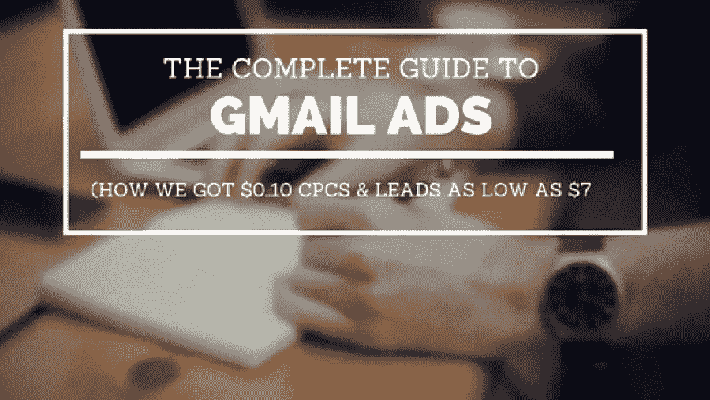
**(我们如何获得 0.10 美元的 CPCs &领先低至 7 美元)**

*本文最初发表于[增长无处不在](http://growtheverywhere.com/)。*

如果我说今天你仍然可以在 AdWords 中找到低于 0.15 美元的定向点击，会怎么样？

每次获取的点击量转换成本很低？

点击率高达 20%？

听起来很不可思议，对吧？看看这个:

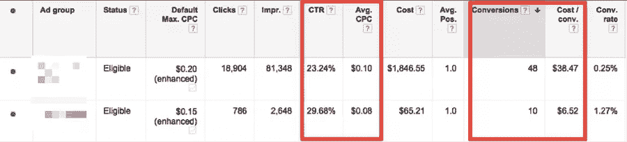

这是谷歌 Gmail 赞助的促销活动。他们最近把它带了回来，我们的团队已经测试过了，结果很棒。

以下是 Gmail 内部的一个示例:

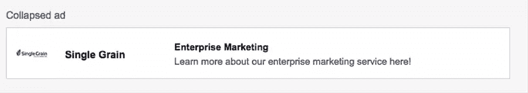

正如你在上表中看到的，我们得到的注册会计师数字低至 6.52 美元！我们的每笔收购目标成本(CPA)约为 80 美元，**因此 CPA 下降了 87.74%。**

你们中的一些人可能会想，“嗯，这些数字看起来不错，但是转换率和转换率似乎很低。”

**先说转化率:**

上图显示了 0.25%和 1.27%的转换率(CVR)——不是超级性感的数字，但要知道展示广告的转换率通常不如定向广告。只要你的每次点击成本低，点击量高，你就处于有利地位。

**现在来说说转化量:**

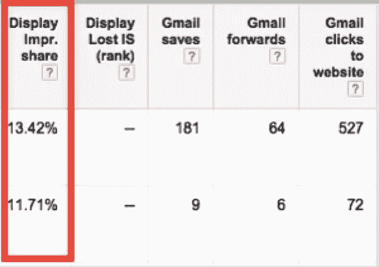

[显示印象份额](https://support.google.com/adwords/answer/2497703?hl=en)是指在您有资格获得的总估计印象数中，您已经获得的印象数。对于这些目标，看起来仍有增长空间。Gmail 推广广告最好的地方？有大量的目标选择，以帮助扩大你的活动。

在这篇文章中，你将学习如何建立 Gmail 赞助的促销活动以获得长期成功。

## 1.如何创建 Gmail 推广广告

首先，登录你的 AdWords 账户，参加你的任何活动。然后选择“广告”选项卡，点击“+广告”，并选择“广告图库”:

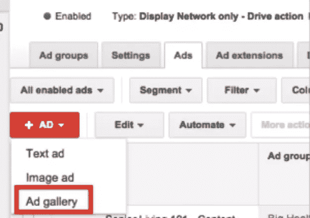

之后，选择“Gmail 广告”:

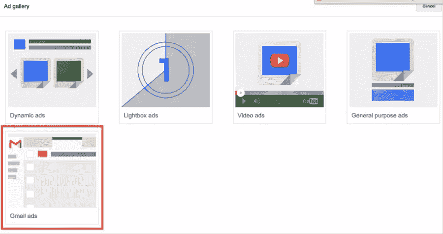

从那里，你有四个不同的广告选项可供选择。为了简单起见，让我们使用“Gmail 单一推广模板”:

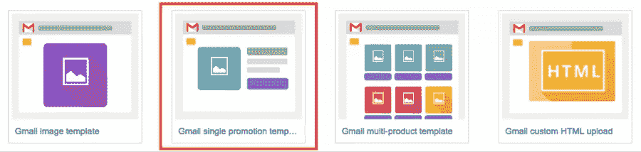

为了向你展示这有多简单，这里有一个我刚刚创作的广告的例子:

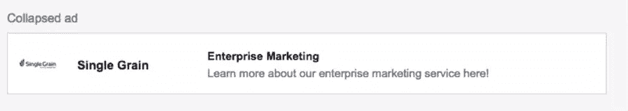

扩展形式:

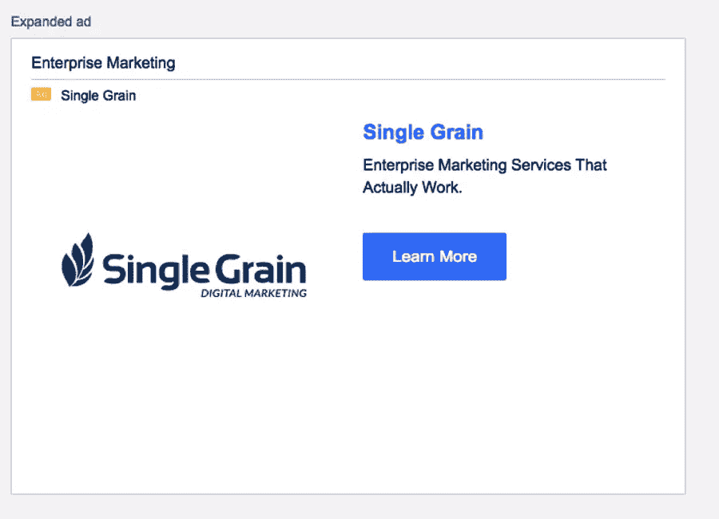

## 2.如何制作广告

有三个部分需要填写，但不要担心，这很简单！在第一部分，您将填写以下内容:

*   **广告名**–你想怎么称呼你的广告。这仅供内部使用。一个例子是“2018 年 1 月 1 日单一谷物企业营销广告”。
*   **显示 URL**–将向查看者显示的 URL(不一定是最终的 URL)。
*   **登陆页面**–将向查看者显示的最终 URL。提醒一下，别忘了在这里添加 UTM 标签用于追踪。

它看起来是这样的:

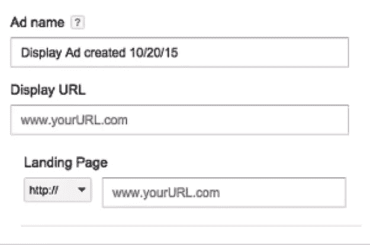

在第二部分，您将填写以下内容:

*   **徽标**–这是观众将在折叠(较小)的广告中看到的徽标。建议的尺寸是 144 像素 x 144px 像素的正方形图像。没有 logo？你可以用 [Canva](https://www.canva.com/) 或 [Pablo](https://buffer.com/pablo) 快速拍出好看的图像。
*   **广告商**–你公司的名字(或者你，如果你在宣传你自己的品牌)。
*   主题–这是你的标题。确保你写了一个[有吸引力的标题](http://www.copyblogger.com/magnetic-headlines/)来吸引人们点击！
*   **描述**–对您的报价的简短描述。

它看起来是这样的:

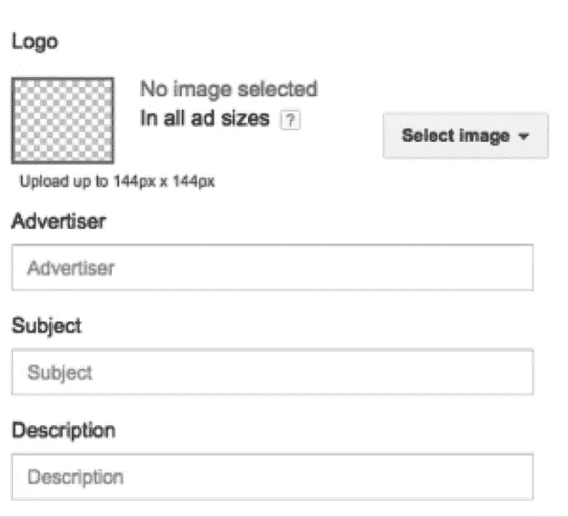

在第三部分，您将填写以下内容:

*   **图片**–将在您的扩展(更大)广告中使用的更大图片。上传一个 300 像素 x(200-500 像素)的文件。
*   **标题**–同上–确保你写了一个有吸引力的标题！
*   **内容**–你诱人的提议。
*   **行动号召按钮**-你让人们点击你的广告的最后机会。让它有价值。如果你需要想法，这里有一些来自 HubSpot 的很棒的 [CTA 例子。](http://blog.hubspot.com/marketing/great-call-to-action-examples)
*   **行动号召按钮 URL**–用户将登陆的最终 URL。
*   **页眉(可选)**–添加横跨广告的页眉图像(630px x 50-200px)。

当您满意时，点击顶部“保存”按钮旁边的“选择广告组”按钮，选择您想要放置广告的广告组。

## 3.重要设置

以下是我开始 Gmail 广告活动时喜欢使用的初始设置。请记住，您的里程会有所不同。

首先，点击“设置>所有设置”。关键设置:

*   **类型**–这是您正在开展的活动的类型。我选择“仅展示网络-推动行动”,因为我希望活动有针对性，并且我关心推动具体结果。
*   **交付方式(高级)**–这是您需要点击展开的部分。当我第一次开始时，我喜欢用“加速”的方式，这样我就可以尽可能快地收集尽可能多的数据。如果你的预算有限，就选“标准”吧。
*   频率上限(Frequency capping)——一般来说，我喜欢限制向观众展示广告的次数，但在这种情况下，我没有上限，因为我的参与度保持不变。
*   **广告轮换**–我从“平均轮换:在至少 90 天内更均匀地展示广告，然后优化”开始，这样我就能给我的两个竞争广告中的一个真正的机会脱颖而出。

## 4.如何拆分你的广告群

最有效的方法之一就是将你的广告组分成单个关键词广告组。这到底是什么意思？Unbounce 写了一个关于“如何正确使用 AdWords”的很棒的指南，我强烈建议在继续之前先看看。

简而言之，你的每个广告组将只有一个目标去追求。

举例来说，如果你是阿迪达斯，想跟踪那些打开耐克电子邮件的人，你可以在一个广告群中锁定 Nike.com，并针对 Nike.com 的电子邮件浏览者定制广告。

要设置目标，请点击“显示网络”并转到“显示关键字”:

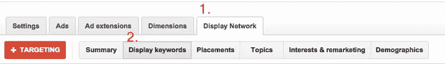

然后针对每个广告组，输入一个你想锁定的网站。它可能是一个竞争对手，一个组织，一个博客或者任何你能想到的东西。例如，如果我想做阿迪达斯的广告，我可以选择以下几个不同的类别:

*   直接竞争对手——耐克、彪马、Sketchers、安德玛
*   组织——瑜伽团体、徒步旅行团体、跑步团体
*   流行杂志/网站–competitor.com、menshealth.com
*   间接竞争对手–Lululemon、Gaiam

## 5.如何找到定位思路

**Google Display Planner**–这是一款免费工具，你可以用它来为热门网站、应用、视频、关键词等寻找放置创意。只需登录你的 AdWords 账户，点击“工具>展示策划”，你就可以进入了。

在下面的例子中，我输入 www.nike.com 作为我的登陆页面，然后点击“位置”标签来寻找我从未听说过的热门网站的创意:

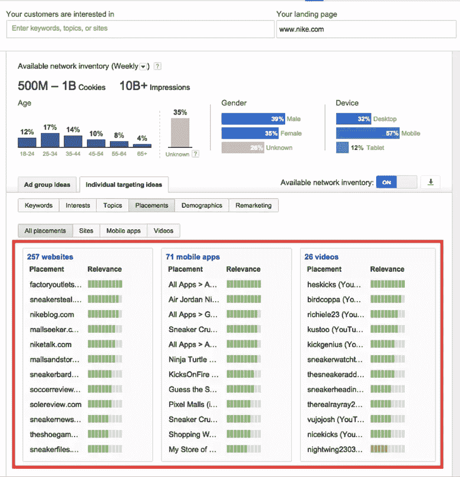

跳进那里玩一玩，你一定会找到一两个金块！

**脸书观众观察**–这是另一个免费工具，你可以在你的脸书账户中找到。你可以利用从 Google Display Planner 获得的数据来收集更多的信息。如果这些房产在谷歌和脸书都很受欢迎，那么它很有可能是黄金。

进入你的脸书广告账户，点击“工具>受众观察”。

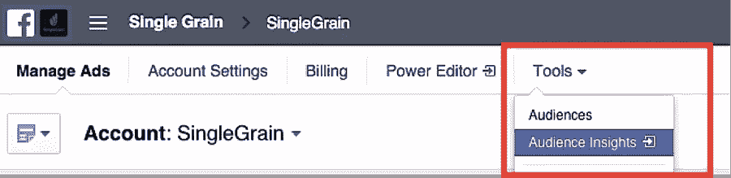

在下图中，我看了一下对 Copyblogger、Moz 和 Unbounce 感兴趣的人。特别是，我对找到与这三个兴趣相关的页面很感兴趣。然后，我可以将它们放入单独的 Gmail 广告组。

以下是如何开始了解受众的见解:

[https://www.youtube.com/embed/qy132skcqto](https://www.youtube.com/embed/qy132skcqto)

similar web–similar web 显示受众细分、流量趋势和参与度、相关移动应用和类似网站等洞察。为了这篇文章，我们对类似的网站和移动应用更感兴趣。你需要做的就是去类似的网站，输入你想分析的网站:

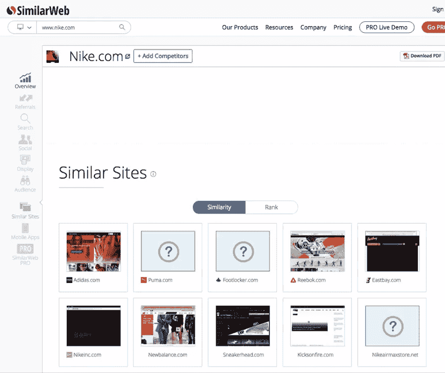

看一看:

*   类似网站
*   类似的移动应用
*   你看到的整个类别

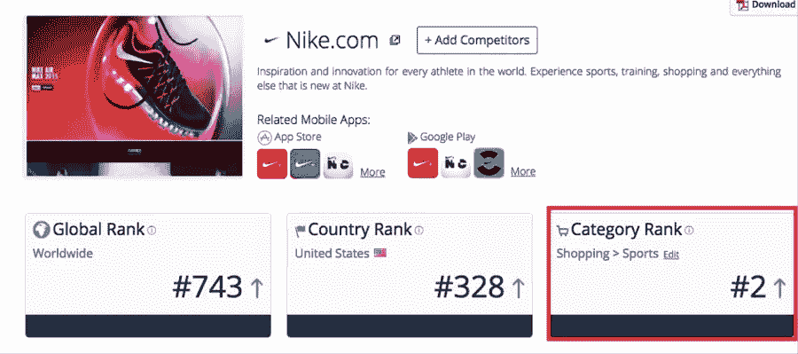

前面提到的三个免费方法应该足够让你入门了。

## 额外收获:使用 Gmail 广告进行内容推广

更多的内容营销人员已经使用脸书广告来加强他们的内容营销工作。

Gmail 广告是增加内容营销的另一种方式。你的收益可能会有所不同，但如果你已经在内容营销上投入了大量的精力，那么 0.10 美元一次的点击绝对值得一试。

如果你在做内容营销，而没有使用付费广告来帮助扩大你的努力，你就错过了。作为这方面的介绍，[数字营销人员](http://www.digitalmarketer.com/pixel-process-facebook/)在这里有一篇很棒的文章。

## 结论

如果你还没有尝试过，现在是时候给 Gmail 广告一个机会了。这可能是你的业务的下一个巨大的增长渠道！

## 分享这篇文章