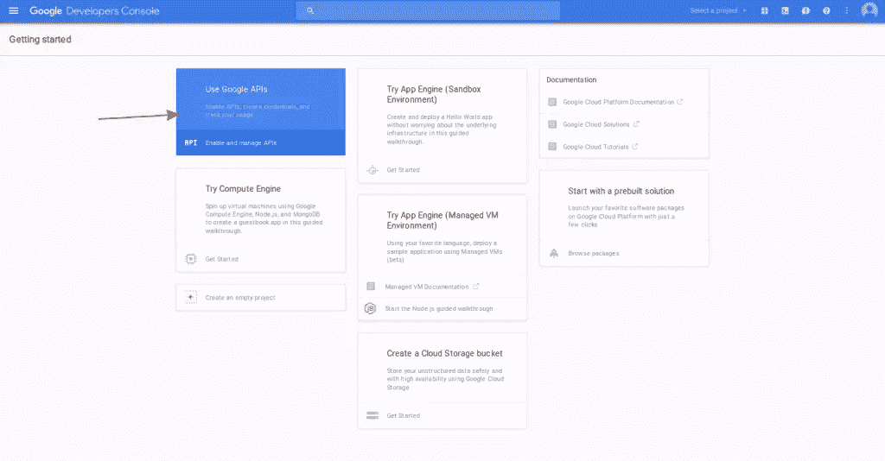
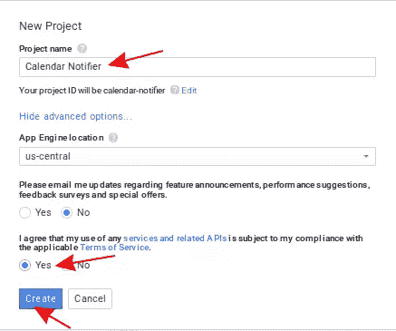
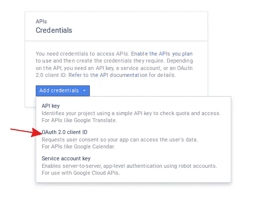
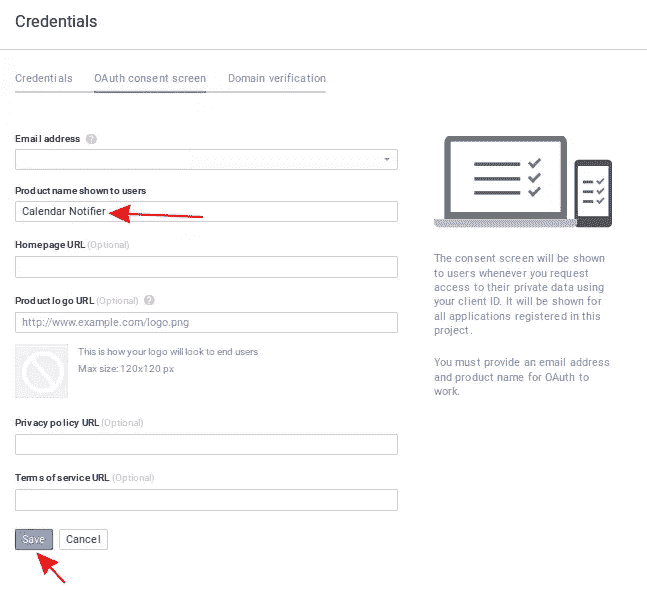
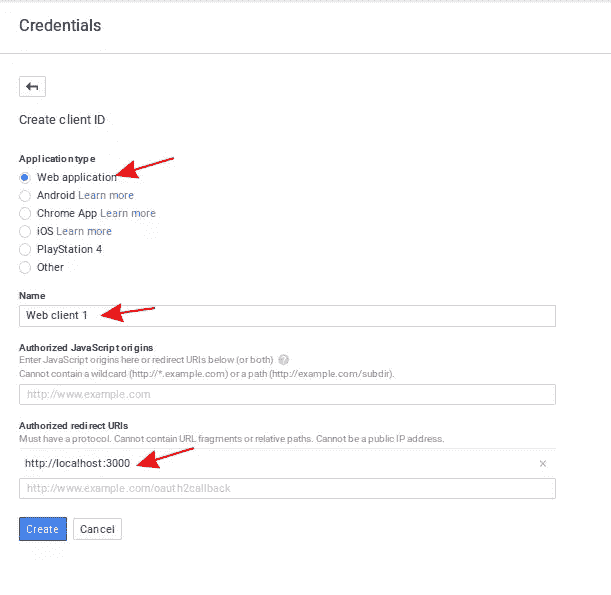

# 如何用 Twilio 搭建短信预约提醒 App

> 原文：<https://www.sitepoint.com/build-sms-appointment-reminder-app-with-twilio/>

*这篇文章由[马克·托勒](https://github.com/MarcTowler)和[布鲁诺·莫塔](https://www.sitepoint.com/author/bmota/)进行了同行评审。感谢 SitePoint 的所有同行评审员使 SitePoint 的内容尽可能做到最好！*

在本教程中，我们将使用 Node.js 构建一个短信提醒应用程序。我们将使用用户的谷歌日历来获取约会，然后使用 Twilio 发送短信。

与以往一样，您可以从 [github repo](https://github.com/sitepoint-editors/google-calendar-twilio) 中找到本教程中使用的代码。

## 设置事物

首先，你需要有一个谷歌账户和一个 Twilio 账户。如果你还没有这些，你可以去注册。以下是链接:

*   谷歌
*   [Twilio](https://www.twilio.com/try-twilio)

你不需要担心 Twilio，它可以免费试用。

### 谷歌控制台项目

一旦你有了一个谷歌账户，进入[谷歌控制台](https://console.developers.google.com/)并创建一个新的应用程序。默认情况下，谷歌控制台页面会显示你最近使用的应用的仪表盘。但是，如果您还没有从事任何项目，它会显示以下内容:



在这里，您可以点击右上角的`select project`菜单并选择`create a project`。这将打开一个模态窗口，允许您输入项目的标题。



创建项目后，将显示仪表板。从那里你可以点击`use Google APIs`，搜索谷歌日历 API 并启用它。


启用 API 后，它会要求您创建凭证。点击`Go to Credentials`开始设置。这将向您显示以下内容:



点击`Add credentials`按钮，然后选择`OAuth 2.0 client ID`。

这将要求您首先配置同意屏幕。点击`configure consent screen`。

为`Product name shown to users`文本字段输入一个值，并点击`save`。



完成配置后，您现在可以创建客户端 ID。选择`Web application`作为应用类型，保留默认名称(如果你愿意)，输入`http://localhost:3000/login`作为`Authorized redirect URIs`，然后点击`create`。



这将打开一个显示客户端 ID 和客户端密码的模式。现在记下这些，因为我们以后会用到它们。

### Twilio

一旦你创建了一个 Twilio 账户，进入[设置页面](https://www.twilio.com/user/account/settings)，记下`Live API Credentials`下`AccountSID`和`AuthToken`的值。

接下来转到 [`programmable voice dashboard`](https://www.twilio.com/user/account/voice/dashboard) 。这是你可以看到沙箱号码的地方。你可以用这个数字来测试 twilio。但是之后你需要[购买一个电话号码](https://www.twilio.com/user/account/voice/phone-numbers)，这样 twilio 发送的短信就不会添加*“从 twilio 沙箱发送”*。Twilio 沙盒号码的另一个限制是，它只能与经过验证的号码一起使用。这意味着你必须向 twilio 注册一个电话号码才能向它发送信息。从 [`manage caller IDs page`](https://www.twilio.com/user/account/phone-numbers/verified) 可以做到这一点。

## 构建应用程序

现在我们已经准备好构建应用程序了。在我们继续之前，我想简要介绍一下我们将如何实施该应用程序。将有三个主要文件:一个用于服务器，一个用于缓存来自 Google 日历的事件，一个用于提醒用户。服务器用于允许用户登录并获取访问令牌。事件将保存在 MySQL 数据库中，全局应用程序配置将添加到一个`.json`文件中。节点的 [`cron`](https://www.npmjs.com/package/cron) 实现将用于执行缓存事件和提醒用户的任务。

### 安装依赖项

在您的工作目录中，创建一个`package.json`文件并添加以下内容:

```
{
  "name": "google-calendar-twilio",
  "version": "0.0.1",
  "dependencies": {
    "config": "^1.17.1",
    "cron": "^1.1.0",
    "express": "^4.13.3",
    "googleapis": "^2.1.6",
    "moment": "^2.10.6",
    "moment-timezone": "^0.4.1",
    "mysql": "felixge/node-mysql",
    "twilio": "^2.6.0"
  }
} 
```

在这个文件中，我们指定了我们的应用程序所依赖的库的名称和版本。以下是每个库的使用情况:

*   [`config`](https://www.npmjs.com/package/config)–用于存储和检索全局 app 配置。
*   [`cron`](https://www.npmjs.com/package/cron)–用于在一天的特定时间执行特定任务。在这个应用程序中，我们用它来运行缓存用户 Google 日历事件和发送文本提醒的任务。
*   [`express`](https://www.npmjs.com/package/express)–node . js 的实际 web 框架。我们用它来服务登录页面。
*   [`googleapis`](https://www.npmjs.com/package/googleapis)——谷歌 API 官方 Node.js 客户端。
*   [`moment`](https://www.npmjs.com/package/moment)–一个日期和时间库。我们使用它来轻松格式化从 Google 日历 API 获得的日期。
*   [`moment-timezone`](https://www.npmjs.com/package/moment-timezone)–时刻的时区插件。这将设置应用程序的默认时区。
*   [`mysql`](https://www.npmjs.com/package/mysql)–node . js 的 MySQL 客户端
*   [`twilio`](https://www.npmjs.com/package/twilio)–node . js 的官方 Twilio 客户端。这允许我们发送文本提醒。

从您的终端执行`npm install`来安装所有的依赖项。

### 数据库ˌ资料库

如前所述，我们将为这个应用程序使用 MySQL 数据库。继续使用您选择的数据库管理工具创建一个新的数据库。然后使用下面的 SQL 转储文件创建表: [`appointment-notifier.sql`](https://github.com/sitepoint-editors/google-calendar-twilio/blob/master/appointment-notifier.sql) 。

数据库中有两个表:`users`和`appointments`。`users`表用于存储用户的数据。在这个应用程序中，我们将只存储一个用户，并且只存储访问令牌。
`appointments`表用于存储我们从 Google 日历 API 获得的事件。注意，它没有`user_id`字段，因为我们只有一个用户。我们将获取所有值为零的行作为`notified`字段的值。

### 应用程序配置

在您的工作目录中，创建一个`config`文件夹，然后在其中创建一个`default.json`文件。这是我们放置全局应用程序配置的地方。这包括时区，我们要发送提醒的电话号码，数据库，谷歌应用程序和 Twilio 设置。

这是模板，请务必填写所有字段。

```
{
    "app": {
        "timezone": "Asia/Manila"
    },

    "me": {
        "phone_number": ""
    },

    "db": {
        "host": "localhost",
        "user": "root",
        "password": "secret",
        "database": "calendar_notifier"
    },

    "google":{
        "client_id": "THE CLIENT ID OF YOUR GOOGLE APP",
        "client_secret": "THE CLIENT SECRET OF YOUR GOOGLE APP",
        "redirect_uri": "http://localhost:3000/login",
        "access_type": "offline",
        "scopes": [
            "https://www.googleapis.com/auth/plus.me",
            "https://www.googleapis.com/auth/calendar"
        ]
    },

    "twilio": {
        "sid": "YOUR TWILIO SID",
        "secret": "YOUR TWILIO SECRET",
        "phone_number": "+YOUR TWILIO PHONE NUMBER / SANDBOX NUMBER"
    }

} 
```

### 公共文件

作为优秀的开发人员，我们需要尽可能避免代码重复。这就是为什么我们需要将我前面提到的三个主要文件(服务器、缓存、通知)所需的代码放在单独的文件中。在你的工作目录下创建一个`common`文件夹。这是我们将要添加公共文件的地方。

#### 数据库ˌ资料库

在`common`目录中创建一个`db.js`文件，然后添加以下内容:

```
var config = require('config');

var db_config = config.get('db');
var mysql = require('mysql');
var connection = mysql.createConnection({
    host: db_config.host,
    user: db_config.user,
    password: db_config.password,
    database: db_config.database
});

exports.db = connection; 
```

这使用配置库来获取我们之前在`config/default.json`文件中添加的配置值。具体来说，我们正在获取数据库配置，以便能够连接到数据库。然后我们导出这个模块，这样我们以后可以从另一个文件中使用它。

#### 时间

`time.js`文件用于通过`moment-timezone`库设置默认时区。我们还导出了时区的值，因为我们稍后在运行两个 cron 任务(缓存事件和通知用户)时会用到它。

```
var config = require('config');
var app_timezone = config.get('app.timezone');
var moment = require('moment-timezone');
moment.tz.setDefault(app_timezone);

exports.config = {
    timezone: app_timezone
};

exports.moment = moment; 
```

#### 谷歌

`google.js`文件用于初始化 Google 客户端和 OAuth2 客户端。为了初始化 OAuth2 客户端，我们需要传入客户端 ID、客户端密码和重定向 URL，这些是我们之前在配置文件中添加的。然后我们初始化 Google 日历服务。最后，我们导出 OAuth2 客户端、日历和 Google 配置。

```
var config = require('config');
var google_config = config.get('google');

var google = require('googleapis');
var OAuth2 = google.auth.OAuth2;
var oauth2Client = new OAuth2(google_config.client_id, google_config.client_secret, google_config.redirect_uri);

var calendar = google.calendar('v3');

exports.oauth2Client = oauth2Client; 
exports.calendar = calendar;
exports.config = google_config; 
```

### 创建服务器

现在我们已经准备好处理服务器了。服务器负责获取访问令牌。它可用于在用户当前未登录的情况下与 Google 日历 API 对话。首先创建一个`server.js`文件，并添加以下内容:

```
var google = require('./common/google');
var connection = require('./common/db');

var express = require('express');
var app = express();

var server = app.listen(3000, function () {
  var host = server.address().address;
  var port = server.address().port;

  console.log('Example app listening at http://%s:%s', host, port);
});

function updateAccessToken(tokens, response){

    connection.db.query(
        "UPDATE users SET access_token = ? WHERE id = 1", 
        [JSON.stringify(tokens)],
        function(err, rows, fields){
            if(!err){
                console.log('updated!');
                response.send('connected!');
            }else{
                console.log('error updating table');
                console.log(err);
                response.send('error occured, please try again');
            }
        }
    );

}

app.get('/', function(req, res){
    var url = google.oauth2Client.generateAuthUrl({
      access_type: google.config.access_type,
      scope: google.config.scopes
    });

    res.send('<a href="' + url + '">login to google</a>');
});

app.get('/login', function(req, res){
    var code = req.query.code;
    console.log('login');

    google.oauth2Client.getToken(code, function(err, tokens){

      if(!err){
        console.log('tokens');
        console.log(tokens);

        updateAccessToken(tokens, res);

      }else{
        res.send('error getting token');
        console.log('error getting token');
      }
    });

}); 
```

打破它

首先，我们导入之前创建的`google`和`db`模块。

```
var google = require('./common/google');
var connection = require('./common/db'); 
```

创建一个在本地主机的端口 3000 上运行的 Express 服务器。这就是为什么我们之前在应用程序配置和谷歌的重定向 URI 中添加了`http://localhost:3000/login`:

```
var express = require('express');
var app = express();

var server = app.listen(3000, function () {
  var host = server.address().address;
  var port = server.address().port;

  console.log('Example app listening at http://%s:%s', host, port);
}); 
```

定义一个`updateAccessToken`函数。这接受两个参数:`tokens`和`response`。令牌是在用户给予必要的权限后，我们从 Google 获得的访问令牌。而`response`是来自 Express 的响应对象。我们将它传递给这个函数，这样我们就可以向用户发送响应。在函数内部，我们更新第一行的`access_token`。如前所述，这个应用程序只对单个用户有效。一旦`access_token`被更新，我们就发送响应。

```
function updateAccessToken(tokens, response){

    connection.db.query(
        "UPDATE users SET access_token = ? WHERE id = 1", 
        [JSON.stringify(tokens)],
        function(err, rows, fields){
            if(!err){
                console.log('updated!');
                response.send('connected!');
            }else{
                console.log('error updating table');
                console.log(err);
                response.send('error occured, please try again');
            }
        }
    );

} 
```

为主页添加路线。这在访问`http://localhost:3000`时执行。从这里我们生成认证 URL。这使用了来自`oauth2Client`的`generateAuthUrl`方法。它接受一个包含`access_type`和`scope`的对象。我们从之前创建的应用配置文件中获取这些值。最后，我们发送用户可以点击的实际链接。请注意，您应该总是在视图中这样做，但是为了简化，我们将直接返回链接。

```
app.get('/', function(req, res){
    var url = google.oauth2Client.generateAuthUrl({
      access_type: google.config.access_type,
      scope: google.config.scopes
    });

    res.send('<a href="' + url + '">login to google</a>');
}); 
```

为登录添加路由。这是用户在给予应用程序必要的权限后被重定向的路径。Google 传入一个名为`code`的查询参数。我们通过请求中的`query`对象获取它。然后我们调用`getToken`方法，并将`code`作为参数传入。这将为我们提供访问令牌。所以我们调用`updateAccessToken`函数将其保存到数据库中。

```
app.get('/login', function(req, res){
    var code = req.query.code;
    console.log('login');

    google.oauth2Client.getToken(code, function(err, tokens){

      if(!err){
        console.log('tokens');
        console.log(tokens);

        updateAccessToken(tokens, res);

      }else{
        res.send('error getting token');
        console.log('error getting token');
      }
    });

}); 
```

### 创建缓存器

缓存器负责将用户的约会保存到数据库中。这使我们不必在每次发送提醒时都查询 Google Calendar API 目录。创建一个`cache.js`文件并添加以下内容:

```
var google = require('./common/google');
var connection = require('./common/db');
var time = require('./common/time');

var CronJob = require('cron').CronJob;

function addAppointment(event_id, summary, start, end){

    connection.db.query(
        "INSERT INTO appointments SET id = ?, summary = ?, datetime_start = ?, datetime_end = ?, notified = 0",
        [event_id, summary, start, end],
        function(err, rows, fields){
            if(!err){
                console.log('added!');
            }else{
                console.log('error adding to table');
            }
        }
    );

}

function getEvents(err, response){

    console.log('response');
    console.log(response);
    if(err){
      console.log('The API returned an error: ' + err);
    }

    var events = response.items;

    if(events.length == 0){
        console.log('No upcoming events found.');
    }else{
      console.log('Upcoming 10 events:');
      for(var i = 0; i < events.length; i++){
        var event = events[i];
        var event_id = event.id;
        var summary = event.summary;
        var start = event.start.dateTime || event.start.date;
        var end = event.end.dateTime || event.end.date;

        addAppointment(event_id, summary, start, end);

      }

    }

}

function cache(){

    var current_datetime = time.moment().toISOString();

    google.calendar.events.list({
        auth: google.oauth2Client,
        calendarId: 'primary',
        timeMin: current_datetime,
        maxResults: 10,
        singleEvents: true,
        orderBy: 'startTime'
    }, getEvents);      

}

connection.db.query('SELECT access_token FROM users WHERE id = 1', function(error, results, fields){
    if(!error){
        var tokens = JSON.parse(results[0].access_token);

        google.oauth2Client.setCredentials({
          'access_token': tokens.access_token,
          'refresh_token': tokens.refresh_token
        });

        new CronJob('0 0 * * *', cache, null, true, time.config.timezone);
        //cache(); //for testing
    }
}); 
```

打破它

首先，我们导入我们需要的所有模块。

```
var google = require('./common/google');
var connection = require('./common/db');
var time = require('./common/time');

var CronJob = require('cron').CronJob; 
```

`addAppointment`函数负责将约会保存到`appointments`表中。这接受约会的`event_id`、`summary`、`start`和`end`日期时间。`event_id`基本上就是 Google 日历中特定约会的 ID。我们将它用作主键的值，这意味着重复的值不会被插入到`appointments`表中。这里缺少的是比较数据库中已经存在的约会和 API 返回的约会的方法。如果由于某种原因约会的时间表改变了，数据库不会更新，因为我们在这里做的只是插入到表中。我会把这个留给你的待办事项。

```
function addAppointment(event_id, summary, start, end){

    connection.db.query(
        "INSERT INTO appointments SET id = ?, summary = ?, datetime_start = ?, datetime_end = ?, notified = 0",
        [event_id, summary, start, end],
        function(err, rows, fields){
            if(!err){
                console.log('added!');
            }else{
                console.log('error adding to table');
            }
        }
    );

} 
```

`getEvents`函数负责遍历 API 返回的所有约会。这使用了`addAppointment`方法为循环的每次迭代保存约会。

```
function getEvents(err, response){

    console.log('response');
    console.log(response);
    if(err){
      console.log('The API returned an error: ' + err);
    }

    var events = response.items;

    if(events.length == 0){
        console.log('No upcoming events found.');
    }else{

      for(var i = 0; i < events.length; i++){
        var event = events[i];
        var event_id = event.id;
        var summary = event.summary;
        var start = event.start.dateTime || event.start.date;
        var end = event.end.dateTime || event.end.date;

        addAppointment(event_id, summary, start, end);

      }

    }

} 
```

`cache`方法是实际调用 Google 日历 API 的方法。这是通过使用谷歌客户端。这里我们调用了`calendar.events`对象上的`list`方法。它接受两个参数:第一个是包含查询选项的对象，第二个是返回结果后要执行的函数。

```
function cache(){

    var current_datetime = time.moment().toISOString();

    google.calendar.events.list({
        auth: google.oauth2Client,
        calendarId: 'primary',
        timeMin: current_datetime,
        maxResults: 10,
        singleEvents: true,
        orderBy: 'startTime'
    }, getEvents);      

} 
```

在包含选项的对象中，我们有以下内容:

*   `auth`–这是`oauth2Client`。这用于验证请求。
*   我们将在其中获取约会的日历的 ID。在这种情况下，我们使用主日历。谷歌日历实际上允许你创建许多日历。其他人也可以与您共享他们的日历。每个日历都有自己的 ID。这就是我们在这里指定的。如果您对访问其他日历感兴趣，请务必查看关于日历的 [API 文档。](https://developers.google.com/google-apps/calendar/v3/reference/calendars)
*   `timeMin`–查询中使用的基本日期时间。在这种情况下，我们使用当前的日期时间。因为谁想得到过去发生的事件的通知呢？请注意，这里使用 ISO 8601 标准来表示时间。谢天谢地，在 moment 中有一个叫做`toISOString`的方法，我们可以用它来得到这个值。
*   `maxResults`–您想要返回的结果总数。
*   `singleEvents`–允许您指定是否仅返回单个一次性事件。这里我们使用了`true`,这意味着重复发生的事件不会被返回。
*   `orderBy`–允许您指定返回结果的顺序。在这种情况下，我们使用了`startTime`，它根据开始时间对结果进行升序排序。仅当`singleEvents`选项设置为`true`时才可用。

所有这些选项和许多其他选项都可以在 [`Events: list`文档](https://developers.google.com/google-apps/calendar/v3/reference/events/list)中找到

从数据库中获取`access_token`,并使用它为`oauth2Client`客户端设置凭证。一旦完成，创建一个新的 cron 作业，它将在每天午夜 12 点运行`cache`方法。

```
connection.db.query('SELECT access_token FROM users WHERE id = 1', function(error, results, fields){
    if(!error){
        var tokens = JSON.parse(results[0].access_token);

        google.oauth2Client.setCredentials({
          'access_token': tokens.access_token,
          'refresh_token': tokens.refresh_token
        });

        new CronJob('0 0 * * *', cache, null, true, time.config.timezone);
        //cache(); //for testing
    }
}); 
```

### 创建通告程序

最后但同样重要的是，我们有通知符(`notify.js`)。它负责从数据库中获取约会，并确定它们是否适合通知。如果是的话，我们就送他们去。

```
var config = require('config');

var twilio_config = config.get('twilio');
var twilio = require('twilio')(twilio_config.sid, twilio_config.secret);

var connection = require('./common/db');    
var time = require('./common/time');

var CronJob = require('cron').CronJob;

function updateAppointment(id){

    //update appointment to notified=1
    connection.db.query(
        "UPDATE appointments SET notified = 1 WHERE id = ?", 
        [id], 
        function(error, results, fields){
            if(!error){
                console.log('updated appointment with ID of ' + id);
            }
        }
    );
}

function sendNotifications(error, results, fields){

    var phone_number = config.get('me.phone_number');
    console.log(phone_number);

    console.log('results');
    console.log(results);

    if(!error){ 
        for(var x in results){

            var id = results[x].id;
            var datetime_start = results[x].datetime_start;
            var datetime_end = results[x].datetime_end;

            var appointment_start = time.moment(datetime_start);
            var summary = results[x].summary + " is fast approaching on " + appointment_start.format('MMM DD, YYYY hh:mm a'); 

            var hour_diff = appointment_start.diff(time.moment(), 'hours');

            console.log('hour diff:');
            console.log(hour_diff);

            if(hour_diff <= 24){

                twilio.sendMessage({
                    to: phone_number, 
                    from: twilio_config.phone_number,
                    body: summary
                }, function(err, responseData){ 

                    if(!err){ 
                        console.log('message sent!');
                        console.log(responseData.from); 
                        console.log(responseData.body); 
                    }else{
                        console.log('error:');
                        console.log(err);
                    }
                });

                updateAppointment(id);
            }

        }
    }

}

function startTask(){

    connection.db.query('SELECT * FROM appointments WHERE notified = 0', sendNotifications);

}

new CronJob('0 12 * * *', startTask, null, true, time.config.timezone); 
```

打破它

导入所有需要的模块。

```
var config = require('config');

var twilio_config = config.get('twilio');
var twilio = require('twilio')(twilio_config.sid, twilio_config.secret);

var connection = require('./common/db');    
var time = require('./common/time');

var CronJob = require('cron').CronJob; 
```

创建一个`updateAppointment`函数。它接受约会的 ID 作为它的参数。它所做的只是将`notified`字段的值设置为 1，这意味着特定约会的通知已经发送。

```
function updateAppointment(id){

    //update appointment to notified=1
    connection.db.query(
        "UPDATE appointments SET notified = 1 WHERE id = ?", 
        [id], 
        function(error, results, fields){
            if(!error){
                console.log('updated appointment with ID of ' + id);
            }
        }
    );
} 
```

接下来我们有`sendNotifications`函数。这负责用 Twilio 实际发送文本提醒。这个函数在从数据库中获取约会后被调用。这就是为什么它传递了`error`、`results`和`fields`参数。`error`包含来自数据库的任何错误。`results`包含从数据库返回的行。而`fields`包含关于返回结果字段的信息。

```
function sendNotifications(error, results, fields){

    var phone_number = config.get('me.phone_number');
    console.log(phone_number);

    console.log('results');
    console.log(results);

    if(!error){ 
        for(var x in results){

            var id = results[x].id;
            var datetime_start = results[x].datetime_start;
            var datetime_end = results[x].datetime_end;

            var appointment_start = time.moment(datetime_start);
            var summary = results[x].summary + " is fast approaching on " + appointment_start.format('MMM DD, YYYY hh:mm a'); 

            var hour_diff = appointment_start.diff(time.moment(), 'hours');

            console.log('hour diff:');
            console.log(hour_diff);

            if(hour_diff <= 24){

                twilio.sendMessage({
                    to: phone_number, 
                    from: twilio_config.phone_number,
                    body: summary
                }, function(err, responseData){ 

                    if(!err){ 
                        console.log('message sent!');
                        console.log(responseData.from); 
                        console.log(responseData.body); 
                        updateAppointment(id);
                    }else{
                        console.log('error:');
                        console.log(err);
                    }
                });

            }

        }
    }

} 
```

在这个函数中，我们从应用程序配置中获取用户的电话号码。

```
var phone_number = config.get('me.phone_number');
console.log(phone_number); 
```

检查是否有任何错误，如果没有，则继续循环所有返回的结果。

```
if(!error){ 
    for(var x in results){
        ...
    }
} 
```

在循环内部，我们提取我们需要的所有值，并构造要发送的实际消息。我们还可以得到当前时间和约会开始时间之间的时差。我们检查小时差异是否小于或等于 24 小时。

```
var id = results[x].id;
var datetime_start = results[x].datetime_start;
var datetime_end = results[x].datetime_end;

var appointment_start = time.moment(datetime_start);
var summary = results[x].summary + " is fast approaching on " + appointment_start.format('MMM DD, YYYY hh:mm a'); 

var hour_diff = appointment_start.diff(time.moment(), 'hours');

console.log('hour diff:');
console.log(hour_diff);

if(hour_diff <= 24){
    ...
} 
```

如果少于或等于 24 小时，我们发送通知。这是通过使用 Twilio 客户端实现的。我们调用`sendMessage`并传入一个包含`to`(用户电话号码)、`from` (Twilio 的 sandobox 号码或您从 Twilio 购买的电话号码)和包含文本消息的`body`的对象。如果没有返回任何错误，我们就认为通知已经发出。所以我们调用`updateAppointment`函数将`notified`字段设置为 1，这样下次任务运行时它就不会被选中。

```
twilio.sendMessage({
    to: phone_number, 
    from: twilio_config.phone_number,
    body: summary
}, function(err, responseData){ 

    if(!err){ 
        console.log('message sent!');
        console.log(responseData.from); 
        console.log(responseData.body); 

        updateAppointment(id);
    }else{
        console.log('error:');
        console.log(err);
    }
}); 
```

最后我们有了`startTask`方法。它所做的只是从`appointments`表中选择通知尚未发送的所有约会。这个函数在中午 12 点和下午 6 点执行。

```
function startTask(){

    connection.db.query('SELECT * FROM appointments WHERE notified = 0', sendNotifications);

}

new CronJob('0 12,18 * * *', startTask, null, true, time.config.timezone); 
```

## 结论

就是这样！在本教程中，你已经学会了如何用 Twilio 创建短信提醒应用程序。具体来说，我们已经了解了如何通过 Google Calendar API 获取用户的约会。我们已经将这些保存在数据库中，并通过 Twilio 通知用户。你可以从 [github repo](https://github.com/sitepoint-editors/google-calendar-twilio) 中找到本教程中使用的代码。

## 分享这篇文章