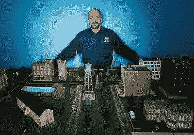
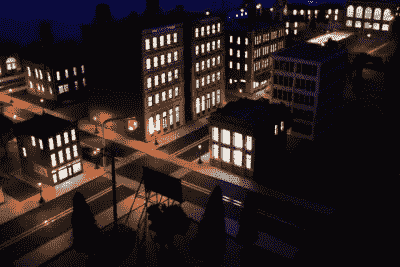
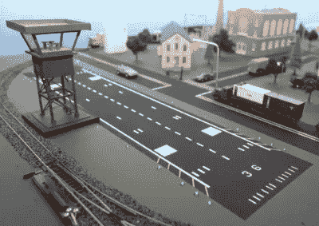

# 网络安全和真正好的列车组的案例

> 原文：<https://www.sitepoint.com/cyber-security-case-really-good-train-sets/>

我们有时很容易忘记“临时服务器”是一个多么好的主意。

每天，我们都可以在一个完美的网站副本上测试我们的工作，在这里，我们偶尔犯的灾难性的、破坏网站的错误在现实生活中几乎没有任何后果。如果有一个错误，我们回滚，修复它，擦我们的额头，外界永远不会知道。

失败是一个很好的老师——只要它不会在课上杀死你，对吗？

现实世界给我们提供的无风险测试机会更少。例如，心脏外科医生在三重搭桥手术中只有一次机会。公路建设人员不得不在公路使用期间对其进行重建。我确信两人都会抓住机会，在部署成品之前私下完成他们的工作。

唉，这是科幻小说的素材了。

有一些例外，团队可以在*半真实场景中测试自己。汽车碰撞安全测试就是一个明显的例子。*

 *我想告诉你的另一个城市是赛博城。

## 网络恐怖主义的棘手问题

在过去十年中，网络安全已经成为世界各国政府越来越重要的担忧——这是有充分理由的。

今天，几乎所有重要的民用基础设施——水、电、交通、卫生——都错综复杂地接入了我们的电子网络。不幸的是，这个网络在成千上万个不同的地方容易受到简单、低风险和潜在破坏性的攻击。

所以，当你忙着封锁你的铁路系统时，他们可能会盯上你的发电站。当你保护机场的时候，他们可能会干扰你的供水。

这就像不让蚂蚁进入足球场一样。你从哪里开始保护面积如此之大的东西呢？

显然答案就在新泽西的一个房间里。

## 网络城市的兴起

在过去的五年里，埃德·斯库迪斯和他在 T2 桑斯研究所的团队一直在经营着一个完整的大都市，拥有自己的电网、机场、交通管理、供水、医院、学校和零售。甚至有一只狗睡在阳台上。

他们称之为“赛博城”,它可能是有史以来最精确的真实城市复制品——尽管缩小到 48 平方的面积。

Ed Skoudis 是一名反黑客和培训师，拥有创建数字信息安全模拟的背景，但 CyberCity 将他的想法释放到了物理空间。

城市中的每个项目都是 1:87 的比例，但这不是玩具。微小的交通信号由现实世界的交通管理软件控制，模型列车由正宗的铁路协调软件协调。每一个继电器和传感器都将它们的数据输入到软件系统中，你会发现这些软件系统正在悄悄地运行着。

当通勤者在地铁发微博时，小医院里的电脑记录着病人进出。这个城市的每个居民都有一个独特的名字、地址和社会保险号。细节都不放过。

夜幕降临赛博城。明天有什么阴险的计划等着我们？

每天，当太阳升起的时候，攻击者就会进来。他们的第一项任务是访问房间里的网络摄像头。然后他们开始着手他们的使命，通过任何必要的手段让赛博城屈服。

他们可能会在咖啡馆的 Wi-Fi 上搜寻密码，使电网过载，破坏空中交通管制，或者破坏水过滤系统。

正如真正的网络恐怖主义一样，这些攻击可能在任何时候来自世界任何地方。攻击者可以实时看到他们成功的物理证据。

当然，赛博城背后的想法是让他们了解攻击可能发生在哪里，以及如何在真正的攻击发生之前最好地防御它们。

埃德和他的团队花了数百个小时在城市的微小细节上，不仅仅是因为这很有趣。攻击者和防御者都需要“高赌注”,他们对网络城市的重视程度越高，他们就越有可能占领或防御网络城市。

你可以说，SANS 已经有效地建立了世界上第一个“反网络恐怖主义登台服务器”。犯你的错误，吸取教训，没有人会受伤。

赛博城机场(如果你仔细看，会看到一辆银色的德罗宁汽车)。

但是更令人印象深刻的是什么呢？

艾德想出了一个办法来建造一个超级列车组，并让军方来买单。

尊重。

P.S. Eric Molinsky 去年游览了赛博城，并在他精彩的播客“想象世界”中记录了他的旅程。如果你喜欢这个故事，我建议你听一听。

*原载于 [SitePoint 设计简讯](https://www.sitepoint.com/newsletter/)* 。

## 分享这篇文章*