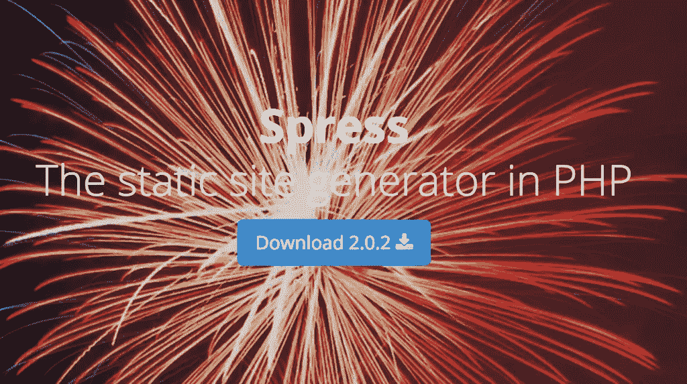
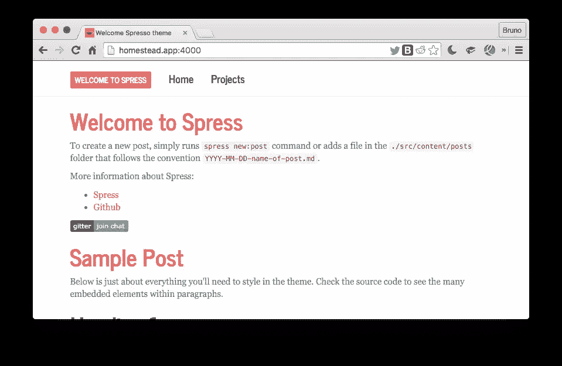

# 建立一个活泼的主题-响应静态博客！

> 原文：<https://www.sitepoint.com/building-an-spress-svbtle-theme-responsive-static-blogs/>

你可能听说过[Sculpin](http://sculpin.io)——PHP 的静态站点生成器。如你所知，静态博客是你在应用程序或本地机器上动态编写的博客，然后作为纯 HTML 版本导出到纯静态服务器上，以获得速度、可靠性和离线优先友好性。

虽然 Sculpin 易于使用且设置快速，但它的开发却停滞不前，文档也有很多不足之处。在某种程度上，Spress 是它的精神继承者。更好的文档，更灵活的配置，更容易扩展，几乎同样的 API 和命令也同样容易使用。



在本教程中，我们将构建一个 Spress 设置来生成一个带有自定义主题的静态博客。

## 拔靴带

本教程将假设你有一个工作的 PHP 环境，如 [Homestead Improved](https://www.sitepoint.com/quick-tip-get-homestead-vagrant-vm-running/) 。为了方便起见，下面几行代码可以让您立即开始:

```
git clone https://github.com/swader/homestead_improved hi_spress
cd hi_spress
bin/folderfix.sh
vagrant up; vagrant ssh 
```

在我们进入虚拟机后，我们可以安装 Spress:

```
wget https://github.com/spress/Spress/releases/download/v2.0.0/spress.phar
sudo mv spress.phar /usr/local/bin/spress
sudo chmod +x /usr/local/bin/spress 
```

Spress 现在在系统范围内可用(或者如果您使用的是 VM，则在 VM 范围内可用)，这可以通过运行`spress`来验证:


要创建一个示例站点，我们可以使用文档中的说明:

```
cd ~/Code
spress site:new myblog spresso
cd myblog
spress site:build --server 
```

该站点现在应该可以通过`http://localhost:4000`访问，或者如果你在一个像[家园改进版](https://www.sitepoint.com/quick-tip-get-homestead-vagrant-vm-running/)的虚拟机中，你应该首先在`Homestead.yaml`中转发端口 4000，在虚拟机外运行`vagrant provision`，然后通过`http://homestead.app:4000`访问该站点:



如果你熟悉 Sculpin，这个设置将几乎是肌肉记忆。就像 Sculpin 一样，Spress 也支持一个`--server`选项来启动 PHP 的内置服务器，以及一个`--watch`选项来监视文件的变化并根据需要重建站点。

## 自定义主题

我们将重新构建 [Svbtle 主题](http://svbtletheme.tumblr.com/)来使用 Spress。

关于 Spress 中主题的更多信息，见[这里](http://spress.yosymfony.com/docs/themes/)。

### Spress 中的主题如何工作

你用 Spress 发布的每个帖子或页面都有“元数据封面”，换句话说，在帖子或页面内容之前有一点特殊格式的文本。这个 frontmatter 定义了变量、设置，以及，你猜对了，要使用的布局(主题)。这与 Sculpin 的工作原理相同。例如，参见示例帖子“欢迎使用 Spress”:

```
---
layout: "post"
title: "Welcome to Spress"
categories: []
tags: ["sample post", "posts"]
---
To create a new post, simply runs `spress new:post` command or adds a file
in the `./src/content/posts` folder that follows the convention `YYYY-MM-DD-name-of-post.md`

.... 
```

顶部分隔符(`---`)之间的部分是前体。在其中，您可以看到值`layout: "post"`。字面意思是“在布局文件`post.twig`中找到*内容*块，在你把它转换成 HTML 后把下面的内容放进去”。如果我们现在查看`/src/layouts`中的`post.twig`，我们会看到以下内容:

```
---
layout: default
---



    


... 
```

内容块就在那里，准备接收转换后的 MD 内容。除了基本的 Twig 语法，我们可以看到这个布局本身也有一些 frontmatter。这些是嵌套的布局:当我们的“欢迎使用 Spress”帖子*扩展了* `post.twig`，`post.twig`本身扩展了`default.twig`——默认布局定义了 CSS、JS 和所有页面/帖子共有的其他元素。因此，我们可以看到 Spress 的布局系统实际上与常规的 Twig 用法相同，唯一的区别是 Spress 使用 frontmatter 来定义继承。

### 构建主题

那么，构建一个主题归结起来就是把正确的 CSS / JS 放到正确的位置，并稍微改变 Twig 模板。

首先，让我们加入一些新的 CSS。将[这个文件](https://github.com/Swader/spress-svbtle/blob/master/src/content/assets/css/svbtle.css)下载到`/src/assets/css`中。然后，抓取一个个人资料图像或标志(如果你没有，使用[可爱的头像](http://avatars.adorable.io/)，并将其保存为`src/assets/img/profile.png`。

> 您放在`src/assets`中的任何东西都会在构建时复制到`/assets`中。

接下来，让我们将这个 CSS 添加到我们的`<head>`部分。在`/src/includes/head.html`中，注释掉或删除将`bootstrap.min.css`和`style.css`添加到文档中的行，并添加`svbtle.css`表，因此该部分如下所示:

```
<link href="//maxcdn.bootstrapcdn.com/font-awesome/4.2.0/css/font-awesome.min.css" rel="stylesheet">
<link href="{{ site.url }}/assets/css/svbtle.css" rel="stylesheet" type="text/css" /> 
```

现在让我们将`layout/default.html`的内容改为:

```
<!DOCTYPE HTML>
<html lang="en">
<head>
    
</head>
<body>
<div class="sidebar">
    <!-- Logo -->
    <div class="logo">
        <a href="/" title="{{ site.title }}">
            <span class="img"></span>
        </a>
        <a href="/" title="{{ site.title }}">
            <h1>{{ site.title }}</h1>
        </a>
    </div>
    <!-- Description -->
    <div class="description">
        Some blog posts by <a
            href="/about">me</a>.
    </div>
    <!-- Navigation -->
    <div class="navigation">
        <a href="{{ site.url }}/blog">Archive</a>
        {#<a href="{{ site.url }}/blog/categories">#}
            {#<nobr>Categories & tags</nobr>#}
        {#</a>#}
        <a href="{{ site.url }}/about">About</a>
    </div>
</div>

<div id="main" class="container spresso-wrap">
    
    {{ page.content }}
    
</div>

    <script src="//ajax.googleapis.com/ajax/libs/jquery/2.0.3/jquery.min.js"></script>

    
    <script src="//cdnjs.cloudflare.com/ajax/libs/highlight.js/8.4/highlight.min.js"></script>
    <script>hljs.initHighlightingOnLoad();</script>
    

    

</body>
</html> 
```

`layout/post.html`的内容应该变成:

```
---
layout: default
---



    <article class="post">
        <header>
            <div class="title"><a
                        href="{{ site.url }}{{ page.url }}">{{ page.title }}</a></div>
        </header>
        <div class="text">
            {{ page.content | raw }}
        </div>

    </article>



    
        <script type="text/javascript">
            var disqus_shortname = '{{ site.comments.disqus_shortname }}';

            (function() {
                var dsq = document.createElement('script'); dsq.type = 'text/javascript'; dsq.async = true;
                dsq.src = '//' + disqus_shortname + '.disqus.com/embed.js';
                (document.getElementsByTagName('head')[0] || document.getElementsByTagName('body')[0]).appendChild(dsq);
            })();
        </script>
    
 
```

而`src/content/index.html`的内容现在应该是:

```
---
layout: "page"
title: "Welcome Svbtle theme"

generator: "pagination"
provider: "site.posts"
max_page: 5
sort_by: "date"
---



    <div class="date">
        <a href="{{ post.url }}">
            {{ post.date|date("d. F, Y") }}
        </a>

    </div>

    <article class="post">
        <header>
            <div class="title"><a
                        href="{{ site.url }}{{ post.url }}">{{ post.title }}</a></div>
        </header>
        <div class="text">

            
                {{ post.content | split('<!--more-->') | first | raw }}
                <footer><a href='{{ site.url }}{{ post.url }}' class='continue'> Read more </a>
                </footer>
            
                {{ post.content | raw }}
            

        </div>
    </article>




    <nav id="pagination">
        <div class="next">
            <a
                href="{{ site.url }}{{ page.pagination.previous_page.url }}">Newer Posts</a>
        </div>
        <div class="prev"><a
                href="{{ site.url }}{{ page.pagination.next_page.url }}">Older Posts</a>
        </div>
    </nav>
 
```

除了主题的改变，我们还加入了一些不错的小技巧——在呈现内容时，Spress 会在帖子中寻找`<!--more-->` HTML 评论。如果遇到它，它只会在主页面上把内容**呈现在**之前，并且会在下面召唤一个“阅读更多”按钮。点击它，读者会被带到文章的完整页面并继续阅读。非常感谢 [@coderabbi](https://twitter.com/coderabbi) 的[这次黑客](https://coderabbi.github.io/posts/sculpin-read-more-links/)。

现在重新构建站点，用`CTRL+C`停止服务器，用`spress site:build --server`为它服务，我们应该看到我们新做的主题被应用了——就这么简单！

注意:虽然构建主题相对容易，但是安装它们有点违反直觉。要安装一个主题，必须有效地克隆一个新的 Spress 站点，然后将 MD 源文件粘贴到其中。由于不同主题使用了不同的文件结构，这往往会很尴尬，但是正如你在上面看到的，这通常不需要太多的工作。

如果我们现在查看我们的站点，并针对不同的屏幕大小呈现它，我们应该会看到它工作得很好:


## 结论

在本教程中，我们研究了 Spress，这是一个用 PHP 和 Symfony 组件编写的静态站点生成器，并生成了一个定制主题的博客。在后续的文章中，我们将会看到它更多的特性——包括分类法(类别和标签)、自定义页面和部署，我们还会写一两个插件。

你用静态博客还是动态博客？为什么？你试过 Spress 或者你还在使用 Jekyll、Sculpin 或者类似的工具吗？让我们知道！

## 分享这篇文章