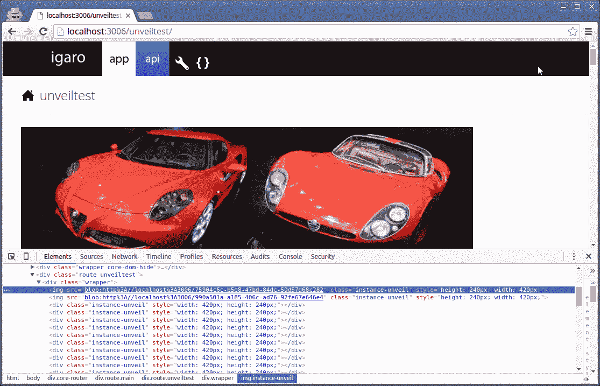

# 用 Igaro 应用 JavaScript 框架延迟加载图像

> 原文：<https://www.sitepoint.com/lazy-loading-images-igaro-app-javascript-framework/>

不久前，我写了一篇关于 Igaro 应用 JS 框架的文章(声明:我是框架的作者)。

“唉！不是另一个框架“我听到你这么说(可能是对的)。好吧，让我告诉你是什么让 Igaro app 与众不同。

Igaro App 并不是另一个插入 HTML 的框架。这是一种完全不同的方法，可能提供任何 web 应用程序框架的最高性能。它基于最新的标准化技术，如承诺(和零回调)，以及事件驱动的架构。有极好的错误管理和恢复，使用 CommonJS 风格模块的惰性加载架构，许多让您入门的小部件，以及零依赖性(无 jQuery)。

在这篇文章中，我将演示如何为 Igaro 应用程序构建一个公开窗口小部件(当图像进入视图时，延迟加载图像),并将重点介绍许多使框架一路闪耀的概念。如果您希望直接跳到最终结果，您可以下载本文的[完整代码。](https://github.com/sitepoint-editors/igaro-app-unveil-widget/)

## 设置环境

首先要做的是从它的 [GitHub repo](https://github.com/igaro/app) 中获取框架的副本。

```
mkdir igaro
git clone https://github.com/igaro/app.git igaro/git
cd igaro/git 
```

然后安装几个依赖项:

```
npm install -g grunt-cli
gem install compass
npm install 
```

Grunt 的命令行界面( [grunt-cli](https://www.npmjs.com/package/grunt-cli) )是一个 npm 包，这意味着你需要在你的机器上安装 Node.js 和 npm。[指南针](http://compass-style.org/)是一个红宝石，这意味着你也需要安装红宝石。安装过程会因操作系统而异。最好的办法是按照各自项目主页上的说明来做([节点](https://nodejs.org/en/download/)、 [Ruby](https://www.ruby-lang.org/en/documentation/installation/) )。

完成后，您可以用一个简单的:

```
grunt
```

一旦克隆并运行，用户就有了一个准备好的开发环境。Igaro 编译成两种模式——调试和部署，每种模式的 web 服务器分别位于端口 3006 和 3007。这些将在您工作时自动重新加载。


## 概述小部件规范

在构建这个小部件的过程中，我将介绍 Igaro 的 [bless](http://app.igaro.com/bless/) ，这是一种预配置对象的方法，我还将解释它是如何允许对象自己整理的。对于 SPA 来说，这对于防止内存泄漏和安全问题非常重要，也就是说，如果一个经过验证的页面(Igaro 应用程序称之为[路由](http://app.igaro.com/routes/))包含了几个我们将要创建的类型的小部件，并且凭证被无效(即用户已经注销)，那么不仅必须删除 DOM 元素，还必须释放事件和依赖关系。

大多数框架希望你重新加载应用程序“刷新页面”来清除历史对象(即使 DOM 端的东西被删除或隐藏)，或者手动处理清除变量的过程。Igaro 的“祝福”的一个特点是对象之间的双向通信，所以在这种情况下，当路径被破坏时，小部件会随之消失。类似地，如果我们销毁小部件，就会通知路由，并将其从同级阵列池中删除。

作为免责声明，我更喜欢像一本书一样流动和阅读的代码，对任何有语言经验的人来说都是自我记录的。由于这个原因，你会发现下面所有的代码都是没有文档记录的，简洁的，但是可读性惊人，这在很大程度上要归功于 ES6 承诺的使用。你应该有很好的 JavaScript 基础或者准备学习。

事不宜迟，下面是我们的小部件的规范:

1.  容器应该是空的`<div>`。
2.  在窗口滚动或调整大小时，检测垂直位置是否在视口内，如果是，添加一个`loading` CSS 类。
3.  获取任何资源，如果图像从`<div>`切换到``并写出数据。
4.  支持 Ajax 调用后的回调函数*。这可能会注入其他 DOM 元素或处理自定义数据。
5.  出错时，添加`error` CSS 类，删除`loading`类。

Ajax 调用可能需要头进行认证或 [CORS 支持](https://www.sitepoint.com/an-in-depth-look-at-cors/)。必须实现允许定制请求的机制。

现在我们知道了小部件应该如何工作，让我们开始编码。

## 创建必要的文件

让我们检查一下小部件的四个主要文件。

### instance . unbound . js

在`compile/cdn/js/`中创建一个名为`instance.unveil.js`的文件，并输入以下代码:

```
module.requires = [
  { name:'instance.unveil.css' }
];

module.exports = function(app) {
  "use strict";
  var InstanceUnveil = function(o) {}
  return InstanceUnveil;
}; 
```

当小部件被实例化时，一个对象文字`o`被传递。这是用来祝福对象的(后面会详细介绍)。

### instance . unbound . scss

接下来，在`sass/scss`中创建一个名为`instance.unveil.scss`的文件，并输入下面的代码。

```
.instance-unveil {
  display:inline-block
}

.instance-unveil-loading {
  background: inline-image("instance.unveil/loading.gif") no-repeat 50% 50%;
  background-size: 3em;
}

.instance-unveil-error {
  background: inline-image("instance.unveil/error.svg") no-repeat 50% 50%;
  background-size: 3em;
} 
```

在网上找到合适的[加载 gif](https://commons.wikimedia.org/wiki/File:Loading_icon.gif) 和合适的[错误图片](https://commons.wikimedia.org/wiki/File:Human-dialog-error.svg)。将这些文件放入名为`saimg/instance.unveil`的文件夹中，并确保名称和扩展名与您刚刚创建的文件中的名称和扩展名相匹配。

### route . main . unviltest . scss

通过[http://localhost:3006/un filtest](http://localhost:3006/unveiltest)可以访问包含我们的小部件的多个实例的测试页面(route)。

在`sass/scss`中创建一个名为`route.main.unveiltest.scss`的文件，并输入下面的代码。

```
@import "../sass-global/mixins.scss";

body >.core-router >.main >.unveiltest >.wrapper {
  @include layoutStandard;
} 
```

### route . main . un filtest . js

在`compile/cdn/js`中创建一个名为`route.main.unveiltest.js`的文件，并输入下面的代码。

```
//# sourceURL=route.main.unveiltest.js

module.requires = [
  { name: 'route.main.unveiltest.css' },
];

module.exports = function(app) {
  "use strict";
  return function(route) {

    var wrapper = route.wrapper,
    objectMgr = route.managers.object;

    return route.addSequence({
      container:wrapper,
      promises:Array.apply(0,new Array(50)).map(function(a,i) {
        return objectMgr.create(
          'unveil',
          {
            xhrConf : {
              res:'http://www.igaro.com/misc/sitepoint-unveildemo/'+i+'.jpeg'
            },
            loadImg : true,
            width:'420px',
            height:'240px'
          }
        );
      })
    });
  };
}; 
```

在 Igaro App 中，当请求一个页面时，路由器( [core.router](https://github.com/igaro/app/blob/master/compile/cdn/js/core.router.js) )向一个提供者请求一个源，实例化一个新的路由，并将其传递给源进行定制。在您刚刚创建的 route 文件中，创建了 50 个 unbound 小部件，并将其传递给一个 sequencer。定序器确保当返回的承诺解析时，图像以原始顺序放置在页面上。

`create`方法是由一个管理者提供的。它延迟加载模块并创建实例化(通过将模块添加到文件顶部的`requires`列表来预加载模块)。在这一点上，小部件还依赖于路由，以便当路由被破坏时，清理操作被运行。

## 添加小部件的功能

用以下代码增强您的`instance.unveil.js`文件:

```
module.requires = [
  { name:'instance.unveil.css' }
];

module.exports = function(app) {
  "use strict";

  var bless = app['core.object'].bless;

  var InstanceUnveil = function(o) {
    var self = this;
    this.name='instance.unveil';
    this.asRoot=true;
    this.container=function(domMgr) {
      return domMgr.mk('div',o,null,function() {
        if (o.className)
          this.className = o.className;
        this.style.width = o.width;
        this.style.height = o.height;
      });
    };
    bless.call(this,o);
    this.onUnveil = o.onUnveil;
    this.xhrConf = o.xhrConf;
    this.loadImg = o.loadImg;
  };

  return InstanceUnveil;
}; 
```

参数`o`提供的属性可以直接使用，比如`o.container`和`o.className`(它们指示小部件应该插入的位置，并提供一个自定义的类名)。有些是直接编写的，比如对象的名称，由 Igaro 的 bless 特性提供的事件管理器使用。Bless 可以提供许多东西，例如如果小部件需要持久数据存储，我们可以要求它附加一个存储管理器(查看[http://localhost:3006/showcase/todo MVC](http://localhost:3006/showcase/todomvc)后面的代码作为示例)。

### 添加窗口事件处理程序

更新您的`instance.unveil.js`文件以包含窗口监听器挂钩、清理函数和基本原型方法，如下所示。如果您愿意，可以用下面的代码替换文件中以前的内容。

```
module.requires = [
  { name:'instance.unveil.css' }
];

module.exports = function(app) {
  "use strict";

  var bless = app['core.object'].bless;

  var removeWindowListeners = function() {
    var wh = this.__windowHook;
    if (wh) {
      window.removeEventListener('scroll',wh);
      window.removeEventListener('resize',wh);
    }
    this.__windowHook = null;
  };

  var InstanceUnveil = function(o) {
    var self = this;
    this.name='instance.unveil';
    this.asRoot=true;
    this.container=function(domMgr) {
      return domMgr.mk('div',o,null,function() {
        if (o.className)
          this.className = o.className;
        this.style.width = o.width;
        this.style.height = o.height;
      });
    };
    bless.call(this,o);
    this.onUnveil = o.onUnveil;
    this.xhrConf = o.xhrConf;
    this.loadImg = o.loadImg;
    this.__windowHook = function() {
      return self.check(o);
    };
    window.addEventListener('scroll', this.__windowHook);
    window.addEventListener('resize', this.__windowHook);
    this.managers.event.on('destroy', removeWindowListeners.bind(this));
  };

  InstanceUnveil.prototype.init = function(o) {
    return this.check(o);
  };

  InstanceUnveil.prototype.check = function(o) {
    return Promise.resolve();
  };

  return InstanceUnveil;
}; 
```

该实例现在将监听器连接到窗口`scroll`和`resize`事件，这将调用`check`函数(该函数将进行计算以查看我们的小部件是否在视口空间内)。重要的是，它还将另一个侦听器附加到实例上的事件管理器，以便在实例被销毁时删除侦听器。还有一个新的原型函数叫做`init`。通过`new`关键字的 JavaScript 实例化是同步的，但是异步代码可以放到`init`中，它将为我们调用。

在 Igaro 应用程序中，任何受祝福的物体都可以通过调用`destroy`来销毁。

此时，代码仍然不会做任何事情。如果您浏览到`/unveiltest`，您会看到一个空白页面(但是检查内容，您会看到 50 个空白的`<div>`元素)。重物提升还没有被添加到`check`功能中。

### 检查功能

该功能应执行以下操作:

*   检测实例的容器(一个`<div>`元素)是否在视口内
*   添加一个`loading` CSS 类
*   创建 XHR 实例
*   获取资源
*   如果加载图像，将`<div>`换成``
*   选择性地呼叫回拨
*   移除`loading` CSS 类
*   清理事件处理程序

`check`函数有相当多的代码，但是不要急着去完成它——它读起来很好。将它添加到您的文件中，不要忘记靠近顶部的 dom 模块的引用。

```
//# sourceURL=instance.unveil.js

module.requires = [
  { name:'instance.unveil.css' }
];

module.exports = function(app) {
  "use strict";

  var bless = app['core.object'].bless,
  dom = app['core.dom'];

  var removeWindowListeners = function() {
    var wh = this.__windowHook;
    if (wh) {
      window.removeEventListener('scroll',wh);
      window.removeEventListener('resize',wh);
    }
    this.__windowHook = null;
  };

  var InstanceUnveil = function(o) {
    var self = this;
    this.name='instance.unveil';
    this.asRoot=true;
    this.container=function(domMgr) {
      return domMgr.mk('div',o,null,function() {
        if (o.className)
          this.className = o.className;
        this.style.width = o.width;
        this.style.height = o.height;
      });
    };
    bless.call(this,o);
    this.onUnveil = o.onUnveil;
    this.xhrConf = o.xhrConf;
    this.loadImg = o.loadImg;
    this.__windowHook = function() {
      return self.check(o);
    };
    window.addEventListener('scroll', this.__windowHook);
    window.addEventListener('resize', this.__windowHook);
    this.managers.event.on('destroy', removeWindowListeners.bind(this));
  };

  InstanceUnveil.prototype.init = function(o) {
    return this.check(o);
  };

  InstanceUnveil.prototype.check = function() {
    var container = this.container;
    // if not visible to the user, return
    if (! this.__windowHook || dom.isHidden(container) || dom.offset(container).y > (document.body.scrollTop || document.documentElement.scrollTop) + document.documentElement.clientHeight)
      return Promise.resolve();
    var self = this,
    managers = this.managers,
    xhrConf = this.xhrConf;
    removeWindowListeners.call(this);
    container.classList.add('instance-unveil-loading');
    return Promise.resolve().then(function() {
      if (xhrConf) {
        return managers.object.create('xhr', xhrConf).then(function(xhr) {
          return xhr.get(self.loadImg? { responseType: 'blob' } : {}).then(function(data) {
            if (self.loadImg) {
              self.container = managers.dom.mk('img',{ insertBefore:container }, null, function() {
                var img = this,
                windowURL = window.URL;
                // gc
                this.addEventListener('load',function() {
                  windowURL.revokeObjectURL(img.src);
                });
                this.src = windowURL.createObjectURL(data);
                this.className = container.className;
                this.style.height = container.style.height;
                this.style.width = container.style.width;
              });
              dom.purge(container);
              container = self.container;
            }
            return data;
          }).then(function(data) {
            if (self.onUnveil)
              return self.onUnveil(self,data);
          }).then(function() {
            return xhr.destroy();
          });
        });
}
if (self.onUnveil)
  return self.onUnveil(self);
}).catch(function(e) {
  container.classList.add('instance-unveil-error');
  container.classList.remove('instance-unveil-loading');
  throw e;
}).then(function() {
  container.classList.remove('instance-unveil-loading');
});
};

return InstanceUnveil;
}; 
```

你可能会问，当我们神圣的对象有一个 DOM 管理器时，为什么我们需要添加`core.dom`模块？

Bless 只提供需要为被祝福的对象定制的函数，因此 DOM manager 不提供删除原始容器(及其所有依赖项)所需的`purge`方法。因此，下面两种创建 DOM 元素的方法是不同的:

```
app['core.dom'].mk(...)

[blessed object].managers.dom.mk(...) 
```

第二个示例将销毁 DOM 元素(如果被祝福的对象被销毁)，以及任何将 DOM 元素注册为依赖项的事件。它自动执行所有的清理，并确保没有内存泄漏。

刷新和页面上应该有许多彩色图像。

## 失败！

正如你所希望的那样，我们根本没有多少图像。你能找出哪里出了问题吗？

两件事；

1.  实例没有附加它的 DOM 元素，这是由`addSequence`函数完成的，但是它发生在我们直接调用`check`之后。

2.  在它的承诺被解决之前，路由是不可见的，这可能允许路由器中止加载损坏的页面。即使我们修复了(1 ),当调用`check`时，图像也不会出现在视窗中。

所遇到的问题不太可能在许多用例中突然出现，但它是一个很好的例子，说明了当您使用框架创建 SPA 时会发生什么，以及最终该框架是否能够轻松解决意外情况，或者它是否会成为障碍？

此时，通过`setTimeout` (HACK！)可能你也想过。我们不会那么做的。

## 解决办法

`core.router`处理路线的加载，当一条路线已经加载并可见时，它触发一个事件`to-in-progress`。我们可以将我们的实例连接到这个调用。

基于前面使用的代码，类似下面的代码应该是合适的。

```
app['core.router'].managers.event.on('to-in-progress',function(r) {
  if (r === route)
    unveil.check(); // no return
}, { deps:[theInstance] }); 
```

请注意实例是如何作为事件的依赖项传递的，并且来自`check`的承诺没有被返回。这样做将导致图像一个接一个地加载(事件是同步的)，并且如果在获取图像时发生错误，它将中止页面的加载。相反，实例将独立处理错误(通过 CSS `error`类)。

因此，`route.main.unveiltest.js`的最终代码如下:

```
//# sourceURL=route.main.unveiltest.js

module.requires = [
  { name: 'route.main.unveiltest.css' },
];

module.exports = function(app) {
  "use strict";

  var coreRouterMgrsEvent = app['core.router'].managers.event;

  return function(route) {
    var wrapper = route.wrapper,
    objectMgr = route.managers.object;

    return route.addSequence({
      container:wrapper,
      promises:Array.apply(0,new Array(50)).map(function(a,i) {
        return objectMgr.create(
          'unveil',
          {
            xhrConf : {
              res:'http://www.igaro.com/misc/sitepoint-unveildemo/'+i+'.jpeg'
            },
            loadImg : true,
            width:'420px',
            height:'240px'
          }
          ).then(function(unveil) {
            coreRouterMgrsEvent.on('to-in-progress',function(r) {
              if (r === route)
                unveil.check(); // no return
            }, { deps:[unveil] });
            return unveil;
          });
        })
    });
  };
}; 
```

刷新一下，当你向下滚动页面时，你应该会看到很多图片。



## 错误处理

将 route 文件中的图像数量更改为更大的数量将导致 Ajax 失败并显示`error` CSS 类。

## 改进想法

前面我提到，一旦路由超出范围，实例上的`window.addEventListener`应该被理想地删除，这将比实例检查其容器的可见性更有效。

正如所知，这可以通过监听路线上的`enter`和`leave`事件来实现。我们可以监视这些并在实例上调用注册/取消注册方法。

## 最终考虑

一个警告是我们的朋友 Internet Explorer。版本 9 不支持 XHRv2 和`window.URL.createObjectURL`，两者都不能多填充。

为了向用户表明他们的浏览器不支持所需的特性，我们可以将下面的代码添加到`instance.unveil.js`的顶部。

```
if (! window.URL))
  throw new Error({ incompatible:true, noobject:'window.URL' }); 
```

至少就图像而言，我认为这是不可接受的。在这段代码准备好投入生产之前，如果`window.URL`不可用，它需要退回到立即写出图像。

## 结论

在写这篇文章的时候，我研究了如何使用返回的 MIME 类型来自动编写替换内容``,以及如何使用 base-64 来支持 IE9。遗憾的是，XHRv1 需要一个 MIME 覆盖，然后覆盖 content-type 头。解决这个问题需要对同一个 URL 进行两次 XHR 调用。

我计划将这个实例模块集成到即将发布的 Igaro 应用程序中，但是您可以通过发送一个 pull 请求来抢先我一步(如果您这样做，不要忘记通过`route.main.modules.instance.unveil.js`提供非`window.URL`支持和文档)。

否则，我希望已经为您提供了 Igaro App 可以做什么的一瞥。我很乐意在下面的评论中回答你的任何问题。

## 分享这篇文章