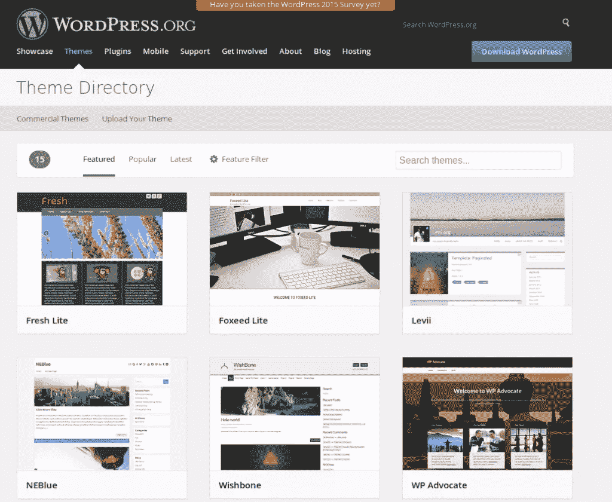

# 给不熟悉 WordPress 的设计师的 5 个建议

> 原文：<https://www.sitepoint.com/designers-new-to-wordpress/>

WordPress 设计为设计者和开发者打开了巨大的可能性。更重要的是，你可以打赌这不仅仅是一时的时尚。WordPress 真的很棒，它肯定会一直存在下去。

如果你现在还没有跳上 WordPress 的马车，你肯定已经错过了很多。别担心，加入永远不晚。如果你是一名设计师(无论是图形还是网页)，并且你正在考虑转向 WordPress，这里有一些建议可以帮助不熟悉 WordPress 的设计师。

## 1.决定你是否能处理 PHP 代码

我不知道对大多数设计师来说这是不是真的，但我感觉他们成为 WordPress 设计师时面临的最大障碍是代码。当我第一次接触 WordPress 设计时，我不记得这对我来说是一个问题，但是在我对 WordPress 设计感兴趣之前，我已经有了一些 Java 和 C 的编程经验，所以对我来说 PHP 不是一个怪物。也许正因为如此，我很难理解一个必须熟悉 HTML 和 CSS 之类代码的设计师，尤其是网页设计师，怎么会一看到 PHP 代码就抓狂。

然而，我认识许多设计师，他们中的一些人比我优秀得多，但他们就是无法对付这个可怕的 PHP 怪物。例如，[这篇文章](http://blog.web123partners.com.au/blog/why-graphic-designers-should-run-a-mile-from-wordpress.aspx)解释了为什么对于一些图形设计师来说，WordPress 代码(以及 WordPress 本身)太多了。

所以，如果你打算成为一名 WordPress 设计师，你应该学习一些 PHP。当然，如果你和 WordPress 开发者密切合作，你也可以没有它。你总是可以指望他们的帮助，但是你很容易变得依赖他们。

另一方面，许多设计师正在学习编码的事实并不意味着你也必须这样做。如果你真的讨厌代码，你也没必要强迫自己去做自己不热衷的事情。

你只需要决定，对你来说，进入 WordPress 设计是不是一个好主意。毕竟，即使你强迫自己去做，只是因为其他人都在做，结果也可能是痛苦太多而收获不多。这根本毫无意义。

## 2.熟悉 WordPress 主题的结构和 WordPress 的工作方式

在你勇敢地决定你可以处理一些(或更多)PHP 代码之后，下一步是熟悉 WordPress 主题的结构和 WordPress 的一般工作方式。幸运的是，这方面的信息很多。

例如，[这篇文章](http://www.codeinwp.com/blog/wordpress-theme-heirarchy/)很好也很容易地介绍了 WordPress 主题的内部原理。虽然看完之后你不会成为一个主题大师，但这是一个很好的起点。你可能也想查看[这篇参考文献](https://codex.wordpress.org/CSS)以获得更多关于 WordPress CSS 的细节。

## 3.检查 WordPress 特有的 CSS

如果你是网页设计出身，那么你应该已经了解了一些 CSS。好消息是这些知识中的大部分都是可重用的。换句话说，你在静态网站上看到的 CSS 和你在 WordPress 上使用的 CSS 是一样的。

然而，也有你不能没有的 WordPress 特有的 CSS。查看本教程以获得更多关于 CSS 类和 id 的信息。不幸的是，没有关于这个主题的权威指南，因为有许多特定主题的 CSS 需要你自己去发现。

如果 CSS 对你来说太难了，还有拖放框架。然而，我的真实看法是，它们不适合专业设计师。这些框架对于快速和肮脏的工作来说是很好的，但是如果你想创建真正的设计，没有手动编码 CSS 是不可能的。

## 4.检查现有主题的内部

学习 WordPress 设计的最好方法之一是检查现有主题的内部结构。这里的关键是选择好的主题——你不会向糟糕的设计师学习，对吗？

我不打算推荐一个特定的主题，因为这是非常主观的。相反，我会推荐去官方 WordPress 主题目录，下载一些流行的主题。安装并测试它们，如果你对外观和感觉或者某个特定的主题感到满意，那么你就可以开始剖析和学习了。

## 5.阅读大量关于 WordPress 的内容

WordPress 一直在变化，如果你想保持领先，你需要大量阅读。新的 WordPress 版本一直在发布。如果你给它添加插件和主题，会有很多东西跟着来。当然，期望你了解 WordPress 的一切是不现实的(你不需要了解)，但是你至少需要了解主要的变化。

如果你喜欢 WordPress，你很可能也会喜欢阅读它。除了 WordPress 博客，WordPress 论坛是另一个可以查看的资源。这些是和其他 WordPress 设计者交流想法和经验的好地方。在一个好的 WordPress 论坛，比如 WordPress.org 的[或者 WordPress.com 的](https://wordpress.org/support/)[你可以通过阅读其他设计师、开发者或者普通用户发布的问题学到很多东西。](https://en.forums.wordpress.com/)

## 结论

从事 WordPress 设计是非常有益的。WordPress 是网络上最受欢迎的 CMS 平台，理由很充分。然而，如果你真的不喜欢 WordPress，没有必要强迫自己使用它。这就是为什么你真的需要给自己一个诚实的答案 WordPress 适合你吗？如果你觉得 WordPress 给了你很多，认真对待它。你可能不得不在电脑前花很长时间，但是当你热爱你的工作时，克服困难就变得更容易了。

## 分享这篇文章