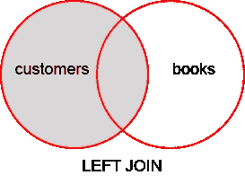
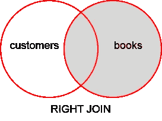
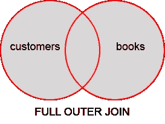
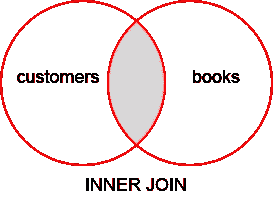
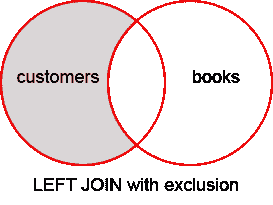
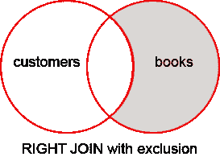
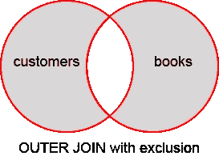

# 您应该熟悉的另外 3 个连接

> 原文：<https://www.sitepoint.com/3-more-joins-you-should-be-familiar-with/>

有许多方法可以连接两个数据库表中的数据并过滤您需要的信息。克雷格·巴克尔写了一篇关于理解加入 T1 的流行文章；即内侧、左侧、右侧和全外侧。这篇文章是那篇文章的延伸。

让我们快速回顾一下。图片两个表，一个用于`customers`，一个用于`books`建立图书借阅数据库。

* * *

`customers`表

| 身份证明（identification） | 西方人名的第一个字 | 姓 | 图书 id |
| --- | --- | --- | --- |
| one | 乔（人名） | 吹 | one |
| Two | 简（女子名） | 母鹿 | Two |
| three | （英、瑞）哈里（人名） | 乌鸦 | Two |
| four | 杰弗里(男子名ˌ等于 Geoffrey) | 雪 | Zero |

`books`表

| 身份证明（identification） | 标题 |
| --- | --- |
| one | 星球大战 |
| Two | [电影]侏罗纪公园 |
| three | 《小妇人》 |
| four | [文学作品]汤姆·索亚历险记 |

每本书在`books`表中都有一行。

对于一次只能借一本书的每个客户，表中有一行。如果他们没有借出的书，`book_id`将是`0`或一个空字符串。

这是一个非常简单的例子，使连接尽可能清晰易懂！

A **LEFT JOIN** 这里是在你想问一个问题的情况下，比如“*给我看看所有的顾客，包括任何借出的书。*



您可以在图像中看到，左侧圆圈或表格中的所有数据都包含在结果集中。右表中仅包含与 books 表重叠的数据。这意味着使用`LEFT JOIN`可能会排除右表中的一些数据。

一个**右加入**就像是问“*给我看看我图书馆里所有的书，以及任何借过它们的顾客。*



在这幅图中，您可以看到右表中的所有**数据都包含在结果集中。仅包含与`customers`表重叠的数据。这意味着有了`RIGHT JOIN`，左表中的一些数据可能会被排除。**

一个**外部连接**就像要求“*显示所有的贷款和所有的书，不管它们之间的联系。*



在此图中，您可以看到来自**和**两个表的**所有**数据都将被包括在内，不管某些数据是否重叠。当这样的查询完成时，结果中会有不重叠的数据，这些字段将被设置为 NULL。

一个**内部连接**就像要求“*只显示有贷款的客户。*



这里您可以看到数据可能被排除在左表和右表之外。你不会看到任何顾客，如果他们没有一本书借出，你也不会看到任何书，如果他们没有借出！

这是最常见的数据类型，也是单独使用关键字`JOIN`时的默认行为。通常不需要添加“内部”一词。

## “左”和“右”到底是什么意思？

你可以认为“左”和“右”只不过是源顺序。看看这个查询:

```
SELECT *
FROM customers
LEFT JOIN books
ON customers.book_id = books.id 
```

注意，我在使用关键字`JOIN`之前提到了表`customers`。这意味着`customers`是我的“左”表。另一种思考方式是询问哪个表在关键字`JOIN`的左边，哪个表在关键字的右边。

几个警告:

*   仅仅因为一个表是“左”表，并不意味着您选择了它的所有记录。这是`LEFT JOIN`或者`RIGHT JOIN`的功能，不是源命令！
*   左边的表将在结果集中首先列出它的列，除非您在`SELECT`部分特别选择了列。
*   关键字`ON`后面的表的顺序无关紧要，如果交换，它将返回相同的结果。

## 复习够了。这些新连接是什么？

嗯，它们不是“新的”，它们只是询问附加问题的一种方式。对于查询中带有“不要”或“不”的问题，您如何找到答案？

显示所有没有借书的顾客。

给我看看所有没有借出的书。

### 排除左连接

看看这张图。请注意阴影区域中与上述连接的不同之处。



这看起来像一个`LEFT JOIN`，但是不再包含“重叠”数据。为什么？这与要求"*显示有**没有**本书被借出的客户是一样的。*“也许你想选择所有没有书的顾客，给他们发一份有特别折扣的时事通讯？

如果你够聪明，你可能会认为你可以在`customers`表中搜索一个为 0 的`book_id`来做同样的事情。这在本例中是可行的，但大多数时候是行不通的；这取决于你的桌子是如何设计的。

该查询如下所示:

```
SELECT *
FROM customers
LEFT JOIN books
ON customers.book_id = books.id
WHERE books.id IS NULL 
```

我们现在包含了一个`WHERE`子句。任何时候你有一个 WHERE 子句，你就是在排除数据，或者过滤它，就像搜索一样。那么，我们为什么要搜索空的`books.id`?为什么会是空的？让我们运行标准的`LEFT JOIN`，看看它返回的数据，我们会有答案:

`LEFT JOIN`返回数据

| 身份证明（identification） | 西方人名的第一个字 | 姓 | 图书 id | id1 | 标题 |
| --- | --- | --- | --- | --- | --- |
| one | 乔（人名） | 吹 | one | one | 星球大战 |
| Two | 简（女子名） | 母鹿 | Two | Two | [电影]侏罗纪公园 |
| three | （英、瑞）哈里（人名） | 乌鸦 | Two | Two | [电影]侏罗纪公园 |
| four | 杰弗里(男子名ˌ等于 Geoffrey) | 雪 | Zero | 空 | 空 |

你能看出问题吗？这是一个`LEFT JOIN`,这意味着来自`customers`表的所有数据都包括在内，不管是否与图书重叠。Jeffrey Snow 包括在内，但他没有借书，这就是为什么“id1”和“title”列被设置为空。当表被连接时，将不会有一个书名或图书 ID 链接到他。

如果我们要求“*显示所有客户，包括他们有哪些书*”，您会想要上面的数据，因为 Jeffrey 是一个客户，不管他有没有借书。在这种情况下，这将是`LEFT JOIN`的功能。

如果我们问问题“*给我看看没有借书的顾客*”，现在我们就能很清楚地知道要找什么了。我们只需要选择客户，其中我们看到`books.id`列为空(当连接时，将被标记为`id1`，因为有两个列名为“id”)。如果我们加上`WHERE books.id IS NULL`，我们就用一个标准的`WHERE`子句做到这一点。现在结果被过滤成这样:

| 身份证明（identification） | 西方人名的第一个字 | 姓 | 图书 id | id1 | 标题 |
| --- | --- | --- | --- | --- | --- |
| four | 杰弗里(男子名ˌ等于 Geoffrey) | 雪 | Zero | 空 | 空 |

你现在有了所有没有借书的顾客。

### 排除右连接

让我们用一个`RIGHT JOIN`做同样的事情。让我们找出所有没有借给任何人的书。



普通的`RIGHT JOIN`将返回每本书，不管它是否被借出，结果集如下所示:

| 身份证明（identification） | 西方人名的第一个字 | 姓 | 图书 id | id1 | 标题 |
| --- | --- | --- | --- | --- | --- |
| one | 乔（人名） | 吹 | one | one | 星球大战 |
| Two | 简（女子名） | 母鹿 | Two | Two | [电影]侏罗纪公园 |
| three | （英、瑞）哈里（人名） | 乌鸦 | Two | Two | [电影]侏罗纪公园 |
| 空 | 空 | 空 | 空 | three | 《小妇人》 |
| 空 | 空 | 空 | 空 | four | [文学作品]汤姆·索亚历险记 |

这看起来有点不同。首先，你可能会注意到《侏罗纪公园》被列了两次。这是因为两个人借了这本书，数据库为每个匹配返回一行。

请注意，对于小妇人和汤姆·索亚来说，`customers`表中所有对应的列都是空的，因为没有人借阅这些书籍，所以没有重叠的数据。

如果我们想选择所有没有被借出的**的书，我们只需使用`WHERE`子句在`customers.id`列中找到“NULL”。**

```
SELECT *
FROM customers
RIGHT JOIN books
ON customers.book_id = books.id
WHERE customers.id IS NULL 
```

结果应该是可以预见的。我们只有不外借的书。

| 身份证明（identification） | 西方人名的第一个字 | 姓 | 图书 id | id1 | 标题 |
| --- | --- | --- | --- | --- | --- |
| 空 | 空 | 空 | 空 | three | 《小妇人》 |
| 空 | 空 | 空 | 空 | four | [文学作品]汤姆·索亚历险记 |

### 带有排除项的外部联接

最后一个`JOIN`长这样。



这个`JOIN`不是很有用，但本质上会同时给你一个没有贷款的客户、**和**没有被借出的书的列表。

像这样一个奇怪的`JOIN`可能在你确实需要选择表之间没有**T2 连接的数据的情况下有用。也许您正在寻找孤立的数据，或者在您转换的旧数据库中寻找不一致的地方。**

其实这种`JOIN`太诡异了，你甚至在 MySQL 都做不到，它不支持`OUTER JOIN`。常规 SQL 可以，查询如下所示(MSSQL 不是 MySQL):

```
SELECT *
FROM customers
FULL OUTER JOIN books
ON customers.id = books.id
WHERE customers.id IS NULL
OR books.id IS NULL 
```

该查询的结果将返回如下所示的数据:

| 身份证明（identification） | 西方人名的第一个字 | 姓 | 图书 id | id1 | 标题 |
| --- | --- | --- | --- | --- | --- |
| one | 杰弗里(男子名ˌ等于 Geoffrey) | 雪 | Zero | 空 | 空 |
| 空 | 空 | 空 | 空 | three | 《小妇人》 |
| 空 | 空 | 空 | 空 | four | [文学作品]汤姆·索亚历险记 |

您可以使用 Craig Buckler 解释的方法用一个`UNION`来实现一个`OUTER JOIN`，但是这并不是没有潜在的问题。在 MySQL 中模拟一个`FULL OUTER JOIN`的最高谷歌搜索结果是 2006 年的，可以在这里找到[。事情会变得有些复杂。](http://www.xaprb.com/blog/2006/05/26/how-to-write-full-outer-join-in-mysql/)

在上面的代码中要注意的主要事情是检查连接两端的 NULL，因为我们希望从两个表中排除。如果不检查两端，我们将简单地以刚才谈到的另一个连接结束。

不管像这样的查询有多奇怪或受支持，我还是想包括它，因为它是一个有效的`JOIN`类型，如果你能想到使用它的理由的话。

## 其他想法

您应该始终对不能将 NULL 作为其*实际*值的字段使用您的`WHERE`子句！我们总是对 ID 字段进行测试，这些字段的值不能为 NULL。想象一下，如果我们的 books 表有一个允许空值的 ISBN 字段。如果我们使用*字段*测试 NULL，它将包含我们不需要的行！

还有一个`JOIN`叫做`CROSS JOIN`也很奇怪很独特。想象一下，不是仅仅将一个用户与一本书匹配，而是将每个用户与每本书匹配！是的，这意味着如果你有 20 本书和 30 个客户，一个`CROSS JOIN`将产生 30*20 行数据！关于这一点如何有用的例子，请看[这篇文章](http://weblogs.sqlteam.com/jeffs/archive/2005/09/12/7755.aspx)。

注意，在 MySQL 中，`JOIN`、`INNER JOIN`和`CROSS JOIN`在语法上是等价的，可以互相替换。这是因为`JOIN`和`INNER JOIN`做同样的事情，并且必须使用`ON`关键字来匹配列。当使用`CROSS JOIN`时，没有`ON`关键字，因为它匹配表 A 中的每一行和表 b 中的每一行。

## 结论

我希望这几个额外的连接对你有意义。当您在两个表之间请求数据时，如果某些内容与另一个“不”匹配，可以考虑使用它们。

*   “查找之前没有订购的所有客户”。
*   “查找所有不在黑名单中的客户”。
*   “查找所有未售出的产品”。
*   “查找所有未借书的客户”。
*   “查找所有最近没有遛狗的狗”。
*   “查找从未发送支持票的员工”。

总之，根据您的数据库和表是如何定义的，您可能需要使用`WHERE`子句来检查空值，以*排除*匹配，而不是像普通连接行为那样*包含*匹配。

那么…你需要交叉连接吗？您还想告诉我们或希望我们介绍任何其他具体的使用案例吗？让我们知道！

## 分享这篇文章