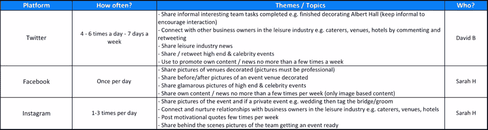
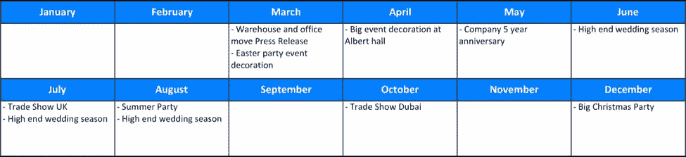
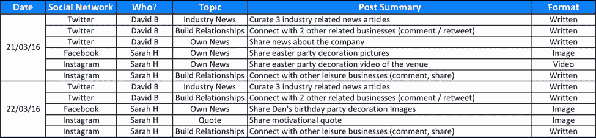
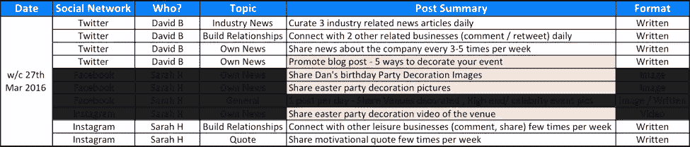

# 将启动你的社交媒体计划的 5 个问题

> 原文：<https://www.sitepoint.com/5-questions-that-will-kickstart-your-social-media-plan/>

无论你从事什么类型的商业活动，如果你想在竞争中保持领先地位，并创造更多的线索和客户，社交媒体是至关重要的。企业开始理解社交媒体营销的价值。越来越多的用户在搜索产品或服务时，更喜欢在脸书等社交网络上进行查询，而不是去搜索引擎。

但是，使用社交媒体不仅仅是在 Twitter 和脸书上建立账户，发布帖子和撰写推文。你需要积极主动，提供人们想要的信息。没有一个明确的计划，社交媒体活动可能是浪费时间——或者更糟，导致灾难。

因此，为了产生影响，您必须首先制定并致力于长期战略，包括内容和社交媒体计划，以及有效的管理和绩效监控手段。

规划阶段可能是你的社交媒体活动中最困难的部分，并将在很大程度上决定其成败。下面是你需要回答的五个问题，来启动你的社交媒体活动。

## 你想通过社交媒体达到什么目的？

社交媒体网络本质上是多才多艺的，所以在开始社交媒体活动之前，对你希望实现的目标有一个清晰的愿景是很重要的。这些目标需要是可衡量的，这样你就可以跟踪你的活动的进展，并在事情进展不顺利时转移你的注意力。

这对于确定你将注册哪些平台、你将在哪些平台上发帖的频率、你将为这项任务分配多少资源和人员，以及你将用来量化你发帖结果的指标和关键绩效指标至关重要。

社交媒体战略最明显的目标是增加你的公司和品牌的存在，扩大你的影响范围。但是你可以实现更多。这里有几个例子:

*   **增加您网站的流量:**通过在您的社交媒体账户上分享您网站内容的链接，您为用户提供了推荐您网站的新渠道。如果你有特定的产品和登录页面，确保你已经设置了适当的分析工具和搜索流，以便以后跟踪进展。
*   **提高公司可信度:**拥有强大社交媒体影响力的公司更有可能被媒体和记者考虑。你需要与相关账户和标签互动，并在设置账户后参与对话。
*   **提供额外的客户服务并创建新的销售线索挖掘渠道:**许多客户更喜欢通过社交网络进行查询和提问，而不是发送电子邮件或打电话。社交媒体可以为你提供接触新朋友的机会。

## 你在追谁？

在开始你的社交之旅之前，你需要定义你的目标受众，因为这将对你的帖子的内容和语气产生直接影响，这些内容和语气自然要根据将要查看它们的人来定制。

有许多因素可以帮助你识别你的受众，包括兴趣、年龄、性别、收入和居住地区。当使用脸书广告等社交媒体广告服务时，了解目标受众的特征将有助于让你的活动更加有效。

## 你应该使用哪些平台？

你必须提前决定你将把注意力集中在哪里，并选择你将用于你的活动的平台。

随着社交媒体比以往任何时候都更加分散，数十个数百万用户的平台可供注册，在选择目标频道时很容易感到困惑。选择错误的平台会让你的社交媒体活动变成一场灾难，而选择正确的渠道会对实现你的商业目标大有帮助。

在很大程度上，你必须让你的目标受众的人口统计和偏好来选择你将用于你的活动的社交媒体网络。

找出你应该花时间在哪些社交网络上的另一种方法是看看你已经在哪些网络上取得了成功。如果你已经在使用谷歌分析等分析工具来收集网站的流量数据，这很容易实现。Dlvr.it 博客作者 Debra Garber 在这里解释了如何做到这一点。

皮尤研究中心为顶级社交媒体平台收集了[人口统计信息](http://www.pewinternet.org/2015/08/19/the-demographics-of-social-media-users/)，这些信息也有助于你选择起点。

最好从与你的业务最相关的几个平台开始，然后随着你在每个平台上的完善，逐步扩大你的网络。每个社交媒体平台都有自己独特的优势，可以帮助你的企业以这样或那样的方式发展。

例如，如果你在经营一家餐馆或咖啡馆，你可能会考虑花一些额外的精力建立你的 Instagram 账户，在那里照片——尤其是食物的照片——会被更广泛地分享。

与此同时，一家招聘机构将会发现，在 LinkedIn 上率先开展活动会更成功，因为在 LinkedIn 上找到找工作的专业人士更容易。

还要注意，您选择的平台将定义所需的活动和响应。例如，当 Twitter 用户提到你的手柄时，他们通常希望得到自发和近乎即时的回应，如果你不回复他们的推文，他们最终会选择竞争对手。因此，如果你没有资源快速回答，在 Twitter 这样的平台上注册可能会对你的商业目标产生负面影响。

在开始使用每个平台之前，请确保您了解其动态。丽贝卡·拉迪切有一篇[帖子](http://rebekahradice.com/kickstart-a-social-media-strategy/)，它将帮助你熟悉主要的社交媒体平台以及应该在每个平台上发布的内容类型。

## 你应该发布什么内容，多久发布一次？

最好的内容策略是包含混合内容的策略。需要有展示你的产品的帖子，但其他帖子需要针对你的目标受众的具体需求和兴趣。如果你只是发布关于你的最新报价和价格的平淡无奇的信息，人们很可能会在未来忽视和避开你。策划一些有趣的帖子，比如与你的行业、产品和服务相关的新闻故事、操作方法文章、视频和图片列表。

可以帮助你规划内容的一个指导方针是 [Marketo 的 411 规则](http://www.marketo.com/_assets/uploads/Your-Sample-Social-Editorial-Calendar.pdf)，这意味着为每个软推广(如活动)和硬推广(如演示、产品等)发布四个教育或娱乐帖子。基本上，它意味着通过提供价值来获得你的观众的信任。

也要直接与你的受众交流，鼓励人们不断与你的品牌互动。

这通常是社交媒体营销被遗忘的方面。许多企业一周在他们的账户上发布几次，然后就不管了。你需要向你的顾客展示你在乎每个人对你的生意的看法。

事实上，你发布的大部分内容以及发布的频率将取决于你的客户进行的活动。如果他们问你一个问题，回答它(即使只是简单的谢谢)，如果他们发布了你的产品的照片，重新发布(或转发或分享)。建立积极的联系大大增加了追随者转化和购买的可能性。

这些简单的手势对管理与你的追随者的关系和创造一个稳定的忠诚客户群大有帮助，如果这是你希望通过你的活动获得的。不要低估销售产品或服务时情感的力量。

不要一头扎进在你的社交媒体账户上发布更新，考虑首先创建一个你计划在每个平台上发布的内容的高层次视图。这将有助于你确保涵盖你所在行业的所有话题和领域。它还将帮助您更好地规划每个网络的用户参与度。您可以使用以下计划作为安排内容帖子的指南。

**示例:高级社交计划(针对某活动装饰公司)**

## 明天，下周或下个月我应该发布什么？

没有时间表，任何活动都不应该开始。为你未来至少四到六个月的活动勾勒出大致的轮廓。首先为您的活动迭代设置里程碑和截止日期，并定义每个阶段的目标。也要留意日历上的场合、假日和事件，并做上标记。每一个都可能是推动你的活动的机会，你应该提前计划好。

**示例:未来一年计划的关键业务活动(针对活动装饰公司)**

提前计划将有助于您降低风险并预测营销活动的成功。它还提供了灵活性:一旦你启动了你的活动，你就能够将你的表现与你的活动的目标和期限进行比较，并对每个阶段做出正确的调整和修正。每日、每周或每月的日历是否适合你的需要取决于你自己。这里的关键是为未来做好准备，并能够应对意想不到的转折和曲折。

编辑日历可以节省您大量的时间，并帮助您安排您的社交内容发布。强烈建议创建并维护一个。理想情况下，你应该能够预见未来的一个月或一周(取决于你的业务和特定的社交策略)，并清楚地知道某些内容何时会在社交媒体上分享。

**示例:编辑日历(某活动装饰公司)**

*日视图*

*周视图*

注意:在周视图中突出显示了特定的任务，因为它们是特定于该周的，而不是从前一周滚动过来的一般任务。

社交媒体是一个强大的工具，应该被包括在每个企业的军火库中。学会为它做计划并利用它的力量，你就会成功。

## 分享这篇文章