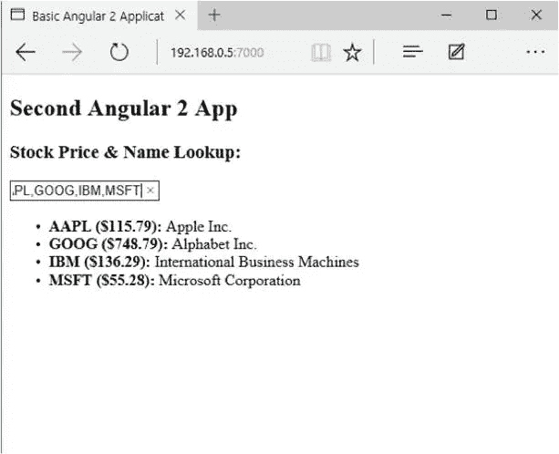
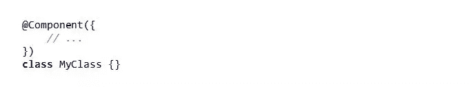
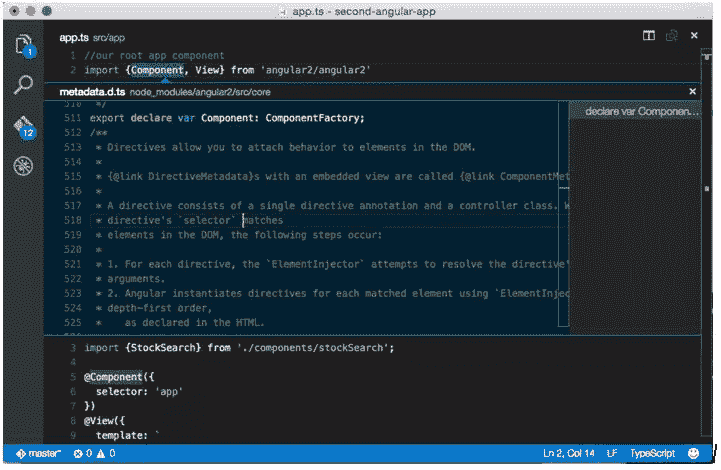
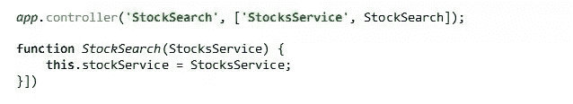
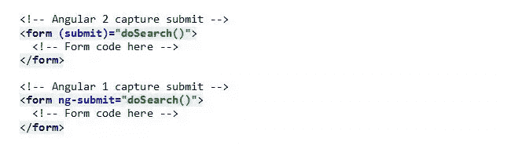

# 在 Angular 2 中通过 Hello World

> 原文：<https://www.sitepoint.com/getting-past-hello-world-angular-2/>

本文是微软网站开发系列的一部分。感谢您对使 SitePoint 成为可能的合作伙伴的支持。

你已经完成了基本的 Angular 2 应用，现在你想要更多。如果你一直在阅读 Angular 2，你肯定已经看到了模板中看起来非常奇怪的语法。您可能已经听说过关于依赖注入的大检查。或者可能是 ES7(或 ES2016，计划明年推出的 JavaScript 版本)的一些功能，如装饰器和 Observables。这篇文章将向你简要介绍这些概念，以及它们如何应用到 Angular 2 应用中。我们还不会深入探讨这些话题，但是可以在以后的文章中更详细地了解每个领域。

那么，让我们从头开始——设置一个环境。

## 环境设置

Angular2 源代码是用 TypeScript 编写的，TypeScript 是 JavaScript 的超集，允许将类型定义应用到您的 JavaScript 代码中(您可以在[www.typescriptlang.org](http://www.typescriptlang.org/)找到关于 TypeScript 的更多信息)。

为了使用 TypeScript，我们需要安装运行在 Node.js 之上的编译器，我用的是 Node 0.12.6 和 NPM 2.9.1。TypeScript 应该由 NPM 自动安装，但是您也可以使用以下命令全局安装 TypeScript:

```
 npm install –g typescript
# Test using
tsc -v 
```

我们也在使用 Gulp 来构建项目。如果您没有全局安装 Gulp，请使用以下命令:

```
npm install -g gulp-cli
```

安装完 Node 后，使用以下说明来设置和启动您的简单应用程序:

```
 git clone https://github.com/DevelopIntelligenceBoulder/second-angular-app
cd second-angular-app
npm install
gulp go 
```

在浏览器中，导航到 [http://localhost:8080](http://localhost:8080/) (或在 http://secondangular2.azurewebsites.net/[部署的版本](http://secondangular2.azurewebsites.net/))。您应该看到一个非常基本的应用程序，如下所示:



这是一个简单的应用程序，以逗号分隔的股票代码作为输入，检索包括价格和股票名称在内的数据，并在一个简单的列表中显示它们。这缺乏风格，但是我们可以用它来演示一些思考 Angular 2 应用程序的方法。

## 成分

Angular 2 应用程序是使用组件构建的。但是什么是组件呢？我们如何在 Angular 2 中设置一个组件？

在高层次上，组件是一组组合在一起的功能，包括视图、样式(如果适用)和管理组件功能的控制器类。如果你熟悉 Angular 1，组件基本上就是一个带有模板和控制器的指令。事实上，在 Angular 2 中，组件只是封装了可重用 UI 构建块的一种特殊类型的指令(最低限度是一个控制器类和一个视图)。

我们将通过检查 StockSearch 组件来查看组成组件的各个部分。在我们的简单应用程序中，StockSearch 组件显示输入框，并包含一个名为 StockList 的子组件，用于呈现从 API 返回的数据。

## 装修工

Decorators 是 ES7 中的一个新特性，你会看到它们在源代码中由一个前导符号“@”标识。Decorators 用于向 Angular 提供关于类(有时是方法或属性)的元数据，以便将它们连接到 Angular 框架中。装饰者总是出现在他们正在装饰的类或属性之前，所以你会看到这样的代码块:



这个模块使用组件装饰器告诉 Angular`MyClass`是一个角度组件。

> 注意:关于装饰器和注释(Angular 2 中使用的一种特殊类型的装饰器)的深入讨论，请参见 [Pascal Precht](https://twitter.com/PascalPrecht) 关于[注释和装饰器的区别](http://blog.thoughtram.io/angular/2015/05/03/the-difference-between-annotations-and-decorators.html)的帖子。

## 检查组件

让我们进入一些代码。下面是 StockSearch 组件，负责接收用户输入，调用服务来查找股票数据，并将数据传递给子 StockList 组件。我们将使用这个示例来讨论构建 Angular 2 应用程序的关键部分:

```
 import {Component, View} from 'angular2/core'
import {StockList} from './stockList'
import {StocksService} from '../services/stocks'

@Component({
	selector: 'StockSearch',
	providers: [StocksService]
})
@View({
template: `
	<section>
	<h3>Stock Price & Name Lookup:</h3>
	<form (submit)="doSearch()">
	<input [(ngModel)]="searchText"/>
	</form>
	<StockList [stocks]="stocks"></StockList>
	</section>
	  `,
	directives: [StockList]
})
export class StockSearch {
	searchText: string;
	stocks: Object[];

	constructor(public stockService:StocksService) {}

	doSearch() {
		this.stockService.snapshot(this.searchText).subscribe(
			(data) => {this.stocks= data},
			(err) => {console.log('error!', err)}
	    );
  	}
} 
```

(本帖截图来自 Mac 中的 [Visual Studio 代码。)](https://code.visualstudio.com/Download/?WT.mc_id=16548-DEV-sitepoint-article84)

> 虽然我对 TypeScript 比较陌生，但我在编写 Angular2 应用程序时一直很喜欢它。TypeScript 在 IDE 或文本编辑器中显示类型信息的能力非常有用，尤其是在处理 Angular2 这样的新事物时。
> 
> 我惊喜地发现 Visual Studio 代码与 TypeScript 集成得如此之好。事实上，它是用 TypeScript 编写的，默认情况下可以解析它(不需要插件)。在 Angular2 中编码时，我发现自己经常查阅文档，直到我发现了“Peek Definition”功能。此功能允许您突出显示任何变量，并使用键盘快捷键(在 Mac 上为 Opt-F12)来查看该变量的源代码。由于 Angular2 的文档存在于源代码中，我发现我很少需要去查阅在线文档。在组件装饰器上使用 Peek 定义如下所示:



### 导入报表

文件顶部的导入语句引入了该组件使用的依赖项。当你创建一个组件时，你几乎总是在顶部使用`import {Component, View} from 'angular2/core`。这一行引入了组件和视图装饰器。

Angular 2 还要求您明确地告诉框架您想要使用的任何子组件(或指令)。所以下一行`(import {StockList} from './stockList')`拉进了 StockList 组件。

同样，我们确定我们将需要的任何服务。在这种情况下，我们希望能够使用 StockService 请求数据，因此最后一次导入会将数据拉入。

### 选择器和模板

传递给组件和视图装饰者的`selector`和`template`属性是构建 Angular 2 组件所需的两个配置选项。选择器告诉 Angular 如何在 HTML 中找到这个组件，它理解 CSS 选择器语法。
与普通 HTML 不同，Angular 2 模板区分大小写。因此，在 Angular 1 中，我们使用连字符将骆驼案制作成烤肉串案，在 Angular 2 中，我们不需要这样做。这意味着我们现在可以使用大写字母来开始我们的组件选择器，这将它们与标准 HTML 区分开来。所以:

```
 selector: 'StockSearch' // matches <StockSearch></StockSearch>
selector: '.stockSearch' // matches <div class="stockSearch">
selector: '[stockSearch]' // matches <div stockSearch> 
```

当 Angular 编译器遇到与这些选择器之一匹配的 HTML 时，它会创建一个组件类的实例，并呈现模板属性的内容。您可以使用`template`创建内联模板，或者使用`templateUrl`传递包含 HTML 模板的 URL。

### 依赖注入(“提供者”和“指令”)

如果你熟悉 Angular 1，你会知道它使用依赖注入将服务、工厂和值传递给其他服务、工厂和控制器。Angular 2 也有依赖注入，但是这个版本更健壮一些。

在上面的组件中，类(控制器)被称为 StockSearch。StockSearch 需要使用 StockService 进行调用来获取股票数据。考虑以下简短的代码片段:

```
 import{StocksService} from '../services/stocks'

@Component({
	selector: 'StockSearch',
	providers: [StocksService]
})
export class StockSearch {
	constructor(public stockService:StocksService) {}
} 
```

与其他类一样，`import`语句使`StocksService`类可用。然后我们将它传递给传递给`Component`装饰器的`providers`属性，当它被传递给 StockSearch 构造函数时，它提醒 Angular 我们想要使用依赖注入来创建一个`StocksService`的实例。

构造函数看起来非常简单，但实际上在这一行代码中发生了很多事情。

### 公共关键字

public 关键字告诉 TypeScript 将`stockService`(*came case*，而不是类名 *PascalCase* )变量放到 StockSearch 组件的实例上。StockSearch 的方法将引用它为`this.stockService`。

### 类型声明

在`public stockService`之后是`:StocksService`，它告诉编译器变量`stockService`将是`StockService`类的一个实例。因为我们使用了组件装饰器，所以构造函数上的类型声明导致 Angular 的依赖注入模块创建 StocksService 类的一个实例，并将其传递给 StockSearch 构造函数。如果您熟悉 Angular 1，类似的代码行应该是这样的:



Angular 1 和 Angular 2 依赖注入系统之间的一个关键区别是，在 Angular 1 中，只有一个大的全局名称空间用于应用程序中的所有依赖。如果你通过在代码的两个不同地方调用`app.controller('MyController', …)`来注册一个控制器，第二个被加载的将会覆盖第一个。(注意，这个覆盖问题不适用于 Angular 1 中的指令。通过在多个地方调用`app.directive('myDirective', …)`来注册一个指令会增加早期定义的行为，而不是覆盖它。)

在 Angular 2 中，通过明确定义在每个视图中使用哪些指令，这种混乱得到了解决。所以`directives: [StockList]`告诉 Angular 在我们的视图中寻找 StockList 组件。如果没有定义该属性，Angular 不会对“`<StockList>`”HTML 标签做任何事情。

### 属性和事件

查看传递给视图装饰器的`template`,我们看到一个新的语法，其中一些属性被括号括起来，一些被括号括起来，一些被括号括起来。

#### 圆括号

用括号将属性括起来，告知 Angular 通过属性名称监听事件。所以`<form (submit) = "doSearch()">`告诉 Angular 监听`form`组件上的`submit`事件，当提交发生时，应该运行当前组件的`doSearch`方法(在本例中，`StockSearch`是当前组件)。



#### 方括号

用方括号将属性括起来，告诉 Angular 将属性值解析为表达式，并将表达式的结果赋给目标组件上的属性。所以`<StockList [stocks] = "stocks"></StockList>`将在当前组件(StockSearch)上寻找一个股票变量，并将其值传递给属性“StockList”中的 stock list 组件。在 Angular 1 中，这需要使用 Directive Definition 对象进行配置，但是只看 HTML，并没有指示如何使用该属性。

```
 <!-- Angular 2 we know [stocks] causes "stocks" to 
  parsed and passed to StockList component -->
<StockList[stocks] = "stocks"></StockList>

<!-- Angular 1 doesn't use brakcets. Looking just at 
  the HTML we don't know how the directive is using 
  the stocks attribute -->
<stock-list stocks = "stocks"></stock-list> 
```

#### 方括号和圆括号

这是一个可用于`ngModel`指令的特殊语法。它告诉 Angular 创建一个双向绑定。所以`<input [(ngModel)] = "searchText">`连接了一个 input 元素，输入到输入中的文本被应用到 StockSearch 组件的`searchText`属性。类似地，StockSearch 实例中对`this.searchText`的更改会导致输入值的更新。

```
 <!-- Angular 2 requires both event and attribute
  bindings to be explicitly clear we want 2-way binding -->
<input [(ngModel)] = "searchText">

<!-- Angular 1 looks simpler without the [(...)]. -->
<input ng-model = "searchText"> 
```

## 服务

对服务更深入的解释将是以后文章的主题，但是我们的应用程序定义了一个 StockService，用于进行 HTTP 调用来检索数据。因此，让我们来看一下服务，并浏览一下各个部分:

```
 //a simple service
import {Injectable} from 'angular2/core';
import {Http, URLSearchParams} from 'angular2/http';

@Injectable()
export class StocksService {
	// TS shortcut "public" to put http on this
	constructor(public http:Http) {}

	snapshot(symbols:string): any {
		let params = new URLSearchParams();
		params.set('symbols', symbols);

		return this.http.get("/api/snapshot", {search: params})
		.map(res => res.json()) // convert to JSON
		.map(x => x.filter(y => y.name)); // Remove stocks w/no name
	}
} 
```

### @ injectible()decorator

在 Angular 2 中，我们使用可注入装饰器让 Angular 知道一个类应该用依赖注入来注册。如果没有这一点，我们在 StockSearch 组件中使用的 providers 属性就不会工作，依赖注入也不会创建一个传递给控制器的服务实例。因此，如果您想用依赖注入来注册一个类，请使用可注入装饰器。

### HTTP 服务

我们将在未来深入探讨 Angular 2 的 HTTP 库，但概括来说，它允许您调用所有基本的 HTTP 方法。类似于我们使 StockService 对 StockSearch 构造函数可用的方式，我们使用`public http:Http`在“this”对象上添加“http”。

如果你看一下“快照”方法，你会看到我们调用`/api/snapshot`，然后传递一个带有搜索参数的配置对象。这非常简单，但是在底部要注意`.map(...)`。在 Angular 1 中(和大多数现代 HTTP 库中一样)，HTTP 调用返回一个“承诺”。但是在角度 2 中我们得到了一个可观测的。

一个可观察的东西就像一个承诺，但它可以被多次解决。关于可观测量有很多需要了解的，我们会在接下来的文章中介绍，但是要了解更多可观测量的信息，请留出一些时间来浏览[这篇文章](https://gist.github.com/staltz/868e7e9bc2a7b8c1f754)和练习，以便跟上进度。

## 组件树

我们已经看了一个组件和它访问的一个服务。Angular 2 应用程序是通过构建一个组件树构建的，从一个根应用程序组件开始。应用程序组件应该包含很少的逻辑，因为它的主要目的是布局应用程序的顶层部分。

```
 //our root app component
import {Component, View} from 'angular2/core'
import {StockSearch} from './components/stockSearch';

@Component({
	selector: 'App'
})
@View({
template: '
	<header>
	<h2>Second Angular 2 App</h2>
	</header>
	<StockSearch></StockSearch>',
	directives: [StockSearch]
})
export class AppComponent {} 
```

现在我们已经熟悉了连接组件的语法，我们可以看到模板输出了头部，后面是 StockSearch 组件。StockSearch 在指令列表中，所以 Angular 在遇到`<StockSearch>`标签时呈现组件。

这就是应用程序组件的全部内容；它只是我们应用程序的根。在任何 Angular 2 应用程序中只能有一个根，这个难题的最后一部分是告诉 Angular 去寻找它。

## 引导我们的应用程序

在 Angular 2 应用程序中，我们需要告诉 Angular 何时启动。这是使用`bootstrap`方法完成的，传入我们的`AppComponent`以及其他模块依赖项。对于熟悉 Angular 1 的人来说，这类似于主要的`angular.module(name, [dependencies...])`构造。

```
 //our root app component
import {bootstrap} from 'angular2/platform/browser';
import {HTTP_PROVIDERS} from 'angular2/http';
import 'rxjs/Rx';
import {AppComponent} from './app';

bootstrap(AppComponent, [HTTP_PROVIDERS])
.catch(err =>console.error(err)); 
```

注意第二个参数是`[HTTP_PROVIDERS]`。这是一个特殊的变量，引用定义 Angular 2 的 HTTP 功能的类，它需要让 Angular 知道我们可以在我们的应用程序中使用 HTTP 类。角 1 当量看起来像这样:

```
 // JavaScript code to set up the app
angular.module('App', ['ngResource']);

<!-- Corresponding HTML tag pointing to "App" module -->
<div ng-app="App"></div> 
```

还要注意我们在顶部有`import 'rxjs/Rx'`。这引入了 RxJs 库，因此我们可以访问 Observables 上的方法。如果不添加这一行，我们将无法在从`http.get()`方法返回的结果上运行`.map()`，因为返回的可观察对象没有可用的 map 方法。

一旦应用程序被引导，Angular 就会在我们的标记中寻找我们的根组件。回头看看`AppComponent`，选择器被设置为 app，所以 Angular 将寻找一个元素`<app>`，并在那里呈现`AppComponent`:

```
 <!DOCTYPE html>
<html>
    <head>
         <title>Basic Angular 2 Application Demonstration</title>
    </head>
    <body>
         <App>
             loading...
         </App>
         <script src="/lib/angular2-polyfills.js"></script>
         <script src="/lib/system.js"></script>
         <script src="/lib/Rx.js"></script>
         <script src="/lib/angular2.dev.js"></script>
         <script src="/lib/http.dev.js"></script>
         <script>
         System.config({
	      //packages defines our app package
	      packages: {'app': {defaultExtension: 'js'}}
         });

         System.import('app/bootstrap')
         .catch(console.error.bind(console));
         </script>

     </body>
</html> 
```

## 摘要

当考虑 Angular 2 应用程序时，请考虑组件及其子组件。在应用程序中的任何时候，您都在检查某个组件，并且该组件知道它的子组件是什么。这是一种自上而下的方法，在每一层，您都定义了划分好的功能，最终形成一个完整的应用程序。

## 更多的 Web 开发实践

这篇文章是微软和 [DevelopIntelligence](http://www.developintelligence.com/) 关于实用 JavaScript 学习、开源项目和互操作性最佳实践的 web 开发系列的一部分，包括[微软 Edge](http://blogs.windows.com/msedgedev/2015/05/06/a-break-from-the-past-part-2-saying-goodbye-to-activex-vbscript-attachevent/?WT.mc_id=16548-DEV-sitepoint-article84) 浏览器和新的 [EdgeHTML 渲染引擎](http://blogs.windows.com/msedgedev/2015/02/26/a-break-from-the-past-the-birth-of-microsofts-new-web-rendering-engine/?WT.mc_id=16548-DEV-sitepoint-article84)。

[DevelopIntelligence](http://www.developintelligence.com/) 为技术团队和组织提供讲师指导的 [JavaScript 培训](http://www.developintelligence.com/catalog/javascript-training)、 [AngularJS 培训](http://www.developintelligence.com/catalog/web-development-training/angularjs)和其他 [Web 开发培训](http://www.developintelligence.com/catalog/web-development-training)。

我们鼓励您在 dev.microsoftedge.com 使用免费工具进行跨浏览器和设备测试，包括 Windows 10 的默认浏览器 Microsoft Edge:

*   [扫描你的网站，寻找过时的库、布局问题和可访问性](http://dev.modern.ie/tools/staticscan/?utm_source=SitePoint&utm_medium=article84&utm_campaign=SitePoint)
*   [下载适用于 Mac、Linux 和 Windows 的免费虚拟机](http://dev.modern.ie/tools/vms/windows/?utm_source=SitePoint&utm_medium=article84&utm_campaign=SitePoint)
*   [跨浏览器检查网络平台状态，包括微软 Edge 路线图](https://dev.modern.ie/platform/status/?utm_source=SitePoint&utm_medium=article84&utm_campaign=SitePoint)
*   [在您自己的设备上远程测试 Microsoft Edge](https://remote.modern.ie/?utm_source=SitePoint&utm_medium=article84&utm_campaign=SitePoint)

从我们的工程师和传道者那里获得更深入的学习:

*   **互操作性最佳实践** ( [系列](https://channel9.msdn.com/Blogs/BeLux-Developer/Riding-the-Modern-Web-5-things-to-consider-as-a-web-developer?WT.mc_id=16548-DEV-sitepoint-article84)):
    *   [如何避免浏览器检测](https://channel9.msdn.com/Blogs/BeLux-Developer/Riding-the-Modern-Web-Avoiding-Browser-Detection?WT.mc_id=16548-DEV-sitepoint-article84)
    *   [使用 CSS 前缀的最佳实践](https://channel9.msdn.com/Blogs/BeLux-Developer/Riding-the-Modern-Web-CSS-Vendor-Prefixes?WT.mc_id=16548-DEV-sitepoint-article84)
    *   [保持你的 JS 框架&库更新](https://channel9.msdn.com/Blogs/BeLux-Developer/Riding-the-Modern-Web-Dealing-with-JavaScript-Libraries?WT.mc_id=16548-DEV-sitepoint-article84)
    *   [构建插件免费网络体验](https://channel9.msdn.com/Blogs/BeLux-Developer/Riding-the-Modern-Web-Dealing-with-Plugins?WT.mc_id=16548-DEV-sitepoint-article84)
*   [GitHub 编码实验室:跨浏览器测试和最佳实践](https://github.com/deltakosh/interoperable-web-development?WT.mc_id=16548-DEV-sitepoint-article84)
*   哇，我可以在 Mac 电脑上测试 Edge & IE 浏览器& Linux！(来自雷伊·班戈)
*   [在不破坏网络的情况下推进 JavaScript】(来自 Christian Heilmann)](http://channel9.msdn.com/Events/WebPlatformSummit/2015/Advancing-JavaScript-without-breaking-the-web?WT.mc_id=16548-DEV-sitepoint-article84)
*   [用 WebGL 释放 3D 渲染](https://channel9.msdn.com/Events/WebPlatformSummit/2015/Unleash-3D-rendering-with-WebGL-and-Microsoft-Edge?WT.mc_id=16548-DEV-sitepoint-article84)(来自 David Catuhe)
*   托管网络应用和网络平台创新

我们的社区开源项目:

*   伏龙。JS (跨设备远程 JavaScript 测试)
*   [manifoldJS](http://manifoldjs.com/?WT.mc_id=16548-DEV-sitepoint-article84) (部署跨平台托管的 web 应用)
*   [babylonJS](http://babylonjs.com/?WT.mc_id=16548-DEV-sitepoint-article84) (轻松制作 3D 图形)

更多免费工具和后端 web 开发工具:

*   [Visual Studio 代码](https://code.visualstudio.com/?WT.mc_id=16548-DEV-sitepoint-article84)(用于 Mac、Linux 或 Windows 的轻量级代码编辑器)
*   [Visual Studio 开发基础知识](https://www.visualstudio.com/en-us/products/visual-studio-dev-essentials-vs.aspx?WT.mc_id=16548-DEV-sitepoint-article84)(基于订阅的免费培训和云优势)
*   [用节点编码。JS](https://www.microsoftvirtualacademy.com/en-US/training-courses/building-apps-with-node-js-jump-start-8422?WT.mc_id=16548-DEV-sitepoint-article84) 与[在蔚蓝云上试用](https://azure.microsoft.com/en-us/pricing/free-trial/?WT.mc_id=16548-DEV-sitepoint-article84)

## 分享这篇文章