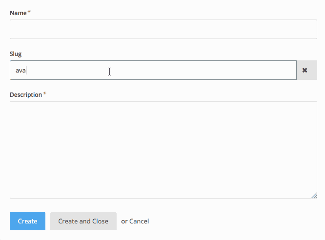

# 像专家一样构建 OctoberCMS 表单域小部件

> 原文：<https://www.sitepoint.com/building-octobercms-form-field-widgets-like-a-pro/>


用任何 CMS 创建你的商业网站都需要使后端用户友好，这意味着使表单有意义和可访问。在本文中，我们将探索 OctoberCMS 表单小部件，并创建一个名为`UniqueValue`的小部件，它帮助用户输入一个唯一的值。这对于输入电子邮件、用户名、帖子等非常有用。让我们开始吧。

## 可用的表单小部件

OctoberCMS 提供了一系列简单的字段类型，如电子邮件输入、密码、下拉选项等。[文档](https://octobercms.com/docs/backend/forms#field-types)有所有可用字段的列表。此外，CMS 还提供了一些[定制小工具](https://octobercms.com/docs/backend/forms#field-types)，比如媒体管理器小工具，可以让你从媒体库或者所见即所得编辑器、降价编辑器等中选择一个项目。

这里我们应该提到的一个有趣的小部件是[中继器小部件](https://octobercms.com/docs/backend/forms#widget-repeater)。假设你有一个食谱网站。厨师将输入食谱名称，并开始填入配料。你可能会问用户“你需要多少配料？”基于此，您可以生成表单字段。另一个干净的方法是在表单底部有一个按钮，上面写着`Add new ingredient`，它将在需要时为厨师生成必要的字段。

以下是配方表单的配置示例:

```
// models/recipe/fields.yaml

fields:
    name:
        label: Name
        type: text
        required: true
    ingredients:
        label: Ingredients
        type: repeater
        prompt: Add new ingredient
        form:
            fields:
                ingredient:
                    label: Ingredient
                    type: text
                how_much:
                    label: How much
                    type: number
                unit:
                    label: Unit
                    type: dropdown
                    options:
                        spoon: Spoon
                        ounce: Ounce
                        # etc 
```


## 创建表单小部件

如果你读过[之前的 OctoberCMS 文章](https://www.sitepoint.com/octobercms-crud-building-a-teamproject-management-plugin/)(应该的，很棒！)，你就知道我们建了一个 [CRUD 插件](https://github.com/Whyounes/OctoberCMS_Sitepoint_plugin_demo/)。我们将在本文中使用它，所以请确保将其克隆到您的 OctoberCMS 安装中。

```
# Inside your plugins folder

git clone git@github.com:Whyounes/OctoberCMS_Sitepoint_plugin_demo.git rafie/sitepointDemo 
```

你可以在同一个 [repo](https://github.com/Whyounes/OctoberCMS_Sitepoint_plugin_demo/tree/uniqueValue-formwidget) 的`uniqueValue-formwidget`分支中查看本教程的最终代码。

为了开始构建我们的小部件，我们使用`create:formwidget` scaffolding 命令创建一个视图文件夹、资产文件夹和一个`FormWidgetBase`类。

```
php artisan create:formwidget rafie.SitepointDemo UniqueValue 
```

我们的`UniqueValue`小部件需要三个属性:

*   `modelClass`:将拥有唯一字段的模型类。
*   `selectFrom`:模型内部的字段名称。默认为`name`。
*   `pattern`:显示的输入类型(`text`、`email`、`number`、`url`)。默认为`text`。

在我们的表单小部件类被构造后，它将自动调用继承的`init`方法，该方法负责准备我们的小部件进行呈现。

```
// formwidgets/UniqueValue.php

class UniqueValue extends FormWidgetBase
{
    /**
     * {@inheritDoc}
     */
    protected $defaultAlias = 'rafie_sitepointDemo_uniquevalue';

    /**
     * {@inheritDoc}
     */
    public function init()
    {
    }
} 
```

我们的父类`WidgetBase`提供了一个`fillFromConfig`助手方法，该方法将从`fields.yaml`文件传递的配置属性映射到表单小部件类的属性。

```
// formwidgets/UniqueValue.php

class UniqueValue extends FormWidgetBase
{
    /*
     * Config attributes
     */
    protected $modelClass = null;
    protected $selectFrom = 'name';
    protected $pattern = 'text';

    /**
     * {@inheritDoc}
     */
    protected $defaultAlias = 'rafie_sitepointDemo_uniquevalue';

    /**
     * {@inheritDoc}
     */
    public function init()
    {
        $this->fillFromConfig([
            'modelClass',
            'selectFrom',
            'pattern'
        ]);
        $this->assertModelClass();

        parent::init();
    }

    // ...
} 
```

调用`fillFromConfig`函数后，我们断言模型类存在，然后调用父`init`方法。

```
// formwidgets/UniqueValue.php

class UniqueValue extends FormWidgetBase
{
    // ...

    protected function assertModelClass()
    {
        if( !isset($this->modelClass) || !class_exists($this->modelClass) )
        {
            throw new \InvalidArgumentException(sprintf("Model class {%s} not found.", $this->modelClass));
        }
    }

    // ...
} 
```

```
// formwidgets/uniquevalue/UniqueValue.php

class UniqueValue extends FormWidgetBase
{
    // ...

    public function render()
    {
        $this->prepareVars();

        return $this->makePartial('uniquevalue');
    }

    /**
     * Prepares the form widget view data
     */
    public function prepareVars()
    {
        $this->vars['inputType'] = $this->pattern;
        $this->vars['name'] = $this->formField->getName();
        $this->vars['value'] = $this->getLoadValue();
        $this->vars['model'] = $this->model;
    }
} 
```

OctoberCMS 将在`partials`文件夹中查找部分内容，并将`$this->vars`数组传递给它。

```
// formwidgets/uniquevalue/partials/_uniquevalue.htm

<?php if ($this->previewMode): ?>

    <div class="form-control">
        <?= $value ?>
    </div>

<?php else: ?>
    <div class="input-group">
        <input
            type="<?= $inputType ?>"
            id="<?= $this->getId('input') ?>"
            name="<?= $name ?>"
            value="<?= $value ?>"
            class="form-control unique_widget"
            autocomplete="off"
        />
        <span class="input-group-addon oc-icon-remove"></span>
    </div>

<?php endif ?> 
```

输入具有预览和编辑模式。编辑时，我们显示一个输入，并使用指定的模式填充该类型。在这种情况下，如果我们正在更新记录，该值会自动设置。根据输入的值，`span.input-group-addon`元素将显示一个*检查*或*移除*图标。

### 使用 AJAX

OcotberCMS 有一组脚本，允许您使用 HTML5 数据属性和 AJAX 处理程序更新内容。我们可能会在另一篇文章中详细讨论它，但是如果你好奇的话，你现在可以参考[文档](https://octobercms.com/docs/cms/ajax)来获得更多的细节。

当输入值改变时，我们将检查输入值是否是唯一的。首先，我们需要添加指定后端方法处理程序名称的`data-request`属性。

```
// formwidgets/uniquevalue/partials/_uniquevalue.htm

// ...
        <input
            type="<?= $inputType ?>"
            id="<?= $this->getId('input') ?>"
            name="<?= $name ?>"
            value="<?= $value ?>"
            class="form-control unique_widget"
            autocomplete="off" 
            data-request="onChange"
        />
// ... 
```

接下来，我们使用`data-request-success`属性指定 JS 函数来处理成功请求的响应。它将接收一个参数列表，但最重要的是引用我们的输入的`$el`和保存请求结果的`data`参数。

```
// formwidgets/uniquevalue/partials/_uniquevalue.htm

// ...
        <input
            type="<?= $inputType ?>"
            id="<?= $this->getId('input') ?>"
            name="<?= $name ?>"
            value="<?= $value ?>"
            class="form-control unique_widget"
            autocomplete="off"
            data-request="onChange"
            data-request-success="uniqueInputChanged($el, context, data, textStatus, jqXHR);"
        />
// ... 
```

OctoberCMS 的 AJAX 框架提供了一个`data-track-input`属性，用于在元素发生变化时触发`data-request`处理程序。它接受一个可选的延迟参数，我们可以用它来最小化发送请求的数量。

```
// formwidgets/uniquevalue/partials/_uniquevalue.htm

// ...
        <input
            type="<?= $inputType ?>"
            id="<?= $this->getId('input') ?>"
            name="<?= $name ?>"
            value="<?= $value ?>"
            class="form-control unique_widget"
            autocomplete="off"
            data-request="onChange"
            data-request-success="uniqueInputChanged($el, context, data, textStatus, jqXHR);"
            data-track-input="500"
        />
// ... 
```

我们仍然没有在表单小部件类中定义我们的`onChange`处理程序方法。OctoberCMS 将在后端页面控制器或任何其他使用的小部件中寻找同名的处理程序。为了避免冲突，我们使用全前缀的处理程序名称，它将包括我们的小部件别名。

```
// formwidgets/uniquevalue/partials/_uniquevalue.htm

// ...
        <input
            // ...
            data-request="<?= $this->getEventHandler('onChange') ?>"
            // ...
        />
// ... 
```

```
// formwidgets/uniquevalue/UniqueValue.php

class UniqueValue extends FormWidgetBase
{
    // ...

    public function onChange()
    {
        $formFieldValue = post($this->formField->getName());
        $modelRecords = $this->model->newQuery()->where($this->selectFrom, $formFieldValue);

        return ['exists' => (boolean) $modelRecords->count()];
    }

    // ...
} 
```

`$this->formField->getName()`返回我们用来从 post 数据中获取输入值的输入名称。然后，我们用`selectFrom`配置值和 post 数据调用`modelClass::where`方法。

剩下的唯一一件事就是使用在我们的`data-request-success`属性中定义的 JavaScript 函数来处理请求的结果。我们的 CSS 和 JavaScript 资产加载在`UniqueValue@loadAsserts`方法中。

```
// formwidgets/uniquevalue/UniqueValue.php

class UniqueValue extends FormWidgetBase
{
    // ...

    public function loadAssets()
    {
        // $this->addCss('css/uniquevalue.css', 'rafie.SitepointDemo');
        $this->addJs('js/uniquevalue.js', 'rafie.SitepointDemo');
    }

    // ...
} 
```

```
// formwidgets/uniquevalue/assets/js/uniquevalue.js

function uniqueInputChanged($el, context, data, textStatus, jqXHR)
{
    var addon = $el.parents('.input-group').find('.input-group-addon');

    if( !$el.val().trim() || data.exists )
    {
        addon.removeClass('oc-icon-check').addClass('oc-icon-remove');

        return;
    }

    addon.removeClass('oc-icon-remove').addClass('oc-icon-check');
} 
```

我们查询 addon 元素，测试返回值，并在元素上设置适当的图标类。您可以通过在模型字段配置文件中插入以下代码来测试小部件。

```
// fields.yaml

fields:
    slug:
        label: Slug
        type: \Rafie\SitepointDemo\FormWidgets\UniqueValue
        modelClass: \RainLab\Blog\Models\Post
        selectFrom: slug
        pattern: text 
```

这是小部件的最终演示。



最后一步，我们将把表单小部件注册为系统小部件(`text`、`checkboxlist`等)。

```
// Plugin.php

// ...
/**
 * Registers any form widgets implemented in this plugin.
 */
public function registerFormWidgets()
{
    return [
        'Rafie\SitepointDemo\FormWidgets\UniqueValue' => [
            'label' => 'Unique Value',
            'code' => 'uniquevalue'
        ],
    ];
}
// ... 
```

现在，我们可以通过使用注册代码来使用我们的小部件。

```
// fields.yaml

fields:
    slug:
        label: Slug
        type: uniquevalue
        modelClass: \RainLab\Blog\Models\Post
        selectFrom: slug
        pattern: text 
```

## 结论

在本文中，我们研究了 OcotberCMS 后端表单域小部件，并构建了一个简单的演示小部件来测试它。您可以通过添加新功能来扩展最终的小部件，比如当值不唯一时添加一个`preventSubmit`选项，等等。你可以在 [Github](https://github.com/Whyounes/OctoberCMS_Sitepoint_plugin_demo/tree/uniqueValue-formwidget) 上查看最终版本，如果你有任何问题或评论，你可以在下面留下，我会尽力回答。

## 分享这篇文章