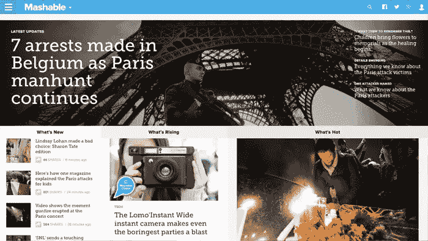
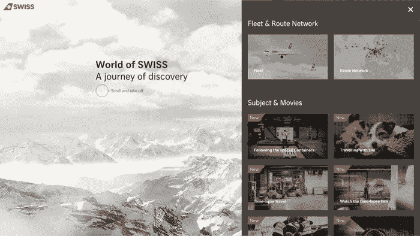
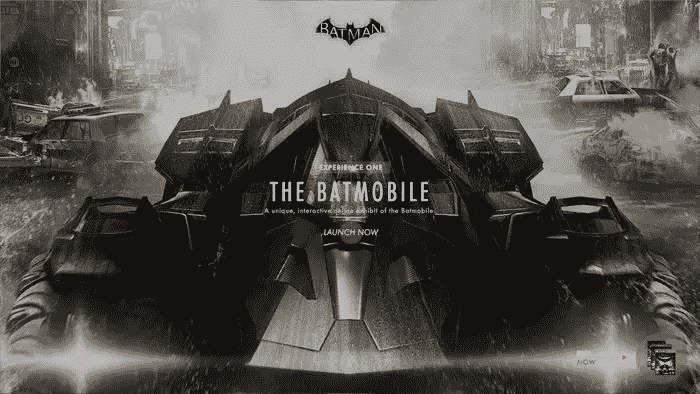
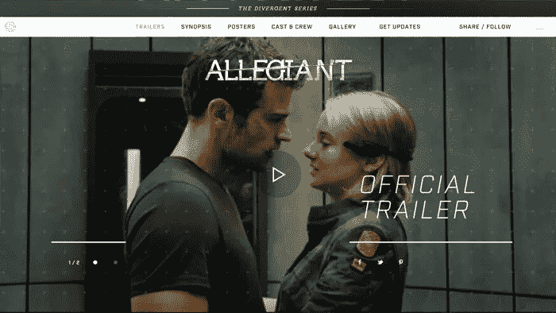
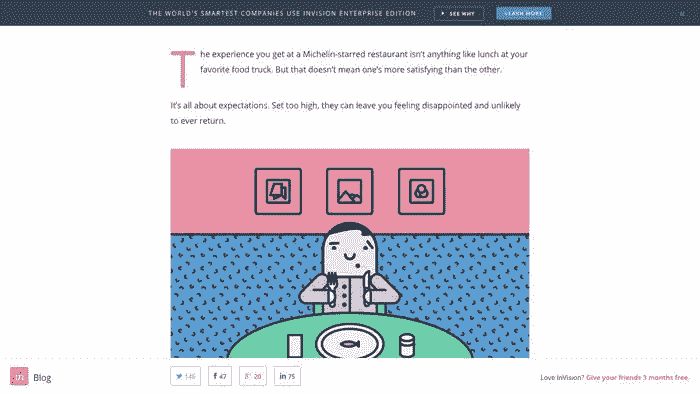
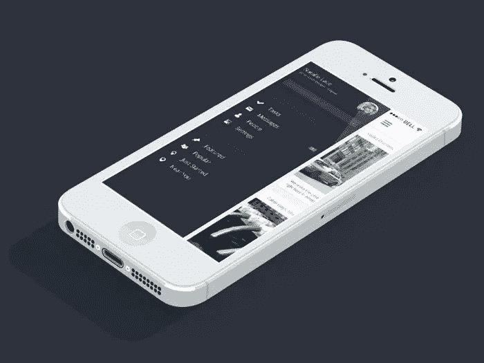
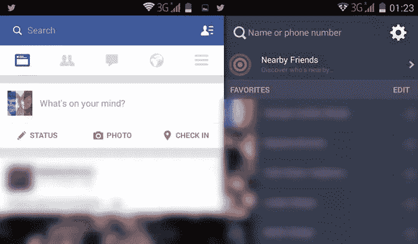

# 你应该避免的 5 个花哨(但无用)的 Web 组件

> 原文：<https://www.sitepoint.com/5-fancy-useless-web-components-avoid/>

每当一个网页设计趋势消失，似乎一个新趋势的旅游巴士出现在地平线上。想要模仿这些趋势也是非常自然的，就好像他们是最新、最酷、最新的摇滚乐队，你绝对必须模仿他们的“样子”。我们内心深处都想成为摇滚明星，对吗？

但是就像伟大的音乐一样，好的网页设计不应该全是华而不实的技巧和视觉效果。它实际上必须*表现好*。

让我们来看看五个时髦的网页组件，它们被时髦的设计师夸大了。

## 1.旋转木马

旋转木马已经失去吸引力有一段时间了——无论如何，肯定是旋转木马的传统概念。

今天，我们倾向于以“主页滑动条”的格式来查看它们，这解决了较小的基于内容的传送带所具有的一些用户体验缺陷。更多的空间意味着更大的点击目标，更大的整体框架意味着我们不需要超级花哨的过渡来窃取焦点。

那么旋转木马到底有什么问题呢？

尽管随着时间的推移，我们已经适应并改进了旋转木马，但事实仍然是，我们通常很难控制如何导航旋转木马。

有时候，我们在幻灯片准备好继续播放之前很久就已经读完了。其他时候，我们仍然在阅读幻灯片，因为它已经从我们身边被撕掉了。随着我们的疲劳，我们的准备程度可能每天都在变化，甚至每小时都在变化。不幸的是，每天没有一个适合所有人的正确时间。

### 替代想法:复杂网格

滚动已经成为网站导航的一个主要特征，尤其是在移动设备上，点击/轻触交互并不可靠。网格允许用户在文本和图像混合的情况下快速滚动和浏览内容。我们的大脑倾向于更熟悉这种类型的概念，因为我们以同样的方式浏览我们的社交媒体。

一个很棒的例子是 Mashable 网站，尽管如今看到像 T2、JD Sports、T4、H、M、T5 这样的大时尚品牌也抛弃旋转木马并不罕见。

## 2.劫机者

在我看来，劫持滚动条是用户需要处理的最不愉快的经历之一。毫无疑问，当用于强化某种基于滚动的动画时，它可以创建一个美丽的用户控制的故事。然而，有些情况下，用户实际上并没有感觉到他或她在滚动。

《瑞士世界》就是其中的一个例子，尤其是该网站提供了普通用户能够理解的普通点击导航。

对于那些不知道的人来说，“scrolljacking”是一种网页设计技术，它超越了用户滚动的默认行为，使屏幕滚动得更快、更慢甚至是向侧面。这不是一个常见的网站功能，所以有理由假设当滚动行为不符合预期时，很大一部分用户会感到困惑。

当然，这可能是一个“酷效应”，但它没有实际价值。

### 另一个想法:别管卷轴了

别管它了。滚动一如既往地简单！

## 3.沉浸式 3D 体验

沉浸式网页设计是操纵人类感官和改变用户精神状态的行为。这是关于以一种超现实的方式给用户留下深刻印象，使他们参与到体验中，首先是通过用户交互在身体上*然后是精神上，因为这种迷人的体验是如何在讲故事、氛围、3D 奇观和动画方面展开的。*

沉浸式网页设计通常用于展示昂贵的奢侈品，如衣服和汽车，但它在电影和娱乐行业也很常见。

这里有一个很好的例子来说明一些缺点。

蝙蝠侠:阿卡姆骑士提供了一个相当令人失望的体验，它破坏了默认的滚动行为，对用户锁定了旋转木马，使用了神秘的图标，有点难以辨认的文本和模糊的按钮；所有这一切都是为了用浮华的视觉效果骚扰用户。

沉浸式网页设计模糊了组件和幻灯片之间的界限，简单地称之为“体验”似乎更合适——就像各种各样的互动故事。

虽然这可能是一个美丽的(和转换)体验，但在没有经过严格测试的情况下实现如此高端的效果可能会导致灾难。

大多数人对传统网站模因都有多年来辛苦积累的经验，所以如果它的外观和行为都不像一个网站，那么你很可能会将访问者流失到选择建立更容易识别的东西的竞争对手那里。

### 另一种想法:建立两个世界的最佳选择

我会推荐一些**适度的**沉浸式的东西，有一个清晰的后退，依靠简单的点击和滚动来导航——也许就像我之前给你展示的瑞士世界的例子。

Insurgent 做得更好，因为交互对用户来说是自动的，默认行为没有被抛弃。如果这些都不适合你，菜单总是固定在网页的顶部，你可以用你习惯的方式导航。

## 4.“喂，点击我，点击我！模态

我们在网站上只花了几秒钟时间，为什么还要订阅时事通讯呢？我们还没有看到内容，我们不知道它是否有价值，也不知道我们是否愿意订阅、喜欢或关注，以便在添加内容时阅读更多内容。

即使模态同时渐变、滑动、弹跳、翻转和旋转，用户也不会被打动。

### 替代想法:中间滚动 CTA 的

我第一次遇到这个想法是在 [InVision App 的博客](http://blog.invisionapp.com/product-design-with-the-worlds-best-restaurants-in-mind/)上:中间滚动的行动号召。基本上，这是通过在网页的顶部和/或底部固定一个组件来实现的，但它只在向下滚动后才会出现。

InVision App 一直在这些部分更换不同类型的 CTA，以测试哪种转化率更高——目前右下角有一个基于链接的行动号召，但几周前这还是一个订阅表单。

基于滚动的行动号召比不请自来的弹出模式更有效，因为用户有时间消化内容；他或她可以做出关于他们是否想要订阅/关注/转换的明智决定，并且网站可以根据用户的位置交换子组件。例如，InVision 只包括文章上的分享按钮。

## 5.隐藏的手机导航

看起来我们已经稳步远离移动设备上的下拉框，这太棒了——它们太大了，太有侵略性了，一旦打开就很难逃脱。

就这样，汉堡包的图标出现了。不管你是否同意它的用法，不可否认，它已经变得很容易辨认了。它会留在这里。

但这是最好的选择吗？画布外的解决方案更大，侵入性更小，这很棒，但有一句话一直困扰着我:“眼不见，心不烦”。此外，在用户开始搜索新的东西之前，需要点击打开菜单，所以这是另一个障碍。

这里有一个由 [Panagiotis Tsamoudakis](https://dribbble.com/shots/1590867-Off-Canvas-Menu) 创作的画布外导航的例子。

它看起来很神奇，但实际上很难接近，除非你有弹性的手指和用意念打开它的能力(当向下滚动时)。此外，它不能用于有大量链接的菜单——我估计 15 个链接已经接近最大值了。

那么你选择什么，更多的空间还是更多的障碍？

### 另一个想法:将画布外和上下文菜单的
结合起来

其实没有对错，只是有**相关和不相关的建议**这种东西。上下文菜单根据您在网站中的位置显示项目，这意味着您仍然可以实现光滑的画布外菜单，并链接到用户可能不需要的东西。

如何定义相关或不相关的内容很大程度上取决于用户通常如何搜索内容。他们合得来吗？搜索？*排序*？让我们来看看脸书的 Android 应用程序。

在上下文菜单中，有五个可点击的图标。其中四个图标非常具体，用户倾向于一天点击几次。

其他的一切都可以从最后一个图标——汉堡包图标来访问。它出现在右手边，这样我们就不用伸手去够了，冗长的好友列表实际上出现在一个完全不同的菜单里；超时尚的非画布菜单。脸书甚至采用了汉堡图标的设计，这样你就能看出区别。

脸书的例子告诉我们，虽然隐藏导航看起来很棒，但它不能被用作一次性链接所有内容的方式。在较小的网站中，无论是不是移动网站，你都应该考虑完全避免脱离画布的导航。

## 结论

仅仅因为我们可以设计和编码所有的东西，并不意味着我们应该这样做。尽管尝试新的趋势是非常令人兴奋的，但是在你决定实施它之前，需要进行一定数量的思考、测试和辩论。

在构建组件之前，有三件事需要问自己:

*   这是必要的组成部分吗？
*   访问该组件的最佳方式是什么？
*   *何时*应该访问该组件？

## 分享这篇文章