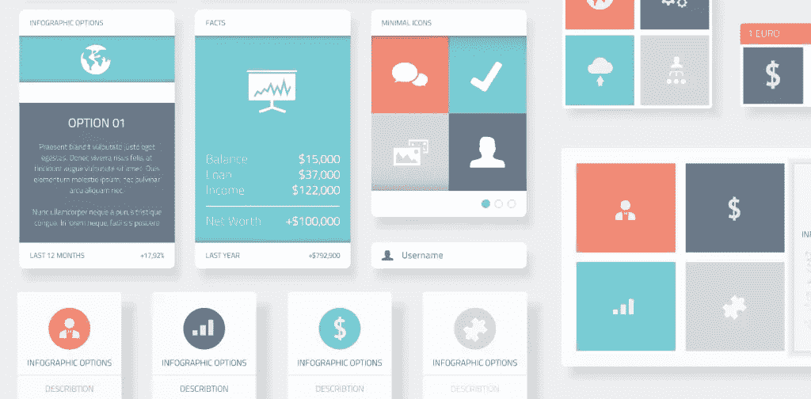
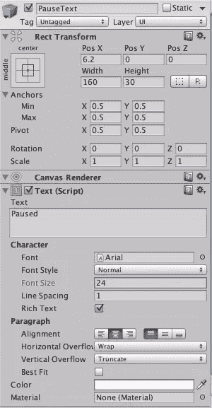
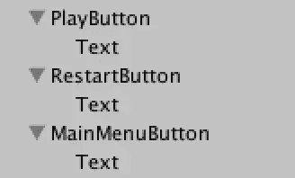
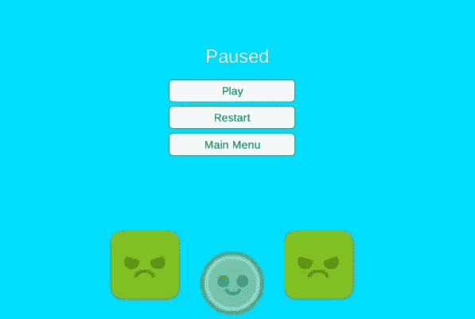
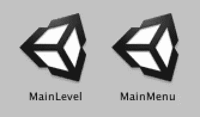
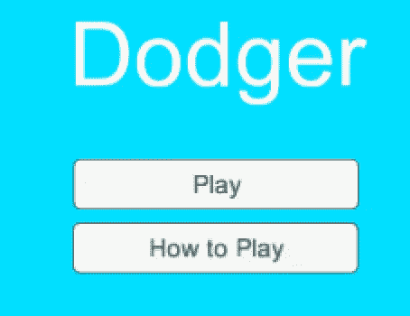
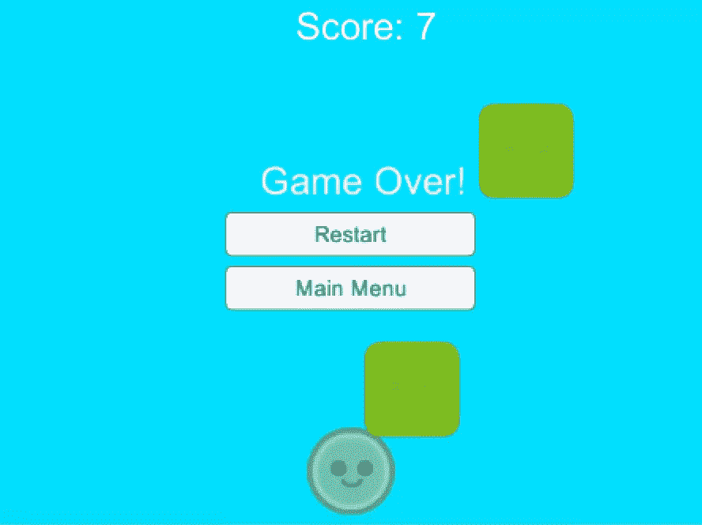

# 在 Unity 中添加暂停、主菜单和游戏界面

> 原文：<https://www.sitepoint.com/adding-pause-main-menu-and-game-over-screens-in-unity/>

按钮、文本、下拉列表等是什么。玩游戏时能看到的？所有这些都是用户界面(UI)的一部分。大多数游戏都有某种类型的用户界面，这使得玩家更容易在不同的关卡之间切换，并激活某些控制(如暂停游戏或重新开始一个关卡)。在之前一篇描述如何在 Unity 中创建 Dodger 的文章中，我们创建了一个小按钮，如果玩家输了就刷新游戏。

在本教程中，我们将把它带到下一个层次，并允许用户暂停或重启游戏，并在不同的场景之间切换。我们还将研究如何只在特定的时间显示特定的 UI 元素——比如当游戏暂停或者玩家死亡/失败的时候。



大多数游戏都包含一个暂停菜单、一个游戏结束屏幕和一个主菜单。由于这些是“完成”游戏所需的少数元素中的一些，我们将把这三个元素都插入到我们的 Dodger 克隆中。此外，我们还将创建一个说明屏幕，以便玩家能够在开始玩游戏之前学习他们可以使用的控件。

完成的游戏可以在 [itch.io](http://quarlwithcode.itch.io/dodger-tutorial-2-game) 玩。

## 创建基本暂停屏幕

暂停屏幕有一组通用的控件，玩家可以用来重新开始一个关卡，回到主菜单，或者取消游戏暂停。暂停屏幕应该只在游戏暂停时可见。在 Unity 中，一般来说，我们可以通过使用`Time.timescale`来区分暂停和未暂停的游戏。如果时间刻度为零，游戏暂停。如果它大于零，游戏就不会暂停(我们将在后面讨论)。我们开始吧！

### 创建暂停文本

首先，我们需要创建一个标题，告诉玩家游戏暂停了。我们应该通过右键单击层次结构窗格并选择 UI -> Text 来创建一个文本对象。让我们将新创建的对象命名为 PauseText。

我们需要创建一个标题，告诉玩家游戏暂停了。我们应该通过右键单击层次结构窗格并选择 UI -> Text 来创建一个文本对象。让我们将新创建的对象命名为 PauseText。

现在我们可以格式化文本对象，让它在游戏屏幕中看起来更好。为了改变文本对象的文本，我们必须在文本属性下的检查器窗格中点击“新文本”字样。在 text 属性中，我们可以将暂停文本的文本更改为“Paused”。为了与游戏的配色方案保持一致，我们应该将文本的颜色改为白色。这可以通过单击颜色对象(可以选择黑色或其他颜色)并选择白色来实现。



让我们调整文字的位置。暂停文本应该在屏幕上水平居中，大约在游戏屏幕的上三分之一处。可以通过更改“矩形变换”属性内的 X 和 Y 值或使用 Unity 编辑器左上角鼠标控制中的四向箭头来移动暂停文本。如果需要的话，我们也可以通过改变宽度和高度属性的值来改变文本的大小。

我们现在需要做的就是标记这个对象，这样在我们添加代码后，程序将能够告诉我们只希望这个对象在游戏暂停时显示。我们可以在显示“未标记”的暂停文本名称下单击，然后单击“添加标记…”。现在我们可以创建一个名为“ShowOnPause”的标签。一旦创建了这个标签，我们需要将它添加到暂停文本中。

### 创建暂停按钮

既然我们已经创建了暂停文本，并为游戏暂停时应该出现的游戏对象添加了一个新标签，我们就可以开始创建组成暂停游戏菜单的按钮了。

我们将创建三个不同的按钮:播放按钮、重启按钮和主菜单按钮。播放按钮将取消暂停游戏，重启按钮将重启游戏，主菜单按钮将玩家带回到游戏的主菜单场景。

让我们首先创建一个新按钮(在 hierarchy -> UI -> Button 中右键单击)，并将其命名为“PlayButton”。我们应该将 play 按钮的标签设置为 ShowOnPause，这样它只会在游戏暂停时显示。现在让我们将播放按钮的文本设置为“play”。这可以通过在检查器中打开文本子对象(单击层次中播放按钮旁边的下拉菜单并选择文本对象)然后将文本属性更改为“播放”来完成。我们应该将播放按钮与屏幕中心对齐，这样它就会在暂停文本的下面。

创建其他两个按钮的快速方法是在层次中选择播放按钮，并复制它(Command / CTRL + D)两次。我们可以将新按钮命名为“RestartButton”和“MainMenuButton”。我们还应该给每个新按钮适当的文本。重启按钮应该显示“重启”，主菜单按钮应该显示“主菜单”。现在让我们删除在[上一篇教程](https://www.sitepoint.com/building-a-dodger-game-clone-in-unity/)中创建的刷新按钮。我们现在可以看到，我们有一个基本的暂停菜单。然而，菜单什么也不做，因为我们没有给对象附加任何代码。



让我们打开在上一个教程中创建的 UIManager 脚本。我们应该编辑我们的 UIManager 脚本，使它看起来像下面的代码。

```
GameObject[] pauseObjects;

	// Use this for initialization
	void Start () {
		Time.timeScale = 1;
		pauseObjects = GameObject.FindGameObjectsWithTag("ShowOnPause");
		hidePaused();
	}

	// Update is called once per frame
	void Update () {

		//uses the p button to pause and unpause the game
		if(Input.GetKeyDown(KeyCode.P))
		{
			if(Time.timeScale == 1)
			{
				Time.timeScale = 0;
				showPaused();
			} else if (Time.timeScale == 0){
				Debug.Log ("high");
				Time.timeScale = 1;
				hidePaused();
			}
		}
	}

	//Reloads the Level
	public void Reload(){
		Application.LoadLevel(Application.loadedLevel);
	}

	//controls the pausing of the scene
	public void pauseControl(){
			if(Time.timeScale == 1)
			{
				Time.timeScale = 0;
				showPaused();
			} else if (Time.timeScale == 0){
				Time.timeScale = 1;
				hidePaused();
			}
	}

	//shows objects with ShowOnPause tag
	public void showPaused(){
		foreach(GameObject g in pauseObjects){
			g.SetActive(true);
		}
	}

	//hides objects with ShowOnPause tag
	public void hidePaused(){
		foreach(GameObject g in pauseObjects){
			g.SetActive(false);
		}
	}

	//loads inputted level
	public void LoadLevel(string level){
		Application.LoadLevel(level);
	} 
```

现在我们已经有了可以在 UIManager 脚本中访问的代码，我们可以回到 Unity 了。在 Unity 内部，让我们选择 play 按钮，并将 pauseControl 方法附加到它上面。为此，我们可以选择 play 按钮，并将 UIManager 游戏对象拖到检查器窗格中的`OnClick()`属性下的游戏对象空间中。添加了 UIManager 游戏对象后，我们现在可以使用第二个下拉菜单来选择 pauseControl 函数(UIManager - > pauseControl)。

使用相同的步骤，我们可以将`reload()`方法添加到重启按钮，将`loadLevel()`方法添加到主菜单按钮。由于`loadLevel()`方法接受一个字符串参数，我们应该在函数下拉菜单下的框中键入“MainMenu”。



如果我们现在点击播放，我们会注意到播放和重启按钮起作用了。此外，如果我们在游戏进行中按 P，我们可以暂停和取消暂停游戏。唯一的问题是主菜单按钮不起作用。这是因为我们还没有在构建设置中添加一个名为“主菜单”的场景。

## 创建主菜单场景

### 创建场景

有了游戏场景中创建的暂停菜单，我们现在可以创建一个新的场景作为游戏的主菜单。我们将创建的主菜单将是简单的，只包含一个播放按钮，将玩家带到播放场景。

首先，我们应该保存我们正在工作的当前场景，这样当我们打开一个新的场景时，我们已经完成的工作不会被删除。我们来创建一个新场景(Command / CTRL + N 或者 File -> New Scene)。场景打开后，保存它并将其命名为“MainMenu”。



*注意:我们将其命名为“MainMenu ”,因为这是我们在播放场景中设置主菜单按钮的字符串属性。如果我们想要一个不同的名称，那么我们可以在播放场景中改变附加到主菜单按钮的`loadLevel()`函数的 string 属性。*

### 创建菜单

既然场景已经保存，我们可以开始工作了。让我们首先选择主相机游戏对象，并将其背景更改为与游戏场景中相同的颜色(R: 0，G: 223，B: 255)。

对于这个场景，我们需要能够访问 UIManager 脚本中的`loadLevel()`方法。这意味着我们需要创建一个 UIManager 游戏对象，并将 UIManager 脚本附加到它上面，这样我们就可以将该功能添加到我们的按钮上。

让我们创建一个空的游戏对象(在 hierarchy 中右键单击-> Create Empty)并将其命名为 UIManager。现在我们可以将 UIManager 脚本添加到 UIManager 游戏对象中。

我们可以开始创建一个简单的菜单，其中包含文本“Dodger”和一个播放按钮。我们首先创建文本(在层次结构-> UI -> Text 中右键单击)并将其命名为“TitleText”。我们应该将文本改为“Dodger ”,并将其与屏幕中心对齐，稍微靠近顶部。现在让我们将标题文本的颜色设置为白色。

创建并编辑文本后，我们可以创建一个新按钮，并将其命名为“PlayButton”。我们应该将 play 按钮的子对象的文本改为“Play”。最后，让我们将 UIManager 游戏对象添加到按钮的`OnClick()`属性中，并选择`loadLevel()`函数。`loadLevel()`函数的参数取决于上一个教程中游戏场景的名称。我们可以通过在“资源”窗格中找到场景来找到播放场景的名称。



如果我们运行游戏并点击播放按钮，我们会注意到按钮不起作用。原因和主菜单按钮在我们的游戏场景中不起作用时一样:我们没有将主菜单场景添加到构建设置中。要将当前场景添加到构建设置中，我们可以打开构建设置(文件->构建设置)并单击添加当前。

## 结束游戏

为了让游戏被认为是“结束”，它需要有一个游戏在屏幕上，这样玩家就能够告诉他们什么时候输了。我们还将在游戏中增加一个分数计数器，这样玩家就可以知道他们的分数有多高。

### 添加分数

我们应该保存当前场景并打开播放场景。随着游戏场景的打开，我们可以创建一个文本对象，并将其命名为“ScoreText”。乐谱文本对象应与屏幕顶部对齐。选择乐谱文本对象后，我们可以通过查看 Rect transform 属性并单击 anchor 菜单来添加顶部拉伸锚点。我们还应该将文本居中，并使其为白色。

我们用来更新分数的条件是方块离开屏幕(意味着玩家已经躲开的方块)。为了激活这个条件，我们需要检查块在屏幕外的碰撞，并为分数增加一个变量。

让我们创建一个空的游戏对象，命名为“BottomBorder”。我们在底部边界添加一个 BoxCollider2D，并将 X 尺寸设置为一个稍微超出相机边界的大数值。现在我们可以添加一个 Rigidbody2D 到底部边框对象，并将重力比例属性设置为 0，这样底部边框对象就不会落下。我们可以将底部边框对象对齐到玩家下方，确保它不在屏幕上。

我们需要创建一个新的脚本，以便为玩家设置分数。让我们在 Scripts 文件夹中创建一个名为“PointCounter”的新 C#脚本。创建 PointCounter 脚本后，我们可以在 IDE 中打开它，并键入:

```
public int score;

	// Use this for initialization
	void Start () {
		score = 0;
	}

	// Update is called once per frame
	void Update () {

	}

	//checks for entering a trigger
	void OnTriggerEnter2D(Collider2D other){
		//checks other collider's tag
		if(other.gameObject.tag == "Enemy"){
			score++;								//increments score
			Destroy (other.gameObject);				//destroys other collider's gameobject
		}
	} 
```

应该将 PointCounter 脚本添加到底部边界游戏对象中，这样一旦有块与它发生碰撞，该块就会被破坏，分数也会更新。

现在，让我们创建一个名为“PointUpdater”的脚本来更新分数文本。我们可以在 IDE 中打开 PointUpdater 脚本并键入:

```
public PointCounter pointCounter;
	// Use this for initialization
	void Start () {
		text = gameObject.GetComponent<Text>();
    text.text = "Score: 0";
	}

	// Update is called once per frame
	void Update () {
		text.text = "Score: " + pointCounter.score.ToString();

	} 
```

我们应该将 PointUpdater 脚本添加到分数文本游戏对象中。应该将底部边界游戏对象添加到点计数器值中，以便更新分数。

### 在菜单上创建游戏

为了结束游戏，我们需要添加一个游戏菜单，它会在玩家死亡时出现。

让我们在 IDE 中打开 PlayerController 脚本，在最后一个变量声明下面添加:

```
public bool alive;
	// Use this for initialization
	void Start () {
		alive = true;
	} 
```

在 EnemyController 脚本中，我们添加:

```
void OnTriggerEnter2D(Collider2D other){

  //Checks if other gameobject has a Tag of Player
  if(other.gameObject.tag == "Player"){
    other.gameObject.GetComponent<PlayerController>().alive = false;
    Time.timeScale = 0;
  }
} 
```

为了开始充实菜单，我们可以创建一个新的文本游戏对象，并将其命名为“GameOverText”。文本应设置为“游戏结束”，文本颜色应为白色。我们应该将游戏文本对齐到屏幕中央稍上方的位置。为了确保这个菜单只在玩家死亡时出现，我们应该创建一个名为“ShowOnFinish”的新标签，并通过文本将其添加到游戏中。

现在让我们复制重启和主菜单按钮。我们应该将按钮重命名为“FinRestartButon”和“FinMainMenuButton ”,并将 ShowOnFinish 标记添加到这两个按钮上。

最后，让我们在 IDE 中打开 UIManager 脚本并编辑它，使它看起来像下面的代码。

```
GameObject[] pauseObjects;
	GameObject[] finishObjects;
	PlayerController playerController;
	// Use this for initialization
	void Start () {
		Time.timeScale = 1;

		pauseObjects = GameObject.FindGameObjectsWithTag("ShowOnPause");			//gets all objects with tag ShowOnPause
		finishObjects = GameObject.FindGameObjectsWithTag("ShowOnFinish");			//gets all objects with tag ShowOnFinish

		hidePaused();
		hideFinished();

		//Checks to make sure MainLevel is the loaded level
		if(Application.loadedLevelName == "MainLevel")
			playerController = GameObject.FindGameObjectWithTag("Player").GetComponent<PlayerController>();
	}

	// Update is called once per frame
	void Update () {

		//uses the p button to pause and unpause the game
		if(Input.GetKeyDown(KeyCode.P))
		{
			if(Time.timeScale == 1 && playerController.alive == true)
			{
				Time.timeScale = 0;
				showPaused();
			} else if (Time.timeScale == 0 && playerController.alive == true){
				Time.timeScale = 1;
				hidePaused();
			}
		}

		//shows finish gameobjects if player is dead and timescale = 0
		if (Time.timeScale == 0 && playerController.alive == false){
			showFinished();
		}
	}

	//Reloads the Level
	public void Reload(){
		Application.LoadLevel(Application.loadedLevel);
	}

	//controls the pausing of the scene
	public void pauseControl(){
			if(Time.timeScale == 1)
			{
				Time.timeScale = 0;
				showPaused();
			} else if (Time.timeScale == 0){
				Time.timeScale = 1;
				hidePaused();
			}
	}

	//shows objects with ShowOnPause tag
	public void showPaused(){
		foreach(GameObject g in pauseObjects){
			g.SetActive(true);
		}
	}

	//hides objects with ShowOnPause tag
	public void hidePaused(){
		foreach(GameObject g in pauseObjects){
			g.SetActive(false);
		}
	}

	//shows objects with ShowOnFinish tag
	public void showFinished(){
		foreach(GameObject g in finishObjects){
			g.SetActive(true);
		}
	}

	//hides objects with ShowOnFinish tag
	public void hideFinished(){
		foreach(GameObject g in finishObjects){
			g.SetActive(false);
		}
	}

	//loads inputted level
	public void LoadLevel(string level){
		Application.LoadLevel(level);
	} 
```



## 结论

我们现在已经在游戏中添加了一个简单的 UI。玩家现在可以使用按钮在两个场景之间移动。我们也获得了模块化 Unity 开发和干编码(不要重复自己)的经验。我们创建乐谱文本的方式是一个很好的例子，说明 Unity 代码应该如何划分，以便它是可回收的。

有问题吗？评论？请把它们留在下面！

完成的项目可以从 [GitHub](https://github.com/quarlwithcode/dodgertutorialpt2) 下载。

## 分享这篇文章