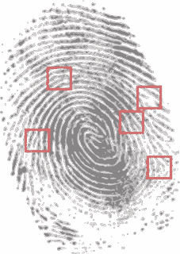
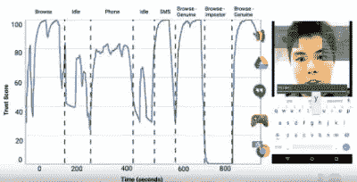

# 密码或隐私的终结？这是你的电话

> 原文：<https://www.sitepoint.com/end-passwords-privacy-call/>

大约 6 年前，我写了一篇关于“[浏览器指纹识别](https://www.sitepoint.com/no-cookies-or-javascript-no-worries-you-can-be-tracked-anyway/)概念的文章。这是一种通过识别浏览器和操作系统来识别回头客的方法——即使他们屏蔽了所有的 cookies。

乍一看，这听起来不太可能。毕竟，OSX 有多少百万人在使用 Chrome？

但是想一想:

*   有多少人在使用你的 版本的 Chrome 浏览器？
*   在同一个 OS 版本上？
*   用的恰恰是 ***你的*** 外挂？
*   还有共享 ***你的*** 时区？
*   还有用 ***你的*** 屏幕分辨率？
*   用精确的 ***你的*** 列表中的可用字体？

领域迅速缩小。

与传统的指纹匹配一样，任何给定指纹的一小部分都可能与成千上万的其他指纹相匹配。但是没有一个符合 ***所有*** 部位的另一个指纹 ***正好*** 。这就是指纹如此有用的原因。

事实证明，我们的网络浏览器对我们的拇指来说并没有什么不同。你越仔细看他们，他们就越显得与众不同。这是一个既酷又令人毛骨悚然的想法。

事实上，[AmIUnique.org 仍然在实践中展示它是如何工作的。](https://amiunique.org/fp)

## 算盘项目:令人毛骨悚然？

现在谷歌想把类似的想法应用到你的身体上来杀死密码。事实证明，就像浏览器一样，我们都积累了自己的记号、个人习惯和模式，使我们彼此明显不同。其中包括:

*   我们打字的模式
*   我们走路的节奏
*   我们所处的位置
*   我们面部的工作方式
*   我们谈话的语气

从整体上看，显然可以为任何用户生成一个“唯一 ID”。

<small>输入/输出处的雷吉娜·杜根</small>

事实上，去年，Regina Dugan 在 Google I/O 上对 Project Abacus 做了一个精彩的(6 分钟)解释。

作为一个概念，它当然有一些很酷的优点。

与传统的密码和签名一样，这些个人特征都是不可复制的。

但不同于复制签名——当前用于授权护照、执照和信用卡的系统——更难知道你在 Abacus 中复制了什么。

例如，通过 10 分钟的练习，你也许能够模仿你最好的朋友的签名，但是你能准确地模仿他们的走路姿势吗？还是他们的刷卡？以及他们的语调？所有的都在同一时间？

### 持续认证

<small>行动信任分数</small>

Abacus 的另一个重要方面是，与所有当前的系统不同，Abacus 会不断验证您的身份并保持一个“信任分数”。

因此，理论上，如果有人在街上抢了你的手机，你是否登录了电子邮件、社交媒体甚至银行账户都无关紧要。该设备会很快识别出当前用户不是你，并注销所有账户。

这是一个令人印象深刻的用例。

## 另一方面..

身体会变。我们敲敲膝盖，一瘸一拐。我们的声音因流感而变得沙哑。我们剪头发，刮胡子，注射胶原蛋白，戴新眼镜。有时都在同一天！

发生严重自行车事故的那一天，你所有的账户都被锁定，这是很难原谅和忘记的。

当然，这个问题只是一个技术/UX 挑战。建立一个在 99.9%的情况下都正确的系统是可能的。签名也从来不是 100%万无一失的。

我们知道谷歌非常擅长构建系统。我会支持他们最终把事情做好。

## 隐私的最后一根稻草？

让我们面对现实吧:我们都很懒。我们都在寻找简单的方法。拿起你朋友的手机，不需要一个密码就能立刻打开你的电子邮件，这种前景非常诱人，对吧？

但是我们也需要意识到我们正在放开方向盘。

我们不再对着电话表明自己的身份。无论我们喜欢与否，手机都在主动识别我们。在这种情况下，谁是老板？

某个地方将会有一个数据库，仅仅因为我们走路的样子滑稽，它就能把我们从人群中挑选出来。可能只是我，但这不仅仅是一个“[少数派报告](https://en.wikipedia.org/wiki/Minority_Report_(film))”的暗示。

一些有趣的决定即将到来。

又及:如果我告诉你 Regina 以 DARPA 的前主管身份加入谷歌，你会感觉更好还是更糟？

*原载于 [SitePoint 设计简讯](https://www.sitepoint.com/newsletter/)* 。

## 分享这篇文章