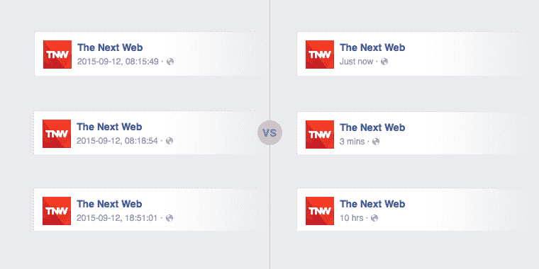

# 时间之前:如何将发布日期显示为自发布以来的时间

> 原文：<https://www.sitepoint.com/counting-the-ago-time-how-to-keep-publish-dates-fresh/>

在网络上呈现日期的格式很常见，比如**发布于 2015 年 9 月 12 日**，或者 **09/12/2015，09:41:23** 和 **2015-09-12** 。

这些例子中的每一个都说明了某种活动的完整日期和/或时间——无论是发表的文章、读者的评论，还是上传的视频。

像这样的日期格式看起来非常合理。毕竟，它们信息量大，可读性强！是的，但是“人类可读”并不一定意味着用户能够很容易地理解最近发生的活动。网络是一个快速发展的地方，给你的内容一种新鲜感可能是吸引你的观众的关键！那么，让我们看看如何改进这些常见的日期格式。

## 一个小技巧

再说一次，假设你偶然发现了一篇几分钟前才发表的文章，但是文章的副标题是这样的:

> 发布于 2016 年 9 月 12 日

…或者这个:

> 发布于 2016-09-12，09:41:23

这些信息的问题在于，它们没有传达出你的网站刚刚更新或者你经常更新的感觉。因此，以这种方式呈现时间肯定会更吸引人——也更清晰:

> 2 分钟前发布

以前见过很多次吗？但是你们中有多少人已经将这一点融入到自己的项目中了呢？以脸书为例:如果他们像我的第一个例子一样显示最新内容的日期，会是什么样子？比较下图中的左列和右列:



左栏的日期没那么吸引人吧？我敢打赌右手的例子对你更有吸引力。知道内容是新的非常重要——尤其是在社交网络上，人们更容易忽略旧的或没有明确时间戳的内容。

## 打印更好的日期

为了呈现*更好的日期*，您将需要一些服务器端脚本，我将使用 PHP 进行这个演示。我创建了一个名为`time_ago()`的小函数，如下所示:

```
<?php

    define( TIMEBEFORE_NOW,         'now' );
    define( TIMEBEFORE_MINUTE,      '{num} minute ago' );
    define( TIMEBEFORE_MINUTES,     '{num} minutes ago' );
    define( TIMEBEFORE_HOUR,        '{num} hour ago' );
    define( TIMEBEFORE_HOURS,       '{num} hours ago' );
    define( TIMEBEFORE_YESTERDAY,   'yesterday' );
    define( TIMEBEFORE_FORMAT,      '%e %b' );
    define( TIMEBEFORE_FORMAT_YEAR, '%e %b, %Y' );

    function time_ago( $time )
    {
        $out    = ''; // what we will print out
        $now    = time(); // current time
        $diff   = $now - $time; // difference between the current and the provided dates

        if( $diff < 60 ) // it happened now
            return TIMEBEFORE_NOW;

        elseif( $diff < 3600 ) // it happened X minutes ago
            return str_replace( '{num}', ( $out = round( $diff / 60 ) ), $out == 1 ? TIMEBEFORE_MINUTE : TIMEBEFORE_MINUTES );

        elseif( $diff < 3600 * 24 ) // it happened X hours ago
            return str_replace( '{num}', ( $out = round( $diff / 3600 ) ), $out == 1 ? TIMEBEFORE_HOUR : TIMEBEFORE_HOURS );

        elseif( $diff < 3600 * 24 * 2 ) // it happened yesterday
            return TIMEBEFORE_YESTERDAY;

        else // falling back on a usual date format as it happened later than yesterday
            return strftime( date( 'Y', $time ) == date( 'Y' ) ? TIMEBEFORE_FORMAT : TIMEBEFORE_FORMAT_YEAR, $time );
    }

?>
```

让我们来看看这段代码的一些细节。

*   您必须提供的唯一参数是`$time`，它是在 **Unix 时间戳**中的一个日期——比如`time_ago( 1442082961 )`。
*   关于传递的`$time`,函数将返回什么的示例:
    *   *现在*——如果它发生在不到 60 秒前(`TIMEBEFORE_NOW`)
    *   3 分钟前–如果不到 60 分钟前(`TIMEBEFORE_MINUTE(S)`)
    *   8 小时前–如果不到 24 小时前(`TIMEBEFORE_HOUR(S)`)
    *   昨天–如果不到 48 小时前(`TIMEBEFORE_YESTERDAY`)
    *   9 月 12 日–如果超过 48 小时且发生在今年(`TIMEBEFORE_FORMAT`)
    *   2015 年 9 月 12 日–如果不是在今年发生(`TIMEBEFORE_FORMAT_YEAR`)。
*   PHP 定义用于将类似配置的数据从函数代码中分离出来(将所有的`define()`事件放入一个配置文件并将函数放入 helpers 文件中是一个好的做法)。
*   定义中的`{num}`用实际数字(分钟或小时)代替。
*   我使用`strftime()`而不是`date()`来避免语言/地区[问题](http://stackoverflow.com/questions/5941121/php-strftime-date-or-datetime-which-is-better/5941268#5941268)。

所以，举例来说，如果你想把它放到你的 WordPress 网站上，你可以简单地写下:

```
<?=time_ago( get_the_time( 'U' ) )?>
```

或者是其他一些假设的 CMS:

```
<?=time_ago( $post->date_created )?>
```

还是那个静道:

```
<?=time_ago( 1447571705 )?>
```

## 可访问性和可用性

您应该使用一个特定的 HTML 元素来表示日期:`<time>`。在我们的例子中，当使用`time_ago`函数时，时间元素的值并不总是有效的日期格式(像昨天的*或 3 分钟前的*)。因此，您还应该使用`[datetime]`属性提供一个回退值:**

 **```
Published <time 
    datetime="<?=date( 'Y-m-d', $time )?>" 
    title="<?=strftime( date( 'Y', $time ) == 
        date( 'Y' ) ? TIMEBEFORE_FORMAT : TIMEBEFORE_FORMAT_YEAR, $time )?>">
    <?=time_ago( $time )?>
    </time>
```

这将提高可访问性，例如:

```
Published <time datetime="2015-09-12" title="September 12">3 minutes ago</time>
```

你发现`[title]`属性了吗？这是一个小小的可用性改进:将光标放在日期文本上，会在 title 属性中显示一条消息。出于某种原因，这是为那些寻找“真正的”日期的用户准备的。这里有一个小小的 CSS 技巧，可以增强你的感觉:

```
time[title]
{
    cursor: help;
}
```


## JavaScript 增强

我们还能做一件事！你有没有注意到脸书也实时增加日期？只要在 **3 分钟**看一分钟，它就会变成 **4 分钟**等等。所以，有很多类型的网站都得到了很好的改进。这在这样的文章帖子上不会有用，但在像 [Readerrr](http://readerrr.com/) 这样的网站上却是完美的:

```
<time data-time="<?=$time?>" ...
```

最后，我们需要将 PHP 代码转换成 JavaScript 等价物。我已经用普通的 JS 为您完成了这项工作(尽管 jQuery 版本也是可用的)。该脚本每分钟(`setTimeout( updateDates, 1000 * 60 )`)遍历一次每个`time[data-time]`元素，并更新值:

```
// ...
var elements    = document.querySelectorAll( 'time[data-time]' ),
    updateDates = function()
    {
        Array.prototype.forEach.call( elements, function( entry )
        {
            var out = '';
            // ...
            entry.textContent = out;
        });
        setTimeout( updateDates, 1000 * 60 );
    };
setTimeout( updateDates, 1000 * 60 );
// ...
```


### 在线演示和代码下载

你可以查看上面代码的在线演示或者[下载](https://uploads.sitepoint.com/wp-content/uploads/2016/01/1453295930ago-time.zip)完整的演示代码。

## 还有一点

在上述示例中，如果活动发生在三天或更早之前，则显示完整日期。但是很容易扩展显示时间的脚本，例如 5 天前的**、 **2 周前的**和 **1 个月前的**等等:**

 **```
// ...

define( TIMEBEFORE_DAYS,    '{num} days ago' );
define( TIMEBEFORE_WEEK,    '{num} week ago' );
define( TIMEBEFORE_WEEKS,   '{num} weeks ago' );
define( TIMEBEFORE_MONTH,   '{num} month ago' );
define( TIMEBEFORE_MONTHS,  '{num} months ago' );

function time_before( $time )
{
    // ...

    elseif( $diff < 3600 * 24 * 7 )
        return str_replace( '{num}', round( $diff / ( 3600 * 24 ) ), TIMEBEFORE_DAYS );

    elseif( $diff < 3600 * 24 * 7 * 4 )
        return str_replace( '{num}', ( $out = round( $diff / ( 3600 * 24 * 7 ) ) ), $out == 1 ? TIMEBEFORE_WEEK : TIMEBEFORE_WEEKS );

    elseif( $diff < 3600 * 24 * 7 * 4 * 12 )
        return str_replace( '{num}', ( $out = round( $diff / ( 3600 * 24 * 7 * 4 ) ) ), $out == 1 ? TIMEBEFORE_MONTH : TIMEBEFORE_MONTHS );

    else
        // ...
}
```

## 包裹

用户体验和满意度在于细节。有时候一个简单的细节——比如动态日期格式——就足以让我们的网站变得更好。

那么，你觉得这个解决方案怎么样？你会考虑在你的下一个项目中使用它吗？你对此有什么问题吗？请在评论中让我知道。

顺便说一句，我希望有人能告诉 Instagram 上的人， **122w** 并不酷，**2.4 年**会更容易理解。那会更好，不是吗？

## 分享这篇文章****