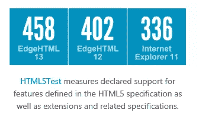
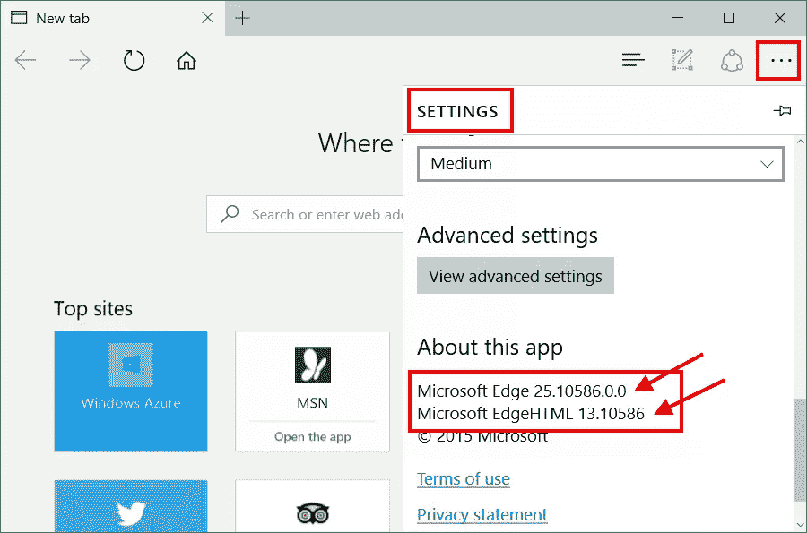
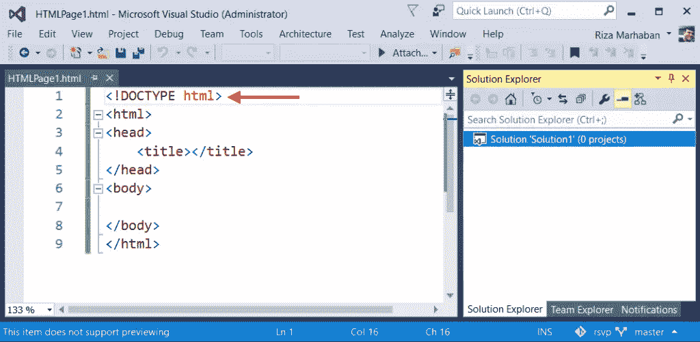
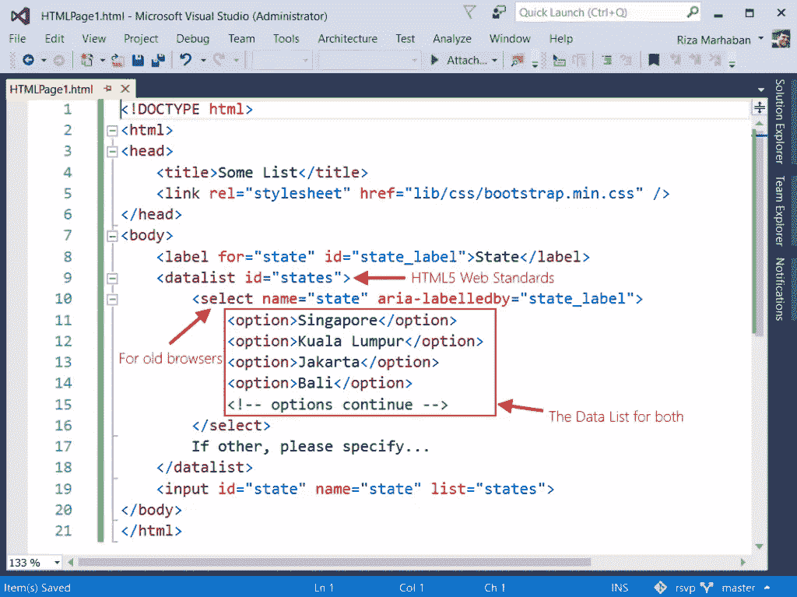
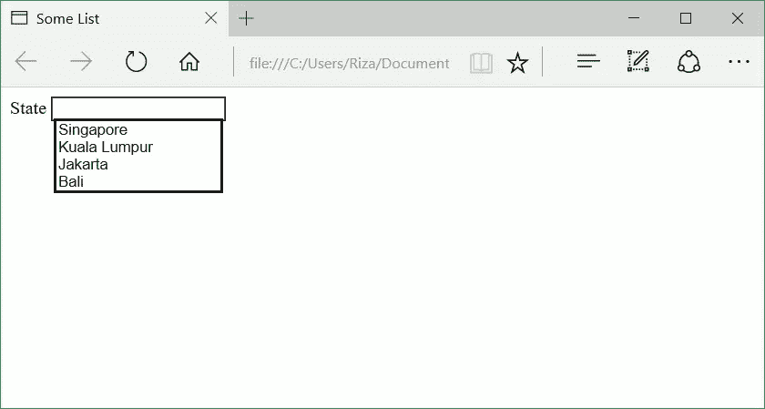
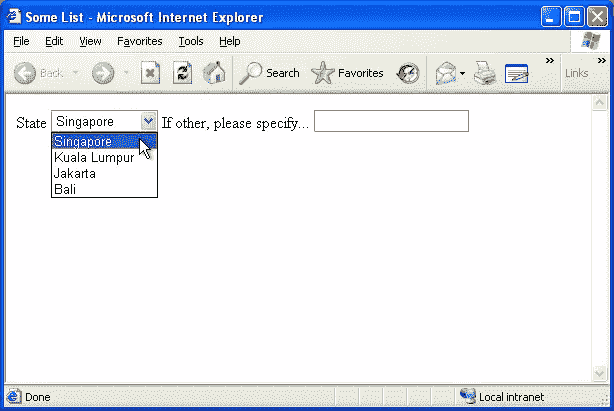
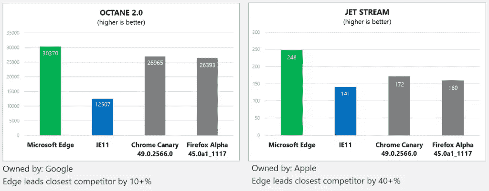
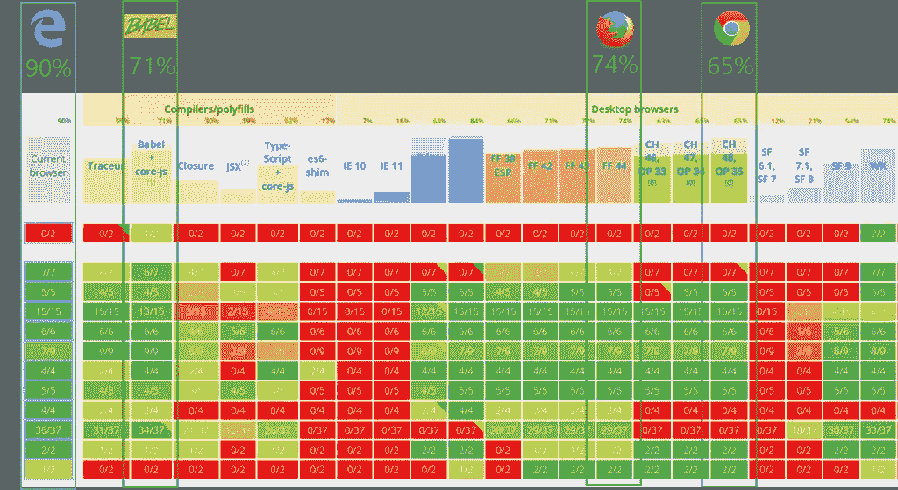

# 关于 Microsoft Edge 的 6 个 Web 开发神话

> 原文：<https://www.sitepoint.com/6-web-development-myths-microsoft-edge/>

本文是微软网站开发系列的一部分。感谢您对使 SitePoint 成为可能的合作伙伴的支持。

你可能(也可能没有)听说过，微软 Edge 是 Windows 10 的默认浏览器，它有一个完全不同的渲染引擎( [EdgeHTML](http://blogs.windows.com/msedgedev/2015/02/26/a-break-from-the-past-the-birth-of-microsofts-new-web-rendering-engine/?WT.mc_id=16543-DEV-sitepoint-article79) )，可以渲染 **HTML5 Web 标准**，比旧版本的 Internet Explorer 更像 Chrome、Firefox 和 Safari 浏览器。

这对网络开发者来说应该是个好消息，尤其是当你结合微软已经[结束对 IE8、IE9 和 IE10](http://venturebeat.com/2016/01/12/microsoft-ends-support-for-ie8-ie9-ie10-and-windows-8/) 的生命周期支持的消息。微软 Edge 与其他版本的 IE 也有很大不同，因为除了 PDF 或 Flash 之外，没有**bho**(*浏览器助手对象*)或 **ActiveX 组件。**

微软 Edge 浏览器还领先支持 [**ES6** ( *ECMA 脚本 6*)](https://blogs.windows.com/msedgedev/2015/05/12/javascript-moves-forward-in-microsoft-edge-with-ecmascript-6-and-beyond/?WT.mc_id=16543-DEV-sitepoint-article79)；事实上，在我写这篇文章的时候，它已经支持了 90%的内容。我们还知道，Edge JavaScript 引擎，' **Chakra** '，现在已经把[变成了*开源*](https://blogs.windows.com/msedgedev/2015/12/05/open-source-chakra-core/?WT.mc_id=16543-DEV-sitepoint-article79) 。这意味着开发者可以在浏览器环境之外使用这个引擎。

但随着所有这些进展，我还观察到社交媒体或论坛上的 web 开发人员展示代码，可能 web 应用程序没有充分利用 Microsoft Edge，尽管他们认为它可以工作，但他们的代码仍然将 Microsoft Edge 视为更像 Internet Explorer 而不是 Chrome、Firefox 或 Safari。也许一些开发者认为微软 Edge 是 IE11——让我告诉你，微软 Edge **不是** IE11。因此，我想解释一下 web 开发人员有时假设的或者可能没有意识到的关于微软 Edge 浏览器的神话。也许是，也许不是；无论如何，我只是想通过分享这个来帮助你。所以，让我们来看看关于微软 Edge 的六大网络开发神话。

## 神话 1

Microsoft Edge 正在使用 Trident 渲染引擎。

**事实核查:假！**

事实是，微软 Edge 有一个新的渲染引擎[，它继续发展](https://blogs.windows.com/msedgedev/2015/11/16/introducing-edgehtml-13-our-first-platform-update-for-microsoft-edge/?WT.mc_id=16543-DEV-sitepoint-article79)，称为“ **EdgeHTML** ，JavaScript 引擎称为“ **[Chakra](https://blogs.windows.com/msedgedev/2015/12/05/open-source-chakra-core/?WT.mc_id=16543-DEV-sitepoint-article79)** ”。根据 HTML5Test 的测量，它甚至更加符合标准:



**如何检查这个**

要识别微软 Edge 和 EdgeHTML 版本，只需进入**设置** ( *右上角的点-点-点图标*)并向下滚动到底部。



## 神话 2

HTML 文档声明。一些开发者认为微软 Edge 没有/不能使用这一行:

```
<!DOCTYPE html>
```

**事实核查:假！**

事实是，微软 Edge 浏览器最好使用 HTML5 文档类型，并告诉浏览器 EdgeHTML 呈现为 HTML5 文档。事实上，Internet Explorer 9+已经以类似的方式支持`<!DOCTYPE html>`。

**怎么用？**

使用在 HTML 文档的顶部或第一行，在`<head />`元素之前。示例:



## 神话 3

在一个微软 Edge HTML 文档中，我们需要添加元信息，即*用户代理* (UA)兼容性为“ **Edge** ”。那就是:

```
<meta http-equiv="X-UA-Compatible" content="IE=edge">
```

**事实核查:假！**

事实是'**没有【T1 ')，你不需要添加这一行。即使你的目标是 IE11 浏览器，也没有必要添加这些元信息。它不需要甚至没有微软 Edge 浏览器中的任何功能。**

**如何解决这个**

移除 HTML 文档上的任何`http-equiv=”X-UA-Compatible”` meta 标签。如果您需要网站兼容 IE8、IE9 或 IE10 等旧浏览器，该怎么办？参见下面的误区 4 和误区 5。

## 神话 4

为了与 Edge 浏览器兼容，我必须在从 web 服务器请求内容之前检测或嗅探浏览器**用户代理**字符串( *UA 字符串*)，这样当服务器响应时，我就可以相应地返回正确的 HTML 版本。

**事实核查:假！**

事实是，您必须避免任何嗅探或检测浏览器用户代理字符串来调节对 web 服务器的请求。你应该返回任何请求作为 HTML5 Web 标准的内容。在某些情况下，您可能需要嗅探浏览器的 UA 字符串，但要确保这只是为了检查，而不是为了调节 web 服务器的响应。为什么？因为 HTML 布局/渲染引擎是一种**容错**声明性语言。即使你抛出任何非 HTML 语法，它也不会阻塞 HTML 文档。然而，不要滥用 HTML 文档中的垃圾或一些垃圾文本。

**如何解决这个**

有几种方法可以解决这个问题。首先，您必须删除任何客户端或 web 服务器端代码，这些代码使用 UA 嗅探来根据 UA 字符串调节 web 服务器响应。尽量避免这种情况——这在 **HTML5 Web 标准**中并不推荐。确保你有一个干净的 HTML 文档。删除任何非 HTML web 标准语法。

有人说，“如果我需要知道浏览器是否支持某些功能，该怎么办？”

是的，没问题。我的建议(推荐)是用 **[Modernizr.js](https://modernizr.com/?WT.mc_id=16543-DEV-sitepoint-article79) 。js 是检查浏览器兼容性的工业标准 JavaScript。Modernizr 告诉你用户的浏览器必须提供什么样的 HTML、CSS 和 JavaScript 特性。另一种方法是，你可以只使用一个普通的 HTML，它有智能回退机制。例如，下面的代码将在现代浏览器和非现代浏览器中正常呈现，即使它使用的是 HTML5 代码。**



下面是微软 Edge 上的输出:



这里是关于微软 IE6 的。等等！什么……IE6？是的，我也在 IE6 上试过测试。这并不意味着你应该使用 IE6。只是为了证明 HTML5 代码能够工作，因为浏览器的 HTML 布局/呈现引擎是容错的。它呈现它所理解的东西。



## 神话 5

微软 Edge JavaScript 慢！像它的前身，即。

**事实核查:假！**

不要总是责怪浏览器；影响性能的因素有很多，当然包括网站上符合标准的代码。以下是流行测试的最新基准；你可以看到查克拉改进的影响:



我对这个基准的看法是，不要把它作为创建不符合标准的代码的借口，并期望浏览器来呈现它。当我们说 HTML5 时，它包括 CSS3 和 JavaScript。也就是说，所有现代浏览器都很棒。各有优缺点。有时，web 开发人员还会对浏览器的特定功能进行相互比较。我告诉你，它不会有同样的标准。下面举个例子:比方说 iOS Safari，苹果会有他们自己特定的 CSS 前缀来匹配其设备功能，比如 iPhone 6S，以适应他们特定的 app。但是对于其他浏览器来说，这是不必要的。因此，我的建议是使用适合所有浏览器的 HTML5 Web 标准。只需编写一个 HTML5，在所有浏览器中测试。如果需要使用某些功能，可以使用 [Modernizr](https://modernizr.com/?WT.mc_id=16543-DEV-sitepoint-article79) 。

**如何优化这个**

您可以通过在 Edge 浏览器中打开 web 应用来进行基准测试。通过使用适当的 HTML5 web 标准来优化 Web。使用[站点扫描工具](https://dev.windows.com/en-us/microsoft-edge/tools/staticscan/?utm_source=SitePoint&utm_medium=article79&utm_campaign=SitePoint)扫描你的站点，看看除了 JavaScript 代码之外还有哪些部分可以优化。这可能会提高性能。你也可以使用[伏龙。JS](http://vorlonjs.com/?WT.mc_id=16543-DEV-sitepoint-article79) 如果你需要**在多种浏览器(包括手机浏览器)上调试**html 5，以匹配设计、布局和兼容性。

如果你需要优化 JavaScript，你总是可以使用普通的 JavaScript。不要使用太多的 JavaScript 库/框架。明智地使用。微软 Edge 目前支持 JavaScript ES6 ( [Kangax ES6 兼容表](http://kangax.github.io/compat-table/es6/?WT.mc_id=16543-DEV-sitepoint-article79))。



## 神话 6

我的 web 应用程序适用于 LOB(业务线)，仅供内部使用(内部网)。我们现在不需要迁移来支持微软 Edge，因为 HTML5 在 2022 年之前不会准备好。

**事实核查:超级假！**

[HTML5 在这里](http://sdtimes.com/w3c-html5-reaches-recommendation-status/)。您的内部网应用程序应该立即迁移到 HTML5，否则您应该考虑至少在 2013 年迁移到 HTML5 的计划，因为现代浏览器将继续在组织间部署。虽然 [IE11 现在有遗留仿真](https://blogs.windows.com/msedgedev/2015/11/23/windows-10-1511-enterprise-improvements/?WT.mc_id=16543-DEV-sitepoint-article79)来帮助使迁移之路更加顺畅，但仍然有性能、可用性以及仅仅维护一个符合标准的代码库需要考虑。想象一下，如果你的同事想在办公室外面使用最新的移动电话访问内部网。他们做不到这一点，因为移动浏览器不支持传统网络。没有 ActiveX，没有 Silverlight，没有可以使用的自定义插件。现在该用 HTML5 了。

**如何迁移**

以下是我观察到的一些小误区，以及你应该怎么做。

*   **大多数企业仍在使用 Windows 7——我们无法迁移**:嗯，如果你想让它在 HTML5 中工作，你可以安装 IE11 或最新版本的 Chrome 或 Firefox。您可以开始缓慢地迁移到目标 IE11，但是，请使用 HTML5 作为您的迁移计划。所以，不仅仅是浏览器迁移计划。也要做 HTML 迁移计划。
*   我的内部网要求我们的 LoB 应用程序使用 ActiveX 技术:没问题，你可以[在计划迁移时使用 IE11](https://blogs.windows.com/msedgedev/2015/11/23/windows-10-1511-enterprise-improvements/?WT.mc_id=16543-DEV-sitepoint-article79) 或最新版本的 Chrome 或 Firefox。将其用作临时迁移过程。慢慢移除任何 BHO ( *浏览器辅助对象*)，比如 ActiveX 插件，换成 HTML5 Web 标准的新 web app 开发。它更安全，性能更好。
*   **你不明白，我们有数百个内部网 web app** :我个人确实明白。这就是为什么你需要一个迁移计划。这么说吧，迁移到 HTML5 是你的首要任务，你需要从现在开始。
*   **我在内部网 web 应用程序中使用第三方产品**:联系供应商，索要更新的 HTML5。如果他们没有，就不要用。请使用最新的版本。我的建议是，如果供应商使用 ActiveX，那么只使用适当的 HTML5 Web 标准来替换它。

**结论:使用 HTML5 Web 标准**

如果你想面向所有现代网络浏览器，使用 HTML5 网络标准。微软 Edge 和 IE11 是现代网络浏览器。只要你使用恰当的 HTML5，就不需要担心兼容性。正确的 HTML5 意味着:

1.  **确保第一行为 HTML5 渲染模式。**是的这一行。
2.  **避免浏览器嗅探和检测**基于浏览器用户代理字符串的条件请求。
3.  避免使用供应商特定的 CSS 前缀。您不能在所有浏览器中使用相同的浏览器功能。因此，使用标准的 HTML5，它已经在所有现代浏览器中得到修正和支持。
4.  请更新您的 JavaScript 库！例如，不要使用过时的 jQuery 或任何其他 JavaScript 库。不要使用未经创建者更新的库。始终更新到最新版本，因为创建者也将遵循 web 标准规范；在本例中为 HTML5。
5.  **停止使用外挂！**不再 Silverlight，避免 Flash，不再自定义 ActiveX。这些不是 HTML5 Web 标准，那是浏览器遗留选项，而不是 HTML。例如，您现在可以使用 CSS3 和 JavaScript 创建动画，甚至是 3D 和矢量图形(SVG)。

## 更多的 Web 开发实践

这篇文章是微软布道者和工程师关于实用 JavaScript 学习、开源项目和互操作性最佳实践的 web 开发系列的一部分，包括[微软 Edge](http://blogs.windows.com/msedgedev/2015/05/06/a-break-from-the-past-part-2-saying-goodbye-to-activex-vbscript-attachevent/?WT.mc_id=16543-DEV-sitepoint-article79) 浏览器和新的 [EdgeHTML 渲染引擎](http://blogs.windows.com/msedgedev/2015/02/26/a-break-from-the-past-the-birth-of-microsofts-new-web-rendering-engine/?WT.mc_id=16543-DEV-sitepoint-article79)。

我们鼓励您在 dev.microsoftedge.com 使用免费工具进行跨浏览器和设备测试，包括 Windows 10 的默认浏览器 Microsoft Edge:

*   [扫描你的网站，寻找过时的库、布局问题和可访问性](http://dev.modern.ie/tools/staticscan/?utm_source=SitePoint&utm_medium=article79&utm_campaign=SitePoint)
*   [下载适用于 Mac、Linux 和 Windows 的免费虚拟机](http://dev.modern.ie/tools/vms/windows/?utm_source=SitePoint&utm_medium=article79&utm_campaign=SitePoint)
*   [跨浏览器检查网络平台状态，包括微软 Edge 路线图](https://dev.modern.ie/platform/status/?utm_source=SitePoint&utm_medium=article79&utm_campaign=SitePoint)
*   [在您自己的设备上远程测试 Microsoft Edge](https://remote.modern.ie/?utm_source=SitePoint&utm_medium=article79&utm_campaign=SitePoint)

**向我们的工程师和传道者进行更深入的学习:**

*   **互操作性最佳实践** ( [系列](https://channel9.msdn.com/Blogs/BeLux-Developer/Riding-the-Modern-Web-5-things-to-consider-as-a-web-developer?WT.mc_id=16543-DEV-sitepoint-article79)):
    *   [如何避免浏览器检测](https://channel9.msdn.com/Blogs/BeLux-Developer/Riding-the-Modern-Web-Avoiding-Browser-Detection?WT.mc_id=16543-DEV-sitepoint-article79)
    *   [使用 CSS 前缀的最佳实践](https://channel9.msdn.com/Blogs/BeLux-Developer/Riding-the-Modern-Web-CSS-Vendor-Prefixes?WT.mc_id=16543-DEV-sitepoint-article79)
    *   [保持你的 JS 框架&库更新](https://channel9.msdn.com/Blogs/BeLux-Developer/Riding-the-Modern-Web-Dealing-with-JavaScript-Libraries?WT.mc_id=16543-DEV-sitepoint-article79)
    *   [构建插件免费网络体验](https://channel9.msdn.com/Blogs/BeLux-Developer/Riding-the-Modern-Web-Dealing-with-Plugins?WT.mc_id=16543-DEV-sitepoint-article79)
*   GitHub 上的编码实验室:跨浏览器测试和最佳实践
*   哇，我可以在 Mac 电脑上测试 Edge & IE 浏览器& Linux！(来自雷伊·班戈)
*   [在不破坏网络的情况下推进 JavaScript】(来自 Christian Heilmann)](http://channel9.msdn.com/Events/WebPlatformSummit/2015/Advancing-JavaScript-without-breaking-the-web?WT.mc_id=16543-DEV-sitepoint-article79)
*   [用 WebGL 释放 3D 渲染](https://channel9.msdn.com/Events/WebPlatformSummit/2015/Unleash-3D-rendering-with-WebGL-and-Microsoft-Edge?WT.mc_id=16543-DEV-sitepoint-article79)(来自 David Catuhe)
*   托管网络应用和网络平台创新

**我们的社区开源项目:**

*   伏龙。JS (跨设备远程 JavaScript 测试)
*   [manifoldJS](http://manifoldjs.com/?WT.mc_id=16543-DEV-sitepoint-article79) (部署跨平台托管的 web 应用)
*   [babylonJS](http://babylonjs.com/?WT.mc_id=16543-DEV-sitepoint-article79) (轻松制作 3D 图形)

**更多免费工具和后端 web 开发工具:**

*   [Visual Studio 代码](https://code.visualstudio.com/?WT.mc_id=16543-DEV-sitepoint-article79)(用于 Mac、Linux 或 Windows 的轻量级代码编辑器)
*   [Visual Studio 开发基础知识](https://www.visualstudio.com/en-us/products/visual-studio-dev-essentials-vs.aspx?WT.mc_id=16543-DEV-sitepoint-article79)(基于订阅的免费培训和云优势)
*   [用节点编码。JS](https://www.microsoftvirtualacademy.com/en-US/training-courses/building-apps-with-node-js-jump-start-8422?WT.mc_id=16543-DEV-sitepoint-article79) 与[在蔚蓝云上试用](https://azure.microsoft.com/en-us/pricing/free-trial/?WT.mc_id=16543-DEV-sitepoint-article79)

## 分享这篇文章