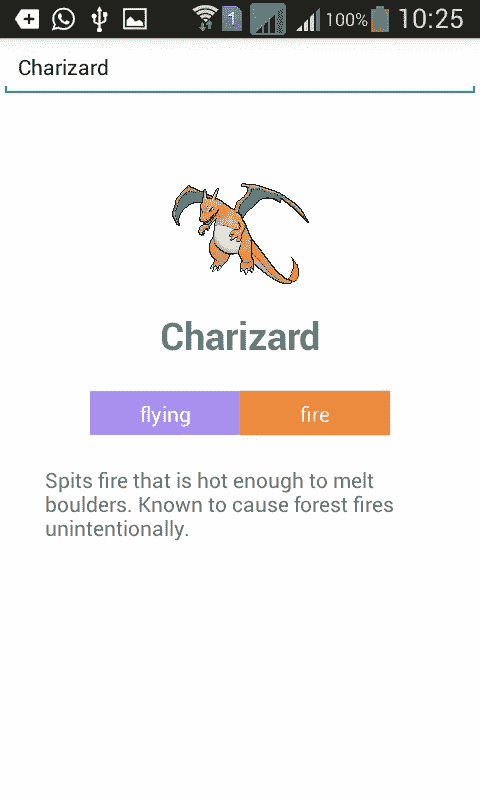
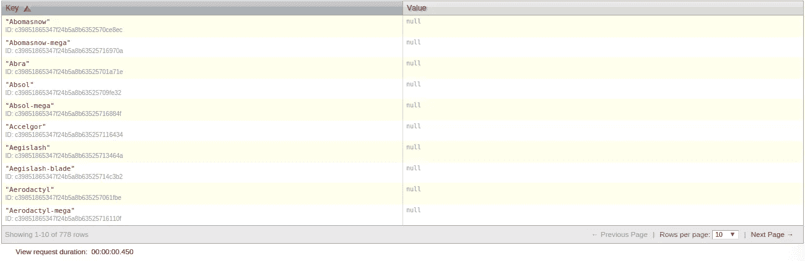
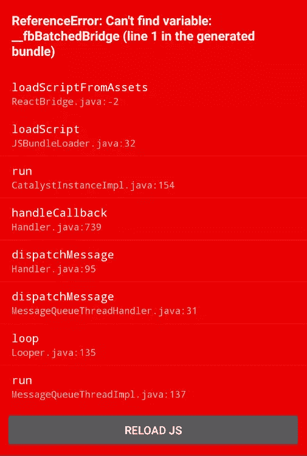

# 用 React Native 构建一个 Android 应用

> 原文：<https://www.sitepoint.com/build-android-app-react-native/>

在本文中，我将向您展示如何在 Android 中使用 React Native 创建 Pokedex 应用程序。该应用不会像谷歌 Play 商店的应用那样功能齐全，只有一个文本字段，用于输入口袋妖怪的确切名称，然后显示提交的详细信息。我们还将增加文本到语音的功能，这将大声读出细节。这是最终应用的外观:



**注意**:我不会展示初始设置，例如[安装 Android SDK](http://developer.android.com/sdk/installing/index.html) 或[安装 React Native 并创建一个项目](https://facebook.github.io/react-native/docs/getting-started.html)或任何其他你需要的开发工具。我假设这将是你的第一个 React 原生应用，并将为每个代码块提供详细的解释。

## 构建服务器

首先，我们需要为这个应用程序构建服务器组件。我们将使用 PHP 作为服务器端语言，使用 CouchDB 作为数据库。在这里可以找到 [CouchDB 的安装说明，在这里](https://wiki.apache.org/couchdb/Installation)可以找到 [PHP 的安装说明。](http://php.net/manual/en/install.php)

一旦完成，通过执行`curl localhost:5984`来检查 CouchDB 是否正在运行，这应该会返回如下内容:

```
{"couchdb":"Welcome","uuid":"xxxxxxxxxxxxxxxx","version":"1.6.0","vendor":{"name":"Ubuntu","version":"15.10"}}
```

现在在浏览器中打开*[http://localhost:5984/_ utils](http://localhost:5984/_utils)*访问默认的 CouchDB 管理系统 Futon。点击*创建数据库*来创建数据库，我们将在其中存储从[口袋妖怪 API](http://pokeapi.co/) 收到的数据。输入 *pokedex* 作为数据库名称，然后点击*创建*。我们可以用 React Native 直接访问 API，但是这需要更多的网络访问。首先将它存储在数据库中，这样我们只需一次请求就可以检索所有内容。这也让我们能够以任何方式查询数据。

有了这种方式，让我们开始建设。

### 保存数据

接下来，我们开始构建服务器组件。首先在 web 服务器文件夹中创建一个工作目录。然后在工作目录中创建一个 *composer.json* 文件，并添加以下内容:

```
{
    "require": {
        "doctrine/couchdb-odm":  "@dev"
    },
    "minimum-stability": "dev",
    "prefer-stable": true
}
```

这将`doctrine/couchdb-odm`库指定为该项目的依赖项。这个库允许我们在 PHP 中使用 CouchDB。执行`composer install`进行安装。

安装时，在你的工作目录下创建一个*pokemon.php*文件，并添加如下内容:

```
<?php
require 'vendor/autoload.php';
set_time_limit(0);

$client = \Doctrine\CouchDB\CouchDBClient::create(array('dbname' => 'pokedex'));

$pokedex = file_get_contents('http://pokeapi.co/api/v1/pokedex/1/');
$pokedex_data = json_decode($pokedex, true);

foreach($pokedex_data['pokemon'] as $row){
    //get details
    $pokemon = file_get_contents('http://pokeapi.co/' . $row['resource_uri']);
    $pokemon = json_decode($pokemon, true);

    //get description
    $pokemon_description = file_get_contents('http://pokeapi.co/' . $pokemon['descriptions'][0]['resource_uri']);

    $pokemon['description'] = json_decode($pokemon_description, true)['description'];

    //get sprites
    $pokemon_sprites = file_get_contents('http://pokeapi.co' . $pokemon['sprites'][0]['resource_uri']);
    $pokemon_sprites = json_decode($pokemon_sprites, true);

    $pokemon['small_photo'] = 'http://pokeapi.co' . $pokemon_sprites['image'];

    $client->postDocument($pokemon);

}
```

分解上面的代码，我们首先包括 autoloader 文件。这将自动加载我们通过 Composer 安装的所有库。在此之下，我们将时间限制设置为零。PHP 脚本有一个默认的最大执行时间，一旦达到这个时间，它就会停止执行。添加此功能可消除这一限制。在写这篇文章的时候，有 721 个口袋妖怪，我们必须为每个口袋妖怪执行总共三个 HTTP 请求，以获得一般的细节，描述和精灵…我想你明白了。

```
<?php
require 'vendor/autoload.php';
set_time_limit(0); 
```

初始化 CouchDB 客户端，并提供我们将使用的数据库的名称。

```
<?php
$client = \Doctrine\CouchDB\CouchDBClient::create(array('dbname' => 'pokedex')); 
```

使用`file_get_contents`函数从 API 获取口袋妖怪的完整列表。这将返回 JSON 格式的数据，因此我们必须将其转换为数组来处理数据:

```
<?php
$pokedex = file_get_contents('http://pokeapi.co/api/v1/pokedex/1/');
$pokedex_data = json_decode($pokedex, true); 
```

循环所有结果:

```
<?php
foreach($pokedex_data['pokemon'] as $row){
    ...
} 
```

在循环内部，访问每个口袋妖怪的`resource_uri`,并使用它来构造返回口袋妖怪详细信息的 URL。

```
<?php
//get details
$pokemon = file_get_contents('http://pokeapi.co/' . $row['resource_uri']);
$pokemon = json_decode($pokemon, true); 
```

使用从上一个请求中收到的数据来构造 URL，以获取 Pokemon 描述和精灵。

```
<?php
//get description
$pokemon_description = file_get_contents('http://pokeapi.co/' . $pokemon['descriptions'][0]['resource_uri']);

$pokemon['description'] = json_decode($pokemon_description, true)['description'];

//get sprites
$pokemon_sprites = file_get_contents('http://pokeapi.co' . $pokemon['sprites'][0]['resource_uri']);
$pokemon_sprites = json_decode($pokemon_sprites, true);

$pokemon['small_photo'] = 'http://pokeapi.co' . $pokemon_sprites['image']; 
```

将数据保存到 CouchDB:

```
<?php
$client->postDocument($pokemon); 
```

要开始保存数据，请在浏览器中打开*pokemon.php*。这将需要一段时间，但在执行过程中，您可以继续下一步。

### 获取数据

要用 CouchDB 获取数据，我们首先必须创建一个视图。要创建一个视图，[转到我们之前创建的数据库](http://localhost:5984/_utils/database.html?pokedex)。点击*视图*下拉菜单，选择*临时视图*。在*映射函数*文本字段下添加以下代码:

```
function(doc) {
  emit(doc.name, null);
}
```

点击*运行*按钮，检查视图是否产生了一些结果。



点击*另存为*按钮，在*设计文档*字段输入*口袋妖怪*，在*视图名称*字段输入 *by_name* 。

完成后，返回工作目录，创建一个名为*get.php*的新文件，并添加以下代码:

```
<?php
require 'vendor/autoload.php';

$client = \Doctrine\CouchDB\CouchDBClient::create(array('dbname' => 'pokedex'));

$pokemon = $_GET['name'];

$query = $client->createViewQuery('pokemon', 'by_name');
$query->setKey($pokemon);
$query->setReduce(false);
$query->setIncludeDocs(true);
$result = $query->execute();

if(!empty($result[0])){

    $data = $result[0];
    echo json_encode($data);

}else{
    $result = array('no_result' => true);
    echo json_encode($result);
}
```

分解上面的代码。首先，我们获得应用程序发送的口袋妖怪的名称。

```
<?php
$pokemon = $_GET['name']; 
```

通过调用`createViewQuery`方法查询视图，提供设计文档名和视图名，然后指定选项。这里我们使用`setKey`方法指定查询，`setReduce`方法进一步过滤从视图返回的结果，`setIncludeDocs`方法指定返回每个结果的实际文档。您可能已经从前面的结果视图截图中注意到，实际的文档并不在那里。这是因为这是默认行为，调用`setIncludeDocs`并提供一个参数`true`将包括我们之前访问*pokemon.php*文件时保存的文档。

```
<?php
$query = $client->createViewQuery('pokemon', 'by_name'); // design document name + view name
$query->setKey($pokemon); // set the key to the name of the pokemon
$query->setReduce(false); // disable reduce
$query->setIncludeDocs(true); // include the actual document for each result
$result = $query->execute(); // perform the query 
```

接下来，我们检查是否有结果，并返回 JSON 编码的版本。否则，返回没有结果。

```
<?php
if(!empty($result[0])){

    $data = $result[0];
    echo json_encode($data);

}else{
    $result = array('no_result' => true);
    echo json_encode($result);
} 
```

此时，如果您在本地机器上工作，使用 [Ngrok](https://www.sitepoint.com/use-ngrok-test-local-site/) 将服务器暴露给公共互联网。或者使用网络分配的内部 IP 地址。请记下它，因为我们将在应用程序的后面使用它。

## 构建应用程序

### 安装依赖项

首先初始化一个新的 React 本地项目并安装它的依赖项:

```
react-native init Pokedex
```

完成后，通过 npm 安装依赖项:

```
cd Pokedex
npm install lodash react-native-android-speech react-native-gifted-spinner --save
```

以下是对每种方法的总结:

*   `lodash`:用于将单词大写，从数组中提取特定数据。
*   `react-native-android-speech`:用于将描述文本转换为语音。
*   `react-native-gifted-spinner`:用于向用户展示网络请求时的加载动画。

您可以打开*node _ modules/react-native/node _ modules*目录来查看安装的不同模块。

安装完成后，访问 [React 原生 Android 语音](https://github.com/mihirsoni/react-native-android-speech)的 Github repo，按照设置说明进行操作。

### 执行网络请求

在 React 原生项目的根目录下，创建一个 *src* 文件夹，并在其中创建一个 *api.js* 并添加以下代码:

```
module.exports = function(pokemon){

    var url = 'http://192.168.xxx.xxx/pokedex/get.php?name=' + pokemon;

    return fetch(url).then(function(response){
        return response.json();
    }).then(function(json){
        return json;
    });
}
```

这导出了使用`fetch`方法从服务器获取数据的函数，这是 React Native 发出网络请求的方式。这个方法接受向其发出请求的 URL，并返回一个使用`then`方法的承诺，并提供一个回调函数来获得响应。

返回的响应不能直接使用，这就是为什么我们必须返回从`response`对象获得的`json`方法的结果。从那里，我们可以通过链接另一个`then`方法来捕获实际的 JSON 数据。然后回调函数将实际的 JSON 数据作为参数传递给它，然后我们返回这个参数。

注意，我们正在返回`fetch`方法的结果，这也是一个承诺，所以当我们稍后在主脚本中调用这个模块时，我们必须再次使用`then`方法来访问 JSON 数据。

**注**:务必将`http://192.168.xxx.xxx/`改为之前注好的 IP 地址或域名。注意 *pokedex* 是我的网络目录中的一个文件夹。

### 主应用程序文件

打开 *index.android.js* 文件。它应该包含一些默认的代码，但是继续清除它。

首先，在每个文件的开头，我们将启用严格模式。这有助于防止我们代码中的常见错误，比如在初始化一个值之前没有定义变量。

之后，导入 React Native 和项目的附加依赖项。

```
'use strict';

var React = require('react-native');
var tts = require('react-native-android-speech')
var GiftedSpinner = require('react-native-gifted-spinner');
var _ = require('lodash');
```

初始化我们需要的所有组件和 API。

```
var {
  AppRegistry,
  StyleSheet,
  Text,
  TextInput,
  View,
  Image,
  ListView
} = React;
```

React Native 提供了不同的组件和 API。默认情况下不会加载这些文件，所以您必须指定您需要的文件。把组件想象成 UI 组件。

例如，网页中有文本栏、列表、表格、图像、标签等。在 React Native 中，UI 的这些小部分是组件。有一个组件用于[显示图像](https://facebook.github.io/react-native/docs/image.html#content)，一个组件用于[显示滚动条](https://facebook.github.io/react-native/docs/scrollview.html#content)，一个组件用于[生成列表](https://facebook.github.io/react-native/docs/listview.html#content)等等。

React 的 API 是访问不同设备功能的一种方式，比如摄像头和推送通知。虽然您可能不会经常使用这些 API，但是在每个项目中都会用到一些。

例子包括[样式表](https://facebook.github.io/react-native/docs/stylesheet.html#content)和[学徒制](https://facebook.github.io/react-native/docs/appregistry.html#content)。

下面是我们使用的每个组件和 API 的简要描述:

*   `AppRegistry`:用于注册定制组件。在 React Native 中，每个事物都是一个组件，每个组件都可以由更小的组件组成。
*   `StyleSheet`:用于声明应用中使用的样式。
*   `Text`:用于显示文本。
*   `TextInput`:用于创建文本字段。
*   `View`:构建 UI 的基础组件。主要用于包装内容。
*   `Image`:用于显示图像。
*   `ListView`:用于显示列表。

回到代码，导入前面创建的 *src/api.js* 文件。这允许我们通过调用`api`方法进行网络调用。

```
var api = require('./src/api.js');
```

创建一个新的自定义 React 组件，它将包含所有的 UI 和应用程序逻辑。

```
var Pokedex = React.createClass({
    ...
});
```

在类内部，我们初始化状态。“状态”是 React Native 存储数据的方式，这些数据将在整个组件中可用。`query`是用户输入的文本，`hasResult`表示有没有搜索结果，`noResult`表示有没有搜索结果。这与`hasResult`相反，但用于决定是否显示<q>无结果发现</q>文本。这是因为当应用程序最初加载时，我们不希望用户看到那些文本，因为他们甚至还没有开始搜索。`result`存储从服务器检索到的当前搜索结果，`isLoading`指示加载器是否显示，`dataSource`包含列表视图的数据源。这是通过创建一个新的`ListView.DataSource`实例来实现的，该实例接受一个包含`rowHasChanged`函数的对象。该函数告诉`ListView`当数据源发生变化时重新呈现一行。在这种情况下，数据源是 Pokemon 类型对象的数组。通过查看`search`方法的代码，您将看到这些数据是如何提供的。

```
getInitialState: function(){
  return {
    query: null,
    hasResult: false,
    noResult: false,
    result: null,
    isLoading: false,
    dataSource: new ListView.DataSource({
      rowHasChanged: (row1, row2) => row1 !== row2,
    })
  }
},
```

接下来我们将看看`render`方法。这是为我们呈现 UI 的方法。

```
render: function() {
    ...
},
```

在方法内部，我们返回 UI。

```
return (
  <View style={styles.container}>
    <View style={styles.search}>
      <TextInput
        style={styles.text_input}
        onChangeText={this.changeText}
        onSubmitEditing={this.search}
        placeholder="Type a pokemon name"
      />
    </View>

    {
      this.state.hasResult &&

      <View style={styles.result}>
        <View style={styles.main_details}>
          <Image source={{uri: this.state.result.small_photo}}
                 style={styles.image_dimensions} resizeMode={Image.resizeMode.contain} />
          <Text style={styles.main_text}>{this.state.result.name}</Text>

          <ListView contentContainerStyle={styles.types} dataSource={this.state.types} renderRow={this.renderType}></ListView>

          <View style={styles.description}>
            <Text style={styles.description_text}>{this.state.result.description}</Text>
          </View>
        </View>
      </View>

    }

    {
      this.state.noResult &&
      <View style={styles.no_result}>
        <Text style={styles.main_text}>Pokemon not found</Text>
        <Text style={styles.sub_text}>Please type the exact name</Text>
      </View>
    }

    {
      this.state.isLoading &&
      <View style={styles.loader}>
        <GiftedSpinner />
      </View>
    }
  </View>
);
```

分解上面的代码。我们有主容器。

```
<View style={styles.container}>
</View>
```

**注意**:这是一个要求，因为应该只有一个根组件，所有其他组件都嵌套在其中。它有一个名为`style`的属性，其值是一个描述该组件如何被样式化的对象。稍后我们将看看`styles`对象是如何声明的。现在只要记住，当使用对象作为值时，应该跳过双引号。

主容器内部是用于输入口袋妖怪名称的组件。这有三个属性。`onChangeText`指定每次文本字段内的文本改变时执行的功能。`onSubmitEditing`指定提交文本字段时执行的功能。和`placeholder`来指定当前没有输入时将出现的文本。

```
<View style={styles.search}>
  <TextInput
    style={styles.text_input}
    onChangeText={this.changeText}
    onSubmitEditing={this.search}
    placeholder="Type a pokemon name"
  />
</View>
```

接下来，我们有显示搜索结果的组件。这个组件的语法与前面的组件略有不同，因为它包含在花括号中，并且在开头有一个条件。这告诉 React 仅在状态中存储有结果时才呈现该组件。组件内部是一个显示口袋妖怪照片的`Image`组件，组件下方是一个显示口袋妖怪名字的`Text`组件。名字后面是展示口袋妖怪类型的`ListView`。一些口袋妖怪有不止一种类型，这就是为什么我们需要一个`ListView`来展示它。最后，我们有另一个显示描述的`View`组件。

```
{
  this.state.hasResult &&

  <View style={styles.result}>
    <View style={styles.main_details}>
      <Image source={{uri: this.state.result.small_photo}}
             style={styles.image_dimensions} resizeMode={Image.resizeMode.contain} />
      <Text style={styles.main_text}>{this.state.result.name}</Text>

      <ListView contentContainerStyle={styles.types} dataSource={this.state.types} renderRow={this.renderType}></ListView>

      <View style={styles.description}>
        <Text style={styles.description_text}>{this.state.result.description}</Text>
      </View>
    </View>
  </View>

}
```

让我们深入了解这些组件。`Image`组件接受一个`source`属性，该属性允许我们指定图像来自哪里。这可以是网络映像(来自互联网)、文件系统映像或来自应用程序资源。在这种情况下，我们使用网络映像，数据存储在状态中。`resizeMode`指定当框架与原始图像尺寸不匹配时如何调整图像的大小。这里我们使用`contain`作为值。这意味着图像包含在框架内，同时保持纵横比。

```
<Image source={{uri: this.state.result.small_photo}}
             style={styles.image_dimensions} resizeMode={Image.resizeMode.contain} />
```

`Text`组件显示文本。每当你想在 React Native 中显示文本时，你总是需要将它包装在一个`Text`组件中。

```
<Text style={styles.main_text}>{this.state.result.name}</Text>
```

`ListView`组件显示一个列表。这里的一个问题是，它接受`contentContainerStyle`而不是`style`属性来指定样式。`dataSource`允许我们指定用于渲染该列表的数据将来自哪里，`renderRow`允许我们指定渲染每个列表项要执行的功能。

```
<ListView contentContainerStyle={styles.types} dataSource={this.state.types} renderRow={this.renderType}></ListView>
```

显示搜索结果后，如果没有结果，我们就可以显示组件。

```
{
  this.state.noResult &&
  <View style={styles.no_result}>
    <Text style={styles.main_text}>Pokemon not found</Text>
    <Text style={styles.sub_text}>Please type the exact name</Text>
  </View>
}
```

下面是装载指示器，它使用[天赋微调模块](https://github.com/FaridSafi/react-native-gifted-spinner)来显示一个装载动画。只有当状态中的`isLoading`属性设置为`true`时，才会显示。这个状态是在执行网络请求之前设置的，一旦响应返回，它就被设置为`false`。

```
{
  this.state.isLoading &&
  <View style={styles.loader}>
    <GiftedSpinner />
  </View>
}
```

接下来，我们添加呈现每个列表项的方法。在前面的`ListView`声明中，我们指定了`this.renderType`作为`renderRow`属性的值，这就是那个方法。

```
renderType: function(type){

  return (
    <View style={[styles[type.name], styles.type]}>
      <Text style={styles.type_text}>{type.name}</Text>
    </View>
  );

},
```

如果你检查一下`ListView`的代码，你会发现在`renderRow`属性中我们没有绑定下面我们试图访问的`type`。这是因为`renderRow`在幕后自动传递。

如果您检查从服务器返回的响应，您可以看到`types`对象包含一个表示每种类型的对象数组:

```
[
    {
        "name":"electric",
        "resource_uri":"\/api\/v1\/type\/13\/"
    }
]
```

在`renderType`方法中，我们可以通过`type`参数访问该对象。我们用它来显示类型名，也用它来控制样式。稍后在我们的风格声明中，我们需要为每个口袋妖怪类型添加不同的风格。如果你注意到了，我们为`View`组件使用了两个样式声明。我们在 React Native 中的做法是在数组中添加每个样式声明。

```
<View style={[styles[type.name], styles.type]}>
  <Text style={styles.type_text}>{type.name}</Text>
</View>
```

接下来添加`changeText`方法，每次文本字段中的文本改变时都会执行该方法。实际的文本内容传递给这个方法，所以这是更新存储当前用户输入的 state 属性的好地方。

```
changeText: function(text){
  this.setState({
    query: text
  });
},
```

接下来添加在用户提交文本字段时执行的`search`方法。当你在 Android 的文本栏中输入时，键盘上有一个*完成*按钮。当您点击它时，文本字段上的`onSubmitEditing`事件被触发。前面我们指定了`this.search`作为`onSubmitEditing`属性的值，这样当发生这种情况时，下面的方法就会被执行。

```
search: function(){
  var pokemon = _.capitalize(this.state.query);

  this.setState({
    isLoading: true
  });

  api(pokemon).then(
    (data) => {

      var speech = 'Pokemon was not found. Please type the exact name.';

      if(data.doc){
        var types = this.state.dataSource.cloneWithRows(data.doc.types);

        this.setState({
          hasResult: true,
          noResult: false,
          result: data.doc,
          types: types,
          isLoading: false
        });

        var type_names = _.map(data.doc.types, function(type){
           return type.name;
        });

        speech = data.doc.name + ". A " + type_names.join(' and ') + ' pokemon. ' + data.doc.description;

      }else{

        this.setState({
          hasResult: false,
          noResult: true,
          isLoading: false,
          result: null
        });

      }

      tts.speak({
        text: speech,
        forceStop : true ,
        language : 'en'
      });

    }
  );

}
```

分解上面的代码。我们调用 Lodash 提供的`capitalize`方法将字符串的所有字符转换成小写，第一个字符应该是大写。然后我们更新状态，将`isLoading`属性设置为`true`。这显示了刚好在最后一个组件下面的装载指示器。

```
var pokemon = _.capitalize(this.state.query);

this.setState({
  isLoading: true
});
```

通过`api`模块执行网络请求。

```
api(pokemon).then(
  (data) => {
    ...
  }
);
```

**注意**:回调函数的语法与我们习惯的略有不同，但基本相同:

```
api(pokemon).then(function(data){
  ...
});
```

除了语法之外，一个明显的区别是`this`对象的值。在新的语法中，`this`指的是外部作用域，而不是回调函数。这允许我们使用`this`对象从回调函数内部更新状态，而不必创建存储当前作用域的变量。

在回调函数中，我们设置了用于演讲的默认文本。

```
var speech = 'Pokemon was not found. Please type the exact name.';
```

如果结果中出现了`doc`对象，我们首先提取类型数组，并将其作为参数传递给状态中较早初始化的`dataSource`中的`cloneWithRows`方法。这将返回一个对象，该对象可用作`<ListView>`中`dataSource`属性的值。

接下来，我们更新状态，以便在 UI 中呈现结果。完成后，创建一个名为`type_names`的新数组，其中只包含口袋妖怪的每个类型的名称。这是通过 Lodash 提供的`map`方法完成的。从那里我们构造文本转换成语音，口袋妖怪的名字，它的类型和它的描述。

```
if(data.doc){
  //create the list view data source
  var types = this.state.dataSource.cloneWithRows(data.doc.types);

  //update the state
  this.setState({
    hasResult: true,
    noResult: false,
    result: data.doc,
    types: types,
    isLoading: false
  });

  //create an array containing the type names
  var type_names = _.map(data.doc.types, function(type){
     return type.name;
  });

  //construct the text to be used for the speech
  speech = data.doc.name + ". A " + type_names.join(' and ') + ' pokemon. ' + data.doc.description;
}
```

否则，我们在状态中设置所有必要的值。特别是，我们需要将`hasResult`设置为`false`以便不显示结果组件，将`noResult`设置为`true`以便显示<q>未找到结果</q>文本，将`isLoading`设置为`false`以隐藏加载指示器，将`result`设置为`null`以清除之前的结果。

```
...
else{

  this.setState({
    hasResult: false,
    noResult: true,
    isLoading: false,
    result: null
  });
}
```

在这些条件下，使用 Android 语音模块将文本转换为语音。

```
if(data.doc){
    ...
}else{
    ...
}

tts.speak({
  text: speech,
  forceStop : true ,
  language : 'en'
});
```

接下来通过`StyleSheet` API 添加样式，将其添加到`Pokodex`类的右括号之后。

```
var styles = StyleSheet.create({
  container: {
    flex: 1,
    backgroundColor: '#FFF'
  },
  search: {
    flex: 1
  },
  result: {
    flex: 8
  },
  no_result: {
    flex: 8,
    alignItems: 'center'
  },
  loader: {
    flex: 1,
    alignItems: 'center'
  },
  main_details: {
    padding: 30,
    alignItems: 'center'
  },
  image_dimensions: {
    width: 100,
    height: 100
  },
  main_text: {
    fontSize: 25,
    fontWeight: 'bold',
    textAlign: 'center'
  },
  sub_text: {
    color: '#6e6e6e'
  },
  description: {
    marginTop: 20
  },
  text_input: {
    height: 40,
    borderColor: 'gray',
    borderWidth: 1
  },
  types: {
    flexDirection: 'row',
    marginTop: 20
  },
  type: {
    padding: 5,
    width: 100,
    alignItems: 'center'
  },
  type_text: {
    color: '#fff',
  },
  normal: {
    backgroundColor: '#8a8a59'
  },
  fire: {
    backgroundColor: '#f08030'
  },
  water: {
    backgroundColor: '#6890f0'
  },
  electric: {
    backgroundColor: '#f8d030'
  },
  grass: {
    backgroundColor: '#78c850'
  },
  ice: {
    backgroundColor: '#98d8d8'
  },
  fighting: {
    backgroundColor: '#c03028'
  },
  poison: {
    backgroundColor: '#a040a0'
  },
  ground: {
    backgroundColor: '#e0c068'
  },
  flying: {
    backgroundColor: '#a890f0'
  },
  psychic: {
    backgroundColor: '#f85888'
  },
  bug: {
    backgroundColor: '#a8b820'
  },
  rock: {
    backgroundColor: '#b8a038'
  },
  ghost: {
    backgroundColor: '#705898'
  },
  dragon: {
    backgroundColor: '#7038f8'
  },
  dark: {
    backgroundColor: '#705848'
  },
  steel: {
    backgroundColor: '#b8b8d0'
  },
  fairy: {
    backgroundColor: '#e898e8'
  }
});
```

分解上面的代码。我们有一个主容器，我们将`flex`设置为`1`，因为我们使用 Flexbox 进行布局。值`1`意味着它将消耗整个屏幕。这是因为我们已经将这个样式附加到了根组件上。同一级别上没有其他组件，因此它将占据整个屏幕。

```
container: {
  flex: 1,
  backgroundColor: '#FFF'
},
```

接下来，我们有搜索、结果、无结果和加载器的样式:

```
search: {
  flex: 1
},
result: {
  flex: 8
},
no_result: {
  flex: 8,
  alignItems: 'center'
},
loader: {
  flex: 1,
  alignItems: 'center'
},
```

因为它们都是兄弟姐妹，所以它们共享可用空间。根组件占用整个屏幕，因此其子组件也将共享整个屏幕。用分数来思考。搜索和加载组件是`flex: 1`的，所以它们占用的空间最少。作为一部分，它们占据了屏幕的 1/10，因为一次总共有 10 个部分可见:1 个用于搜索，8 个用于结果或无结果，1 个用于加载器。

```
<View style={styles.search}>
    ...
</View>

<View style={styles.result}>
    ...
</View>

<View style={styles.no_result}>
    ...
</View>

<View style={styles.loader}>
    ...
</View>
```

主要细节充当了口袋妖怪的照片、名称、类型和描述的容器。我们希望所有内容都居中对齐，但我们也需要在周围放置一些填充，这样文本就不会太靠近屏幕的边缘。

```
main_details: {
  padding: 30,
  alignItems: 'center'
},
```

接下来是一些标准 CSS 的样式声明。

```
image_dimensions: {
  width: 100,
  height: 100
},
main_text: {
  fontSize: 25,
  fontWeight: 'bold',
  textAlign: 'center'
},
sub_text: {
  color: '#6e6e6e'
},
description: {
  marginTop: 20
},
```

接下来是类型列表的样式。`ListView`被设置为具有用于`flexDirection`的`row`。这意味着分配给它的空间将使用行来划分其部分。这允许我们实现类似于或内嵌效果的<q>浮动。这意味着每个列表项将一个接一个地呈现。对于每个列表项，我们指定一个`width`,这样无论里面包含的文本有多长，宽度都是一致的。给定的`padding`为 5，这样文本就不会太靠近类型容器的边缘。`alignItems`用于将文本居中对齐。</q>

```
types: {
  flexDirection: 'row',
  marginTop: 20
},
type: {
  padding: 5,
  width: 100,
  alignItems: 'center',
},
type_text: {
  color: '#fff',
},
```

现在我们有了每种口袋妖怪的样式。例如，如果 Pokemon 是电动类型，它将为类型容器显示黄色背景色。

```
normal: {
  backgroundColor: '#8a8a59'
},
fire: {
  backgroundColor: '#f08030'
},
water: {
  backgroundColor: '#6890f0'
},
electric: {
  backgroundColor: '#f8d030'
},
grass: {
  backgroundColor: '#78c850'
},
ice: {
  backgroundColor: '#98d8d8'
},
fighting: {
  backgroundColor: '#c03028'
},
poison: {
  backgroundColor: '#a040a0'
},
ground: {
  backgroundColor: '#e0c068'
},
flying: {
  backgroundColor: '#a890f0'
},
psychic: {
  backgroundColor: '#f85888'
},
bug: {
  backgroundColor: '#a8b820'
},
rock: {
  backgroundColor: '#b8a038'
},
ghost: {
  backgroundColor: '#705898'
},
dragon: {
  backgroundColor: '#7038f8'
},
dark: {
  backgroundColor: '#705848'
},
steel: {
  backgroundColor: '#b8b8d0'
},
fairy: {
  backgroundColor: '#e898e8'
}
```

将组件注册到`AppRegistry`。这告诉 React Native 在应用程序打开时呈现名为 Pokedex 的组件。

```
AppRegistry.registerComponent('Pokedex', () => Pokedex);
```

## 运行应用程序

确保您的 PHP 后端正在运行，然后执行`react-native run-android`来编译应用程序，并在设备或模拟器上运行。此时，您会得到一个错误:



这是因为 React 服务器必须首先运行。React 服务器动态转换组件。当你对你的任何一个源文件(如 *index.android.js* )进行修改时，它会自动重新编译。从终端执行`react-native start`来运行 React 服务器。以下是运行它时的输出示例:

```
[7:38:33 AM] <START> Building Dependency Graph
[7:38:33 AM] <START> Crawling File System
[7:38:33 AM] <START> Loading bundles layout
[7:38:33 AM] <END>   Loading bundles layout (1ms)

React packager ready.

[7:38:46 AM] <END>   Crawling File System (13516ms)
[7:38:46 AM] <START> Building in-memory fs for JavaScript
[7:38:52 AM] <END>   Building in-memory fs for JavaScript (6200ms)
[7:38:52 AM] <START> Building in-memory fs for Assets
[7:38:59 AM] <END>   Building in-memory fs for Assets (6048ms)
[7:38:59 AM] <START> Building Haste Map
[7:39:03 AM] <START> Building (deprecated) Asset Map
[7:39:05 AM] <END>   Building (deprecated) Asset Map (2191ms)
[7:39:08 AM] <END>   Building Haste Map (9348ms)
[7:39:08 AM] <END>   Building Dependency Graph (35135ms)
```

当*构建依赖图*完成后，打开一个新的终端窗口，执行`adb shell input keyevent 82`打开设备中的开发者菜单。从弹出的菜单中选择 *dev settings* ，然后在 *debugging* 部分下，输入您的计算机的内部 IP 地址，后跟运行 React 服务器的端口。


完成后，返回应用程序主屏幕，再次打开开发者菜单，选择*重新加载 JS* 重新加载应用程序。此时，应用程序应该可以工作了。

## 常见问题

在这一节中，我将讨论一些常见的问题。

### 运行 React 服务器

如果在运行 React 服务器时出现错误，通常是因为 Watchman。下面是一个错误示例:

```
Error building DependencyGraph:
 Error: Watcher took too long to load
Try running `watchman version` from your terminal
https://facebook.github.io/watchman/docs/troubleshooting.html
    at [object Object]._onTimeout (index.js:103:16)
    at Timer.listOnTimeout (timers.js:89:15)
```

要解决此问题，请执行以下操作:

```
sudo sysctl fs.inotify.max_user_instances=99999
sudo sysctl fs.inotify.max_user_watches=99999
sudo sysctl fs.inotify.max_queued_events=99999

watchman shutdown-server
```

如果这不起作用，请尝试以下方法:

```
echo 999999 | sudo tee -a /proc/sys/fs/inotify/max_user_instances
echo 999999 | sudo tee -a /proc/sys/fs/inotify/max_user_watches
echo 999999 | sudo tee -a /proc/sys/fs/inotify/max_queued_events

watchman shutdown-server
```

上面的命令做的是设置可以查看多少个不同的根目录，每个根目录下可以查看多少个目录，以及可以排队多少个事件。最后一行只是关闭 watchman 服务器，这样更改就会生效。

### 应用程序问题

一旦你让 React 服务器运行，你可能遇到的另一个问题是，在 React 服务器启动后，应用程序仍然无法运行。发生这种情况有两个原因:

1.  当 Android 设备和计算机不在同一个网络上时。
2.  在设备中输入的 IP 地址与计算机的 IP 地址不匹配。

你所要做的就是验证那些不是事实，你应该准备好了。

## 调试和实时重新加载

一旦你让应用程序在你的设备上运行，你现在可以启用一些好东西，比如在 Chrome 中调试和实时重新加载。你可以通过打开开发者菜单，点击 Chrome 中的*调试*和*启用实时重新加载*来实现。这允许你看到来自 *console.log* 的输出，并通过 Chrome 中的控制台标签查看错误。当您更改源文件时，实时重新加载会重新加载应用程序。

## 从这里去哪里

现在你已经创建了你的第一个 React 本地应用，接下来呢？以下是一些建议:

*   查看 [React 本地文档](https://facebook.github.io/react-native/docs/getting-started.html)并了解您可以使用的其他组件和 API。
*   通过将 app 分成更小的组件，然后导入到 *index.android.js* 中来改进 app。
*   [生成 app](https://facebook.github.io/react-native/docs/signed-apk-android.html) 的发布副本。
*   查看[重新评估 UI 套件](http://reapp.io/)。

## 结论

在本文中，您已经学习了如何使用 React Native 构建一个简单的 Pokedex 应用程序。我们已经介绍了一些基本概念，比如创建组件、样式表、执行网络请求和使用第三方库。如果你在让代码工作上有问题，我鼓励你查看一下我上传的这个项目的完整源代码的 Github repo。

如果你有任何意见或问题，请在下面的评论中告诉我。

## 分享这篇文章