# 2016 年值得一读的 11 本免费 UX 电子书

> 原文：<https://www.sitepoint.com/11-free-ux-e-books-worth-reading-2016/>

除了猫咪视频，互联网给我们最大的礼物就是知识。

但是你怎么能把真正的职业助推器从你的必读书目中分离出来呢？下面，我们列出了 11 本最好的免费 UX 设计书籍，在我们进入新的一年时来看看。

## [网页用户界面设计(第一卷)](http://studio.uxpin.com/ebooks/visual-web-ui-design-colors-space-contrast/)

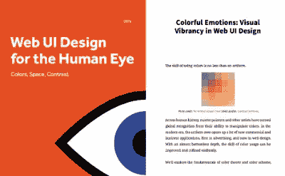

针对人眼的 Web UI 设计——UX pin

UXPin 通过人类视觉科学解释了 UI 和 UX 设计的工艺。

任何视觉媒体的设计师都可以从了解基础知识中受益，两卷本系列[的《人眼 Web UI 设计](http://studio.uxpin.com/ebooks/visual-web-ui-design-colors-space-contrast/)以一种与 Web 设计相关的简单易懂的方式教他们。

[第 1 卷](http://studio.uxpin.com/ebooks/visual-web-ui-design-colors-space-contrast/)讨论了不同颜色的情感效果，影响用户的视觉流，并应用了支配视错觉的格式塔原则。[第 2 卷](http://studio.uxpin.com/ebooks/visual-web-ui-design-content-typography/)通过解释常见的视觉行为、F-模式和 Z-模式、排版和整体布局组织，进一步深入细节。

## [像素完美精度手册 3](https://ustwo.com/blog/the-ustwo-pixel-perfect-precision-handbook-3/)

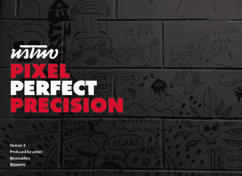

像素完美精度手册 3–us two

在过去的四年中定期更新，第三个也是最新版本的[Pixel Perfect Precision Handbook](https://ustwo.com/blog/the-ustwo-pixel-perfect-precision-handbook-3/)为网页设计中的经典视觉手册带来了更新的内容。

这本电子书以其对视觉设计的关注赢得了粉丝，并包括 Photoshop 的操作指南。新的更新包含了 40 个新的内容页面。

## [UX 说书人:串联起点点滴滴](http://uxstorytellers.blogspot.com.tr/2009/01/ux-storytellers-connecting-dots.html)

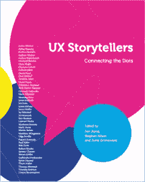

UX 说书人:将点点滴滴连接起来

作为 UX 设计电子书的真正经典， [UX 故事讲述者](http://uxstorytellers.blogspot.com.tr/2009/01/ux-storytellers-connecting-dots.html)由于其独特的结构而仍然具有相关性:它不是一个如何指导，而是来自 42 位真正的 UX 专家的自给自足的故事和技巧的集合。

586 页，你可以随时随地拿起这本书学习新的东西，当你需要一个新鲜的视角时，它就派上了用场。

## [UX 设计趋势 2015&2016](http://studio.uxpin.com/ebooks/ux-design-trends-2015-2016-digital-products/)

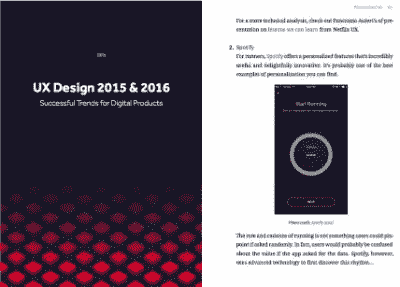

UX 设计 2015 & 2016——数码产品的成功趋势

回顾 2015 年以来的趋势，这本书分析了什么有效，为什么，以及如何在未来实施它。

【2015 年 UX 设计趋势& 2016 年探讨了目前最成功的 6 种 UX 趋势，并概述了每种趋势的最佳实践，包括 Waze、Spotify、Vine、Virgin America 等热门网站的案例研究。

随着时间的推移，个性化、微交互和多设备体验等主题只会变得更加重要。

## [CSS 的魔力](http://adamschwartz.co/magic-of-css/)

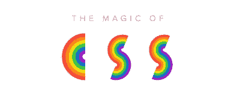

CSS 的魔力——亚当·施瓦茨

不管你喜不喜欢，CSS 现在在现代网页设计中扮演着重要的角色。Adam Schwartz 的《CSS 的魔力》用简单易懂的指南剖析了这种语言，并展示了示例代码和图表。更技术性更复杂的区域甚至还有模板和数据参考图。

这本书的全部内容都可以在网上找到，所以如果你发现自己对某个特定方面感到疑惑，不管答案有多小，只要点击几下鼠标就能找到。

## [UX 读者](http://theuxreader.com/)

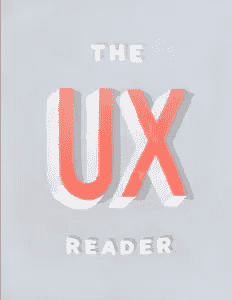

UX 读者——迈钦普·UX

MailChimp 的[UX 读者](http://theuxreader.com/)从前到后涵盖了 UX 设计的学科。这本包罗万象的指南对从零开始的初学者来说很棒，但对专家来说也是一本方便的参考指南，可以放在他们的数字书架上。

这本电子书将 UX 设计分为合作、研究、设计、开发和提炼五个类别。每个类别又进一步划分为由 MailChimp UX 团队的不同成员撰写的类似文章的部分，因此您可以挑选与您相关的主题。

## [50 个用户体验最佳实践](http://userexperiencedesigns.com/)

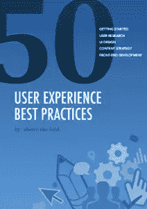

折叠上方的 50 个用户体验最佳实践

UX 电子书中的经典之作，开创性的 [50 条用户体验最佳实践](http://userexperiencedesigns.com/)非常成功，它实际上比写它的 UX 设计机构存在的时间还要长。

这本电子书列出了 50 个技巧来全面改善你的用户体验，涵盖了用户研究、流程、内容策略、规划和前端开发等领域。就广泛的主题提供具体建议，每个人都有适合自己的东西。随意的基调和令人难忘的图形当然也不会伤害。

## [Web UI 设计最佳实践](http://studio.uxpin.com/ebooks/web-ui-design-best-practices/)

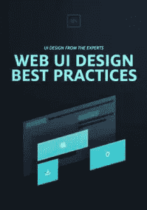

网络用户界面设计最佳实践——UX pin

Web UI 设计最佳实践是 UXPin 的一个包罗万象的指南版本。与他们的其他电子书一样，这本书也提供了普通读者所期待的简单语言解释的技术分析。

这本电子书分为导航、颜色、排版、用户界面模式和视觉层次等几个部分。这本书的好处是它如何结合了网页设计的其他学科，即界面和图形设计。一般来说，UX 设计是一个抽象的领域，从来没有从网页设计的其他组成部分中分离出来。

## [向伟大的设计学习](http://inspectelement.com/)

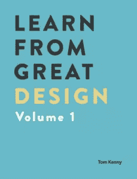

向伟大的设计学习。第 1 卷–汤姆·肯尼

汤姆·肯尼经营博客 Inspect Element，每周解构一个新景点，并解释他们做得好的地方。Kenny 在桌面和移动等不同设备上一页一页地浏览，并用多个截图说明他的观点。

虽然有更全面的书籍可供购买，但免费下载的内容[从伟大的设计中学习](http://inspectelement.com/contact/)收集了三个这样的案例研究，并定期循环播放。

这种教学策略非常有效，尤其是在网页设计这样的视觉媒体中。不同设备上网站的比较对于保持一致的 UX 来说是非常宝贵的，这种详细的处理方式是大多数免费电子书所不具备的。

## [用户体验设计师的好主意](http://userfocus.co.uk/ebooks/uxdesign.html)

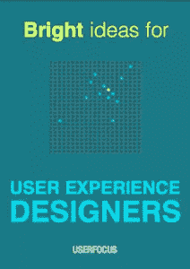

用户体验设计师的好主意——用户焦点

另一部经典之作《用户体验设计师的好主意》从 Userfocus 的 UX 专家的角度来看 UX 的设计实践。这本电子书最好的部分是它的幽默和轻松的语气，这两者都有助于它的记忆。

有趣的首字母缩略词如“通往可用性的垃圾之路”和涉及披头士的类比，这本书既有教育意义又有娱乐性。

Userfocus 提供一系列针对不同职业道路的免费 UX 电子书。如果这本书看起来有帮助，那就去看看其他针对 UX 经理或 T2 UX 研究人员的书籍。

## 【2015 年& 2016 年
网页设计潮流之书

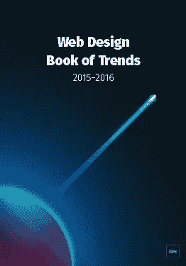

2015 年和 2016 年网页设计趋势——UXPin

我们名单上的最后一个是 UXPin 的[2015-2016](http://studio.uxpin.com/ebooks/web-ui-design-trends-2015-2016/)趋势网页设计书，这是他们的最新作品之一。

网页设计行业发展迅速，紧跟技术进步和用户偏好的趋势，并在一个相对年轻的领域发现新的最佳实践。去年还是尖端的技术今年会让你的产品显得过时。

UXPin 的书让设计师跟上时代。这本书涵盖了英雄图像、卡片布局、长滚动和高清视觉等趋势的理论和最佳实践，借鉴了苹果、Dropbox 和 Spotify 等 166 个热门网站的例子，并以 100 个额外的在线资源为特色。

## 分享这篇文章