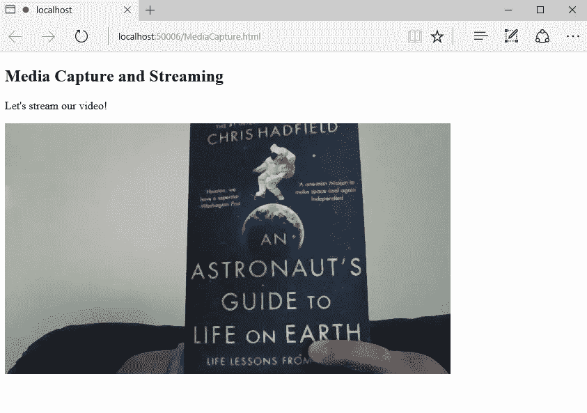
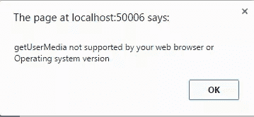

# 什么是媒体捕获和流，我如何使用它们？

> 原文：<https://www.sitepoint.com/whats-media-capture-streams-use/>

本文是微软网站开发系列的一部分。感谢您对使 SitePoint 成为可能的合作伙伴的支持。

当使用 web 技术开发应用程序时，无论是在 web 上还是在移动设备上，有时您会希望使用本地多媒体设备，如麦克风或摄像机。一个例子是允许用户从本地摄像机中流式传输或拍摄他们自己的照片。给你一点背景知识，网络上的音频/视频捕获和流很大程度上依赖于浏览器插件(Flash 或 Silverlight)。随着 HTML5 和浏览器推出浏览器插件，被誉为救世主的 HTML5 为网络接入设备带来了从地理定位(GPS)和 WebGL (GPU)到网络音频 API(音频硬件)等诸多功能。这些强大的功能展示了与系统底层硬件功能对话的高级 JavaScript APIs。

让我们从 ***HTML 媒体捕获*** 开始，根据规范，它被定义为一种表单扩展，便于访问设备的媒体捕获机制，它可以是相机、麦克风甚至是上传控件中的文件。

在其核心，媒体捕获用一个`capture`属性扩展了`HTMLInputElement`接口。一个基本的例子是: `<input type="file" capture>`。

这个捕获属性请求使用媒体捕获工具(照相机、麦克风等)。)用于现场捕捉媒体。

下面是一个简单的声明性示例来说明它的用法。下面显示了一个 HTML 表单，它使用了`capture`和`accept`属性，为用户捕获媒体提供了首选 MIME 类型的提示。

```
<input type="file" accept="image/*" capture>
```

HTML 媒体捕获扩展被特别设计为简单和声明性的，并且覆盖了 web 平台的媒体捕获功能的子集。然而，该 HTML 规范不提供对捕获的详细作者控制，也不允许从宿主设备访问实时媒体流。HTML 媒体捕获是标准化网络媒体捕获的第一枪。它重用文件输入元素，并通过重载它和为 accept 参数添加新值来工作。所以基本上，它的工作原理很神奇，但它只允许你记录媒体文件或及时拍摄快照。Media Capture 的不足之处是实现实时效果的能力，例如将实时网络摄像头数据渲染到一个`<canvas>`元素，并在其上应用一些 WebGL 过滤器。

因此，我们有媒体捕获和流。

媒体捕获和流实际上是一组 JavaScript APIs。这些 API 允许从平台请求本地媒体(音频和视频)。换句话说，它提供对用户本地音频和视频输入/输出设备的访问。

更具体地说，我们有 MediaStream API，它提供了控制多媒体流数据消费位置的方法，并提供了对制作媒体的设备的一些控制。此外，MediaStream API 公开了关于能够捕获和呈现媒体的设备的信息。

为什么重要？这是给后代的一堂历史课，他们可能会认为这是理所当然的。媒体(音频/视频)捕获功能已经成为 web 开发的“天堂”有一段时间了。历史上，我们不得不依靠浏览器插件(Flash 或 Silverlight)来实现这一点。然后 HTML5 来拯救我们。HTML5 带来了强大的功能，允许从地理定位(GPS)到 WebGL (GPU)等本地访问设备硬件。这些现已嵌入浏览器的功能展示了位于设备硬件能力之上的高级 JavaScript APIs。

那么，我们为什么要使用它就变得很明显了。

这个 API 中最重要的方法之一是`getUserMedia()`,它是 API 集合的入口。`getUserMedia()`提供访问用户本地摄像头/麦克风流的方法。

然而，特征检测是检查其支持的最好方法，直接`if(navigator.getUserMedia)`或使用现代化工具`if(Modernizr.getusermedia)`。

基本语法是:

```
var stream = navigator.getUserMedia(constraints, successCallback, errorCallback);
```

`constraints`参数实际上是一个具有两个布尔成员的`MediaStreamConstraints`对象:视频和音频。这些描述了支持`LocalMediaStream`对象的媒体类型。必须指定其中一个或两个来验证约束参数。LocalMediaStream 对象是调用`getUserMedia()`返回的 MediaStream 对象。它拥有 MediaStream 对象和 stop 方法的所有属性和事件。

为音频和视频设置约束如下:`{ video: true, audio: true }`

将使用包含媒体流的 LocalMediaStream 对象调用`successCallback`函数(成功时)。您可以将该对象分配给适当的元素并使用它，如下例所示:

当出现错误时，将调用`errorCallback`，它将被以下代码参数之一调用:“permission_denied”、“not_supported_error”或“mandatory_unsatisfied_error”。

一个基本的例子是:

```
 <!DOCTYPE html>
	<a href="Default.html">Default.html</a>
	<head>
	<meta charset="utf-8"/>
	<title></title>
	<script type="text/javascript">
		if (navigator.getUserMedia) {
            navigator.getUserMedia(
			// constraints
            {
                video: true,
                audio: true
            },
			// successCallback
			function (localMediaStream) {
				var video = document.querySelector('video');
                video.src = window.URL.createObjectURL(localMediaStream);
				// do whatever you want with the video
                video.play();
            },
			// errorCallback
			function (err) {
                console.log("The following error occured: " + err);
            });
        } else {
            alert("getUserMedia not supported by your web browser or Operating system version");
        }
	</script>
	</head>
	<body>
		<h2>Media Capture and Streaming</h2>
		<p>Let's stream our video!</p>
		<video autoplay></video>
	</body>
</html> 

```

当您运行此脚本时，浏览器会提示您使用设备上的网络摄像头和麦克风。下图显示了此示例在浏览器上的运行情况:



从现在开始，你可以变得有创造力。使用`getUserMedia`，可以录制、播放、保存和加载流媒体。然后，如果你愿意，你可以应用一些可视化，效果和过滤器的数据流。

在浏览器兼容性方面，现代主流浏览器都支持 getUserMedia API。微软 Edge，Chrome 21+，Opera 18+，火狐 17+。令人惊讶的是，在 Chrome 上，标准功能没有被识别出来。似乎无法识别 getUserMedia 函数。下面是我在 Chrome 上运行该网站时的截图。



为了解决这个问题，我必须添加供应商 webkit 供应商前缀。为了安全起见，我最终添加了所有的供应商前缀。

下面是附加的脚本，就在`if (navigator.getUserMedia)`之前

```
 navigator.getUserMedia = (navigator.getUserMedia ||
	navigator.webkitGetUserMedia ||
	navigator.mozGetUserMedia
); 

```

微软 Edge 承诺提供基于标准和可互操作的 web 体验，支持 build 10240+的无前缀版本。你可以在他们网站的[平台状态](https://dev.windows.com/en-us/microsoft-edge/platform/status/mediacaptureandstreams?utm_source=SitePoint&utm_medium=article77&utm_campaign=SitePoint?filter=f3f0000bf&search=getUserMedia)部分查看对媒体捕获和流的支持，特别是 getUserMedia API。在那里，您还可以查看其他实现的 web 标准路线图。

最后，微软 Edge 网站上有一个很好的例子[https://dev . windows . com/en-us/Microsoft-Edge/test drive/demos/microphone/](https://dev.windows.com/en-us/microsoft-edge/testdrive/demos/microphone/?utm_source=SitePoint&utm_medium=article77&utm_campaign=SitePoint)。这个演示展示了麦克风流&网络音频一起工作。你也可以在 GitHub repo 上查看这个演示的代码和其他代码:https://github.com/MicrosoftEdge/EdgePortal-demos。

编码快乐！

## 更多的 Web 开发实践

这篇文章是微软布道者和工程师关于实用 JavaScript 学习、开源项目和互操作性最佳实践的 web 开发系列的一部分，包括[微软 Edge](http://blogs.windows.com/msedgedev/2015/05/06/a-break-from-the-past-part-2-saying-goodbye-to-activex-vbscript-attachevent/?WT.mc_id=16541-DEV-sitepoint-article77) 浏览器和新的 [EdgeHTML 渲染引擎](http://blogs.windows.com/msedgedev/2015/02/26/a-break-from-the-past-the-birth-of-microsofts-new-web-rendering-engine/?WT.mc_id=16541-DEV-sitepoint-article77)。

我们鼓励您在 dev.microsoftedge.com 使用免费工具进行跨浏览器和设备测试，包括 Windows 10 的默认浏览器 Microsoft Edge:

*   [扫描你的网站，寻找过时的库、布局问题和可访问性](http://dev.modern.ie/tools/staticscan/?utm_source=SitePoint&utm_medium=article77&utm_campaign=SitePoint)
*   [下载适用于 Mac、Linux 和 Windows 的免费虚拟机](http://dev.modern.ie/tools/vms/windows/?utm_source=SitePoint&utm_medium=article77&utm_campaign=SitePoint)
*   [跨浏览器检查网络平台状态，包括微软 Edge 路线图](https://dev.modern.ie/platform/status/?utm_source=SitePoint&utm_medium=article77&utm_campaign=SitePoint)
*   [在您自己的设备上远程测试 Microsoft Edge](https://remote.modern.ie/?utm_source=SitePoint&utm_medium=article77&utm_campaign=SitePoint)

**向我们的工程师和传道者进行更深入的学习:**

*   **互操作性最佳实践** ( [系列](https://channel9.msdn.com/Blogs/BeLux-Developer/Riding-the-Modern-Web-5-things-to-consider-as-a-web-developer?WT.mc_id=16541-DEV-sitepoint-article77)):
*   [如何避免浏览器检测](https://channel9.msdn.com/Blogs/BeLux-Developer/Riding-the-Modern-Web-Avoiding-Browser-Detection?WT.mc_id=16541-DEV-sitepoint-article77)
*   [使用 CSS 前缀的最佳实践](https://channel9.msdn.com/Blogs/BeLux-Developer/Riding-the-Modern-Web-CSS-Vendor-Prefixes?WT.mc_id=16541-DEV-sitepoint-article77)
*   [保持你的 JS 框架&库更新](https://channel9.msdn.com/Blogs/BeLux-Developer/Riding-the-Modern-Web-Dealing-with-JavaScript-Libraries?WT.mc_id=16541-DEV-sitepoint-article77)
*   [构建插件免费网络体验](https://channel9.msdn.com/Blogs/BeLux-Developer/Riding-the-Modern-Web-Dealing-with-Plugins?WT.mc_id=16541-DEV-sitepoint-article77)
*   [GitHub 编码实验室:跨浏览器测试和最佳实践](https://github.com/deltakosh/interoperable-web-development?WT.mc_id=16541-DEV-sitepoint-article77)
*   哇，我可以在 Mac 电脑上测试 Edge & IE 浏览器& Linux！(来自雷伊·班戈)
*   [在不破坏网络的情况下推进 JavaScript】(来自 Christian Heilmann)](http://channel9.msdn.com/Events/WebPlatformSummit/2015/Advancing-JavaScript-without-breaking-the-web?WT.mc_id=16541-DEV-sitepoint-article77)
*   [用 WebGL 释放 3D 渲染](https://channel9.msdn.com/Events/WebPlatformSummit/2015/Unleash-3D-rendering-with-WebGL-and-Microsoft-Edge?WT.mc_id=16541-DEV-sitepoint-article77)(来自 David Catuhe)
*   托管网络应用和网络平台创新

**我们的社区开源项目:**

*   伏龙。JS (跨设备远程 JavaScript 测试)
*   [manifoldJS](http://manifoldjs.com/?WT.mc_id=16541-DEV-sitepoint-article77) (部署跨平台托管的 web 应用)
*   [babylonJS](http://babylonjs.com/) (轻松制作 3D 图形)

**更多免费工具和后端 web 开发工具:**

*   [Visual Studio 代码](https://code.visualstudio.com/?WT.mc_id=16541-DEV-sitepoint-article77)(用于 Mac、Linux 或 Windows 的轻量级代码编辑器)
*   [Visual Studio 开发基础知识](https://www.visualstudio.com/en-us/products/visual-studio-dev-essentials-vs.aspx/?WT.mc_id=16541-DEV-sitepoint-article77)(基于订阅的免费培训和云优势)
*   [用节点编码。JS](https://www.microsoftvirtualacademy.com/en-US/training-courses/building-apps-with-node-js-jump-start-8422?WT.mc_id=16541-DEV-sitepoint-article77) 与[在蔚蓝云上试用](https://azure.microsoft.com/en-us/pricing/free-trial/?WT.mc_id=16541-DEV-sitepoint-article77)

## 分享这篇文章