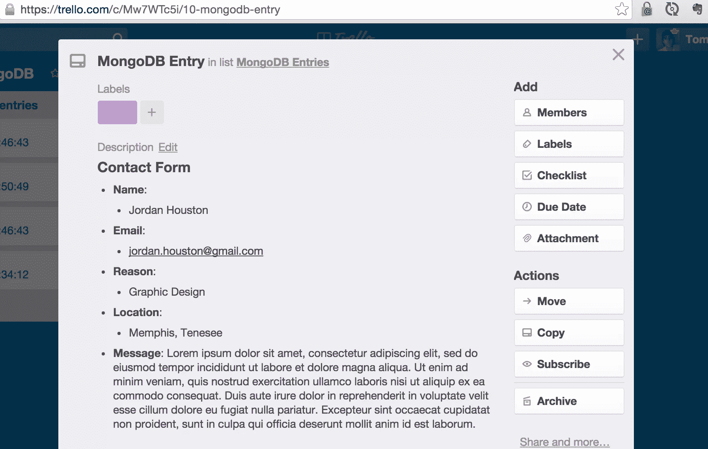
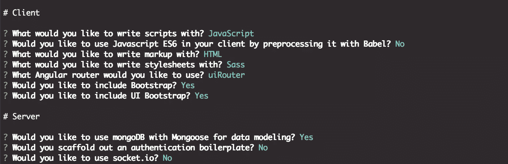
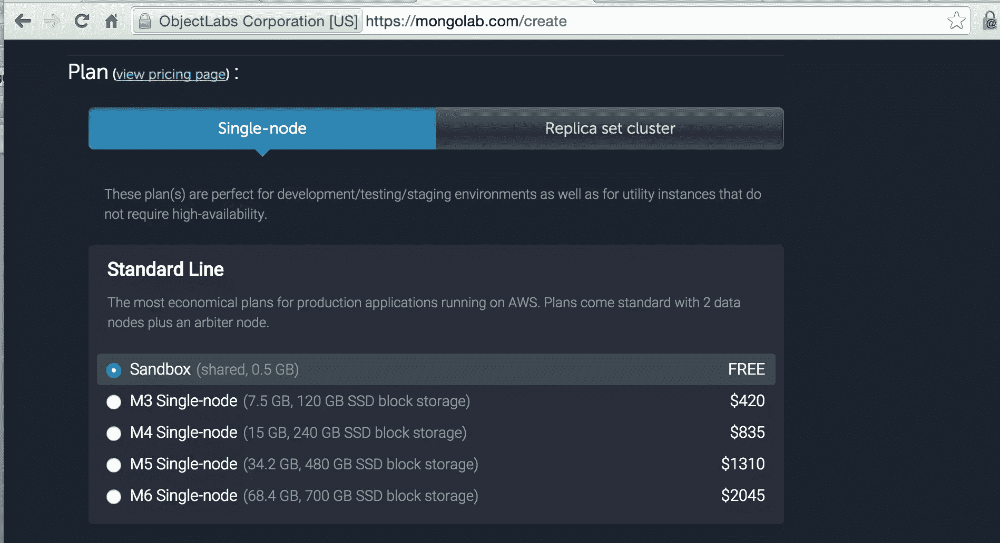
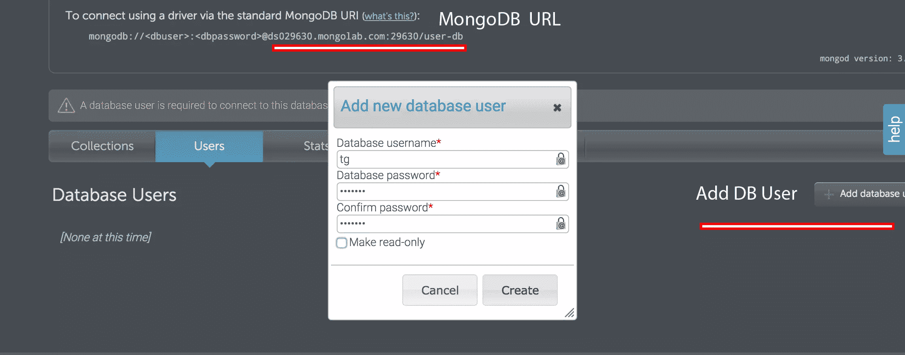

# 和 Trello 和 Zapier 一起去找 M.E.A.N

> 原文：<https://www.sitepoint.com/getting-mean-with-trello-and-zapier/>

*这篇文章由[杰瑞米·海伦妮](https://www.sitepoint.com/author/jheleine/)和[马克·托勒](https://github.com/MarcTowler)进行了同行评审。感谢 SitePoint 的所有同行评审员使 SitePoint 的内容尽可能做到最好！*

说到工作流工具，毫无疑问，Trello 和 Zapier 在许多开发人员的生活中扮演着重要的角色。Trello 负责管理任务，而 Zapier 则负责自动化。这使得这对组合非常强大。到本文结束时，我们将连接一个表单，该表单发送到 MongoHQ 上设置的 MongoDB 实例。此外，我们将把它与 Zapier 联系起来，这样每当我们的用户收藏中增加一个新的 Trello 卡时，它就会创建一个新的 Trello 卡。

## 介绍特雷罗

Trello 是一个任务管理器，擅长提供降价支持或快捷方式等资产。它使管理任务成为一个更简单的过程。在 SitePoint，我们每天都依靠 Trello 来有效地开发内容，从一个想法到一篇文章。在整个编辑过程中，我们利用了许多不同的板块，这些板块是 Trello 的重要组成部分。我们每件商品都有一张卡片。这些卡片通常包括大纲、链接和其他与主题相关的东西。考虑到这一点，Trello 可以通过许多不同的方式来组织与你生活相关的信息。

今天，我们将利用 Trello，将它与 [Zapier](https://zapier.com/) 结合起来，创造出令你惊叹的东西。在本教程结束时，我们将有一个表单，它根据传递给它的信息创建一张卡片。下面我们可以看到一个使用发送到我们表单的数据生成的卡片示例。



对于那些没有 Trello 帐户的人，您可以在几分钟内创建一个。注册后，我们将很快创建一个新的公告板和一个列表，我们将在这个列表中以 Trello 卡的形式生成项目。

## 发电机满了

我们将使用生成器 fullstack 来构建这个应用程序。[对 M.E.A.N. stack](https://www.sitepoint.com/introduction-to-mean-stack/) 有基本的了解会有所帮助，但完成本教程并不是必须的。刚接触 M.E.A.N 堆栈的人很快就会发现，在这个 Yeoman 生成器的帮助下，构建一个完整的堆栈应用程序是多么容易。要安装所需的生成器 generator-angular-fullstack，我们可以运行以下命令:

```
npm install -g generator-angular-fullstack
```

之后，在 CLI 上写下:

```
yo angular-fullstack
```

当运行这个命令时，我们会被问到一系列关于我们项目的问题。如何配置它们，取决于你自己。然而，我们想确保我们为数据建模启用了[mongose](http://mongoosejs.com/)。下面，我们可以看到构建示例应用程序过程中命令行的屏幕截图。



一旦 [angular-fullstack](https://github.com/angular-fullstack/generator-angular-fullstack) 创建了我们的应用，我们只需做很少的改动。首先，我们向应用程序添加一个 mongoDB 实例。我们将使用`grunt serve`来运行我们的应用程序，因此它将寻找在`server/confi/development.js`文件中配置的本地数据库。毕竟这个命令要启动一个开发 M.E.A.N. start 应用的完整环境。然而，我们需要我们的应用程序与托管在 mongolab.com[的数据库进行交互，这是一个著名的 MongoDB 提供商。注册一个账户非常容易。那些还没有这样做的人，现在应该做了。](https://mongolab.com/)

登录后，我们需要做两件事:

1.  创建一个数据库。
2.  向此数据库添加用户。

当创建一个新的数据库时，我们将不得不请求我们希望我们的应用程序拥有的空间量。在本教程中，我们只需要创建一个集群数据库。



下面是 mongolab 仪表板上的图像。它显示了一个名为 *user-db* 的数据库。在这一页中，我们需要注意的事情很少。首先是 Mongo URL，我们将把它传递到我们的应用程序中，以便任何对数据库的请求都可以与这个实例进行交互。为了使用这个数据库，我们还需要为它创建一个用户。此外，数据库用户的用户名和密码也很重要，因为需要它们来将这个实例添加到我们的应用程序中。



## 服务器端代码

一旦创建了一个数据库，我们就需要设置它，这样我们就可以成功地调用它。首先，我们修改前面提到的`development.js`文件，它位于我们的`server/config`目录中。如果成功，该文件应该类似于下面的代码。

```
'use strict';

// Development specific configuration
module.exports = {
  // MongoDB connection options
  mongo: {
    uri: 'mongodb://:@ds029630.mongolab.com:29630/user-db'
  },
  seedDB: true
};
```

我们想做的下一件事是创建一个端点来发布我们的`user`文档。当使用我们正在使用的生成器时，我们可以很容易地为应用程序的客户端和服务器端生成不同的代码。在这个实例中，我们将使用这个工具来命令为我们的应用程序生成一个端点。

通过运行下面的命令，我们可以生成与位于`user`集合中的数据进行交互所需的文件。

```
yo angular-fullstack:endpount user
```

当被提示有任何问题时，我们只需按 enter 键并使用默认设置。结果将是位于`api/users`的用户端点。

此外，我们在`server/api`目录中生成了一个名为`user`的新文件夹。在这个目录中，angular-fullstack 创建了一个模式，我们可以将数据发送到这个模式中。您还记得有人问您是否将 Mongoose 用于数据建模吗？嗯，这就是我们要用它的地方。

Mongoose 是一个用于建模数据的 npm 模块。通过查看下面的代码，我们看到 Schema 已经被设置为等于 mongoose.Schema。在`newSchema({})`对象内部，我们需要修改一些属性。我们将删除所有当前属性(除了*姓名*，并添加名为*电子邮件*、*位置*、*原因*和*消息*的附加字段。像 *name* 一样，所有这些属性都将是字符串，因此最终结果应该类似于下面的代码片段:

```
var UserSchema = new Schema({
    name: String,
    email: String,
    location: String,
    reason: String,
    message: String
});
```

太好了！我们已经创建了一个端点，对我们的模式进行了正确的修改，并且我们已经准备好了！

我们之前了解到，我们可以使用`grunt serve`来启动 app。如果一切顺利，Grunt 将打开一个浏览器，允许我们在不重启服务器的情况下修改文件。值得注意的是，这通常需要我们使用`mongod`命令运行一个 MongoDB 的本地实例，但是我们修改了`development.js`文件来引用我们通过 MongoLab.com 托管的数据库。也就是说，让我们继续为我们的应用程序配置客户端代码。

## 客户端

通过在我们的项目中运行`yo angular-fullstack:route <route-name>`,我们可以很容易地生成一条新路线。然而，我们将保持它的简单性，并使用这个应用程序安装时所在的`main`目录中的文件。具体来说，我们将对主状态的控制器以及模板文件进行更改。默认情况下，generator-fullstack 在这个控制器中包含一些 API 调用。虽然对于这个例子来说它们不是必需的，但是它们展示了 Angular 的`http`模块的真实例子，并且帮助用户提供了一个坚实的起点。选择保留还是删除这段代码并不重要，但是我们需要添加一些代码。

我们通常会将 HTTP 模块传递到我们的控制器中，但是由于这个应用程序已经在与我们的 API 进行交互，我们可以立即开始编写 post 调用。

通过查看下面的代码，我们可以看到这个控制器中现在有了一个`sendForm()`函数。

```
angular.module('yoTrelloApp')
    .controller('MainCtrl', function($scope, $http) {
$scope.sendForm = function() {
            var data = ({
                name: $scope.fullName,
                email: $scope.email,
                location: $scope.userLocation,
                reason: $scope.reason,
                message: $scope.message
            });
            $http.post('/api/users', data)
                .success(function(data) {
                    $scope.data = data;
                });
            $scope.name = '';
            $scope.email = '';
            $scope.location = '';
            $scope.reason = '';
            $scope.message = '';
        };
    });
});
```

让我们来分析一下到底发生了什么。

1.  创建一个名为 data 的变量。在这个变量中，我们设置了在服务器模式中定义的所有属性的`$scope`。这将允许我们使用`ng-model`指令来访问这些属性。
2.  对`/api/user/`路由进行了一个`http.post`调用，这是我们在生成用户端点时指定的位置。这将 post 调用与新的输入数据联系起来，所以每次启动`sendForm()`函数时，这个调用都会向用户集合中添加一个新用户。
3.  我们做的最后一件事是通过将模式中所有属性的`$scope`设置为一个空数组来重置表单。这可能看起来是一个不太好的方法，但它会很好。

现在我们所有的客户端 JavaScript 都已经存在了，我们需要添加一个表单，向我们的 MonogoDB 发出 post 请求。为此，我们将对我们的`main.html`文件进行一些修改。

首先，我们将删除容器中的所有内容。在我们的开始表单标签中，我们需要包含`ng-submit`指令，并赋予它值`sendForm()`。然后，我们需要将这个表单绑定到我们的数据模型。为此，我们创建了几个输入字段来保存我们的`ng-model`指令。此外，每个`ng-model`将以其对应的属性的名称传递。最后，为了执行`sendForm`功能，我们需要创建一个`onsubmit`事件。为了实现这个目标，我们将在表单底部添加一个按钮，并将其声明为`type="submit"`。

一旦完成，我们的代码应该看起来像 [this CodePen](http://codepen.io/SitePoint/pen/yeojBr) ，也报告如下:

在 [CodePen](http://codepen.io) 上通过 SitePoint ( [@SitePoint](http://codepen.io/SitePoint) )看笔[yeobjbr](http://codepen.io/SitePoint/pen/yeojBr/)。