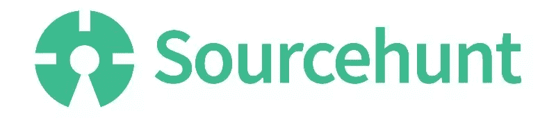
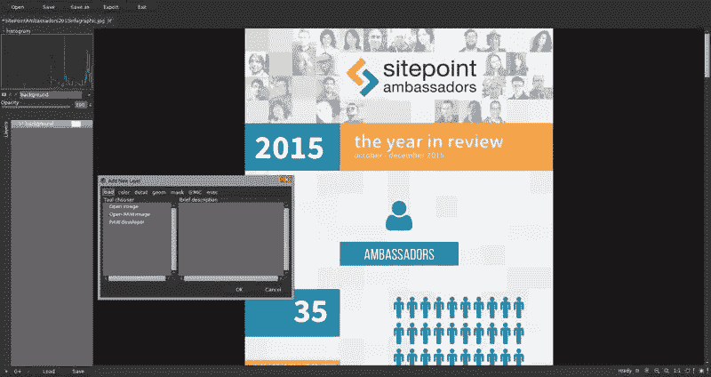
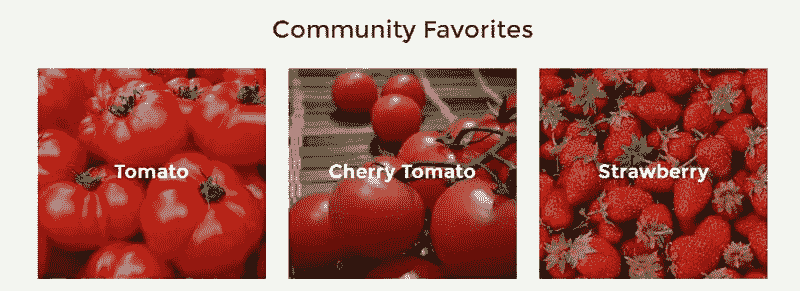
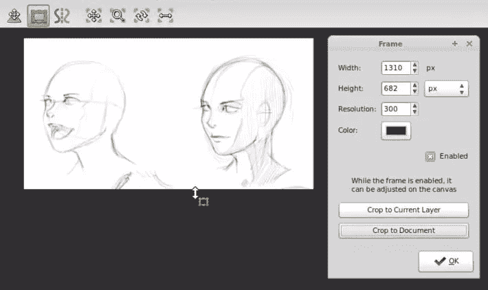
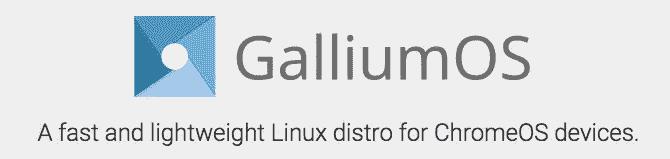

# 你是一个有才华的设计师吗？Sourcehunt #1 需要你！

> 原文：<https://www.sitepoint.com/talented-designer-sourcehunt-needs/>

2015 年 10 月，SitePoint 自己的布鲁诺·什科沃茨发布了 Sourcehunt PHP ，这是一项有价值的举措，旨在通过吸引更多贡献者来帮助(主要是小众)开源项目发展。在真正的开源时尚中，它极大地反映了我们在 SitePoint 对开源的热爱。

随着 PHP 频道成为第一个获得 Sourcehunt 待遇的频道，设计频道也渴望赶上。虽然您可能不经常在同一个句子中听到“设计”和“开源”，但我已经看到太多伟大的开源项目由于缺乏好的设计而失败。通常情况下，对 UX、用户界面甚至品牌的简单修改就能带来改变。

然而，为一个开源项目做贡献是非常有益的。当然，你可能不会直接得到报酬，因为*会得到:——设计师的街头信誉(“哦，是的..我致力于此..”)-以分散的方式与其他有才华的人一起工作的经历-当然，这在你的简历上看起来非常令人印象深刻*

更不用说制作酷东西的简单快乐了——这个概念我可能不需要说服你，因为你可能已经是一名设计师了，并且正在阅读这篇文章。

对于 Sourcehunt Design 来说，[开源设计](http://opensourcedesign.net/)小组在推广开放设计原则和需要少量优秀设计的开源项目方面提供了很大的帮助。多亏了他们，我才能够收集这些小项目，并在接下来的几个月里提供更多的项目。

**所以，简单回顾一下:**

我们将通过一些开源项目，这些项目需要帮助设计的手。然而，作为一名设计师，有时做贡献并不像做代码那样简单，所以我会试着根据具体情况解释你如何做贡献。

万一 GitHub 有点吓到你(没关系，我们都经历过)，放松！我们将只关注 GitHub 的问题，这是 GitHub 提供的票务系统。检查一下 [GitHub 导轨](https://guides.github.com/)以防卡住。

我们开始吧！

## [PhotoFlow](http://photoflowblog.blogspot.al/)

PhotoFlow 旨在通过包括原始图像开发在内的完整工作流程，提供完全无损的照片修图体验。它有一个雄心勃勃的特性列表，希望在 1.0 版本发布后实现。具体来说:

*   完全无损、基于图层的照片编辑工作流程，可实时预览最终图像
*   支持 8 位和 16 位整数以及 32 位和 64 位浮点精度，可在运行时按图像选择
*   由于基于 VIPS 库的底层渲染引擎，允许加载和编辑任意大小的图像
*   全色彩管理工作流程:用户定义的输入、工作和输出配置文件、软打样等
*   支持图层分组和图层蒙版
*   支持常见的照片编辑工具:级别，曲线，亮度对比度控制，模糊，锐化，裁剪，调整大小，色彩空间转换等。以图像层的形式实现

该项目目前正在寻找一个 UX/用户界面设计师，以改善其图形界面，并帮助该计划的一般外观和感觉。这是一个非常简单的任务，所以[查看开源设计](http://opensourcedesign.net/jobs/jobs/2015-10-26-PhotoFlow-UI_UX-Enhancement.html)的列表，并在 [GitHub 回购中发起一个问题。](https://github.com/aferrero2707/PhotoFlow)

*   [网站](http://photoflowblog.blogspot.al)
*   [GitHub 回购](https://github.com/aferrero2707/PhotoFlow)

## [露天农场](https://openfarm.cc/)

OpenFarm 是一个免费开放的农业和园艺知识数据库。它旨在为专家和初学者农民和园丁提供一个平台，以种植指南的形式分享他们的知识，这些指南描述了如何根据特定的环境条件和种植实践种植作物。用户和指南之间的兼容性评分允许快速发现高质量的相关信息。

这不是你偶然发现的普通开源项目之一，这使得它更加有趣。同样值得注意的是，OpenFarm 的数据库中存储的所有数据都是公共域，这是对 commons 的巨大贡献。

目前，OpenFarm 的伙计们正在寻找一名插画师来[创作他们的个性化吉祥物](http://opensourcedesign.net/jobs/jobs/2015-07-10-design-openfarm-mascot-openfarm.html)。如果你想尝试一下，就去 GitHub 上的[看看这个问题。](https://github.com/openfarmcc/OpenFarm/issues/639)

如果图标设计是你的事情，OpenFarm 也需要一些帮助来开发他们的拖放农场设计器/管理器工具-[特别是植物图标的选择](http://opensourcedesign.net/jobs/jobs/2015-09-SVG-plant-icons.html)。你可以在 GitHub 上找到[的相关问题，如果你能接手的话。](https://github.com/openfarmcc/OpenFarm/issues/685)

这只是目前最优先考虑的两个具体工作，但请随意浏览，并通过其他更改和添加为项目做出贡献。OpenFarmers 肯定会很感激的！

*   [网站](https://openfarm.cc/)
*   [GitHub 回购](https://github.com/openfarmcc/OpenFarm)

## [雷鸟对话](https://addons.mozilla.org/en-US/thunderbird/addon/gmail-conversation-view/)

Thunderbird Conversations 是一个 Thunderbird 扩展，顾名思义，它支持 Mozilla 的 Thunderbird 电子邮件客户端中的对话视图。显著的特点包括:

*   常规对话视图，从所有文件夹中提取邮件，其行为类似于 Gmail
*   具有自动完成功能的快速回复功能，允许您快速回复一个主题，
*   引用的零件被折叠，
*   键盘快捷键，
*   以及其他一些额外的功能。

Conversations 实际上是下载量最大的雷鸟插件之一，每日用户超过 6 万。作为主要的开源客户端，雷鸟也很受欢迎。

这是一个项目接近我自己的心，我亲自创建了附加的标志。我目前也在重新设计用户界面。该项目目前正在寻找设计师来帮助完成重新设计。如果你有兴趣，可以看看 GitHub 的第一期。我们可能最终会在这个项目上合作！

*   [网站](https://addons.mozilla.org/en-US/thunderbird/addon/gmail-conversation-view/)
*   [GitHub 回购](https://github.com/protz/thunderbird-conversations)

## [my paint](http://mypaint.org/)

MyPaint 是一款适用于数字画家的灵活、轻松的工具。它支持 Wacom 公司生产的图形输入板和许多类似的设备。MyPaint 的画笔引擎是通用的和可配置的，它提供了有用的生产工具。它还提供了一系列画笔，可以精确地模仿传统媒介，如木炭、铅笔、墨水或颜料。

该项目在这个阶段已经相当成熟，经过多年的开发后，这是有意义的。MyPaint 团队鼓励贡献者提交他们的作品和/或画笔，但也征集对软件 UI 和 UX 的贡献。

UX 帮助你解决的一个例子是 GitHub 上的这个(相当老的)问题。随时打开一个新的问题，与开发者取得联系，并开始贡献！

*   [网站](http://mypaint.org/)
*   [GitHub](https://github.com/mypaint/mypaint)

## [伽蓝鸟](https://galliumos.org)

这是另一个我非常感兴趣的项目。GalliumOS 是一个 Linux 发行版，针对 Chromebooks 和 Chromeboxes 的性能和兼容性进行了精心优化。它的目标是在相同的硬件上超越 ChromeOS，同时提供完整的 Linux 环境。

GalliumOS 基于 Xubuntu(基于 ubuntu，基于 Debian)，为 Chrome 设备提供了比其他 Linux 发行版更多的优化和功能。

它是轻量级的，开箱即可流畅运行，具有 Linux 爱好者可能需要的所有功能。通过与 ChromeOS 鼠标驱动程序集成，镓提供了 ChromeOS 闻名的那种光滑的触摸板体验。

此外，GalliumOS 还为 Chrome 设备修复了一些其他 Linux 发行版中没有的错误。

我个人作为一个贡献者参与了 GalliumOS，创建了它的品牌标识，早期的网站设计，以及一些在实际操作系统中使用的壁纸。该项目目前需要为其网站，维基和 UI &发行版的 UX 的设计贡献。你可能会和我在 GalliumOS 的设计方面一起工作，所以如果你渴望加入，请随时在 GitHub 上提交问题！

[网站](https://galliumos.org) [GitHub](https://github.com/GalliumOS/galliumos-distro)

## 打猎了吗？

我希望上面的一些项目引起你的兴趣！在开始之前，请务必通读每个项目的贡献指南。然而，大多数时候，简单地提出一个问题并提供帮助就能达到目的。他们会很高兴伸出援助之手，你应该会很快得到答复。

请在评论中让我们知道您的贡献，或者使用# sourcehunt #设计标签，我们可能会在下一期 sourcehunt 中介绍您！

## 分享这篇文章