# 具有 UITableView 和自动布局的自调整单元格

> 原文：<https://www.sitepoint.com/self-sizing-cells-uitableview-auto-layout/>

长期以来，iOS 开发者面临的一大挑战是定制`UITableView`和`UICollectionView`单元格的高度和大小。有很多方法可以实现这一点，比如“[自动布局](https://developer.apple.com/library/ios/documentation/UserExperience/Conceptual/AutolayoutPG/)”，但是它们很“粗糙”，没有完全实现。

以前计算身高，开发者有两种选择。

如果使用自动布局，开发人员可以创建一个屏幕外单元格，在`tableView:heightForRowAtIndexPath:`中布局内容，然后获得高度(使用`systemLayoutSizeFittingSize:`)。

如果不使用自动布局，必须手动计算每个单元格的高度，并缓存值以避免速度变慢。

到了 iOS 8，`UITableView` s 和`UICollectionView` s 已经拥抱自动布局。在本帖中，我们将涵盖你需要知道的在你的应用中支持`UITableView`的内容。

我们将创建一个小的示例应用程序，您也可以在 [Github](https://github.com/sitepoint-editors/iOS-SelfSizingCells) 上找到它。

应用程序中使用的资产可在此处找到[。](https://github.com/sitepoint-editors/iOS-SelfSizingCells/blob/master/dataset.zip)

## 项目设置

在这个应用程序中，我们将显示一系列报价和报价者的照片(如果有)。我们将在 Xcode 7.2 上用 Swift 2.1 编写应用，但将针对 iOS 8.1 及以上版本。

在 Xcode 中，进入*文件- >新建- >项目*，新建一个*单视图应用*。这将生成一个带有简单`UIViewController`的新项目供您开始。因为我们不需要它，所以删除 *ViewController.swift* 。

创建项目之后，我们需要创建视图控制器和定制单元。这些应该是`UITableViewController`和`UITableViewCell`的一个子类。

在项目内部，创建两个新组(文件夹)，*视图控制器*和*单元格*来保存上面的内容。

让我们创建我们的视图控制器。*右击**视图控制器*组，选择*新文件*，在出现的面板中选择*可可触摸类*。

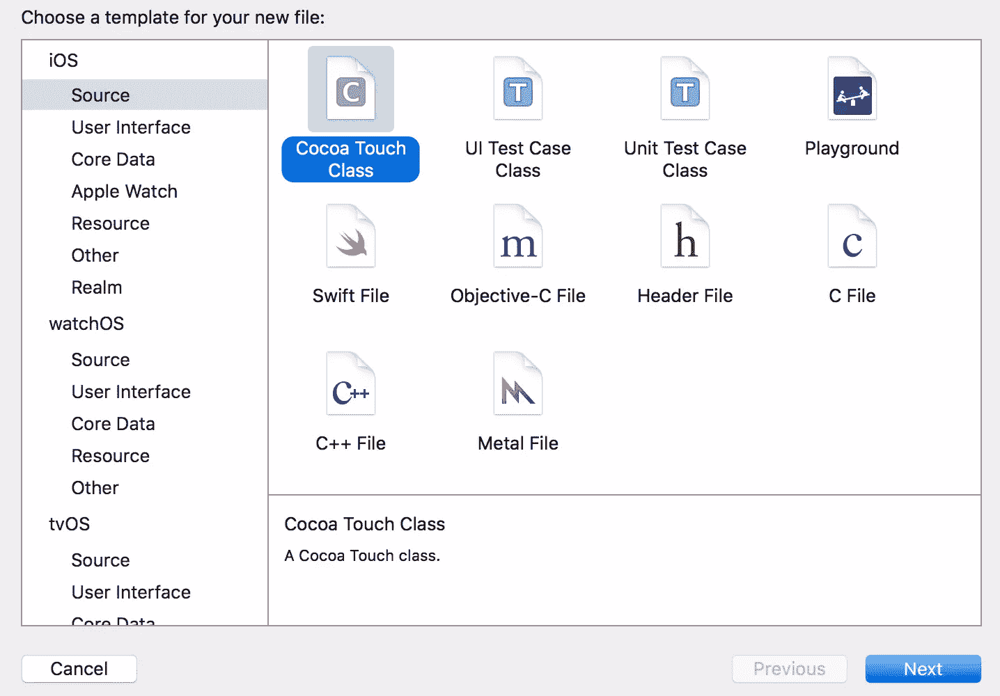

然后创建一个`UITableViewController`的子类。因为我们将在应用程序中使用故事板，你可以不勾选*也创建 XIB 文件*选项。

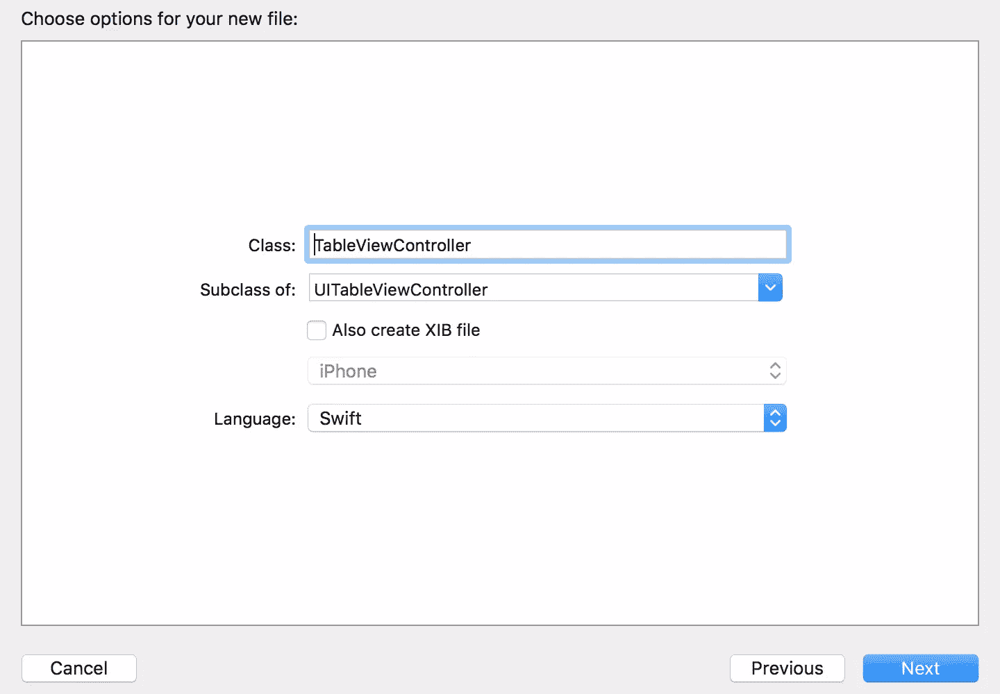

在*单元格*组下，创建`UITableViewCell`的子类。

这一次，我们**将**检查 XIB 选项，因为我们稍后将使用它来设置单元。


接下来，我们需要使用我们在应用程序中创建的视图控制器。打开 *Main.storyboard* ，删除 Xcode 生成的任何现有场景。然后从对象库中点击并拖动一个`UITableViewController`到故事板上，并将其更改为`TableViewController`的一个实例。

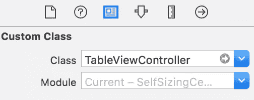

通过选择`TableViewController`场景并选择*编辑器- >嵌入- >导航控制器*，将该视图控制器嵌入到`UINavigationController`中。对于我们的目的来说，这是可选的，但它会使应用程序看起来更好。

最后，确保导航控制器是 app 的入口。选择控制器，并在属性检查器中，启用*是初始视图控制器*。

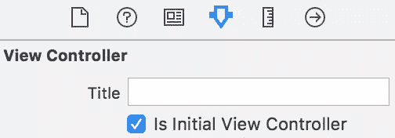

故事板现在应该看起来像这样:

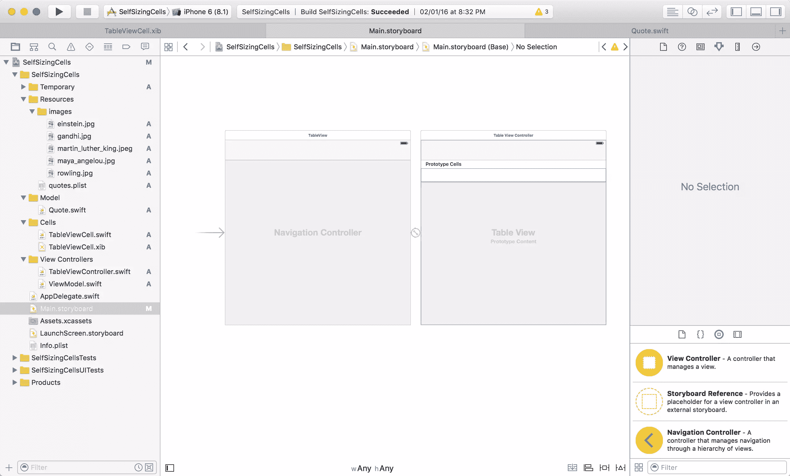

稍后我们将配置单元和视图控制器。

接下来，我们将创建:

*   将报价表示为一个`NSObject`子类的模型
*   另一个`ViewModel`的子类`NSObject`，作为控制器的数据源。这将简化我们的视图控制器，让我们尽可能重用代码。例如，如果我们需要从使用一个`tableView`转移到一个`collectionView`，这样做是微不足道的。

在新的*车型*组中创建 *Quote.swift* ，并添加以下内容:

```
import Foundation

class Quote: NSObject {
    var text: String!
    var imageName:String?
    var personName:String?

    convenience init(text:String!, imageName:String?, personName:String?) {
        self.init()
        self.text = text
        self.imageName = imageName
        self.personName = personName
    }
}
```

接下来我们将创建`ViewModel`，它装载并保存将填充`ViewController`的报价，作为`UITableView`的数据源。在*视图控制器*组中创建 *ViewModel.swift* ，并添加以下内容:

```
import UIKit

class ViewModel: NSObject,UITableViewDelegate, UITableViewDataSource {

var quotes:[Quote] = []

    override init() {
        super.init()
        self.loadQuotes()
    }

    private func loadQuotes(){
        quotes = []
        if let path = NSBundle.mainBundle().pathForResource("quotes", ofType: "plist"),let quotesArray = NSArray(contentsOfFile: path){

            for dictionary in quotesArray {
                let dictionary = dictionary as! NSDictionary
                let text = dictionary.valueForKey("text") as? String ?? ""
                let imageName = dictionary.valueForKey("imageName") as? String
                let personName = dictionary.valueForKey("person") as? String

                let quote = Quote(text: text, imageName: imageName, personName: personName)
                quotes.append(quote)
            }
        }
    }
    // TODO: TableView datasource methods
}
```

在这里，我们从包中的 plist 文件加载一组静态的报价。

## 配置 UITableViewCell 和 UITableView

现在我们已经有了数据和模型，是时候设置视图了。

对于每个报价，我们将显示报价本身、报价人的姓名以及报价人的照片(如果有)。

请注意，图像是可选的。这意味着我们可能希望也可能不希望单元格中有一个`imageView`,这会影响文本的可用空间，进而影响高度。

有两种方法可以解决这个问题:

*   对每种类型的报价使用不同的重用标识符和单元格子类别，或者
*   动态改变单个单元格子类中的约束，得到我们想要的布局。

所采用的方法取决于约束条件变化的复杂程度。如果您发现每个单元格类都需要一组完全不同的自动布局约束，那么最好选择第一种。

在这种情况下，对约束条件的更改非常简单，因此我们将遵循第二种方法。

打开 *TableViewCell.xib* 并添加如下元素:

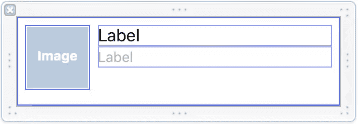

该单元格由显示图像的`photoView`、显示报价的`quoteTextLabel`和显示名称的`nameLabel`组成。

### 影像检视

我们将`photoView`的大小设置为固定的 64×64，并相应地设置约束。

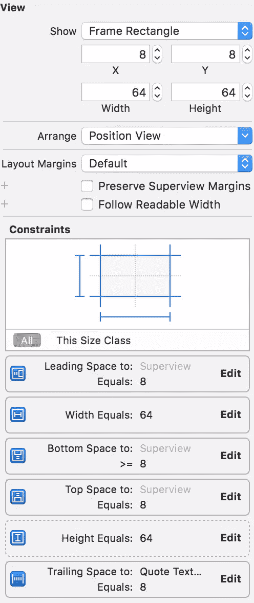

**注意**:默认情况下，宽度和高度约束的优先级设置为 1000。可能会有约束不起作用的情况。如果您检查调试日志，它应该包括系统添加的名为`UIView-Encapsulated-Layout-Height`的约束和系统删除的其他约束。解决方案是将这样的约束设置为较低的优先级，比如 999。在这种情况下，我们将`imageView`高度约束设置为这个优先级，因此它周围有虚线。

### 报价文本标签

如下设置字体和行数。我们将行数设置为`0`，因为我们希望标签显示报价的所有文本。

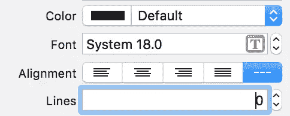

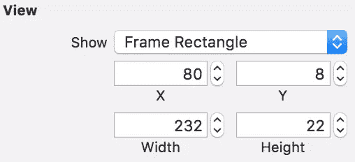

当设置标签的约束时，将*内容拥抱*优先级设置为值 751，即高，这将确保标签将调整大小以适合其内容。

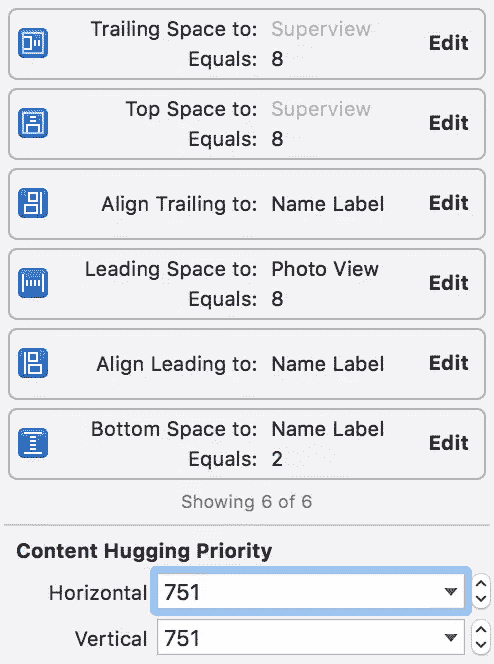

#### Name Label

由于名称不太可能很长，并且需要多行，所以我们将行数设置为 1，将高度设置为固定的 21 磅。

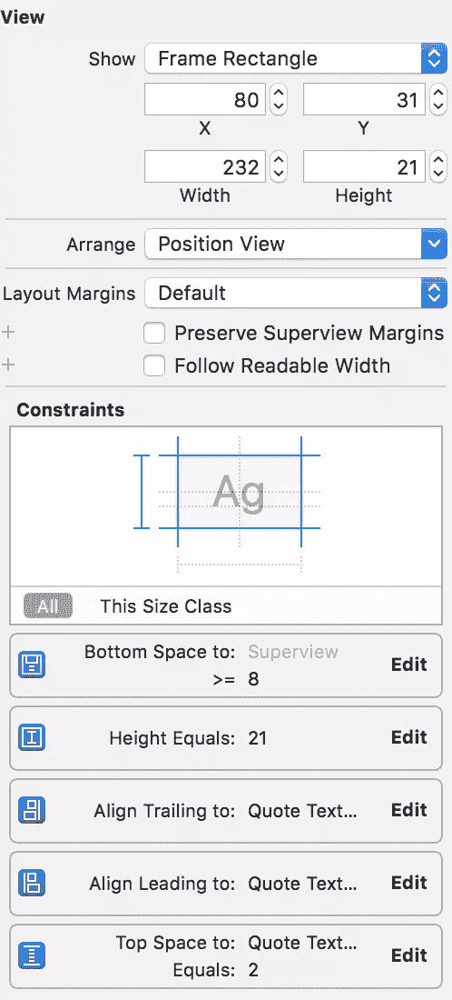

**注意**:根据报价的长度，`nameLabel`或`photoView`有可能是单元格中最底部的视图。因此，我们为它们各自的底部间距约束设置了一个`>=`约束。

**注意**:自动布局约束的明确性很重要。他们应该可以通过系统<q>解决</q>

接下来，从视图中拖放以在单元中创建插座:

```
@IBOutlet weak var photoView: UIImageView!
@IBOutlet weak var quoteTextLabel: UILabel!
@IBOutlet weak var nameLabel: UILabel!
```

最后，还记得`imageView`是可选的吗？为了实现这一点，我们将维护对一组约束的引用，特别是`photoView`的宽度约束和`photoView`与`quoteTextLabel`之间的间距约束。通过更新这两个约束，我们可以让`photoView`看起来甚至不在单元格中。

```
@IBOutlet weak var photoWidthConstraint: NSLayoutConstraint!
@IBOutlet weak var photoRightMarginConstraint: NSLayoutConstraint!
```

为约束创建出口与为视图创建出口相同。只需在界面构建器中选择约束，*ctrl+click+drag*到助手编辑器。

设置完单元格后，就该在 *ViewModel.swift* 中设置数据源方法来显示内容了。

```
...

// TODO: TableView datasource methods

func tableView(tableView: UITableView, numberOfRowsInSection section: Int) -> Int {
    return quotes.count
}

func tableView(tableView: UITableView, cellForRowAtIndexPath indexPath: NSIndexPath) -> UITableViewCell {
    let cell = tableView.dequeueReusableCellWithIdentifier(tableViewCellIdentifier, forIndexPath: indexPath) as! TableViewCell

    let quote = quotes[indexPath.row]
    cell.quoteTextLabel.text = quote.text
    cell.nameLabel.text = quote.personName

    if let imageName = quote.imageName where !imageName.isEmpty{
        cell.photoView?.image = UIImage(named: imageName)
        cell.photoWidthConstraint.constant = kDefaultPhotoWidth
        cell.photoRightMarginConstraint.constant = kDefaultPhotoRightMargin
    }
    else {
        cell.photoView?.image = nil
        cell.photoWidthConstraint.constant = 0
        cell.photoRightMarginConstraint.constant = 0
    }

    cell.contentView.setNeedsLayout()
    cell.contentView.layoutIfNeeded()

    return cell
}
```

并将这里使用的变量添加到 *TableViewCell.swift* 中:

```
import UIKit

let tableViewCellIdentifier = "TableViewCell"
let kDefaultPhotoWidth: CGFloat = 64
let kDefaultPhotoRightMargin: CGFloat = 8

class TableViewCell: UITableViewCell {
  ...
}
```

数据源用内容填充每个单元格。请注意我们是如何利用先前存储为出口的约束的。在返回单元格之前，我们可以对这些约束进行更改。如果图像不存在，`photoView`被设置为宽度 0，其右边距也是如此。实际上，我们阻止了`photoView`在单元格中显示。

仅仅使用约束的数值是不够的。我们还需要让单元格的`contentView`知道它的约束已经改变，它需要重新布局。因此，调用了`setNeedsLayout:`和`layoutIfNeeded:`

**注意**:以上似乎只有在 iOS 8 上才有必要，在 iOS 9 上没有。

最后，我们来到`tableView`设置，所有的魔法都在这里发生。

在*表视图控制器. swift* 中:

```
 ...

var viewModel:ViewModel!

override func viewDidLoad() {
    super.viewDidLoad()

    //Create the ViewModel, and set it as the delegate + datasource.
    self.viewModel = ViewModel()
    self.tableView.delegate = viewModel
    self.tableView.dataSource = viewModel

    //Register our custom cell subclass.
    self.tableView.registerNib(UINib(nibName: "TableViewCell", bundle: NSBundle.mainBundle()), forCellReuseIdentifier: tableViewCellIdentifier)

    // Self-sizing magic!
    self.tableView.rowHeight = UITableViewAutomaticDimension
    self.tableView.estimatedRowHeight = 50; //Set this to any value that works for you.

}
```

要在`UITableView`上启用自调整单元格大小，只需要最后两行。因为行高现在是一个非显式值，iOS 将首先使用`estimatedRowHeight`来设置单元格，然后在单元格出现在屏幕上之前计算行高。我们使用自动布局设置所做的所有工作在这里都得到了回报。

它是如何工作的？iOS 通过<q>求解由自动布局约束表示的线性方程</q>来计算高度，使用一组已知的变量:单元格的宽度`contentView`(通常是`tableView`减去缩进、`accessoryViews`等内容的宽度)，以及约束本身。这些信息是以任何方式计算身高的最低要求。

既然已经设置了`rowHeight`，就没有必要再执行`tableView:heightForRowAtIndexPath:`了。

**关于预计高度的说明**:这只是一个估计。如果您的估计值与实际高度相差很大，您可能会在滚动时看到一些跳动，因为 iOS 会将单元格展开或折叠到适当的高度。如果您需要对估计高度进行粒度控制，使用`UITableView`数据源方法`tableView:estimatedHeightForRowAtIndexPath:`并单独计算每一行的估计高度。

现在你已经完成了所有的艰苦工作，是时候运行应用程序了。最终的应用程序应该是这样的:


*如果您对*有任何问题或意见，请告诉我。

## 分享这篇文章