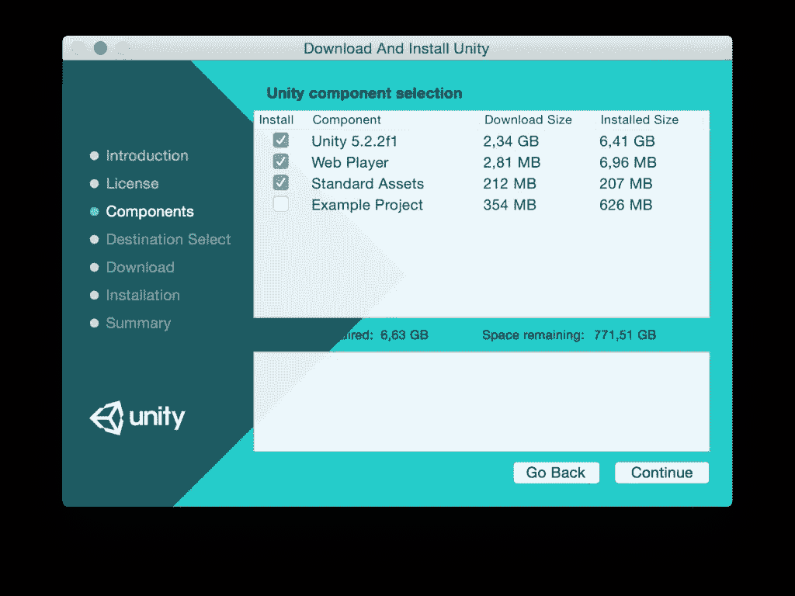
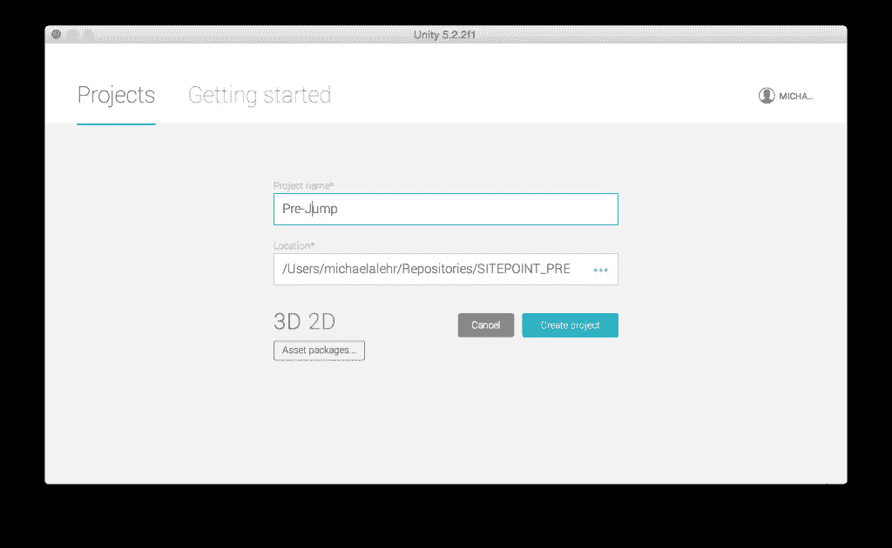
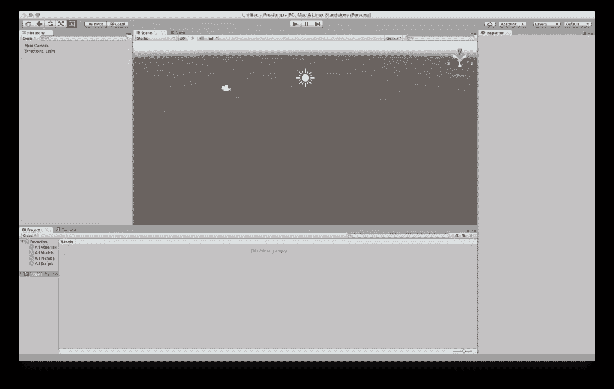
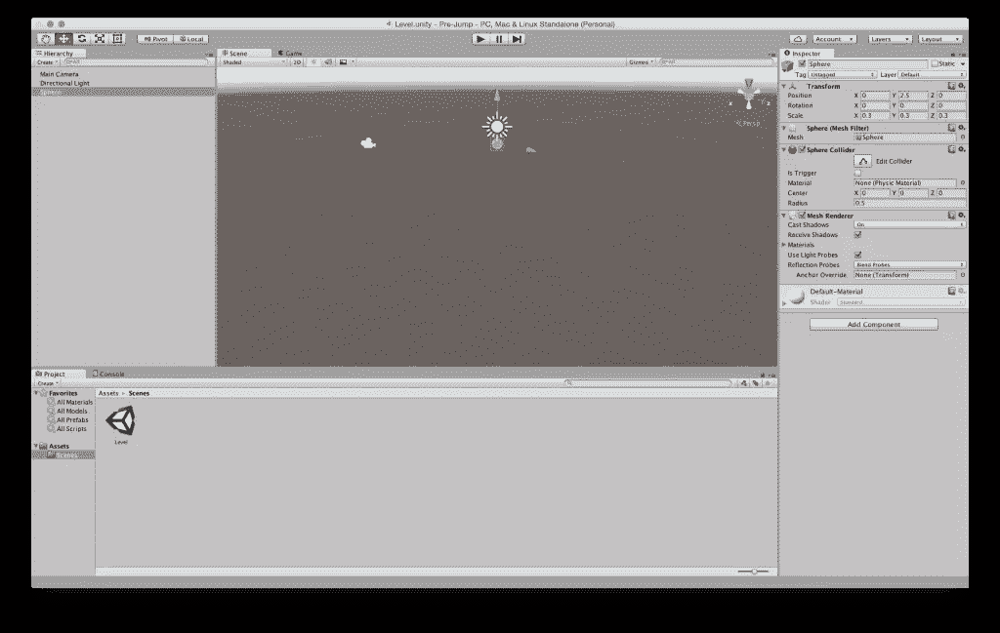
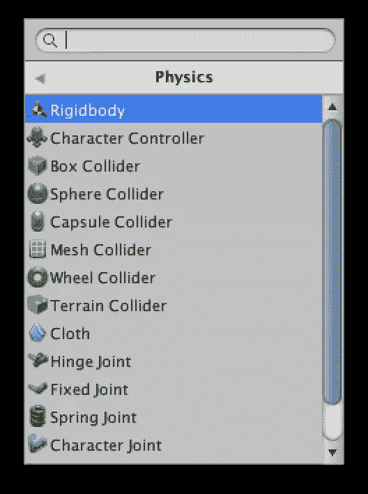
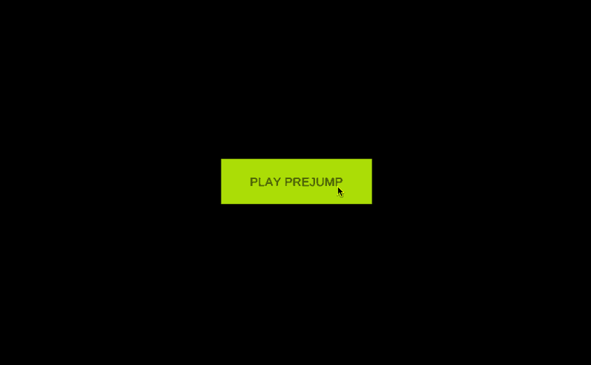
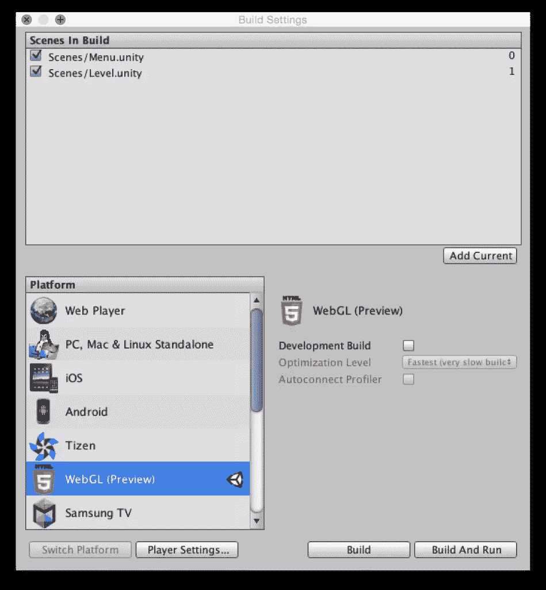

# 用 Unity 5 和 JavaScript 创建一个 WebGL 游戏

> 原文：<https://www.sitepoint.com/creating-webgl-game-unity-5-javascript/>

*这篇文章由[尼尔森·雅克·科林斯](https://twitter.com/nilsonjacques)、[马克·托勒](https://twitter.com/MarcTowler)和[马特·伯内特](https://www.sitepoint.com/author/mburnett/)进行了同行评议。感谢 SitePoint 的所有同行评审员使 SitePoint 的内容尽可能做到最好！*

[Unity](http://unity3d.com/) 是一个跨平台的游戏引擎，用于为 PC、游戏机、移动设备和网站开发视频游戏。最新版本(Unity 5) [附带了一个 WebGL 导出器](https://blog.mozilla.org/blog/2015/03/03/unity-5-ships-and-brings-one-click-webgl-export-to-legions-of-game-developers/)，这意味着开发者可以轻松地将他们的游戏发布到网络上。顾名思义，WebGL exporter 利用了 [WebGL](https://en.wikipedia.org/wiki/WebGL) ，一个用于渲染交互式 3D 计算机图形的 JavaScript API 和 [asm.js](https://en.wikipedia.org/wiki/Asm.js) ，Mozilla 开发的 JavaScript 子集，被吹捧为“web 汇编语言”。你可以在这里阅读更多关于 Unity 和 Unreal Engine [的 Asm.js 和 WebGL。](https://www.sitepoint.com/asm-js-and-webgl-for-unity-and-unreal-engine/)

在本教程中，我将向您展示如何使用 Unity。我还将向您展示如何使用 JavaScript 在 Unity 中创建一个简单的游戏，以及如何将您的游戏导出到 web。

你可以[在这里](http://download.geildanke.com/sitepoint/creating-a-game-with-unity-and-javascript/)查看完成的游戏(你需要一个[支持 WebGL 的](http://caniuse.com/#search=webgl)桌面浏览器)，或者你可以从我们的 [GitHub repo](https://github.com/sitepoint-editors/sitepoint_projectcode_prejump) 下载游戏文件和项目文件。

所以让我们开始吧…

### 关于 Unity 中的 JavaScript

当我们在 Unity 中谈论 JavaScript 时，我们实际上是在谈论 UnityScript，这是一种类型化的 JS 方言。Unity 本身[经常提到这个 JavaScript](http://docs.unity3d.com/ScriptReference/index.html) ，然而更多愤世嫉俗的观察者认为“Unity 做 JavaScript”是某种[营销策略](https://www.quora.com/How-do-you-program-your-game-using-Unity-and-JavaScript#ld_ktoclp_125990)。无论哪种方式，我们都应该清楚这样一个事实，即 UnityScript 不符合任何 ECMAScript 规范——也没有试图这样做。你可以在这里找到一个[差异的好概述](http://wiki.unity3d.com/index.php/UnityScript_versus_JavaScript)。

## 安装 Unity

要开始这个教程，我们需要有一个运行的 Unity 版本，可以在这里下载。Unity 有 Windows 和 Mac OS X 的安装程序。Linux 用户可能可以[通过 Wine](http://wiki.unity3d.com/index.php/Running_Unity_on_Linux_through_Wine) 运行 Unity，但你的里程数可能会有所不同。



安装完成后，我们就可以开始工作了！因此，让我们打开 Unity 并创建一个新的 3D 项目。



## 项目设置

Unity 首次打开后，我们应该花一分钟时间熟悉一下主窗口:



1.  最左边的面板是*层次*，它概述了当前场景中的所有元素。场景类似于游戏的视图，例如关卡或菜单。目前应该有一个*主摄像头*元件和一个*方向灯*元件。
2.  中间是*场景*视图，用图标说明 3D 空间中的相机和灯光。
3.  在*场景*标签旁边有一个*游戏*标签，显示游戏本身，就像玩家看到的一样。这是为了在编辑器中测试游戏而做的。
4.  在右边是*检查器*面板，在这里可以修改元件设置。让我们点击*层级*中的*方向灯*来试试。我们现在应该可以看到很多关于这个灯的信息，并且可以用*阴影类型关闭它的阴影:没有阴影*。
5.  底部是*项目*窗口，显示了我们开发游戏所需文件的视图。

现在我们已经熟悉了 Unity 的界面，在开始开发之前，还有一件事要做:保存当前场景。*文件>保存场景*打开*保存场景*对话框，进入名为`Assets`的文件夹。在 Unity 中组织文件的一种常见方式是使用子文件夹。所以在`Assets`文件夹中添加一个名为`Scenes`的新文件夹，并将场景保存在这个名为`Level.unity`的文件夹中。

## 创造一个英雄

我们的游戏将由一个英雄组成，从一个平台跳到另一个平台。如果它错过了一个并被遗忘，游戏就输了。所以让我们从创造英雄开始。因为玩家会以第一人称视角来看游戏，所以英雄的外貌并不重要，我们可以使用标准的球体几何图形。球体的好处在于它可以在几步之内被创造出来，而且它符合我们跳跃所需要的物理学原理。点击*层级*中的*创建*添加球体，并使用检查器编辑以下属性:

```
Position { X: 0, Y: 2.5, Z: 0 }
Scale { X: 0.3, Y: 0.3, Z: 0.3 } 
```



让我们按下播放按钮来测试一下我们做了什么。我们应该在天际线前面的 3D 空间中看到一个球体。

要让英雄倒下，它得增肥。因此，我们需要通过点击*检查器*中的相应按钮并选择*刚体*来给球体添加一个组件。由于我们不希望英雄旋转，我们通过打开*约束*并选择*旋转*行中的所有轴，将它冻结在`Rigidbody`组件中。再玩场景的时候，应该能看着英雄倒下。



为了拯救英雄免于永无止境的坠落，我们将创建一个扁平的盒子作为平台。为此，我们必须添加一个立方体，并将`Scale.Y`值设置为`0.1`。回放场景证实了英雄安全降落在平台上，虽然我必须承认这看起来不太自然。那么我们如何让英雄反弹呢？通过添加一些物理材料。

## 让英雄弹跳

首先，我们需要为球体创建一个新的物理材质，使其有弹性。为此，在`Assets`文件夹中创建一个名为`Materials`的新文件夹，并在这里创建一个新的物理材质。姑且称之为`Bouncy_Sphere`。我们需要在*检查器*中调整的值是:

```
Dynamic Friction: 10
Static Friction: 10
Bounciness: 1
Friction Combine: Maximum
Bounce Combine: Maximum 
```

如果我们将这种材料添加到*球体对撞机*，这将使球体上下弹跳，但总是达到相同的高度。为了让球体在每次弹跳时跳得越来越高，我们还必须在平台上添加一些物理材料。为此，我们创建另一个名为`Bouncy_Platform`的材质，并将其值更改为:

```
Dynamic Friction: 0.9
Static Friction: 0.9
Bounciness: 1
Friction Combine: Average
Bounce Combine: Multiply 
```

为了实现这里的一致性，我们还应该将立方体元素重命名为`Platform`，方法是在*层次结构*中双击它。当我们现在开始游戏时，我们可以注意到球体每次都跳得越来越高。

我们还将创建一个名为`Platform`的新标准材质，为平台增添一些色彩。创建这个材质后，使用`#C8FF00`作为*反照率*颜色(`Albedo`是 Unity UI 中的标签)，然后将这个材质拖放到平台元素上。它现在应该是黄色的。

## 添加第一人称视角

为了添加第一人称视角，我们将摄像机(在*层级*中)拖放到球体上。这将使相机成为英雄的子元素，并使相机在球体移动时跟随它。摄像机属性也必须调整到:

```
Position { X: 0, Y: 1, Z: 0 }
Rotation { X: 90, Y: 0, Z: 0 }
Scale { X: 2.5, Y: 2.5, Z: 2.5 }
Clear Flags: Solid Color
Background: #000
Field of View: 80.3 
```

我们还将创建一个聚光灯作为球体的第二个孩子。这会给玩家一种英雄当前跳跃高度的感觉。将聚光灯的值调整为:

```
Rotation { X:90, Y:0, Z:0 }
```

## 对控制器进行编程

我们的目标是使用鼠标或触控板让玩家向特定方向移动。为此，我们将编写第一个脚本。和*刚体*一样，一个脚本作为一个组件被添加到游戏元素中。在我们的例子中，我们将向摄像机添加一个名为`InputController`的 JavaScript 脚本。同样，对于场景和材质，我们应该在*项目*面板中创建一个名为`Scripts`的新文件夹。这应该包含脚本。双击新脚本，Unity 将在默认编辑器 *MonoDevelop* 中打开它。默认编辑器可能会更改为任何编辑器(*Unity>Preferences>External Tools*)，但现在这并不重要。

正如您将看到的，该脚本已经包含了一些代码。首先，我们必须在第 1 行之后创建一些变量，`#pragma strict`(在 Unity 上下文中强制输入)。

```
#pragma strict

public var Hero : GameObject;
private var halfScreenWidth : float;
private var  halfScreenHeight : float;

function Start () {}

function Update () {} 
```

第一个变量是公共的，类型为[game object](http://docs.unity3d.com/ScriptReference/GameObject.html)；它必须引用球体。切换回 Unity，摄像机仍然处于选中状态，我们可以看到这个公共变量旁边有一个空值的输入字段。让我们将球体拖放到这个槽中，并为变量赋值。

其他两个变量都是私有的，将在 [Start](http://docs.unity3d.com/ScriptReference/MonoBehaviour.Start.html) 函数中赋值。这个函数在场景开始后被调用一次。两个私有变量将分别被赋予当前屏幕宽度和高度的一半，为此我们使用 Unity 内置的[屏幕](http://docs.unity3d.com/ScriptReference/Screen.html)类:

```
function Start () {
  halfScreenWidth = Screen.width / 2;
  halfScreenHeight = Screen.height / 2;
} 
```

在`InputController`脚本中剩下唯一要做的事情就是在鼠标移动时从鼠标中获取值。为此，我们使用了[更新](http://docs.unity3d.com/ScriptReference/MonoBehaviour.Update.html)函数，每一帧都会调用这个函数:

```
function Update () {
  var x : float = 0.0;
  var z : float = 0.0;

  x = ( Input.mousePosition.x - halfScreenWidth ) / halfScreenWidth;
  z = ( Input.mousePosition.y - halfScreenHeight ) / halfScreenHeight;

  Hero.GetComponent( HeroController ).SetPosition( x, z );
} 
```

新变量`x`和`z`都代表相应的轴。当我们向下看 y 轴时，我们看到一个水平的 x 轴和一个垂直的 z 轴。在这些轴上，我们希望在收到鼠标输入后调整英雄的位置。为此，我们使用了`Input.mousePosition`，它返回一个[二维向量](http://docs.unity3d.com/ScriptReference/Vector2.html)。向量的零值在左下方，必须处理到我们的坐标系中，其原点在屏幕的中间。这发生在下面几行中。最后，我们调用一个函数`setHeroPosition`，将两个计算值作为参数。我们将在一个名为`HeroController`的新脚本中编写这个函数，附加到球体上:

```
#pragma strict

public function SetPosition ( x : float, z : float ) {
  transform.position.x = x;
  transform.position.z = z;
} 
```

让我们通过移动鼠标或触控板并让主角从平台上摔下来来测试我们的代码。

## 程序化地创建平台

为了自动创建平台，我们需要某种平台模板。这在 Unity 里叫“预制”。为了创建一个预置，我们必须将平台从*层级*拖放到一个新的`assets`文件夹中，这个文件夹(与我们的命名约定一致)被称为`Prefabs`。[预设](http://docs.unity3d.com/Manual/Prefabs.html)在*层级*中可以通过蓝色识别。所有的平台(除了第一个)都将通过一个名为`GameManager`的新脚本来创建，该脚本附加在摄像机上。我们通过引用必要的变量来开始这个脚本:

```
#pragma strict

public var Platform : GameObject;
public var Hero : GameObject;

private var boundary : float;
private var rotation: Quaternion;
private var lastPlatformPosition : Vector3;

function Start () {
  boundary = 1.0;
  rotation = Quaternion.identity;
  lastPlatformPosition = new Vector3( 0, 0, 0 );
}

function Update () {} 
```

我们需要引用预设面板和球体，所以必须将它们拖放到编辑器中的特定位置。我们还创建了三个私有变量，用于实例化预制面板:

1.  该边界标记了 y 轴上的界限。每当英雄跳得比这个高，就必须创建一个新的面板。
2.  第二个变量是实例化预设所需的旋转。值`Quaternion.identity`导致[根本没有旋转](http://docs.unity3d.com/ScriptReference/Quaternion-identity.html)，这正是我们所需要的。
3.  变量`lastPlatformPosition`将最后一个平台的位置保存为一个[三维向量](http://docs.unity3d.com/ScriptReference/Vector3.html)。

对于每一帧，我们现在将检查球体是否在边界之上。如果是，我们将提高边界并实例化一个新面板:

```
function Update () {
  if ( Hero.transform.position.y > boundary ) {
    var position : Vector3;

    boundary += 1.0;
    position = getNextPlatformPosition();
    Instantiate( Platform, position, rotation );
  }
} 
```

接下来，我们可以添加代码来获取下一个面板位置。我们将把它放在一个额外的函数中，以保持可读性:

```
private function getNextPlatformPosition () {
  var position : Vector3;

  do {
    position = new Vector3( Random.Range( -1, 2 ), boundary, Random.Range( -1, 2 ) );
  } while ( position.x == lastPlatformPosition && position.z == lastPlatformPosition );

  lastPlatformPosition = position;

  return position;
} 
```

为了确保位置向量的新的`x`和`z`值与之前的值不同，我们使用了一个`do while`循环。统一的[随机。Range](http://docs.unity3d.com/ScriptReference/Random.Range.html) 函数是获得`x`和`z`值的随机值的正确方法。在这两种情况下，我们都希望它们在-1 和 2 之间。最后，我们将新位置保存为面板的最后位置，并将其返回。

## 添加游戏菜单

在这种状态下，玩家可以通过在相应的方向上移动鼠标在平台上越跳越高。但是如果玩家掉下来，在下落的过程中错过了所有的平台，球体就会无休止地下落。这就是我们现在想要解决的问题。我们将检查是否有一个球体掉到了第一个平台的下面，在这种情况下加载一个新的场景。

首先，我们来检查一下英雄是否在某一点以下。为此，让我们编辑`GameManager`脚本的`update`函数中的`if`语句。`else if`语句将检查球体的 y 位置是否低于-2.0 单位。在这种情况下，我们调用一个私有函数`gameOver`:

```
function Update () {
  if ( Hero.transform.position.y > boundary ) {
    var position : Vector3;

    boundary += 1.0;
    position = getNextPlatformPosition();
    Instantiate( Platform, position, rotation );
  } else if (Hero.transform.position.y < -2.0) {
    gameOver();
  }
} 
```

我们将使用一个新的函数来处理游戏结束状态，如下所示:

```
private function gameOver () {
  Application.LoadLevel( 'Menu' );
} 
```

这里我们使用 Unity 的[应用程序类](http://docs.unity3d.com/ScriptReference/Application.html)，它让我们可以访问方法`LoadLevel`，我们可以用它来加载一个名为`Menu`的新场景。为了让这段代码工作，我们首先必须通过*文件>新场景*创建场景，然后用名称`Menu`保存它。之后，我们需要将两个场景都添加到构建过程中。构建设置可通过*文件>构建设置*打开。菜单场景应该仍然是打开的，所以让我们点击*添加当前*按钮，将场景添加到构建设置中。打开关卡场景，重复此操作。现在，当我们完成游戏时，我们应该被带到新创建的游戏菜单场景。

## 添加一个按钮开始游戏

为了让游戏可以玩，我们需要创建一个带有播放按钮的游戏菜单。让我们切换到游戏菜单场景，首先在*检查器*中将相机设置调整为:

```
Clear Flags: Solid Color
Background: #000
Width: 200
Height: 60 
```

要添加一个按钮，我们使用 Unity 的 UI 元素，可以像 3D 元素一样通过*层级*添加。添加 UI 按钮后，我们应该在*层次结构*中看到以下新元素:

*   一个*事件系统*元素和
*   一个*画布*元素
*   子*按钮*元素和
*   其子元素*文本*元素。

canvas 是所有 UI 元素的容器，它可以是某种响应性的。为此，我们必须将检查器中的*画布缩放器:UI 缩放模式*设置从*恒定像素大小*切换到*随屏幕大小缩放*。现在我们可以改变按钮的位置:

```
Rect Transform { Pos X: 0, Pos Y: 0, Pos Z: 0 }
Rect Transform { Width: 200, Height: 60 } 
```

移除按钮的源图像并将颜色设置为`#C8FF00`会使菜单看起来更好。最后，我们修改文本，将*文本*元素的文本编辑为“播放预跳”，并将字体大小设置为 16。为了让按钮工作，我们将使用一个新函数，我们将把它添加到*按钮*元素上的一个新的`UIController`脚本中。它包含一个加载关卡场景的函数:

```
public function StartGame () {
  Application.LoadLevel( 'Level' );
} 
```

我们可以在按钮的*检查器*设置中应用该功能。在`Button (Script)`组件设置中，我们可以在玩家点击时执行一个功能。为此，我们通过单击 *+* 图标向`On Click ()`事件添加一个新函数。现在我们可以将按钮本身拖放到输入字段中。然后我们从 UIController 脚本中选择我们刚刚编写的函数(`UIController.StartGame`)。



## 将您的项目发布为 WebGL 浏览器游戏

Unity 能够将项目导出为 WebGL 应用程序。打开构建设置后，我们选择 *WebGL* 作为平台。然后，我们通过点击*切换平台*按钮来切换导出目的地。之后，我们只需点击*构建*按钮，并为我们的游戏选择一个名字。构建过程完成后，我们可以用支持 WebGL 的桌面浏览器打开 html 文件。



## 我们将何去何从？

当然这个小游戏还可以改进，比如分数，更多的平台类型，额外的输入法，音频等等。但是我们在本教程中看到的是，跨平台游戏引擎 Unity 提供了一个所见即所得编辑器和脚本可能性的组合，我们可以使用类似 JavaScript 的语言。根据我们特定的项目需求，Unity 可能是 WebGL 框架的一个很好的替代品。

你在项目中使用 Unity 了吗？你用 Unity 制作了一个你想分享的很酷的游戏吗？请在下面的评论中告诉我。

## 分享这篇文章