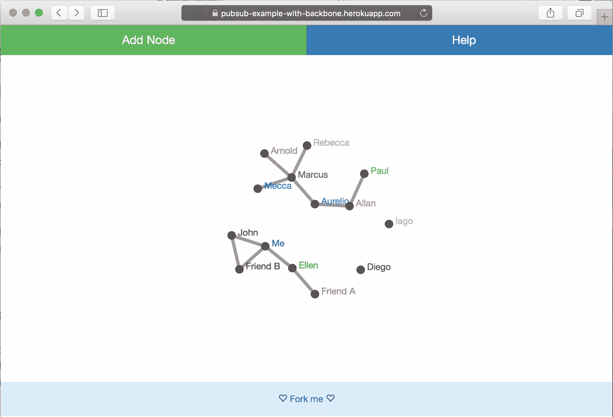

# 用 Backbone.js 和 Socket 搭建一个 Web App。超正析象管(Image Orthicon)

> 原文：<https://www.sitepoint.com/build-a-web-app-with-backbone-js-and-socket-io/>

*这篇文章由[托马斯·格列柯](https://www.sitepoint.com/author/tgreco/)和[马克·托勒](https://github.com/MarcTowler)进行了同行评审。感谢 SitePoint 的所有同行评审员使 SitePoint 的内容尽可能做到最好！*

很多人都知道， [Backbone.js](http://backbonejs.org/) 是一个众所周知的 MV*框架。它托管在 GitHub 上，它<q>通过提供具有键值绑定和自定义事件的模型，具有丰富的可枚举函数 API 的集合，具有声明性事件处理的视图，为 web 应用程序提供结构，并通过 RESTful JSON 接口将其连接到您现有的 API。</q>

在本文中，我们将使用一个名为 *Events* 的 Backbone 内置特性来实现异步消息传递范式，以避免耦合。这个想法是将高度相互依赖的代码组分开。

[我要展示的例子](https://github.com/sitepoint-editors/pubsub-example-with-backbone)是一个[图形可视化工具](https://pubsub-example-with-backbone.herokuapp.com)，其中数据在用户之间完美同步。使用 [WebSockets](https://developer.mozilla.org/en-US/docs/Web/API/WebSockets_API) 将有可能在用户的浏览器和服务器之间打开一个交互式通信会话。

目标是让这个例子尽可能简单。这里学到的概念将对您减少耦合有很大帮助。此外，对于构建可扩展、灵活和可维护的代码来说，这是一种非常有用的方法。在我们的实验结束时，我们会得到以下结果:



## 骨干网. js

Backbone.js 是一个通过提供*模型*、*视图*、*控制器*、*集合*和*自定义事件*来构建单页面应用程序的框架。它的结构有助于我们将用户界面与业务逻辑分离开来。在本文中，我将只向您介绍其中的一些元素，但是如果您想要更深入的指导，我建议您阅读文章“ [Backbone.js Basics: Models，Views，Collections and Templates](https://www.sitepoint.com/backbone-basics-models-views-collections-templates/) ”。

一个[模型](http://backbonejs.org/#Model)代表数据，它可以通过扩展`Backbone.Model`来创建:

```
var MyModel = Backbone.Model.extend({
  initialize: function () {
    console.log('model initialized');
  }
})
```

视图是一种将用户界面组织成逻辑视图的方式，由模型支持。它不包含 HTML 标记，只包含向用户呈现模型数据背后的逻辑。要创建一个视图，您需要如下扩展`Backbone.View`:

```
var MyView = Backbone.View.extend({
  el: 'div#my-view-container',
  initialize: function (options) {
    this.model = new MyModel()
    console.log('view initialized')
  }
})
```

[Events](http://backbonejs.org/#Events) 是一个可以混合到任何对象中的模块，赋予对象绑定和触发自定义命名事件的能力。*模型*和*视图*都有这个模块*事件*，它允许我们将事件绑定到*模型*或*视图*。一个常见的模式是创建监听模型变化的视图。这种技术通常旨在允许视图在底层数据发生变化时自动重新呈现自身。

为了给你一个这些元素如何一起工作的例子，我在 CodePen 上创建了一个演示。

通过[码笔](http://codepen.io)上的 SitePoint ( [@SitePoint](http://codepen.io/SitePoint) )看笔 [XXpwMQ](http://codepen.io/SitePoint/pen/XXpwMQ/) 。