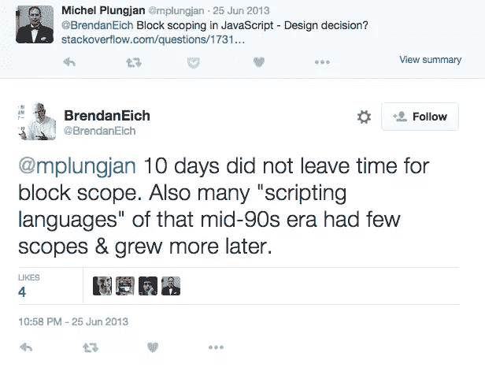
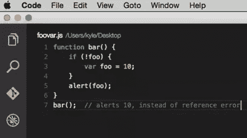
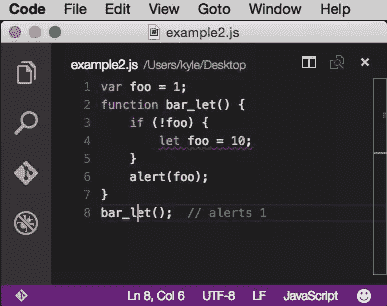
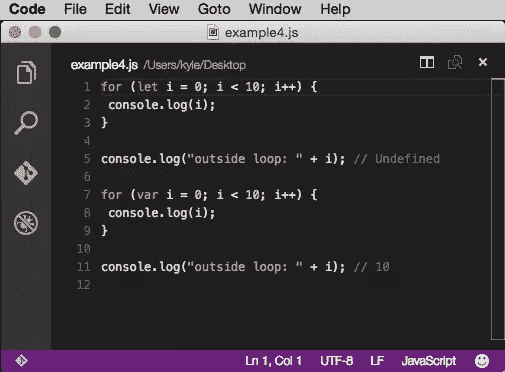
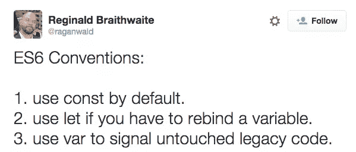

# 使用 ES6 的块作用域的乐趣

> 原文：<https://www.sitepoint.com/joys-block-scoping-es6/>

布伦丹·艾希(Brendan Eich)在 10 天内[于 1995 年](https://www.quora.com/In-which-10-days-of-May-did-Brendan-Eich-write-JavaScript-Mocha-in-1995?srid=oZE&share=1)5 月 6 日-15 日左右发明了 JavaScript。这种语言最初被称为 Mocha，最初是一种简单的客户端脚本语言。[奥赖利的语言史](http://archive.oreilly.com/pub/a/javascript/2001/04/06/js_history.html)详细描述了语言发明时的背景:

> Eich 最终决定使用一种松散类型的脚本语言来适应环境和受众，即需要能够在没有字节码编译器或不了解面向对象软件设计的情况下绑定页面元素(如表单、框架或图像)的几千名 web 设计人员和开发人员。

JavaScript 诞生于一个网络非常不同的时代，但最终会成为使用中最普遍的编程语言之一。很少有人能预料到它会变得如此受欢迎。自然，JavaScript 有一些设计缺陷，从一开始就让开发人员感到沮丧和困惑。

一个常见的抱怨是 Javascript 缺乏块范围。与其他流行的语言如 [C](https://www.google.com/url?sa=t&rct=j&q=&esrc=s&source=web&cd=2&ved=0CC0QFjABahUKEwji4oCNqonJAhVQN4gKHYmICC0&url=https%3A%2F%2Fmsdn.microsoft.com%2Fen-us%2Flibrary%2Ffw5abdx6.aspx&usg=AFQjCNFD-n7FDMlA7vjfMv1UYARYAccQow&cad=rja) 或 [Java](https://msdn.microsoft.com/en-us/library/aa286478(v=vs.60).aspx) 不同，JavaScript(ES6 之前)中的块`({...})`没有作用域。[JavaScript 中的变量的作用域是最近的父函数，如果没有函数，则是全局的](https://msdn.microsoft.com/library/bzt2dkta(v=vs.94).aspx?WT.mc_id=16540-DEV-sitepoint-article76)。

当被问及为什么 JavaScript 没有块作用域时， [Brendan Eich 的回答非常直接](https://twitter.com/brendaneich/status/349768501583548416):没有足够的时间来添加块作用域。



令人欣慰的是，JavaScript 起源于 C/C++/Java，并因为后来添加了块范围而经得起未来考验，正如 Eich 在这一系列推文中解释的那样。

现在，ECMAScript 6 (ES6)终于出现了，它通过两个新的 ES6 变量关键字 *let* 和 *const* 为我们提供了块范围。对 let/const 的支持仍然局限于 Edge、Chrome 和 Firefox，但是更多的浏览器可能会很快支持它。

这篇文章将解释为什么`const`和`let`是有用的，以及它们是如何使用的。


来源:[http://www . cs . uni . edu/~ walling f/blog/archives/monthly/2012-10 . html](http://www.cs.uni.edu/~wallingf/blog/archives/monthly/2012-10.html)

## 使用 *var* 的挑战

在介绍`const`和`let`之前，首先值得讨论一下为什么它们是有帮助的或者必要的。到目前为止，Var 一直是 JavaScript 中变量的唯一关键字，但是它有几个缺点。

### 对于来自其他语言的开发人员来说，作用域是令人困惑的

对于来自其他语言的开发人员来说,`var`的范围令人困惑。他们很容易无意中在使用`if`块或`for`循环的代码中导致错误。ES5 及以下版本中的变量声明没有按照他们预期的方式工作。鉴于 JavaScript 的流行，其他语言的开发人员有时不得不编写 JavaScript，因此更容易理解的变量作用域对他们会有帮助。

### 使用*变量*的全局与局部混淆

当使用`var`编写 JS 时，很难立即辨别哪些变量是局部作用域还是全局作用域。在 JavaScript 中，很容易意外地在全局对象上创建一个变量。这通常不会影响简单的演示应用程序，但会给企业级应用程序带来问题，因为团队成员会意外地删除彼此的变量。

### 令人困惑的变通模式

JavaScript 中缺乏明确的全局和局部作用域区别，这迫使开发人员想出像 life(立即调用函数表达式)这样的模式。对于缺少块范围来说，这是一个笨拙的解决方法。这也是避免将 var 声明的变量附加到全局对象的一种方法。

```
 (function(){
  // code here
}()); 
```

如果您不是经验丰富的 Javascript 开发人员，这种模式没有什么意义。这是怎么回事？那些括号是什么？为什么这个函数没有名字？块作用域应该减少像这样的工作区设计模式的需要。

### 关于吊装的误解

`var`的另一个挑战是它并不像大多数开发者认为的那样工作。JavaScript 解释器对一段 JavaScript 代码进行两次传递。第一遍处理变量和函数声明，并将它们提升到顶部(“提升”)。第二遍处理函数表达式和未声明的变量。如果开发者没有敏锐地意识到[提升是如何工作的](https://www.sitepoint.com/javascript-hoisting/)，这会导致一些混乱的代码。从[开发者本·切瑞的博客](http://www.adequatelygood.com/JavaScript-Scoping-and-Hoisting.html)中拿这个例子:



*本帖截图来自 Mac 中的 [Visual Studio 代码](https://code.visualstudio.com/Download/?WT.mc_id=16540-DEV-sitepoint-article76)*

[http://codepen.io/DevelopIntelligenceBoulder/pen/obZYRY?代号编辑=101](http://codepen.io/DevelopIntelligenceBoulder/pen/obZYRY?editors=101)

在上面的例子中，`var foo = 10;`被提升到最近的父函数。这就是为什么它警告 10，即使你可能认为你会得到一个“ReferenceError: foo 未定义”。用`let`重构的例子更直观。



[http://codepen.io/DevelopIntelligenceBoulder/pen/VvVNpg?代号编辑=101](http://codepen.io/DevelopIntelligenceBoulder/pen/VvVNpg?editors=101)

## 使用*让*

新的 ES6 关键字`let`允许开发人员在块级别(最近的花括号)确定变量的范围。如果你想知道哪些浏览器支持`let`(和`const`)，请访问[微软 Edge 页面，跟踪对 ES6 特性的支持](https://dev.windows.com/en-us/microsoft-edge/platform/status/es6blockbindingsletconstfunction/?utm_source=SitePoint&utm_medium=article76&utm_campaign=SitePoint)。你也可以在这里查看你当前的浏览器是否支持`let`和`const` 。

以下是不同类型块中的一些`let` (vs. var)示例:

***如果**挡住例子*


[http://codepen.io/DevelopIntelligenceBoulder/pen/BoGEoa?代号编辑=101](http://codepen.io/DevelopIntelligenceBoulder/pen/BoGEoa?editors=101)

在上面的例子中，当用`var`声明变量时，它的作用域是 IIFE 函数。在`if`块中，用`let`声明了一个单独的水果变量，其作用域是`if`块。

***为**循环块示例*



[http://codepen.io/DevelopIntelligenceBoulder/pen/KdrYdg?代号编辑=101](http://codepen.io/DevelopIntelligenceBoulder/pen/KdrYdg?editors=101)

上面的`for`循环例子比`if`块更有趣一些。通过在初始化表达式中使用`let`,变量`i`的作用范围仅限于块。通过使用`var`，将`i`的作用域设为最近的函数。在`for`循环块外，变量等于 10。这可能会导致意外关闭，如下例所示:


[http://codepen.io/DevelopIntelligenceBoulder/pen/XmyQXe?代号编辑=101](http://codepen.io/DevelopIntelligenceBoulder/pen/XmyQXe?editors=101)

在这个例子中，代码的意思是在一个简单的列表中注册一个事件监听器，并警告哪个数字被点击了。取而代之的是，它会提醒每个列表项的第 5 个被点击的**。将事件侦听器部分包装在函数中是避免意外关闭的常见方法。**

相反，用`let`重构它(一旦它被完全支持)会在`for`循环中创建一个块范围，并避免意外关闭。它允许在事件监听器回调函数中使用预期的迭代器。


[http://codepen.io/DevelopIntelligenceBoulder/pen/JYeVGv?代号编辑=101](http://codepen.io/DevelopIntelligenceBoulder/pen/JYeVGv?editors=101)

关于`let`的一个警告是[不会像`var`和](http://stackoverflow.com/questions/31219420/are-variables-declared-with-let-or-const-not-hoisted-in-es6)一样提升。如果你试图在它被声明之前使用它，你会得到一个引用错误。这被一个开发者称为[时间死区](http://jsrocks.org/2015/01/temporal-dead-zone-tdz-demystified/)(这个术语从此开始流行)。

## 使用*常量*

像其他语言中的[常量](https://msdn.microsoft.com/en-us/library/ms173119.aspx?WT.mc_id=16540-DEV-sitepoint-article76)，`const`通常用于在程序执行中不需要重新赋值的值。像 API 键这样的字符串或者像`CANVAS_HEIGHT`这样的数字是不需要重新分配的`const`变量的用例。用`const`声明的变量通常都是大写的，但这是一个偏好问题。

*Const* 是另一个新的 ES6 关键字，用于声明变量。在其他语言中，Const 在很多方面都像一个[常量](https://msdn.microsoft.com/en-us/library/aa240857(v=vs.60).aspx?WT.mc_id=16540-DEV-sitepoint-article76)一样工作，但是有一些注意事项。 *Const* 代表对一个值的“常量引用”。`const`引用的值不是不可变的(它们的属性可以改变)。这可以借用[雄辩的 JavaScript(一本很棒的初学者 JS 书)](http://eloquentjavascript.net/02_program_structure.html)的一个比喻来解释。

雄辩 Javascript 的作者 Marijn Haverbeke 说，最好把变量看作是触角而不是盒子。

> 它们不包含值；他们掌握它们——两个变量可以指同一个值。程序只能访问它仍然持有的值。当你需要记住一些东西时，你会长出一条触手来抓住它，或者你把你现有的一条触手重新接上。

所以使用`const`，你实际上可以改变被变量引用的对象的属性。你不能改变引用本身。通过上面的比喻解释，触手不会移动或改变，但它抓住的东西可以。下面是一些`const`的代码示例:

```
 const PI_VALUE = 3.141592; 
```

```
 const APIKEY = 'aekljefj3442313kalnawef'; 
```

```
 const NAMES = [];
NAMES.push("Jim");
console.log(NAMES.length === 1); // true
NAMES = ["Steve", "John"]; // error 
```

如果你想要一个常量完全不可变，使用 [`object.freeze`](https://msdn.microsoft.com/en-us/library/ff806186(v=vs.94).aspx) 使属性不可变。

## 何时使用*常量* vs. *let*

关于什么时候使用`const`和`let`，JavaScript 社区仍然有一些争论。有些原本[推荐用`let`代替`var`](http://babeljs.io/docs/learn-es2015/) 。其他人现在呼吁默认为`const`而不是`let`。



JavaScript 专家[雷金纳德·布莱斯维特的推特](https://twitter.com/raganwald)得到了[许多](http://programmers.stackexchange.com/questions/278652/how-much-should-i-be-using-let-vs-const-in-es6)人的响应。开发者 Eric Elliot 阐述了在`let` 之前使用`const`的[论点:](https://medium.com/javascript-scene/javascript-es6-var-let-or-const-ba58b8dcde75)

> 如果我不需要重新赋值，`const`是我的默认选择，而不是`let`，因为我希望代码中的用法尽可能清晰。
> 
> `const`表示**变量不会被重新分配**。
> 
> `let`是一个信号，表明**变量可能被重新分配**，如循环中的计数器，或算法中的值交换。它还表明变量将只在定义它的块中使用，而不总是整个包含函数。
> 
> `var`现在是**可用信号最弱的**。

Kyle Simpson(《T2》一书的作者，你不知道 JS )写了一些反驳围绕“let 是新的 var”的热情的文章，暗示了`let`声明的隐含本质会导致 JS 代码中的问题。此外，有些情况下`var`仍然有用:

> 改进 JS 中的作用域选项，而不是替换。对于在整个函数中使用的变量来说,`var`仍然是一个有用的信号。两者兼而有之，意味着范围意图更容易理解、维护和实施。这是一个巨大的胜利！

Simpson 认为,`let`是`var`的同伴，它不应该用来代替所有的`var`陈述。

这场辩论将如何收场仍有待确定。

## 摘要

一旦它们被更多的浏览器支持，`const`和`let`将允许 JavaScript 中的块范围变量，使得像 life 这样的模式变得不那么必要。其他语言的开发人员可能会更容易理解 JavaScript 范围。开发人员[亚伦·弗罗斯特](https://github.com/aaronfrost)厚颜无耻地说，“使用 LET 和 CONST 而不是 VAR 会有一个奇怪的副作用，你的代码会在运行时执行，就像它在开发时一样。”

## 更多的 Web 开发实践

这篇文章是微软和 [DevelopIntelligence](http://www.developintelligence.com/) 关于实用 JavaScript 学习、开源项目和互操作性最佳实践的 web 开发系列的一部分，包括[微软 Edge](http://blogs.windows.com/msedgedev/2015/05/06/a-break-from-the-past-part-2-saying-goodbye-to-activex-vbscript-attachevent/?WT.mc_id=16540-DEV-sitepoint-article76) 浏览器和新的 [EdgeHTML 渲染引擎](http://blogs.windows.com/msedgedev/2015/02/26/a-break-from-the-past-the-birth-of-microsofts-new-web-rendering-engine/?WT.mc_id=16540-DEV-sitepoint-article76)。 [DevelopIntelligence](http://www.developintelligence.com/) 为技术团队和组织提供讲师指导的 [JavaScript 培训](http://www.developintelligence.com/catalog/javascript-training)、 [AngularJS 培训](http://www.developintelligence.com/catalog/web-development-training/angularjs)和其他 [Web 开发培训](http://www.developintelligence.com/catalog/web-development-training)。

我们鼓励您在 dev.microsoftedge.com 使用免费工具进行跨浏览器和设备测试，包括 Windows 10 的默认浏览器 Microsoft Edge:

*   [扫描你的网站，寻找过时的库、布局问题和可访问性](http://dev.modern.ie/tools/staticscan/?utm_source=SitePoint&utm_medium=article76&utm_campaign=SitePoint)
*   [下载适用于 Mac、Linux 和 Windows 的免费虚拟机](http://dev.modern.ie/tools/vms/windows/?utm_source=SitePoint&utm_medium=article76&utm_campaign=SitePoint)
*   [跨浏览器检查网络平台状态，包括微软 Edge 路线图](https://dev.modern.ie/platform/status/?utm_source=SitePoint&utm_medium=article76&utm_campaign=SitePoint)
*   [在您自己的设备上远程测试 Microsoft Edge](https://remote.modern.ie/?utm_source=SitePoint&utm_medium=article76&utm_campaign=SitePoint)

从我们的工程师和传道者那里获得更深入的学习:

*   **互操作性最佳实践** ( [系列](https://channel9.msdn.com/Blogs/BeLux-Developer/Riding-the-Modern-Web-5-things-to-consider-as-a-web-developer/?WT.mc_id=16540-DEV-sitepoint-article76)):
    *   [如何避免浏览器检测](https://channel9.msdn.com/Blogs/BeLux-Developer/Riding-the-Modern-Web-Avoiding-Browser-Detection/?WT.mc_id=16540-DEV-sitepoint-article76)
    *   [使用 CSS 前缀的最佳实践](https://channel9.msdn.com/Blogs/BeLux-Developer/Riding-the-Modern-Web-CSS-Vendor-Prefixes/?WT.mc_id=16540-DEV-sitepoint-article76)
    *   [保持你的 JS 框架&库更新](https://channel9.msdn.com/Blogs/BeLux-Developer/Riding-the-Modern-Web-Dealing-with-JavaScript-Libraries/?WT.mc_id=16540-DEV-sitepoint-article76)
    *   [构建插件免费网络体验](https://channel9.msdn.com/Blogs/BeLux-Developer/Riding-the-Modern-Web-Dealing-with-Plugins/?WT.mc_id=16540-DEV-sitepoint-article76)
*   [GitHub 编码实验室:跨浏览器测试和最佳实践](https://github.com/deltakosh/interoperable-web-development/?WT.mc_id=16540-DEV-sitepoint-article76)
*   哇，我可以在 Mac 电脑上测试 Edge & IE 浏览器& Linux！(来自雷伊·班戈)
*   [在不破坏网络的情况下推进 JavaScript】(来自 Christian Heilmann)](http://channel9.msdn.com/Events/WebPlatformSummit/2015/Advancing-JavaScript-without-breaking-the-web/?WT.mc_id=16540-DEV-sitepoint-article76)
*   [用 WebGL 释放 3D 渲染](https://channel9.msdn.com/Events/WebPlatformSummit/2015/Unleash-3D-rendering-with-WebGL-and-Microsoft-Edge/?WT.mc_id=16540-DEV-sitepoint-article76)(来自 David Catuhe)
*   托管网络应用和网络平台创新

我们的社区开源项目:

*   伏龙。JS (跨设备远程 JavaScript 测试)
*   [manifoldJS](http://manifoldjs.com/?WT.mc_id=16540-DEV-sitepoint-article76) (部署跨平台托管的 web 应用)
*   [babylonJS](http://babylonjs.com/) (轻松制作 3D 图形)

更多免费工具和后端 web 开发工具:

*   [Visual Studio 代码](https://code.visualstudio.com/?WT.mc_id=16540-DEV-sitepoint-article76)(用于 Mac、Linux 或 Windows 的轻量级代码编辑器)
*   [Visual Studio 开发基础知识](https://www.visualstudio.com/en-us/products/visual-studio-dev-essentials-vs.aspx/?WT.mc_id=16540-DEV-sitepoint-article76)(基于订阅的免费培训和云优势)
*   [用节点编码。JS](https://www.microsoftvirtualacademy.com/en-US/training-courses/building-apps-with-node-js-jump-start-8422/?WT.mc_id=16540-DEV-sitepoint-article76) 与[在蔚蓝云上试用](https://azure.microsoft.com/en-us/pricing/free-trial/?WT.mc_id=16540-DEV-sitepoint-article76)

## 分享这篇文章