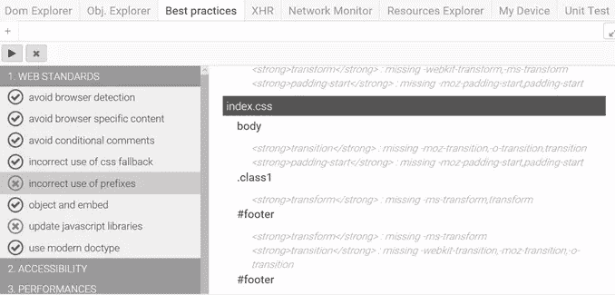
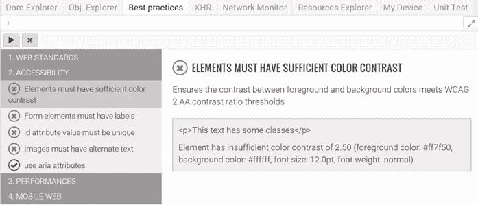
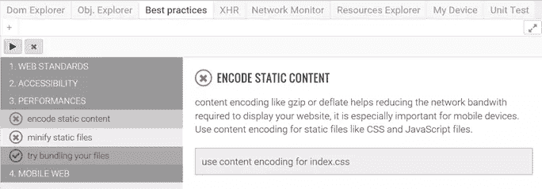
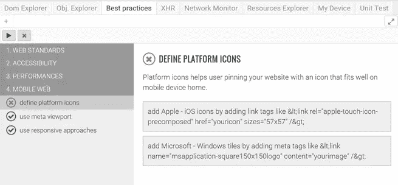

# Vorlon.js 如何帮助您改进 Web 代码

> 原文：<https://www.sitepoint.com/vorlon-js-helps-improve-web-code/>

本文是微软网站开发系列的一部分。感谢您对使 SitePoint 成为可能的合作伙伴的支持。

当谈到在 web 开发中编写好的代码时，很容易迷失在你在网上找到的大量资源中。有一些每个人都知道或应该知道的基本知识，还有一些更具体的知识。

你现在能告诉我你确定你遵循了这些实践吗？大概不会。你可能有这样的直觉，而且你在编写代码的时候肯定考虑到了它们，但是你不能确定你总是尊重它们。如我所说，网络上有很多不同的资源。要知道所有这些并不容易。要做到所有这些并不容易。而且要确定你做得对是很不容易的。

这就是为什么我们决定在 Vorlon.js 中创建[最佳实践](http://vorlonjs.com/documentation/#best-practices/?WT.mc_id=16539-DEV-sitepoint-article75)插件。这是一种让你自动获得关于如何改进代码的提示和建议的方式。当前的实践和扫描列表是根据我们自己的经验创建的。它是可扩展的，你可以添加你自己的规则到这个插件中，使它更加精确和全面。:)

非常感谢到 [Guillaume Leborgne](https://twitter.com/gleborgne) 和 [Mehdi Lahlou](https://twitter.com/Mehdi_La) 在这方面所做的努力！

## 如何使用最佳实践插件

首先，你需要设置一个 Vorlon.js 环境。你可以按照我们这里提供的文档:[http://vorlonjs.com/documentation/#vorlonjs-server](http://vorlonjs.com/documentation/#vorlonjs-server/?WT.mc_id=16539-DEV-sitepoint-article75)。

一旦您启动并运行了 vorlon.js 服务器，并且您的网站已连接到该服务器，请点击“最佳实践”选项卡上的“播放”按钮。它将对您当前正在调试的页面和链接到它的资源(JavaScript 文件、CSS 文件等)运行动态和静态测试。).

[https://www.youtube.com/embed/KK8QQ51dJSU?feature=oembed](https://www.youtube.com/embed/KK8QQ51dJSU?feature=oembed)

上面的视频向你展示了使用这个插件的效果。所有的推荐分为 4 类:**网页标准**、**无障碍**、**性能**、**移动网页**。

让我们来看看你在这些类别中得到的一些规则。

1.  ### 网络标准

    在这方面，我们可能会犯很多常见的错误。有时候，它甚至不是一个错误。以您使用的 JavaScript 库为例:您多久检查一次您引用的版本是否过时？或者认为 CSS 前缀有问题:你确定你总是添加所有的供应商前缀吗？这可能是一个好主意，以确保您的网站在最广泛的计算机上正常工作。你有做浏览器检测的代码吗？你应该把它改成特征检测。等等。等等。

    本节给出了您在这方面可以改进的地方:

    *   **避免浏览器检测**:告诉你是否有代码调用`navigator.userAgent`
    *   **避免浏览器特定内容**:检查您的网站是否为某些浏览器发送了不同的内容
    *   避免条件注释:条件注释并不是使你的网站适应目标浏览器的最佳方式，IE > 9 的支持已经停止。
    *   **CSS 回退的不正确使用**:验证 CSS 文件中存在的所有 CSS 规则确实存在于计算的样式中。这是一个动态检查，根据您使用的浏览器，结果可能是*真*或*假*。
    *   前缀使用不正确:这个程序对你的 CSS 文件进行静态扫描，以确保你总是使用所有的供应商前缀。
    *   **对象和嵌入**:现代网络只是关于网络语言，而不是插件、activeX 和其他嵌入对象。这证明你的网站不包括一个。
    *   **更新 JavaScript 库**:检查您正在使用的所有 JS 文件是否被它们的创建者认为没有过时。
    *   **使用现代文档类型**:像`<!DOCTYPE html>`这样的现代文档类型对浏览器兼容性更好，并且支持使用 HTML5 特性。

    

2.  ### 易接近

    遵循 web 标准并不能保证您的网页易于访问。可访问性是 Vorlon.js 团队真正关心的事情。

    伟大的人在这方面做了很多工作。由[德雀](http://www.deque.com/)创造的[斧](http://www.deque.com/products/aXe/)产品就是一个例子。它是一个开源工具，给你一个庞大的网站建议列表。它们深入分析，例如，可以告诉你某个特定元素的颜色对比度不足，视力受损的人无法看清。这真的是很棒的工作，我们和 deque 的团队一起将它集成到这个插件中。

    *注意:这种集成在 Vorlon.js 的 npm 版本中还不可用，但是你可以从 github 仓库的 [dev 分支](https://github.com/Microsoftdx/vorlonjs/tree/dev)中获得。*

    规则太多了，我无法一一列举，但这里有一些固定的规则:

    *   表单元素必须有标签才能被自动网络阅读器理解。
    *   **图片必须有替换文字**:这个列出了所有不包含`alt`属性的``标签。
    *   **使用`aria`属性**

    所有的**轴**规则只有在失败状态下才会显示:

    

3.  ### 演出

    你可以遵循一些简单的规则，从你的网站获得更好的表现。

    *   **Encore static content** :尝试确定您是否使用 gzip 或 deflate 编码来减少网络带宽
    *   **缩小静态文件**:检查您是否使用了缩小过程来减小 CSS 和 JavaScript 文件的大小
    *   尝试捆绑你的文件:简单的算法，检查你是否为所有的脚本创建了一个文件来减少 HTTP 请求

    

4.  ### 移动网络

    当谈到移动时，许多 web 开发人员忘记添加正确的元素和信息来正确地考虑它。

    *   定义平台图标:这不是必须的，但是当用户锁定你的网站时，它会给用户更好的体验。
    *   **使用 meta viewport** :使用 meta viewport 标签来选择你的网站如何在手机等较小的设备上缩放。至少定义`<meta name="viewport" content="width=device-width, initial-scale=1">`。
    *   **使用响应式方法**:即使你的网站只针对特定的设备，你也可能会有用户使用意想不到的设备或屏幕比例。

    

## 轮到你了！

该插件目前提供了一些基本规则。我们真的希望这将由社区中任何人都可以创建的新规则来完成。在 [Vorlon.js repo](https://github.com/Microsoftdx/vorlonjs) 中添加您的请求并创建一个拉动请求。

## 更多的 Web 开发实践

这篇文章是微软布道者和工程师关于实用 JavaScript 学习、开源项目和互操作性最佳实践的 web 开发系列的一部分，包括[微软 Edge](http://blogs.windows.com/msedgedev/2015/05/06/a-break-from-the-past-part-2-saying-goodbye-to-activex-vbscript-attachevent/?WT.mc_id=16539-DEV-sitepoint-article75) 浏览器和新的 [EdgeHTML 渲染引擎](http://blogs.windows.com/msedgedev/2015/02/26/a-break-from-the-past-the-birth-of-microsofts-new-web-rendering-engine/?WT.mc_id=16539-DEV-sitepoint-article75)。

我们鼓励您在 dev.microsoftedge.com 使用免费工具进行跨浏览器和设备测试，包括 Windows 10 的默认浏览器 Microsoft Edge:

*   [扫描你的网站，寻找过时的库、布局问题和可访问性](http://dev.modern.ie/tools/staticscan/?utm_source=SitePoint&utm_medium=article75&utm_campaign=SitePoint)
*   [下载适用于 Mac、Linux 和 Windows 的免费虚拟机](http://dev.modern.ie/tools/vms/windows/?utm_source=SitePoint&utm_medium=article75&utm_campaign=SitePoint)
*   [跨浏览器检查网络平台状态，包括微软 Edge 路线图](https://dev.modern.ie/platform/status/?utm_source=SitePoint&utm_medium=article75&utm_campaign=SitePoint)
*   [在您自己的设备上远程测试 Microsoft Edge](https://remote.modern.ie/?utm_source=SitePoint&utm_medium=article75&utm_campaign=SitePoint)

**向我们的工程师和传道者进行更深入的学习:**

*   **互操作性最佳实践** ( [系列](https://channel9.msdn.com/Blogs/BeLux-Developer/Riding-the-Modern-Web-5-things-to-consider-as-a-web-developer/?WT.mc_id=16539-DEV-sitepoint-article75)):
    *   [如何避免浏览器检测](https://channel9.msdn.com/Blogs/BeLux-Developer/Riding-the-Modern-Web-Avoiding-Browser-Detection/?WT.mc_id=16539-DEV-sitepoint-article75)
    *   [使用 CSS 前缀的最佳实践](https://channel9.msdn.com/Blogs/BeLux-Developer/Riding-the-Modern-Web-CSS-Vendor-Prefixes/?WT.mc_id=16539-DEV-sitepoint-article75)
    *   [保持你的 JS 框架&库更新](https://channel9.msdn.com/Blogs/BeLux-Developer/Riding-the-Modern-Web-Dealing-with-JavaScript-Libraries/?WT.mc_id=16539-DEV-sitepoint-article75)
    *   [构建插件免费网络体验](https://channel9.msdn.com/Blogs/BeLux-Developer/Riding-the-Modern-Web-Dealing-with-Plugins/?WT.mc_id=16539-DEV-sitepoint-article75)
*   [GitHub 编码实验室:跨浏览器测试和最佳实践](https://github.com/deltakosh/interoperable-web-development/?WT.mc_id=16539-DEV-sitepoint-article75)
*   哇，我可以在 Mac 电脑上测试 Edge & IE 浏览器& Linux！(来自雷伊·班戈)
*   [在不破坏网络的情况下推进 JavaScript】(来自 Christian Heilmann)](http://channel9.msdn.com/Events/WebPlatformSummit/2015/Advancing-JavaScript-without-breaking-the-web/?WT.mc_id=16539-DEV-sitepoint-article75)
*   [用 WebGL 释放 3D 渲染](https://channel9.msdn.com/Events/WebPlatformSummit/2015/Unleash-3D-rendering-with-WebGL-and-Microsoft-Edge/?WT.mc_id=16539-DEV-sitepoint-article75)(来自 David Catuhe)
*   托管网络应用和网络平台创新

**我们的社区开源项目:**

*   伏龙。JS (跨设备远程 JavaScript 测试)
*   [manifoldJS](http://manifoldjs.com/?WT.mc_id=16539-DEV-sitepoint-article75) (部署跨平台托管的 web 应用)
*   [babylonJS](http://babylonjs.com/) (轻松制作 3D 图形)

**更多免费工具和后端 web 开发工具:**

*   [Visual Studio 代码](https://code.visualstudio.com/?WT.mc_id=16539-DEV-sitepoint-article75)(用于 Mac、Linux 或 Windows 的轻量级代码编辑器)
*   [Visual Studio 开发基础知识](https://www.visualstudio.com/en-us/products/visual-studio-dev-essentials-vs.aspx/?WT.mc_id=16539-DEV-sitepoint-article75)(基于订阅的免费培训和云优势)

[用节点编码。JS](https://www.microsoftvirtualacademy.com/en-US/training-courses/building-apps-with-node-js-jump-start-8422/?WT.mc_id=16539-DEV-sitepoint-article75) 与[在蔚蓝云上试用](https://azure.microsoft.com/en-us/pricing/free-trial/?WT.mc_id=16539-DEV-sitepoint-article75)

## 分享这篇文章