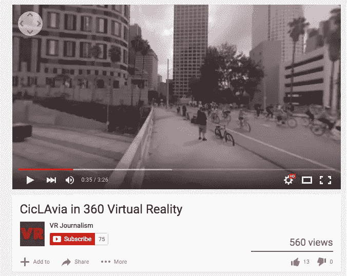
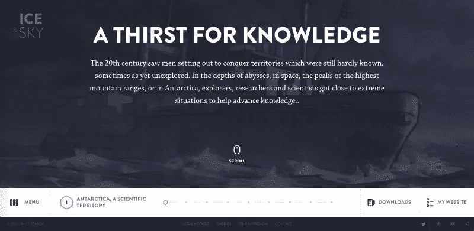
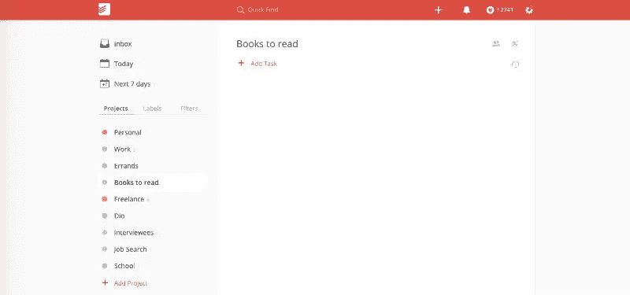
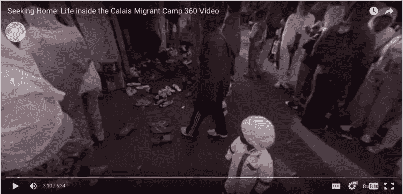
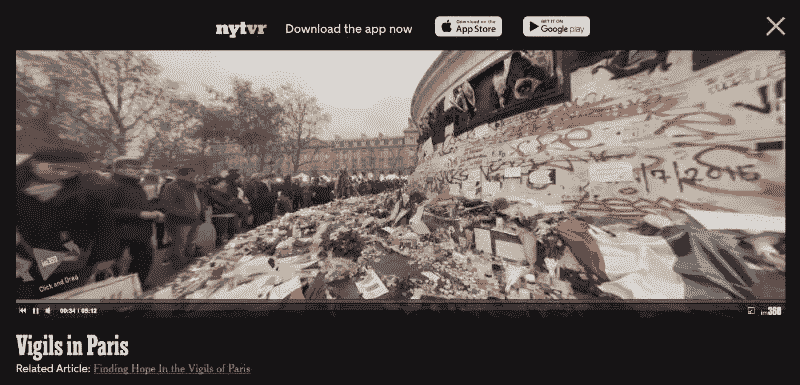
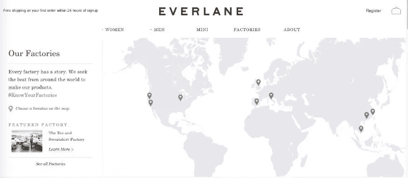
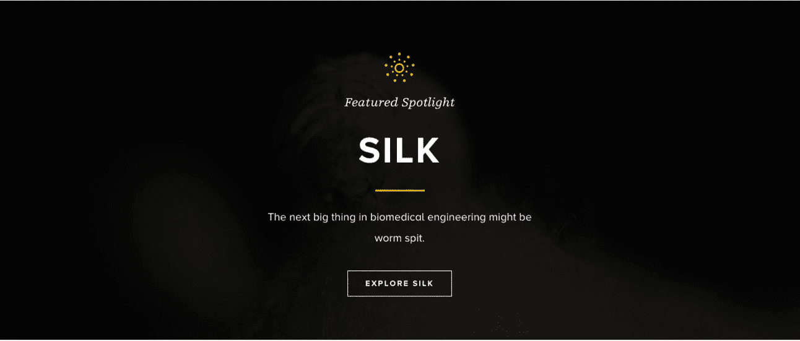

# 关于 UX，虚拟现实能教给我们什么

> 原文：<https://www.sitepoint.com/what-vr-can-teach-us-about-ux/>

虚拟现实是终极用户体验——毕竟，你真的沉浸在一个新世界中。

因此，作为一个对伟大设计充满热情的人，我一直在密切关注虚拟现实最佳实践的出现。

惊奇吧，惊奇吧:有助于好的虚拟现实体验的东西也有助于好的用户体验。

让我们深入了解一下虚拟现实能教给我们什么关于 UX 的知识。

## 出席

VR 的第一法则？不要打破现状。

过去 10 年来，虚拟现实研究人员一直在谈论“在场”的概念。

正如 AMD 的虚拟现实营销负责人解释的那样，“临场感可以被衡量为虚拟环境忠实地唤起一种真实感，使用户暂停怀疑的程度。怀疑的悬置越大，存在感达到的程度就越大。”

为了实现临场感，虚拟现实的机制必须尽可能隐藏起来。这意味着复杂的头部跟踪技术、低延迟和高分辨率。

或者，实际上，如果你正在穿过一片丛林，不仅显示应该令人信服地呈现，而且当你转头时，世界应该立即改变。

### 应用它

尽管没有人会“忘记”他们正在浏览你的网站或应用程序，但存在感仍然非常重要。

你想让访问者感觉他们有一个无缝的，人类的体验，他们可以直观地导航。

Wild-Touch 的冰与天空网站就是一个很好的例子。

这非常复杂——当你在一个水平的叙事时间线上移动时，你会看到一些垂直滚动的简短“章节”。还有音频、视频、图像和互动元素。

然而，尽管复杂，穿过冰和天空是无摩擦的。这是因为该网站的机制是隐藏的，元素的工作正如你所期望的那样。

也可以通过使用熟悉的界面元素来实现呈现。查看 [Todoist 主页](https://en.todoist.com/)；无论你是第一次使用，还是有经验的用户，你都可以很容易地理解所呈现的信息以及你该如何回应。

这是因为几乎页面上的每个图标都很熟悉。若要更改设置，请点按齿轮按钮。若要查看您的日程，请点按“日历”按钮。要添加任务，您可以单击“+”图标，在一个一致设计的好例子中，要添加项目，您可以单击一个更大的“+”按钮。

虽然用你的用户界面做一些全新的事情会有回报，但是不要忘记加入可识别的元素。如果用户界面不可用，拥有一个漂亮的用户界面也没用——当你的访问者正在努力理解该做什么的时候，他们是不会在场的。

## 详述

虚拟现实开发者必须构建他们的体验，并期望观众能够近距离地、个人化地看待一切事物。

与大多数视频游戏玩家或电影观众不同，虚拟现实参与者有代理权:他们选择看什么，什么时候看，看多长时间。

年代

在 2015 年游戏开发者大会上，让[每个细节都扎实](http://dsky9.com/rift/vr-design-best-practices/)是关键主题之一。

一名参与者解释说:“虚拟现实有一种方式，可以邀请玩家非常近距离地检查物体、道具、表面和角色。”"做好仔细检查的准备，确保你的几何图形和纹理是紧密的."

### 应用它

当谈到用户控制时，网站和应用程序 UI 与 VR 非常相似。你不能控制用户会做什么；你只能构建环境，预测他们的反应，并确保一切正常运行。

缺乏控制意味着界面的每个方面都应该经过深思熟虑。

瑞士网站的[世界是瑞士航空公司的互动品牌体验，体现了这种对细节的关注。](http://www.world-of-swiss.com/en)

当游客在天空中滚动时，一小束一小束的云在屏幕上“散开”,所以感觉就像一个人在向前和向上移动。

尽管该网站的垂直侧边栏鼓励上下滚动，但你也可以使用左右移动来导航。

其他小细节让体验更加丰富。例如，当您将鼠标悬停在关闭按钮上时，它会旋转——镜像整个站点中的圆形元素。

如果你有兴趣深入这个话题，读一读佩特拉什·博基关于微观互动的精彩文章。

## 交互性

交互性是 VR 最重要的特性之一。要真正让自己沉浸在一个环境中，你必须成为一个积极的参与者，而不是一个被动的旁观者。

这是用几种不同的方法创建的。首先，移动:简单地在虚拟现实场景中移动是交互式的。

例如，看看纽约时间的 360 度巴黎守夜视频。该视频采用线性叙事形式:随着夜晚变成白天，你会听到巴黎人讲述他们的袭击故事。

然而，当他们说话时，你可以四处走动，探索神社的不同角度。

虚拟现实开发人员正在进一步实现用户触发响应的交互性。正如 [Leap Motion VR 最佳实践大纲](http://dsky.co/downloads/leap/LeapMotion_VR_Best_Practices_Guidelines.pdf)的作者解释的那样，每个交互对象都应该对任何不经意的移动做出反应。假设你按了一个按钮。即使你没有施加足够的力量完全推动它，仍然应该有*一些*反应。

此外，必须有线索表明用户已经与这个场景互动。开发人员建议在按钮上使用手的阴影，按钮在手上反射的光，按钮被按下时的点击，或者与用户施加的压力大小相对应的按钮上的向下运动。

“当有效地完成时，人们会感觉自己在与场景互动时期待触觉体验，”作者总结道。

### 应用它

交互性也是成功的 UX 的一个重要组成部分。你的界面越互动，就越吸引人，越有粘性。

要获得灵感，看看电子商务网站 [Everlane](http://everlane.com) 。为了展示其透明的生产，该公司创建了一个显示其工厂位置的交互式地图。每个工厂都有自己的图文页面。

该网站还有其他意想不到的互动功能。将鼠标悬停在一个产品上，显示的照片会变成另一张不同角度的照片——这是一个很好的方式，既能给用户一些代理，又能让他们更有效地浏览。

(请注意，这些例子有助于 Everlane 的最终目标:让访问者进行购买。即使交互性是必要的，它也应该与你的目的相一致。)

科学星期五网站展示了如何在小范围内实现互动。当你将鼠标悬停在网站上时，几乎每个元素都会做出反应。

这两个例子都证明了你可以将交互性融入到任何类型的网站中——你只需要有创造性。

## 后续步骤

这三个“最佳实践”——在场、细节和交互性——仅仅是开始。你越深入虚拟现实，你就会从传统 UX 中获得越多的灵感。如果你对探索基于浏览器的虚拟现实感兴趣，可以去看看[脸书的 360 视频频道](https://www.youtube.com/channel/UCzuqhhs6NWbgTzMuM09WKDQ)、 [Mozilla VR 的项目](http://mozvr.com/projects/)和 [Janus VR 体验](http://www.janusvr.com/)。只需几美元，你就可以在亚马逊上购买谷歌 Cardboard 耳机，并在手机上体验虚拟现实。

虚拟现实如何影响了你对伟大设计的想法？

## 分享这篇文章